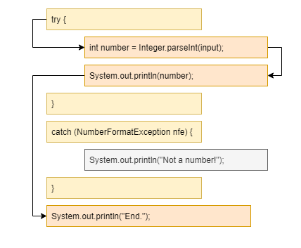

# Java történeti háttér

## Elmélet

**Szoftverkrízis** fogalma már 1968-ban megjelent, mely a mai napig azt jelenti, hogy
minél több, komplexebb alkalmazás fejlesztésére van igény, lehetőleg egyre kevesebb
fejlesztői erőforrás igénybevételével. Erre a problémára több megoldás is született
több-kevesebb sikerrel, és ezek között szerepelnek különböző programozási
paradigmák bevezetése, mint pl. **objektumorientált programozás**.

A **Java** nyelv 1991-ben a Sun titkos projektjeként született, James Gosling vezetésével.
A cél egy olyan programozási platform, mellyel hatékonyan lehet alkalmazásokat
fejleszteni olyan digitális eszközökhöz, mint pl. a televízió.
Az első megjelenése egy Mosaic böngészőbe épített Java motor, mely
egy molekulát forgatott három dimenzióban. Elképzelhető mekkora
újítás volt ez akkor, mikor a weboldalak fehér alapon fekete betűk voltak,
és az oldalakat kék színű linkek kötötték össze.


A Java kifejlesztésekor a következő célkitűzéseket fogalmazták meg:

* Egyszerű, könnyen tanulható és használható
* Objektumorientált
* Robusztus, azaz hibatűrő, az alkalmazás fejlesztője, vagy használója által
  vétett hiba ne befolyásolja a teljes alkalmazás működését, hanem kellően lokalizálható legyen
* Biztonságos, hiszen az internetről letöltött tartalmakban nem mindig lehet megbízni
* Architektúra-semleges, hordozható, azaz a megírt alkalmazás ugyanúgy fusson eltérő platformokon, mint Windows vagy Linux
* Nagyteljesítményű
* Interpretált, utasításonként végrehajtott
* Többszálúságot nyelvi szinten támogassa
* Dinamikus, azaz a futáshoz szükséges kódrészeket futás közben töltse be, mindig azt, amire szükség van


A Java programozási nyelv egy szabvány, melynek több implementációja (megvalósítása) létezik.
A hivatalos referencia implementáció az ingyenes [OpenJDK](https://openjdk.java.net/),
melyet az Oracle és az OpenJDK köré épült közösség fejleszt, több más cég
közreműködésével. Azonban ezt nem javasolják éles használatra, hanem
valamely erre épülő implementációt.

Történeti okok miatt az [Oracle Java SE JDK](https://www.oracle.com/java/technologies/javase-downloads.html)
a legelterjedtebb. Ez a Sun megvásárlásával került az Oracle-höz.
Azonban ennek használatához a Java 11 óta fizetni kell, így megjelentek további
implementációk, mint pl. az [AdoptOpenJDK](https://adoptopenjdk.net/).

Mivel elterjedt, és oktatásra ingyenes, ezért az Oracle Java SE JDK-t használjuk a
képzésen.

A Java elsődleges felhasználási területe nagyvállalati háttérrendszerek (backend). Mobil környezetben is
találkozhatunk vele, hiszen az Android készülékekre először Javaban kellett fejleszteni.

> A Google az Oracle-lel való jogi csatározások miatt Android területen kezd elfordulni a Java
programozási nyelvtől, és helyette a Kotlin programozási nyelvet javasolja.

Felhasználói felületek fejlesztésére, számítógépre telepíthető, önállóan futó alkalmazások
fejlesztésére (kliens alkalmazások) a Java nem annyira alkalmas. Bár több technológia létezik, Swing,
NetBeans Platform, Eclipse Platform, nem igazán terjedt el.
Főleg Java fejlesztőeszközöket implementálnak Java alkalmazásokként.

> A JavaFX egy újabb technológia felhasználói felületek fejlesztésére. A Java 8-as fejlesztőkészletben jelent
> meg, azonban a Java 11-esből eltávolították. Eredetileg a Java részét képező Swing vastag kliens technológia
> leváltására jött létre.

Java áll több IoT (Internet of Things - Internetre kötött eszközök), és Big Data megvalósítás mögött.
Az Oracle szerint jelenleg 10 millió Java fejlesztő van a világon és mintegy 15 milliárd Java kódot futtató eszköz.

A Java verziószámozása az újabb verziókban már konzisztens, a weboldalon letöltéskor megjelenő verziószám (pl. 12.0.1)
megegyezik azzal, amit a fejlesztőkörnyezet is kiír.

A tananyag legutóbbi frissítésekor a Java legfrissebb verziója a 15-ös verzió.

## További források

A Java verziószámozását, és a különböző verziókban megjelenő újdonságokat a
[Wikipedia](https://en.wikipedia.org/wiki/Java\_version\_history) részletesen taglalja.

## Ellenőrző kérdések

* Milyen megoldások születtek a szoftverkrízisre?
* Kinek a nevéhez kötődik a Java programozási nyelv?
* Mely cég vett és vesz részt a Java fejlesztésében?
* Milyen irányelveket vettek figyelembe a Java nyelv kialakításakor?
* Milyen Java implementációkat ismersz?
* Melyik a legfrissebb Java verzió?

# Oracle JDK telepítése

## Gyakorlati feladat

Ellenőrizd, hogy milyen **JDK** van telepítve a gépre parancssorban a `java -version` parancs kiadásával. Ha a legfrissebb,
akkor nincs további dolgod.
Amennyiben van fenn korábbi, mondjuk 8-as, akkor el kell távolítani (Windowson a _Programok telepítése és törlése_
kifejezésre keresve a _Start_ menüben.)
(A Java 8-at egyébként 2030-ig támogatják, és sok helyen még azt használják.)

A JDK mindenkori legfrissebb verzióját le kell tölteni a [https://www.oracle.com/java/technologies/javase-downloads.html](https://www.oracle.com/java/technologies/javase-downloads.html) címről.

A `jdk-XXX_windows-x64_bin.exe` állományt kell kiválasztani,
elfogadni a Licence feltételeket, majd letölteni és elindítani az állományt.

A varázslóval értelemszerűen feltelepíthető.

Alapértelmezetten a `C:\Program Files\Java\jdk-XXX` könyvtárba telepíti (az XXX helyére természetesen a
mindenkori aktuális verziószám kerül).

Állítsuk be a `JAVA_HOME` és `PATH` környezeti változókat!

Ehhez a Windows _Rendszer környezeti változóinak módosítása_ menüpontját kell kiválasztani a Start menüből.
A megjelenő ablakban a _Környezeti változók..._ gombra kell kattintani.

A `JAVA_HOME` értéke a könyvtár, ahova a JDK telepítve lett,
tehát `C:\Program Files\Java\jdk-XXX`, a `PATH` környezeti változó értéke `%JAVA_HOME%\bin` legyen.

Vigyázz, a környezeti változók szerkesztése után újra kell indítani a parancssort!

Sikeres telepítés és beállítás után parancssorba a `java -version` parancsot írva a következőt írja ki
(a verziószám természetesen itt is lehet más):

```
java version "16.0.1" 2021-04-20
Java(TM) SE Runtime Environment (build 16.0.1+9-24)
Java HotSpot(TM) 64-Bit Server VM (build 16.0.1+9-24, mixed mode, sharing)
```

# Több JDK egy gépen

Előfordulhat, hogy egy számítógépen több JDK-t kell használni.
Ez történhet azért, mert különböző projekteket különböző
verziójú JDK-val kell fejleszteni. Esetleg egy használt program
elvárja, hogy JDK legyen telepítve a gépre
([Általános Nyomtatványkitöltő (ÁNYK) - keretprogram](https://www.nav.gov.hu/nav/letoltesek/nyomtatvanykitolto_programok/nyomtatvany_apeh/keretprogramok/abevjava_install.html)).

Vannak programok, melyek az operációs rendszer beállításait veszik alapul.
Valamint ha parancssorból hívjuk a JDK-ban lévő programokat, akkor is
az operációs rendszer beállításai érvényesülnek.

Ezt kizárólag a `JAVA_HOME` és `PATH` környezeti változók szabályozzák.
A `JAVA_HOME` az a könyvtár, ahova a JDK telepítve lett. Pl.
Java 8 esetén Windowson a `C:\Program Files\Java\jdk1.8.0_271`
könyvtár. A `PATH` környezeti változó értéke tartalmazza azt, hogy melyik
könyvtárban vannak a segédprogramok. Ez a JDK `bin` könyvtára.
Ezért az értékei között szerepeljen a pl. `C:\Program Files\Java\jdk1.8.0_271\bin`!
Azért, hogy ne kelljen mindig mind a kettőt állítani, érdemes a `PATH`
értékei közé a következőt felvenni: `%JAVA_HOME%\bin`. Ekkor ha módosítjuk
a `JAVA_HOME` értékét, akkor változni fog a `PATH` értéke is.

Windowsban grafikus felületen a _Rendszer környezeti változóinak módosítása_
menüpontban tudjuk módosítani ezeket az értékeket.

Módosítás után újra kell indítani a parancssort, Total Commandert, stb.

Adott parancssorra ideiglenesen is állíthatjuk. Windowsban pl.:

```shell
set JAVA_HOME=C:\Java\jdk-11.0.10
echo %JAVA_HOME%
set PATH=%JAVA_HOME%\bin;%PATH%
echo %PATH%
```

Fontos, hogy a `PATH`-ban több JDK is szerepelhet, de az fog érvényesülni, ami
elöl van. Az `echo` paranccsokkal ellenőrizzük a beállítást.

Linux alatt:

```shell
export JAVA_HOME=/opt/jdk-11.0.10
echo $JAVA_HOME
export PATH=$JAVA_HOME/bin:$PATH
echo $PATH
```

Mindkét operációs rendszer alatt telepíthető tehát több JDK, csak
a `JAVA_HOME` és `PATH` beállítástól függ, melyiket használjuk.

Linux alatt használhatjuk az `update-alternatives`, `update-java-alternatives`
segédprogramokat, valamint a [jEnv - Manage your Java environment](https://www.jenv.be/)
eszközt.

A fejlesztőeszközökben ettől függetlenül állítható, pl.
IntelliJ IDEA esetén a _File / Project Structure / Project Settings / Project / Project SDK_
menüpontban.

# Maven

## Elmélet

Sajnos a Java platform nem biztosít standard **projektstruktúrát**.
A projekt nem más, mint a könyvtárak és fájlok halmaza. Itt főleg a
forráskódokat tartalmazó állományokat tároljuk.
A nyelv megjelenésekor minden projekt máshogy épült fel, más könyvtárakba csoportosították
az alkalmazás felépítéséhez szükséges állományokat. A Java források fordításával,
az így előállt bájtkód és az alkalmazás futtatásához szükséges egyéb állományok
(ún. erőforrás állományok, pl. szövegek, képek) összecsomagolásával jön létre maga az alkalmazás,
ez egy `jar` kiterjesztésű állomány. Ezt a folyamatot nevezzük **build** folyamatnak.

A Maven egy kvázi szabványos eszköz a build folyamat megvalósításáért. Ezen kívül
kezeli a függőségeket, hiszen egy alkalmazás fejlesztésekor számos más szervezet és
gyártó által megírt nyílt és zárt forráskódú programot/könyvtárat (**third party library**-t)
használunk.

Ennél azonban többnek definiálja magát a Maven, ún. software project management and comprehension tool.
Betartja a **Convention over configuration** elvet, ami azt jelenti, ha a konvencióknak
(megállapodásoknak) megfelelően járunk el, akkor az eszközt nem kell konfigurálni,
hanem a build folyamatban az előzetes megállapodásoknak megfelelően fog eljárni.

Ez gyakorlatban annyit tesz, ha a fájlokat a megfelelő könyvtárakban helyezzük el,
akkor különleges konfiguráció nélkül lefut a build folyamat, lefordításra kerülnek
a forrásállományok, és összecsomagolásra az alkalmazás.

A build folyamat általában a következő nagyobb lépésekből áll:

* Forrásállományok fordítása
* Többi, ún. erőforrás állomány megfelelő helyre másolása
* Tesztesetekhez szükséges erőforrás állományok másolása
* Tesztesetek fordítása
* Tesztesetek futtatása
* Alkalmazás összecsomagolása

Jelen projektben még nincsenek automatikus tesztesetek, de későbbi
projektekben készítünk ilyeneket is. (Az **automatikus tesztesetek**
olyan programok, melyek az alkalmazás helyes működését
ellenőrzik.)

A Maven projektet a `pom.xml` állomány írja le, melyet a projekt gyökerében,
azaz az állományainkat tartalmazó könyvtárban kell
elhelyezni. A különböző állományokat konvenció
szerint a következő könyvtárakba kell elhelyezni:

* `src\main\java` Java forráskódok
* `src\main\resources` Erőforrás állományok
* `src\test\java` Tesztesetek, nem része az alkalmazásnak
* `src\test\resources` Tesztesetekhez szükséges egyéb erőforrás állományok, nem része az alkalmazásnak

A következő példa bemutat egy minimális `pom.xml` állományt.

```xml
<?xml version="1.0" encoding="UTF-8"?>
<project xmlns="http://maven.apache.org/POM/4.0.0"
         xmlns:xsi="http://www.w3.org/2001/XMLSchema-instance"
         xsi:schemaLocation="http://maven.apache.org/POM/4.0.0 http://maven.apache.org/xsd/maven-4.0.0.xsd">
    <modelVersion>4.0.0</modelVersion>

    <groupId>training</groupId>
    <artifactId>intromaven</artifactId>
    <version>1.0-SNAPSHOT</version>

    <properties>
        <project.build.sourceEncoding>UTF-8</project.build.sourceEncoding>
        <maven.compiler.source>1.8</maven.compiler.source>
        <maven.compiler.target>1.8</maven.compiler.target>
    </properties>

</project>
```

Ebben szerepelnek a projekt koordinátái, melyek egyedileg azonosítják a projektet,
úgymint `groupId`, `artifactId`, `version`. Ezeket szabadon választhatjuk,
a `groupId` tipikusan a cégünk neve, ahol dolgozunk, az `artifactId`
a projekt neve. Az `artifactId` tipikusan megegyezik a könyvtár nevével,
amely tartalmazza a projektet és `pom.xml` állományt.

A verziószám pedig indulhat `1.0-SNAPSHOT` verzióval. A
`SNAPSHOT` azt jelenti, hogy az alkalmazás még fejlesztés alatt áll.

Érdemes még megadni a karakterkódolást,
hiszen a fájl önmaga nem tartalmazza, hogy milyen karakterkódolással íródott a
forráskód. Ez az ékezetes karakterek használatakor fontos. Ez a `project.build.sourceEncoding`
property-ben adható meg. Manapság érdemes mindenütt az UTF-8 karakterkódolást használni.

Tartalmaznia kell, hogy mely Java verzióval kompatibilis a forrás,
és mely Java verzióra legyen fordítva. Ezeket a `maven.compiler.source` és
`maven.compiler.target` property tartalmazza.

A build az `mvn clean package` paranccsal indítható. A `target/classes` könyvtárban
létrejönnek a `class` kiterjesztésű állományok. A `target` könyvtárban
létrejön a `jar` állomány.


## Ellenőrző kérdések

* Mire használjuk a Maven-t?
* Tipikusan hogyan épül fel egy build folyamat?
* Milyen alkönyvtárakat tartalmaz a projekt könyvtár?
* Mi ír le egy projektet? Milyen elemek találhatók benne?

## Gyakorlati feladatok

### Gyakorlati feladat - Maven telepítése

Töltsd le a legfrissebb Maven Binary zip archive állományt a [https://maven.apache.org/download.cgi](https://maven.apache.org/download.cgi) címről,
majd a letöltött `.zip` állományt tömörítsd ki a `C:\Java` könyvtárba!

A fájl neve pl. `apache-maven-3.8.1-bin.zip`.

Vedd fel az `M2_HOME` környezeti változót, melynek értéke az a könyvtár, ahova
a Maven ki lett csomagolva (példánkban `C:\Java\apache-maven-3.8.1`),
és vegyük fel a `PATH` környezeti változóba a `%M2_HOME%\bin` értéket is!


A telepítés és beállítás sikerességét a `mvn -version` parancs kiadásával ellenőrizzük!
Valami hasonlót fog kiírni:

```shell
Apache Maven 3.8.1 (05c21c65bdfed0f71a2f2ada8b84da59348c4c5d)
Maven home: C:\Program Files\Java\apache-maven-3.8.1\bin\..
Java version: 16.0.1, vendor: Oracle Corporation, runtime: C:\Program Files\Java\jdk-16.0.1
Default locale: hu_HU, platform encoding: Cp1250
OS name: "windows 10", version: "10.0", arch: "amd64", family: "windows"
```

### Gyakorlati feladat - Első Maven projekt

Hozz létre egy üres könyvtárat `intromaven` néven, abban egy `pom.xml` állományt a következő tartalommal.
Figyelj arra, hogy a `<maven.compiler.source>` és a `<maven.compiler.target>` tagekhez tartozó értéket
(ami itt `1.8`) cseréld ki a Java legfrissebb verziószámára (pl. `16`)!

```xml
<?xml version="1.0" encoding="UTF-8"?>
<project xmlns="http://maven.apache.org/POM/4.0.0"
         xmlns:xsi="http://www.w3.org/2001/XMLSchema-instance"
         xsi:schemaLocation="http://maven.apache.org/POM/4.0.0 http://maven.apache.org/xsd/maven-4.0.0.xsd">
    <modelVersion>4.0.0</modelVersion>

    <groupId>training</groupId>
    <artifactId>intromaven</artifactId>
    <version>1.0-SNAPSHOT</version>

    <properties>
        <project.build.sourceEncoding>UTF-8</project.build.sourceEncoding>
        <maven.compiler.source>1.8</maven.compiler.source>
        <maven.compiler.target>1.8</maven.compiler.target>
    </properties>

</project>
```

Majd az `src/main/java` könyvtárban hozzunk létre egy `HelloWorld.java` állományt
a következő tartalommal:

```java
public class HelloWorld {
  public static void main(String[] args) {
    System.out.println("Hello World!");
  }
}
```

Add ki az `mvn clean package` parancsot abban a könyvtárban, ahol a `pom.xml` található! Ha minden rendben történik, ilyesmit fog kiírni:

```shell
[INFO] Scanning for projects...
[INFO]
[INFO] ---------------------< training:intromaven >---------------------
[INFO] Building intromaven 1.0-SNAPSHOT
[INFO] --------------------------------[ jar ]---------------------------------
[INFO]
[INFO] --- maven-clean-plugin:2.5:clean (default-clean) @ intromaven ---
[INFO] Deleting C:\iviczian\Downloads\tmp\target
[INFO]
[INFO] --- maven-resources-plugin:2.6:resources (default-resources) @ intromaven ---
[INFO] Using 'UTF-8' encoding to copy filtered resources.
[INFO] skip non existing resourceDirectory C:\iviczian\Downloads\tmp\src\main\resources
[INFO]
[INFO] --- maven-compiler-plugin:3.1:compile (default-compile) @ intromaven ---
[INFO] Changes detected - recompiling the module!
[INFO] Compiling 1 source file to C:\iviczian\Downloads\tmp\target\classes
[INFO]
[INFO] --- maven-resources-plugin:2.6:testResources (default-testResources) @ intromaven ---
[INFO] Using 'UTF-8' encoding to copy filtered resources.
[INFO] skip non existing resourceDirectory C:\iviczian\Downloads\tmp\src\test\resources
[INFO]
[INFO] --- maven-compiler-plugin:3.1:testCompile (default-testCompile) @ intromaven ---
[INFO] No sources to compile
[INFO] 
[INFO] --- maven-surefire-plugin:2.12.4:test (default-test) @ intromaven ---
[INFO] No tests to run.
[INFO] 
[INFO] --- maven-jar-plugin:2.4:jar (default-jar) @ intromaven ---
[INFO] Building jar: C:\iviczian\Downloads\tmp\target\intromaven-1.0-SNAPSHOT.jar
[INFO] ------------------------------------------------------------------------
[INFO] BUILD SUCCESS
[INFO] ------------------------------------------------------------------------
[INFO] Total time:  1.453 s
[INFO] Finished at: 2020-09-25T11:27:09+02:00
[INFO] ------------------------------------------------------------------------ 
```

A `target/classes` könyvtárban
létrejön a `HelloWorld.class` állomány. Ez futtatható a következő paranccsal
a projekt könyvtárában: `java -classpath target\classes HelloWorld`.

A `target` könyvtárban létrejön az `intromaven-1.0-SNAPSHOT.jar` állomány.

# Maven használata proxy mögött

Amennyiben a számítógép proxy-n keresztül kapcsolódik
az internetre, ezt a Mavennek is be kell állítani,
hiszen a külső függőségeit az internetről tölti le.

Ehhez a `settins.xml`-be kell elhelyezni a következő
tartalmat. A megfelelő értékek átírandók.
A `settings.xml` fájl helye a HOME könyvtárban a
`.m2` könyvtár. Windows esetén `%USERPROFILE%\.m2\settings.xml`,
Linux esetén `${user.home}/.m2/settings.xml`.

```xml
<settings>
  <proxies>
   <proxy>
      <id>example-proxy</id>
      <active>true</active>
      <protocol>http</protocol>
      <host>proxy.example.com</host>
      <port>8080</port>
      <username>proxyuser</username>
      <password>somepassword</password>
      <nonProxyHosts>www.google.com|*.example.com</nonProxyHosts>
    </proxy>
  </proxies>
</settings>
```

# IDE

## Elmélet

Java fejlesztésre különböző **fejlesztőeszközöket** használunk, melyek ugyanúgy a JDK szolgáltatásaira épülnek, de grafikus
felhasználói felülettel rendelkeznek, és egyszerűbbé teszik a forráskód szerkesztését, a build folyamat futtatását,
az alkalmazás tesztelését és elindítását.

A legelterjedtebb fejlesztőeszközök a **NetBeans**, **Eclipse** és a **JetBrains IntelliJ IDEA**. A NetBeans nyílt
forráskódú, az Oracle berkeiben volt, de nemrég átkerült az Apache szervezethez. Az Eclipse fejlesztése régóta az
Apache szervezeten belül történik, szintén nyílt forráskódú eszköz. A NetBeans egy kezdők számára jobban ajánlott
eszköz, a különböző funkciók jobban integráltak, de kevésbé testre szabhatóak. Az Eclipse inkább haladó
fejlesztőknek javasolt, pluginekkel tetszőlegesen bővíthető és
jobban testre szabható. A JetBrains egy fejlesztőeszközök gyártására szakosodott cég, az ő termékük az
IDEA, mely egy Java fejlesztőeszköz. Nagyon sok Javára épülő technológiát támogat. Két kiadása van, egy ingyen használható
Community és egy nagyvállalati fejlesztésre szánt kereskedelmi Ultimate verzió.


A fejlesztőeszköz alapvető fogalma a **projekt**. Egy projekt állományok összessége:
Java forrásállományok, erőforrás állományok stb. Létre lehet hozni új projektet
vagy meg lehet nyitni már létező projektet.

Egy projekt típusa lehet különböző, attól függően, hogy milyen eszközöket szeretnénk használni.

Új projektet létrehozni a nyitóképernyőn, a _New Project_ gombbal lehet. Maven
projektet válasszunk ki. Majd meg kell adni a projekt nevét és a könyvtárat, amelyben tárolva lesz.

Ezután megjelenik a főablak. A projekt felépítését, fizikai elemeket (könyvtárakat, fájlokat) a bal oldalon található
Project ablak mutatja.

> Az alkalmazás új Java verzióval nem fog futni, mert be kell illeszteni a `pom.xml`-be, hogy
újabb Java verziót használunk.

A `pom.xml`-t kell módosítani, hogy frissebb Java verziót használunk (amennyiben már ez a verzió szerepel benne,
akkor természetesen nincs ezzel már újabb teendő):

```xml
<properties>
    <project.build.sourceEncoding>UTF-8</project.build.sourceEncoding>
    <maven.compiler.source>16</maven.compiler.source>
    <maven.compiler.target>16</maven.compiler.target>
</properties>
```

Az IDEA fejlesztőeszköz képes a Maven kezelésére, azonban a saját projekt fogalma
és a Maven projekt fogalma eltér. Ezért a kettőt szinkronizálja. Választhatunk,
hogy a fejlesztőeszköz automatikusan tegye ezt, vagy kérdezzen rá, és nekünk kell
a frissítést elvégezni, amennyiben módosítjuk a `pom.xml` állományt.

Azaz a `pom.xml` módosítása után a jobb oldalon lévő _Maven_ panelt nyissuk ki, és
nyomjuk meg a _Reload All Maven Projects_ gombot!

Új `.java` állomány úgy hozható létre, hogy a bal oldalon található _Project_ fülre kell kattintani.
Itt le kell nyitni a projektet, azon belül az `src\main\java` könyvtárat, és jobb klikk
_New / Java class_ menüpontot kell kiválasztani. Ugyanis a `.java` állományok
valójában osztályokat tartalmaznak.

A fejlesztő a legtöbb időt a kódszerkesztő ablakban tölti, mely különböző kisegítő
funkciókkal támogatja a forráskód írását, ilyen a kód színezése, vagy az automatikus
kódkiegészítés.

A fejlesztőeszköz lehetőséget biztosít az alkalmazás és a tesztesetek futtatására is.


Fontos megjegyezni, hogy az IDEA-ban az `src/main/java` könyvtárnak
Sources Root-nak kell lennie, míg az `src/test/java` könyvtárnak
Test Sources Root könyvtárnak. Amennyiben a projekt megnyitásakor
ezek már léteznek, az IDEA felismeri ezeket. Amennyiben később kerülnek
létrehozásra, frissíteni kell a Maven konfigurációt. Ehhez a _View / Tool Windows /
Maven Projects_ ablakot kell előhozni, és ott megnyomni a _Reimport All Maven Projects_
gombot.

Az IDEA leggyakrabban használt billentyűzet kombinációit a _Help/Keymap reference_
tartalmazza, mely egy nyomtatható PDF állomány.

A leghasznosabb a `Ctrl + Space`, ami automatikus kódkiegészítést végez, valamint
a `Alt + Enter`, mely a leggyakoribb hibákra próbál megoldási javaslatot adni.
Gyakran használt kódrészleteket nem kell mindig begépelni, hanem erre ún.
code template-ek állnak rendelkezésre. Ilyenkor egy rövidítést kell
beírni, majd a `Tab` billentyűt lenyomni.
A `.java` fájlon belül egy osztály található. Azon belül a `main`-t egy
metódusnak nevezzük. A `psvm + Tab`
a `main()` metódust generálja le. A `sout + Tab` billentyűkombinációval a `System.out.println`
utasítást generáljuk le.

## Ellenőrző kérdések

* Milyen Java IDE-kről hallottál?
* Miben segít nekünk az IDE?
* Mi a fejlesztés alapegysége, (a könyvtár, amiben a fájlok találhatóak)?
* Mondj néhány billentyűkombinációt!

## Gyakorlati feladatok

### Gyakorlati feladat - IDEA telepítése

Ellenőrizd, hogy az IntelliJ IDEA fejlesztőeszköz telepítve van-e a gépeden!
Az Asztalon, Tálcán, vagy a Start menüben meg kell jelennie.

Amennyiben nincs, az IDEA letölthető a [https://www.jetbrains.com/idea/#chooseYourEdition](https://www.jetbrains.com/idea/#chooseYourEdition)
címről, és a Community verziót kell letölteni és feltelepíteni.

Érdemes a `C:\Java` könyvtárba telepíteni.

A telepítés történhet az alapértelmezett beállításokkal, azon módosítani nem
szükséges.

### Gyakorlati feladat - Új projekt létrehozása

Hozz létre egy új projektet `introide` néven a `C:\training\introide`
könyvtárba! Módosítsd megfelelően a `pom.xml` fájlt! Hozz létre benne egy
`HelloWorld` osztályt, mely kiírja a `Hello World!` szöveget! Futtasd az
alkalmazást!

# Git használata IDE-ben

## Elmélet

Az IDEA fejlesztőeszköz beépítetten támogatja a **Git** használatát.
Lehetőség van új projekt esetén azt verziókezelő rendszerben tárolni,
vagy egy projektet úgy megnyitni, hogy közvetlen verziókezelő rendszerből
kerüljön letöltésre és megnyitásra.

Ahhoz, hogy egy új projekt Git alatt legyen tárolva, a `git init` parancsot kell
kiadni. Ez felületről is megoldható a _VCS / Enable Version
Control Integration_ menüpont használatával.

Alul található a _Git_ panel. Ezen ablak mutatja az újonnan létrehozott,
módosított és törölt állományokat. Itt lehet az állományokat a Githez hozzáadni,
commitolni. A _Revert_ művelettel lehet a saját módosításainkat elvetni.

A `pom.xml`, `.gitignore`, és a `*.java` állományokat adjuk hozzá. A `target` könyvtárba
dolgozik a Maven, az `.idea` könyvtár tartalma az IDEA-hoz tartozik,
azt sose commitoljuk. Ehelyett helyezzük el a `.gitignore` fájlban.

```
target/
.idea/
```

> Az IDEA újabb verziói már nem hoznak létre `.iml` fájlokat, így azt már nem kell beleírni.

> A `.gitignore` fájlt az IDEA újabb verziói már a projekt létrehozásakor
elkészítik. Alapesetben elég sok sort tartalmaz, a fájl tartalmát nyugodtan
ki lehet cserélni csak a fenti pár sorra.

A verziókezelő rendszerhez, azaz esetünkben a Githez kapcsolódó parancsokat
a _VCS / Git_ menüpont alatt lehet megtalálni, ebből a _Remotes..._, _Pull..._ és _Push..._ a leggyakrabban
használt.

Alul megtalálható a _Git_ panel is, mely információkat ad a Git műveletekről és a
repository-ról.


Bár érdemes az IDEA fejlesztőeszközt használni a Git műveletek végrehajtására,
tisztában kell lenni azzal, hogy parancssorban hogyan lehet ezeket elvégezni.
Gyakran lehet olyan, hogy vagy nincs kéznél fejlesztőeszköz, vagy
parancssorból kell ellenőrizni, hogy a fejlesztőeszköz jól működik-e, esetleg
speciális parancsokat kell kiadni.

## Ellenőrző kérdések

* Hogyan támogatja a fejlesztőeszköz a Git használatát?

## Gyakorlati feladatok

### Gyakorlati feladat - Első commitok

Hozz létre egy új projektet `introgit` néven, abban egy `HelloGit`
Java osztályt, ami kiírja, hogy `Hello Git!`!

Hozz létre egy lokális Git repository-t, és commitold a megoldásodat!

Módosítsd a Java osztályt, hogy most már azt írja ki, hogy `Hello IDEA and Git!`.

Commitold a megoldásodat!

# Feltöltés a GitHubra

## Elmélet

Ahhoz, hogy a projektet meg lehessen osztani **GitHub**-on, a webes felületen
létre kell hozni egy új üres projektet. Ennek az URL-jét kell
kimásolni, és a _VCS / Git / Remotes_ menüpontban kell `origin` néven
felvenni a lokális repository-ban távoli repository-ként.

Ahhoz, hogy működjön az azonosítás, a _Settings_ menüpontban,
a _Git_ ablakban a _Use credential helper_ checkboxot
be kell klikkelni. Majd újra a _VCS / Git / Push_ menüpontban
lehet a módosításokat push-olni a távoli repository-ba.

Commitnál is lehet egyből push-olni, ha a _Commit_ gomb
melletti nyíllal kiválasztod, hogy _Commit and push_.

## Ellenőrző kérdések

* Milyen lépések kellenek, hogy a GitHubon meg tudd osztani a projektedet?
* Mi az a push?
* Mi az az `origin`?
* Mi a különbség a local és a remote repository között?

## Gyakorlati feladatok

### Gyakorlati feladat - Első push

Hozz létre egy új projektet `introgit` néven, abban egy `HelloGit`
Java osztályt, ami kiírja, hogy `Hello Git!`!

Ha még nem vagy regisztrálva, regisztráld magad a GitHubon!

Hozz létre egy local Git repository-t, és commitold a megoldásodat!
Majd hozz létre egy GitHub repository-t, vedd fel
`origin` néven távoli repository-ként és push-old a megoldásodat!

### Gyakorlati feladat - Második push

Írd át a `HelloGit` osztályban, hogy azt írja ki, hogy `Hello IDEA and Git!`!

Commitold és egyben push-old a megoldásodat!

# Kiírás és beolvasás konzolról

## Elmélet

A Java nyelv alap építőköve az **osztály**. Minden alkalmazás osztályokból épül fel.
Tipikusan egy fájlba egy osztályt írunk, és a fájl neve meg kell egyezzen az
osztály nevével. (Megj.: Ha több osztályt írunk egy fájlba, akkor csak egyetlen
publikus osztály - `public` módosítószóval ellátott - lehet benne, és ennek a
neve kell megegyezzen a fájlnévvel.)

Ez egy egyszerű osztály:

```java
public class HelloWorld {

}
```

Látszik, hogy a Java forráskód struktúráját kapcsos zárójelekkel adjuk meg. Ezek
ún. **blokkokat** képeznek.

Sok osztályból álló alkalmazásnak **csomagokkal** tudunk belső struktúrát adni. A
csomagok nem csak könnyebbé teszik az áttekintést, de az osztályok láthatóságát
is szabályozzák. A csomagok fizikailag könyvtárként jelennek meg.

A csomagot meg kell adni az első utasításban a `package` kulcsszóval.

```java
package training;

public class HelloWorld {

}
```


Az osztály tagjai között vannak, amelyek adatokat tárolnak és vannak, amelyek
utasításokat fognak össze. Ez utóbbiak a **metódusok**.

Látható, hogy az eddigi utasítások hatására még nem történt semmi, az ilyen
utasítások a **deklarációs utasítások**. Ezek csak arra valók, hogy struktúrát adjanak
a programunknak, vagy valaminek nevet adjanak, amire később tudunk hivatkozni.

Az alkalmazáson belül azon osztályok futtathatóak, melyek tartalmaznak `main()`
metódust. Egy alkalmazásban akár több ilyen is lehet, azonban tipikusan egy
szokott lenni, ez az alkalmazás fő belépési pontja, ezzel indítjuk el az
alkalmazást. Azonban tanuláskor több osztálynak is készíthetünk `main()` metódust,
tesztelve osztályunk működését. A JVM a `main()` metódust csak akkor találja meg,
ha megfelel bizonyos szabályoknak. Nézzük, hogy kell kinéznie egy `main`
metódusnak az osztályon belül:

```java
package training;

public class HelloWorld {

    public static void main(String[] args) {
        System.out.println("Hello World!");
    }

}
```

Látható, hogy itt a struktúra miatt a blokkokat egymásba ágyazzuk, hiszen
az osztály tartalmazza a metódust.

Ez az osztály futtatható, a `training` csomagban van és a fájl neve `HelloWorld.java`.
Az osztály futtatásával a `main()` metódusban lévő utasítások szépen sorban
végrehajtódnak. A `HelloWorld` osztály esetében ez egyetlen egy utasítást jelent,
mely a konzolra kiírja a `Hello World!` szöveget.

Az IntelliJ IDEA fejlesztőeszköz számos template-et tartalmaz a gyakran használt
kódrészletek gyors legenerálására. Ezek a template-ek rövid szavakkal elérhetőek,
melyek begépelése után a `Tab` billentyű lenyomására az elmentett kódrészlet
jelenik meg. Ilyen például a `main()` metódust legeneráló `psvm` rövidítés.
A `System.out.println()` utasítás szintén elérhető template-ből a `sout` rövidítéssel.
További template-eket találsz a _File / Settings..._ menüpont alatt megjelenő
ablak _Editor/Live Templates_ lapján.

## Kommunikáció a felhasználóval

Az alkalmazások valamilyen felületen át kommunikálnak a felhasználóval. Az üzenetek
megjelenítésének legegyszerűbb módja, ha azt a konzolra kiírjuk. Ezt
a `System.out.println()` metódus hívásával tehetjük meg. A zárójelei között
paraméterként a kiírandó üzenetet kell megadnunk. Ez legtöbbször szöveg, de lehet
más típusú adat is.

> A `System.out.println()` metódus a két kerek zárójel között megadott kifejezéseket
> sortöréssel, egymás alá írja ki a konzolra. Egy ilyen, a kerek zárójelek között megadott, szövegként
> értelmezhető kifejezés után automatikusan következik egy sortörés karakter.
> Használható még a `System.out.print()` metódus is, amely a kiírást sortörés nélkül valósítja meg.
> Több egymás utáni `System.out.print()` metódushívással egymás mellé írhatjuk a konzolra a különböző
> szövegeket.

Ha szeretnénk valamilyen adatot bekérni a felhasználótól, akkor azt a `Scanner`
osztállyal tehetjük meg. Ehhez először **példányosítanunk** kell egy **objektumot**
az osztály alapján a `new Scanner(System.in)`
utasítással, és a kapott objektumot el kell tárolni egy **változóban**. Ezek után
a `Scanner` objektum metódusait használva különböző típusú adatokat tudunk beolvasni.

* `nextLine()`: az `Enter` lenyomásáig bevitt szöveget olvassa be
* `nextInt()`: egész szám beolvasására használható

Egy szöveg beolvasható a következő kóddal:

```java
package training;

import java.util.Scanner;

public class HelloWorld {

    public static void main(String[] args) {
        Scanner scanner = new Scanner(System.in);

        System.out.println("What's your name?");
        String name = scanner.nextLine();
        System.out.println(name);
    }
}
```

A `Scanner scanner` egy **változódeklaráció**, ahol a `scanner` a változó neve,
a `Scanner` annak típusa. A típust kötelező megadni, mert a Java egy
szigorúan típusos nyelv, ami azt jelenti, hogy nem lehet akármilyen értéket adni egy
változónak, csak olyat, amit a típusa megenged.
Majd az egyenlőségjellel értéket adunk neki.

A `String name` ugyanígy egy változódeklaráció, ahol a `name` a változó neve,
a `String` annak típusa (karakterlánc). Majd az egyenlőségjellel értéket adunk neki, méghozzá
úgy, hogy beolvassuk a konzolról.

A kód tehát beolvassa a nevet, majd kiírja a konzolra. A nevet az IDEA-ban alul,
a `Run` ablakban lehet megadni.

Mivel a `Scanner` osztály a `java.util` csomagban található, ezért **importálni**
kell az osztály elején. Ezt nem szükséges beírni, hanem amikor az
osztály nevét (`Scanner`) írjuk a `main()` metódusban, akkor az IDEA felajánlja,
hogy automatikusan beimportálja. Ehhez nyomjuk meg az `Alt + Enter`
billentyűkombinációt (amikor az osztály neve piros és alá van húzva).
Ekkor elhelyezi az IDEA az import utasítást az osztály elején a csomagdeklaráció
(`package`) alatt.

A következő példa azt is megmutatja, milyen műveleteket lehet végezni a `String`
és `int` típusú értékekkel.

```java
package training;

import java.util.Scanner;

public class HelloWorld {

    public static void main(String[] args) {
        Scanner scanner = new Scanner(System.in);

        System.out.println("What's your name?");
        String name = scanner.nextLine();
        System.out.println("Hello " + name); // 1

        System.out.println("What's your year of birth?");
        int yearOfBirth = scanner.nextInt();
        System.out.println("Year of birth: " + yearOfBirth); // 2

        System.out.println(2019 - yearOfBirth); // 3
    }
}
```


Az `int yearOfBirth` utasítással egy `int` típusú, `yearOfBirth` nevű
változót deklarálunk. Ennek értéke tehát csak egy egész szám lehet.

Az `// 1` jelzéssel ellátott sor mutatja, hogy kell két karakterláncot összefűzni.
A `// 2` jelzéssel ellátott sor mutatja, hogy egy karakterlánchoz egy egész szám is
hozzáfűzhető. Ekkor a szám először automatikusan szöveggé kerül átalakításra.
A `// 3` jelzéssel ellátott sor mutatja, hogy lehet két egész számmal kivonás műveletet
elvégezni.

> Egyszerűnek tűnik, ugye? Azonban akadhatnak problémák, amikbe előbb utóbb belefutsz.
A `nextInt()` nem olvassa be az Enter leütésével odakerült sortörés karaktert,
így az a következő `nextLine()` hívást megzavarja.

Mire figyelj a `Scanner` használatakor: a `nextLine()` a teljes szöveget beolvassa,
de a sorvége jelet eldobja, míg a `nextInt()` csak az első láthatatlan karakterig
(pl. szóköz, sorvége jel) olvas, és azt ott hagyja. Éppen ezért, ha szám beolvasása
után egy szöveget akarsz olvasni, akkor azt fogod tapasztalni, hogy ez a szöveg
üres lesz, és csak a második olvasás ad eredményt.

```java
public static void main(String[] args) {
        Scanner scanner = new Scanner(System.in);

        System.out.println("How old are you?");
        int age = scanner.nextInt();
        scanner.nextLine(); //Ez fogja az ottmaradt sorvége jelet beolvasni
        
        System.out.println("What's your name?");
        String name = scanner.nextLine();
        System.out.println(name);
    }
```

## Ellenőrző kérdések

* Mik a Java alkalmazások alapvető építőkövei?
* Egy Java osztály mit tartalmazhat, amikben utasításokat lehet írni?
* Hogyan lehet konzolról adatokat bekérni? Melyik osztályra van ehhez szükségünk?
* Mivel a `Scanner` másik csomagban található, mit kell csinálni a használatához?
* Hogyan lehet a konzolra adatokat kiírni?
* Milyen probléma merülhet fel az egész szám beolvasásakor?

## Gyakorlati feladatok

`demos/src/main/java/classstructureio` 

Hozz létre egy új projektet a `C:\training\training-solutions` könyvtárba, és innentől
ebbe a projektbe dolgozz külön csomagokban! Hozz létre egy repository-t a GitHub accountodon
a mentor által megadott néven! Innentől ide push-old a megoldásaidat!

Figyelj arra, hogy külön feladatmegoldások mindig külön commitban legyenek!

A feladatok megoldásai a `solutions/classstructureio` elérési úton vannak.

Hozz létre te is egy `classstructureio` csomagot, és ennél a leckénél abba tedd a
gyakorlati feladatok megoldásait!

### A main metódus szerepe

A `main()` metódus a legegyszerűbb módja annak, hogy a megírt kódodat kipróbáld,
legyen ez akár egy osztály, akár egy metódus.

Ide tetszőleges utasításokat írhatsz, amivel kipróbálod, teszteled a megoldásod. A feladatleírások
adnak ugyan támpontokat, de ennél nyugodtan teljesíthetsz többet. Próbálj osztályokat
példányosítani, meghívni a különböző metódusokat, különböző paraméterekkel! Az adatokat
akár a konzolról is bekérheted a felhasználótól (akkor is, ha esetleg nem szerepel a
feladatkiírásban).

### Gyakorlati feladat - Számológép

Készíts egy `Calculator` osztályt a `classstructureio` csomagba! A `main` metódusban kérj be a felhasználótól
két egész számot! Az első sorban írd ki a műveletet a következő formátumban: `5 + 10`! A második
sorban írd ki az eredményt (`15`)!

### Gyakorlati feladat - Regisztráció

Készíts egy `Registration` osztályt a `classstructureio` csomagba! A `main` metódusban kérd be a felhasználótól a
nevét és az email címét, majd írd ki, hogy milyen adatokkal regisztrált!

# Objektumok és attribútumok

## Elmélet

Egy Java alkalmazás a futás közben létrejövő és egymással kommunikáló **objektumok**
összessége. Ezen objektumok az osztályok alapján készülnek el. Az objektumok
tárolhatnak adatokat, melyeket **attribútumnak** nevezünk. Az attribútumok
tulajdonképpen osztályszinten deklarált **változók**. Az azonos típusú
objektumok ugyanolyan mintára készülnek, ezért ugyanolyan típusú adatok tárolására
alkalmasak. Egy objektum **állapotán** az attribútumok aktuális értékeinek
összességét értjük.
Gondoljunk úgy az osztályra, mint egy tervrajzra, ami alapján elkészítjük,
más szóval **példányosítjuk** az objektumokat. A példányosítás a `new`
kulcsszóval történik. Ezért az objektumra a **példány** szót is szoktuk használni.
Egy osztályhoz bármennyi példányt tudunk készíteni.
(Hasonlóan, ahogy egy tervrajz alapján több házat is meg tudunk építeni.)
Látható, hogy eddig a `Scanner` objektumot is példányosítottuk:

```java
Scanner scanner = new Scanner(System.in);
``` 
Nem csak a Javaban már létező osztályt tudunk példányosítani,
hanem saját osztályt is létre tudunk hozni.

Ezen belül attribútumokat a típusuk és a nevük megadásával deklarálhatunk:

```java
public class Trainer {
    
    String name;

    int yearOfBirth;

}
```

Példányosítás után az adott objektumot értékül adjuk egy változónak,
hogy később tudjunk rá hivatkozni.
Az objektum attribútumát a pont operátorral érhetjük el.

Ahhoz, hogy kipróbáljuk az osztályunkat, egy új `TrainerMain` osztályt
hozunk létre. A `main()` metódust akár a `Trainer` osztályban is létrehozhatnánk,
de így jobban látható, hogy hogyan használható egy osztály a másikból.

```java
public class TrainerMain {

    public static void main(String[] args) {
        Trainer trainer = new Trainer(); // 1
        trainer.name = "John Doe";
        trainer.yearOfBirth = 1980;
    
        Trainer anotherTrainer = new Trainer(); // 2
        anotherTrainer.name = "Jack Doe";
    }

}
```

A példában látható, hogy az `// 1` jelzéssel ellátott sorban példányosítunk egy
`Trainer` objektumot, és értékül adjuk egy `Trainer` típusú `trainer` nevű változónak.

Ebből a példányosítás:

```java
new Trainer()
```

Ez így önmagában is értelmes utasítás. Hatására létrejön egy
objektum, és lefoglalásra kerül a JVM memóriájában.
Amikor az objektum létrejön,
még üres a `name` attribútumának értéke, és a `yearOfBirth` értéke `0`.

Azért nem használjuk így magában, mert így nem tudunk rá a későbbiekben hivatkozni,
nem tudjuk átállítani az
attribútumainak az értékét.

Hogy az attribútumának értékét, azaz az állapotát módosítani tudjuk, létrehozunk egy `Trainer` típusú `trainer`
változót. A típusa egy osztály, ezért nagybetűs. A neve bármi lehet, szabadon
választhatjuk meg, konvenció szerint kisbetűs. Majd az egyenlőségjellel értékül adjuk neki a példányosított
objektumot.


Így a későbbiekben már tudunk rá hivatkozni, és a változó nevét használva
(`trainer`), beállítjuk a nevét és a születési évét. Ez lesz
az objektum állapota.

```java
trainer.name = "John Doe"
```

Majd a `// 2` jelzéssel ellátott sorban példányosítunk
egy másik `Trainer` objektumot, ennek más nevet állítunk be.


Az ábrán narancssárga mező reprezentálja a virtuális gép memóriáját. A lila `Trainer` osztály
alapján jön létre két sárgával jelölt objektum (`John Doe` és `Jack Doe`). Az elsőre a `trainer` változó,
a másodikra az `anotherTrainer` változó hivatkozik.

### Változók elnevezése

A változók neve szabadon választható, konvenció szerint legyen kisbetűs. Utaljon arra,
hogy mit tárol, hiszen arra való, hogy a későbbiekben
ezen keresztül férjünk hozzá a példányosított objektumhoz. Az előbbi kódrészlet tehát így is helyes lenne:

```java
public class TrainerMain {

    public static void main(String[] args) {
        Trainer john = new Trainer(); // 1
        john.name = "John Doe";
        john.yearOfBirth = 1980;
    
        Trainer jack = new Trainer(); // 2
        jack.name = "Jack Doe";
    }

}
```

Ugyanúgy a `Scanner`-t tartalmazó változót is nevezhetjük másképp:

```java
Scanner systemInScanner = new Scanner(System.in);
``` 

## Ellenőrző kérdések

* Mi a kapcsolat az osztály és példány között?
* Mi az az attribútum?
* Mit értünk egy objektum állapota alatt?

## Gyakorlati feladatok

A `classstructureattributes` csomagba dolgozz!

A feladatok megoldásai a `solutions/classstructureattributes` elérési úton vannak.

### Gyakorlati feladat - Ügyfél nyilvántartás

Hozz létre egy `Client` osztályt, melynek három attribútuma van: név (`name`), születési év (`year`)
és cím (`address`). Típusaik rendre `String`, `int` és `String`.

Hozz létre egy `main()` metódust a `ClientMain` osztályba, amelyben kipróbálod
a `Client` osztály működését. Példányosítani kell egy objektumot
a `Client` osztály alapján, majd kérd be az attribútumok értékét a
felhasználótól. Ellenőrzésképp írd ki minden attribútumának értékét a konzolra!

### Gyakorlati feladatok - Zeneszámok

Készíts egy `Song` osztályt, melyben eltárolhatod egy dal előadóját (`band`), címét
(`title`) és a hosszát (`length`) percben!

Készíts `main()` metódust egy `Music` osztályba, ahol kérd be a felhasználótól
a kedvenc zeneszáma adatait! Ellenőrzésképp írd ki a megadott adatokat
`előadó - cím (hossz percben)` formában, azaz `Britney Spears - Oops!...I Did It Again (4 perc)`!

# Metódusok

## Elmélet

Az objektumok nem csak adatokat, hanem **utasításokat** is tartalmazhatnak. Az utasítások többfélék
lehetnek. Többségüket egy osztályon belül a **metódusok** fogják egybe.
A metódusok feladata az objektum attribútumainak módosítása vagy azok lekérdezése.
Ezzel tulajdonképpen pontosíthatjuk az osztály definícióját: az osztály a tulajdonságok (attribútumok) és
műveletek (metódusok) összessége.

A metódus hívásakor az egyik metódus átadja a vezérlést a másik metódusnak, és
átadja neki a **paramétereket**. A metódushívás a példányokon értelmezett.

Egy metódus készítésekor meg kell adnunk, hogy mi legyen a **visszatérési típusa**,
a neve, valamint a paraméterek listája.
Visszatérési típust akkor is kötelező megadnunk, ha a metódus nem ad vissza értéket.
Ebben az esetben a `void` kulcsszót kell használnunk.

Amennyiben nem `void` a visszatérési típus, muszáj valamilyen értékkel
visszatérni. Ehhez a `return` kulcsszó használandó és utána kell írni a visszatérési értéket.
A `return` főleg a metódusok utolsó utasításaként szerepel.

Metódusnak nem kell lennie paraméterének, ekkor csak egy nyitó és csukó zárójel szerepel.
A paramétereket egymástól vesszővel kell elválasztani. Mivel a Java
erősen típusos nyelv, minden paraméter esetén meg kell adni annak típusát is.

A `main()` is egy metódus.


A metódus hozzáfér az attribútumokhoz, valamint a paraméterekhez. A metóduson
belül is deklarálhatunk változókat, ezek a **lokális változók**. Az attribútumok, a paraméterként
átadott változók és a lokális változók együttesen, összefoglaló néven **változók**,
létrehozásuk pedig **változódeklaráció** utasítással történik.
Előfordul, hogy a paraméterként kapott változó neve ugyanaz, mint az attribútumé. Ekkor a
paraméter elfedi az attribútumot. Ha leírjuk magában a nevet, az a paraméterre
vonatkozik.
Úgy lehet az attribútumhoz hozzáférni, hogy az attribútum elé kitesszük a `this` minősítőt.


Fontos objektumorientált alapelv, hogy az attribútumokhoz nem engedünk közvetlen
hozzáférést kívülről, azokat mind lekérdezni, mind módosítani csak metóduson át
lehet. Ez az **information hiding** alapelv. De hogyan tudjuk ezt elérni? A
tagok láthatóságát **módosítószavakkal** szabályozhatjuk, melyet mindig a legelső
helyen kell megadni.

* `public` - minden osztályból látható, elérhető
* `private` - csak az adott osztályon belül látható, érhető el

Javaban az alapértelmezett láthatóság a package private, azaz azonos csomagon
belül más osztályokból is elérhető a tag. Ekkor semmilyen módosítót nem használunk.
Ezért deklaráljuk az attribútumainkat mindig privátként!

Az adott osztályban látható néhány metódus is.

```java
public class Trainer {
    
    private String name;
    
    private int yearOfBirth;
    
    public String getNameAndYearOfBirth() {
        return name + ": " + yearOfBirth;
    }
    
    public int getAge(int year) {
        return year - yearOfBirth;
    }
    
    public void changeName(String name) {
        this.name = name;
    }
    
    public void setYearOfBirth(int yearOfBirth) {
        this.yearOfBirth = yearOfBirth;
    }
    
}
```

Egy másik osztályból már csak a `Trainer` metódusait érhetjük el, az attribútumait nem.

```java
public class TrainerMain {
    
    public static void main(String[] args) {
        Trainer trainer = new Trainer();
        trainer.changeName("John Doe");
        trainer.setYearOfBirth(1980);

        String nameAndYearOfBirth = trainer.getNameAndYearOfBirth();
        int age = trainer.getAge(2019);
    }
}
```

Itt a `main()` metódusból meghívásra kerül a `changeName()` metódus, és paraméterül
átadásra kerül a `John Doe` érték. Majd meghívásra kerül a `setYearOfBirth()` metódus,
mely paraméterül kapja az `1980` egész számot. Ezek nem adnak vissza értéket.
A `getNameAndYearOfBirth()` metódusnak nincs paramétere, de visszatér egy karakterlánccal,
melyet eltárolunk a `nameAndYearOfBirth` változóban. A `getAge()` metódus visszaad egy
egész értéket, melyet eltárolunk az `age` változóban.

Nagyon gyakran használunk olyan metódusokat, amelyek egyetlen attribútum értékét
lekérdezik, illetve módosítják. A lekérdező metódus neve **getter**, a módosítóé
**setter**.

## Fejlesztőeszköz támogatás

> Látható, hogy nem mindig, de van olyan eset, mikor az IDEA megjeleníti
a paraméter nevét. Ezt nem kell begépelni!

A fejlesztőeszköz csak segít abban, hogy szürkével megjeleníti a paraméter nevét.
Ezt nem kell kiírni. Javaban a metódus hívásakor csak a paraméter neveket kell
megadni sorban egymás után, vesszővel elválasztva.

Tehát az IDEA így jeleníti meg:

```
anotherTrainer.changeName(newName: "Joe Doe"); // Ez a Java kód nem fordul le
```


Helyesen természetesen így kell meghívni:

```
anotherTrainer.changeName("Joe Doe");
```

A getter és setter metódusokat az IDEA-val nagyon könnyen előállíthatjuk:
jobb klikk a szerkesztőben, majd _Generate..._ (vagy `ALT + Insert` billentyűkombináció),
azon belül _Getter and Setter_ pont. Miután kiválasztottuk azokat az attribútumokat,
amelyekhez szeretnénk gettert és settert generálni, az IDEA automatikusan beszúrja
ezek kódját az osztályba.

A névhez generált getter és setter metódusok:

```java
public String getName() {
    return name;
}

public void setName(String name) {
    this.name = name;
}
```

## Ellenőrző kérdések

* Mi a feladata a metódusoknak?
* Mihez férhetnek hozzá a metódusok?
* Milyen részei vannak a metódus deklarációjának?
* Mik azok a getter és setter metódusok? Mi a nevük, paramétereik és visszatérési értékeik?

## Gyakorlati feladatok

A `classstructuremethods` csomagba dolgozz!

A feladatok megoldásai a `solutions/classstructuremethods` elérési úton vannak.

### Gyakorlati feladat - Ügyfél nyilvántartás

Hozz létre egy `Client` osztályt, melynek három `private` attribútuma van:
név (`name`), születési év (`year`) és cím (`address`). Típusaik rendre
`String`, `int` és `String`!

Mind a három attribútumra legyen lekérdező és módosító metódus! Legyen egy
`public void migrate(String address)` metódusa is, mely az ügyfél elköltözését
implementálja, valójában beállítja a tárolt címet az új, paraméterként átadott címre.

Hozz létre egy `main()` metódust egy `ClientMain` osztályban, amelyben kipróbálod
az osztály működését! Példányosítani kell egy objektumot a `Client` osztály alapján, majd
be kell állítani az attribútumai értékét.
Írd ki konzolra az összes adatát, majd hívd meg a `migrate()` metódust egy másik címmel!
Jelezd vissza a felhasználónak a címváltozás sikerességét úgy, hogy kiírod az
eltárolt új címet!

### Gyakorlati feladat - Jegyzeteljünk!

Készíts egy `Note` osztályt, melyben a felhasználó rövid szöveges jegyzetét
tárolod. Tárolni kell a felhasználó nevét (`name`), a jegyzet témáját (`topic`)
és szövegét (`text`). Fejlesztés során ezentúl mindig tartsd be az information
hiding elvet, azaz az attribútumok legyenek privátak, és készíts
hozzájuk gettereket és settereket! Készíts egy `getNoteText()` metódust, mely az
osztály attribútumai alapján egyetlen szöveget ad vissza `name: (topic) text` formátumban!

Teszteld az osztályod a `NoteMain` osztály `main()` metódusából! A `Note` tartalmának
megjelenítésekor használd a `getNoteText()` metódust!

# Konstruktorok

## Elmélet

A **konstruktorok** felelősek az objektumok állapotának inicializálásáért. Amikor
egy osztályt példányosítunk, akkor lefoglalásra kerül a memóriában a hely az attribútumai
számára. Ezek kezdőértéket kívülről konstruktoron át kaphatnak.

A konstruktor hasonlít egy metódusra, de nem az. A konstruktornak nincs visszatérési értéke,
a neve pedig megegyezik az osztály nevével.

```java
public class Trainer {
    
    private String name;
    
    private int yearOfBirth;
    
    public Trainer(String name, int yearOfBirth) {
        this.name = name;
        this.yearOfBirth = yearOfBirth;
    }
    
    //getter és setter metódusok
}
```

Látható, hogy itt is a paraméterek elfedik az attribútumokat, ezért ha az
attribútumra akarunk hivatkozni, akkor a `this` kulcsszót kell alkalmaznunk.

Amikor a `new` operátorral szeretnénk egy `Trainer` objektumot létrehozni, akkor
tulajdonképpen a `Trainer` osztály konstruktorát hívjuk meg. (Ezt a paraméter nélküli
konstruktort eddig legenerálta nekünk a fordító, nem magunknak kellett megírni,
mi csak meghívtuk. Ez egy ún. paraméter nélküli **default konstruktor**) Ha ez paramétereket
vár, akkor azokat is meg kell adnunk.

```java
public class TrainerMain {
    
    public static void main(String[] args) {
        Trainer trainer = new Trainer("John Doe", 1980); //konstruktor hívása
        
        System.out.println(trainer.getName()); //"John Doe"
        System.out.println(trainer.getYearOfBirth()); //1980
    }
}
```


Úgy képzeljünk, hogy a konstruktor hívásával az üres attribútumoknak adunk értéket a konstruktor
paramétereken keresztül.

Amikor leírjuk a következő kódot:

```java
Scanner scanner = new Scanner(System.in);
```

már tudjuk, hogy a `Scanner` osztály konstruktorát hívjuk meg, és átadjuk neki
paraméterül a `System.in` értéket.

Konstruktort a fejlesztőkörnyezet is tud generálni. Az IDEA-ban az `ALT + Insert`
billentyűkombináció lenyomása után a _Constructor_ menüpontot választva meg kell
adnunk, hogy mely attribútumok kapjanak kezdőértéket, majd az IDE a konstruktor
kódját automatikusan beszúrja.

## Ellenőrző kérdések

* Mi a konstruktor feladata?
* Milyen megkötések vannak, amikor konstruktort készítesz?
* Hogyan lehet az IDEA segítségével konstruktort létrehozni?

## Gyakorlati feladatok

A `classstructureconstructors` csomagba dolgozz!

A feladatok megoldásai a `solutions/classstructureconstructors` elérési úton vannak.


### Gyakorlati feladat - Könyv regisztráció

Hozz létre egy `Book` osztályt, melynek három privát attribútuma van:
szerző (`author`), cím (`title`) és regisztrációs szám (`regNumber`),
mindhárom típusa `String`.

A `Book` példányosításakor csak a szerzőt és a címet kelljen megadni.

Legyen egy `public void register(String regNumber)` metódusa, mely a
nyilvántartásba vételt implementálja, és ennek paraméterül kell megadni
a regisztrációs számot.

Írj egy `main()` metódust a `BookMain` osztályba, amivel kipróbálod a működését!
Az attribútumok kiolvasásához használj gettereket!

### Gyakorlati feladat - Raktárkészlet

Készíts egy `Store` osztályt, mely egy raktárt modellez. A raktár jellemzője
az, hogy miből (`product`) és aktuálisan mekkora mennyiséget (`stock`) tárol.
(Ennek a raktárnak speciális jellemzője, hogy csak egyféle terméket tud
tárolni.)
Az első attribútuma `String`, a második `int` típusú.

A `Store` példányosításakor elég megadni a tárolt terméket, a mennyiség mindig 0,
ezért a konstruktor csak a terméket kapja meg kívülről.

Készíts hozzá két metódust, mely a tárolt mennyiséget változtatja: a `store()` metódusa
a paraméterként kapott mennyiséget eltárolja a raktárban növelve ezzel a készletet,
míg a `dispatch()` metódusa az elszállítást modellezi, azaz a paraméterként kapott
mennyiséggel csökkenti a készletet! (Most még nem kell ellenőrizned, hogy
elszállításkor van-e a raktárban elegendő mennyiségű terméked.)

A `StoreMain` osztály `main()` metódusában készíts két `Store` példányt, és
teszteld, hogy mindkét raktár helyesen és függetlenül működik-e be- és kiszállítás
esetén is!

# UML, példányok konzol íráskor/olvasáskor

## Elmélet

Az osztály egységbe zárja az összetartozó adatokat és a rajtuk végzett
műveleteket. Háromféle tagját különböztetjük meg:

* attribútum: az adatok, tehát az állapot tárolására szolgáló változók
* konstruktor: az adatok inicializálására (kezdőérték adás) szolgáló speciális metódus,
  mely példányosításkor egyszer és csakis egyszer fut le
* metódus: az állapot lekérdezésére, módosítására szolgáló műveletek

## UML (Unified Modeling Language)

Az **UML** szabványos, általános célú modellező nyelv, amely alkalmas nagy méretű
rendszerek vizuális megjelenítésére, dokumentálására. A diagramok
alkalmasak a rendszer struktúrájának és viselkedésének leírására. Egyik
leggyakrabban használt diagramja az **osztálydiagram**, mely az osztályok és
kapcsolataik grafikus ábrázolására szolgál. Az osztályokat egy három
részre osztott téglalap jelöli. A felső részben található az osztály
neve, a középsőben az attribútumok, a harmadikban a metódusok sora.
A tagok láthatóságát speciális karakterek jelölik a tag neve előtt.

Metódusok esetén gyakran találkozunk azzal, hogy a paramétereknek csak típusa
van, neve nincs. Ilyenkor tetszőleges, de beszédes nevet adhatunk nekik. Az UML
osztálydiagram csak akkor tartalmazza a neveket is, ha több paraméter esetén nem
egyértelmű azok szerepe. Például két `String` típusú paraméter is van.


## Konzol használata objektum létrehozásakor

Az objektum létrehozásához szükséges adatokat a felhasználótól `Scanner`
objektum segítségével kérhetjük be, majd a létrehozott objektum aktuális
állapotát `System.out.println()` metódussal írhatjuk ki. Lássunk is egy
teljes példát erre:

```java
package training;

public class TrainerMain {

    public static void main(String[] args) {
        System.out.println("What is your name?");
        Scanner scanner = new Scanner(System.in);
        String name = scanner.nextLine();
    
        System.out.println("Year of birth?");
        int yearOfBirth = scanner.nextInt();
    
        Trainer trainer = new Trainer(name, yearOfBirth);
    
        System.out.println(trainer.getName());
        System.out.println(trainer.getNameAndYearOfBirth());
        System.out.println("Age: " + trainer.getAge(2019));
    }
}
```

Amennyiben két osztály van, a köztük lévő vonal jelenti, hogy kapcsolatban vannak egymással.


Egy osztálydiagramon nem szükséges mindent kiírni, csak ami a megértés szempontjából fontos. Sőt, komolyabb
alkalmazások esetén nem is szoktuk az alkalmazás minden osztályát megjeleníteni, hiszen az több száz vagy
ezer is lehet.

## Ellenőrző kérdések

* Mi az UML?
* Hogyan épül fel egy osztálydiagram?
* Milyen részekből áll egy osztály diagramelem?

## Gyakorlati feladatok

A `classstructureintegrate` csomagba dolgozz!

A feladatok megoldásai a `solutions/classstructureintegrate` elérési úton vannak.

### Gyakorlati feladat - Termék

Az alábbi diagram és a leírás alapján készítsd el a `Product` osztályt!


Az attribútumok kezdőértéket a konstruktorban kapnak. Az `increasePrice()` a paraméter
értékével növeli, a `decreasePrice()` pedig csökkenti az aktuális árat.

Próbáld ki az osztály működését a `ProductMain` osztály `main()` metódusban, ahol a példány létrehozásához
szükséges adatokat a felhasználótól kéred be!

### Gyakorlati feladat - Bankszámlák

Az UML diagram és a leírás alapján készítsd el a `BankAccount` osztályt!


Számlanyitáshoz mindhárom attribútum értékét meg kell adni. A számlára lehet
befizetni (`deposit()`) és lehet róla pénzt kivenni (`withdraw()`).

A `getInfo()` metódus a számla adatait az alábbi formában adja vissza Stringként:

```
Tóth Kálmán (10073217-12000098-67341590): 103400 Ft
```

Készíts egy `Bank` osztályt, amely `main()` metódusában létrehozol egy bankszámlát!
Próbáld ki az összes elkészített metódust, hogy jól működik-e!
A szükséges adatokat a felhasználótól kérd be!

# Kódolási konvenciók

## Elmélet

A **kódolási konvenciók** arra valók, hogy az együtt dolgozó fejlesztők
hasonló formátumú kódot írjanak. Így ha el kell olvasni, netán módosítani kell
egymás kódját, könnyebben megértsék azokat.

## Kódformázás

A Java szabványban nincs egységes kódolási szabálygyűjtemény az elnevezésekre, behúzásokra,
sortörésekre stb. Az Oracle weboldalán megtalálható egy ajánlás, valamint a
nagyobb cégek is, mint például a Google, mind rendelkeznek saját konvenciókkal.
Ezeket az alábbi linkeken tanulmányozhatod át:

[https://www.oracle.com/java/technologies/javase/codeconventions-contents.html](https://www.oracle.com/java/technologies/javase/codeconventions-contents.html)

[https://google.github.io/styleguide/javaguide.html](https://google.github.io/styleguide/javaguide.html)

Az IDE-k tartalmaznak kódformázó menüpontokat, de ezek sem egységesek.

## Behúzások, üres sorok, blokkok

Konvenció szerint beljebb kezdünk minden olyan utasítást, amely valamilyen másik
utasításon, blokkon belül van. Így az osztályon belül beljebb kezdjük az
attribútum és metódus deklarációkat, a metóduson belül a metódustörzs utasításait.

Az attribútumok és a metódusok között hagyjunk ki egy-egy üres sort, így a kódunk
sokkal strukturáltabbá, olvashatóbbá válik.

## Elnevezések

A Java nyelvben használt azonosítók bármilyen Unicode betűt, számot `_`-t és `$`-t
tartalmazhatnak, azonban kerüljük az ékezetes karakterek használatát. Legjobb,
ha csak az angol ábécé betűit és számokat használunk.
Bármilyen elnevezés megengedett, kivéve a nyelv által lefoglalt kulcsszavakat
(például a ciklusképző  utasításoknál a `while`, `do`, `for` szavak,
elágazásképező utasításoknál az `if`). Kerüljük azokat az elnevezéseket is,
amelyek megtévesztők. Például ne használjuk a `string` vagy az `integer` azonosítót,
mert ezeket ugyan elfogadja a fordító, de összekeverhetőek a `String` és `Integer`
típusokkal. Nem megengedettek a számmal és a speciális karakterrel kezdődő
elnevezések. (Ez utóbbiból vannak ugyan kivételek, de ezek semmiképpen nem ajánlottak.)
Ha több szóból álló elnevezést szeretnénk megadni, azt egybeírjuk, de egymástól
úgy választjuk el, hogy a szóhatároknál a betűt nagybetűvel írjuk, az összes többi
betűt pedig kisbetűvel (**CamelCase**).
Az osztályok nevét nagy kezdőbetűvel kezdjük, ugyanez igaz a konstruktorok nevére
(a konstruktorok elnevezése megegyezik az osztály nevével). Az attribútumok, a metódusok
és bármilyen egyéb változó nevét kisbetűvel kezdjük.
Kivétel ezek alól a mozaikszavak elnevezése, ezek esetén csak az első betűt írjuk naggyal,
a többit kicsivel.

## Megjegyzések

Háromféle megjegyzés létezik. Az egysoros megjegyzést `//` karakterekkel kezdjük
és a sor végéig tart. Ezt akár egy utasítás mögé is írhatjuk.
Ha többsoros megjegyzést szeretnénk írni, akkor azt a `/*`
jellel kezdjük és  `*/` jellel zárjuk. A Javadoc megjegyzések olyan speciális elemek,
amelyekből HTML-ben írt dokumentáció készíthető. Ezeket `/**` jellel kezdjük és `*/`
jellel fejezzük be, és konvenció szerint minden sor elején `*` jel van. A Javadoc
megjegyzés mindig azon elem fölé kerül, amelyikhez készítjük. Tartozhat osztályhoz,
attribútumhoz és metódushoz is. Speciális jelöléseket használ például a metódus
paraméterek vagy a visszatérési érték megadásához.

```java
/**
 * Visszaadja összefűzve az oktató nevét és születési évét.
 *
 * @return Az összefűzött eredmény.
 */
public String getNameAndYearOfBirth() {
    return name + ": " + yearOfBirth; // Összefűzés
}
```

Ne használjunk feleslegesen megjegyzéseket. Amennyiben a kódból is egyszerűen megfejthető,
hogy mit csinál, nem kell odaírni megjegyzésben is.

Forrás: [https://www.oracle.com/technical-resources/articles/java/javadoc-tool.html](https://www.oracle.com/technical-resources/articles/java/javadoc-tool.html)

## Sorrendezés

A java fájlban először mindig a csomagdeklaráció (package), utána az importok,
végül az osztálydeklaráció következik. Ezek sorrendje kötött. Az, hogy az
osztályon belül milyen sorrendben deklaráljuk az attribútumokat, metódusokat
és konstruktorokat, az ránk van bízva, mégis konvencionálisan először adjuk meg
az attribútumokat, utána a konstruktorokat, és csak a legvégén a metódusokat.
Ez utóbbiakat láthatóság szerint csökkenő sorrendbe szoktuk rendezni, azaz
először írjuk a publikus, a legvégén pedig a privát metódusokat.

## Ellenőrző kérdések

* Mire valók a kódolási konvenciók?
* Hogyan nevezzük el az osztályokat, attribútumokat és metódusokat?
* Mire figyeljünk a betűszavaknál?
* Milyen sorrendben következzenek egy osztályon belül a különböző tagok?
* Milyen típusú megjegyzések vannak Java nyelvben?

## Gyakorlati feladatok

A `conventions` csomagba dolgozz!

### Gyakorlati feladat - Javítsd a helytelent!

Az alábbi kód nem helytelen ugyan, de a kódolási konvencióknak több helyen nem felel meg.
Hozz létre egy `Car` osztályt, másold bele az alábbi kódot és javítsd ki benne a konvencióknak nem megfelelő
dolgokat (elnevezések, sortörések, behúzások, stb.)!
Ne az IDEA beépített formázójával formázd meg! Végül írj hozzá egy `CarMain` nevű osztályt, amelyben teszteled,
hogy tényleg minden jól működik-e!

```java
package conventions;

public class Car {

    public void setCarType(String carType) {this.CarType = carType;}

    private String CarType; private String engineType;
    private int doors;
public int getPersons() {
        return persons;
    }
    public Car(String carType, String engineType, int DOORs, int persons) 
    
    
    
    { 
    this.CarType = carType;
    this.engineType = engineType;
        this.doors = DOORs;
        this.persons = persons;
    }
    private int persons;
    public String getCarType() {
                                    return CarType;
    }public String GetEngineType() {
        return engineType; }public int getdoors() {
        return doors;
    }

    

    

                    public void setEngineType(String engineType) {
        this.engineType = engineType;}

    public void SetDoors(int doors) {
        this.doors = doors;}public void SetPersonS(int persons) {
        this.persons = persons;}
        public void addModelName(String MODELName) {
        this.CarType = CarType + " " + MODELName;
    }
}
```

# Literálok és lokális változók

## Elmélet

## Adattípusok

A Java erősen típusos nyelv, azaz minden változó deklarációjakor meg kell adnunk
annak típusát, és ezt később nem változtathatjuk meg. Egy típus
pl. a `boolean` mely egy **logikai értéket** tárol, `true` vagy `false`.
Az `int` **egész típus**, a `double` **lebegőpontos típus** (a valós számok tárolási módja,
lényeg, hogy ezzel lehet nem csak egész számokat ábrázolni). Ezek **primitív típusok**,
úgy is megkülönböztethetőek, hogy kisbetűvel kezdődnek.

Egy változó lehet primitív típusú vagy **referencia típusú**.
A primitív típusú változók magát az értéket tárolják.
A referencia típusú változók
mindig egy objektumra mutatnak, de annak nem az állapotát, hanem csak egy
hivatkozást (referencia) tárolnak. Egy objektum állapota csak közvetve, ezen a hivatkozáson,
vagy referencián keresztül érhető el. Ilyen referencia típus például a `String`.

## Bevezetés a literálok használatába

**Literálnak** hívjuk azokat a kifejezéseket, amelyeknek önmagukban is van jelentése.
Ezekhez mindig **implicit** módon társul egy adattípus.

Az implicit ebben az esetben azt jelenti, hogy nem nekünk kell megadni, hanem a "háttérben",
közvetetten történik meg. (A fordító vagy a virtuális gép végzi el helyettünk.)

A `true` és `false`
`boolean` típusú literál. Ha pl. leírjuk, hogy `12`, az egy
egész literál, melynek típusa `int`.

Amennyiben nagy egész számot használunk, az olvashatóság kedvéért írhatjuk a következő
formátumban is: `100_000`.

Pl. az `1.5` egy lebegőpontos literál, melynek
típusa `double`.

Speciális literál a `null`, mely referencia változóknak adható értékül, amikor
semmilyen objektumra nem mutatnak.

A `"John Doe"` egy `String` típusú literál.

## Lokális változók

A metóduson belül deklarált és paraméterként átadott változókat együttesen **lokális
változóknak** nevezzük.
Változókat deklarálni a típusukkal és a nevükkel lehet.
Ezen kívül opcionálisan meg lehet adni kezdőértéket is, egyenlőségjel után.

```java
double amount;
amount = 2.3;

double sum = 1.5;

int i = 0;
```

Látható, hogy a deklaráció és az értékadás állhat külön, két utasításban, de
állhat egyben is, egy utasításként.

A lokális változót a deklarálástól kezdve az adott blokk végéig lehet használni, ez a **láthatósága**.

A változónak bármennyiszer újra értéket tudunk adni.

A lokális változóknak nincs automatikus kezdőértékük, ezért használatuk előtt mindig nekünk
kell az értékadásról gondoskodni. Kizárólag a deklarációtól azon blokk végéig
léteznek, amelyben deklaráltuk.

## Típuskonverzió

Alapszabály, hogy egy változónak csak olyan típusú érték adható, amilyen a
deklarált típusa. Ha más típusú értéket szeretnénk benne tárolni, akkor azt
konvertálni kell. Ez a **típuskonverzió** vagy típuskényszerítés.
Ez a konverzió történhet automatikusan, implicit módon vagy
a programozó által jelölten, explicit módon.

Hasonló típusok között (pl. számok) a kisebb automatikusan konvertálható
nagyobbra, mint például `int` típusú érték `double` típusúra. A nagyobb típusú
csak explicit, azaz kiírt konverzióval (**cast**) konvertálható kisebbre, és ez esetleges
adatvesztéssel járhat.

```java
double d = 12;         // int --> double implicit
int i = (int) 3.14; // double --> int kényszerítéssel, értéke 3
```

Például a matematikai kerekítés szerint `3.6` kerekített értéke `4` lenne, de Java típuskényszerítés
esetén `3` lesz.

```java
double d = 3.6;
int i = (int) d; // i értéke 3 lesz
```

A Java nyelvben a logikai érték nem kapcsolható számértékhez, mint sok más nyelvben,
ezért ezek nem konvertálhatók számmá.

## Objektumok élettartama

Egy objektum a létrehozásától (konstruktor hívása) addig létezik, amíg használjuk.
Nem kell nekünk megjelölnünk, hogy nem használjuk többet, hanem ezt a JVM automatikusan
figyeli. Van egy mechanizmus, mely a memóriából kitörli a nem használt objektumokat,
ezáltal helyet szabadítva fel, ez a **szemétgyűjtő mechanizmus**, **garbage collector** (**GC**).

## Getter boolean esetén

Egy boolean típusú változó esetén a hozzá generált getter nem `get`, hanem `is` előtagot tartalmaz.

```java
public class Employee {
    private boolean fullTime;

    public boolean isFullTime() {
        return fullTime;    
    }
}
```

## Ellenőrző kérdések

* Mire valók a literálok?
* Milyen literálokat ismersz és hogyan deklarálod őket?
* A hol definiált változókat nevezzük lokális változóknak?
* Szükséges-e típust definiálni? Milyen típusokat különböztetünk meg?
* Mi a lokális változó láthatósága?
* Mi a kezdőértéke egy lokális változónak?
* Mi az a szemétgyűjtő mechanizmus?

## Gyakorlati feladatok

A `localvariables` csomagba dolgozz!

A feladatok megoldásai a `solutions/localvariables` elérési úton vannak.

### Gyakorlati feladat - Literálok és típusok

A `localvariables.LocalVariablesMain` osztály `main()` metódusában
hozd létre az alábbi lokális változókat!

Definiálj egy `boolean` típusú
változót `b` néven, majd írasd ki az értékét!

Sikerül?

Adj értékül neki `false` értéket és írasd ki így!

Definiálj egy `int` típusú változót `2` kezdőértékkel `a` néven! Írd ki!

Definiálj két `int` típusú változót `i` és `j` néven `3` és `4`
kezdőértékkel!

Definiálj egy `int` típusú változót `k` néven, és add neki értékül az
`i` változó értékét!

Írd ki a konzolra `i`, `j` és `k` értékét!

Próbálj egy változót definiálása előtt kiírni! Sikerül?

Definiálj egy `String` típusú változót `s` néven! Adj neki `"Hello World"`
értéket! Írd ki!

Definiálj egy `String` típusú változót `t` néven, és add értékül neki az `s`
változó értékét! Ezt is írd ki!

Metóduson belül definiálj egy blokkot (kapcsos zárójelek között)!
A blokkon belül definiálj egy `int` típusú `x` változót `0` kezdőértékkel!
Írd ki az értékét! Írd ki a blokkon belül a korábban definiált `a` változó értékét is!

Az értékét próbáld kiírni blokk után, a blokkon kívül! Fog sikerülni?

A blokkban próbáld meg kiírni a blokkon kívül, a blokk előtt definiált `a`
változó értékét!

### Gyakorlati feladat - Távolság

Hozz létre egy `Distance` osztályt, mely tartalmazza a távolságot lebegőpontos számként,
valamint azt, hogy a mért távolság pontos-e, egy boolean értékként!
Csak getter metódusokat hozz létre!

A `DistanceMain` osztályban hozz létre egy `Distance` példányt, majd írd ki
a távolságot, és hogy pontos-e!

Majd deklarálj egy `int` típusú változót és add értékül neki a távolság
egész részét! Majd írd ki ezt az értéket!


# Kifejezések és utasítások

## Elmélet

A **kifejezés operátorok** (műveleti jelek) és **operandusok** (azok a literálok,
változók vagy metódushívások, amelyekkel a műveletet elvégezzük) kombinációja,
tipikusan egy érték kiszámítására.

## Operátorok

- Matematikai operátorok: `+`, `-`, `*`, `/`, `%` (összeadás, kivonás, szorzás, osztás, maradékos osztás)
- Példányosítás: `new`
- Értékadó operátor: `=`
- Összevont értékadó operátorok: `+=`, `-=`, `*=`, `/=`, `%=`, `&=`, `|=`, `^=`
- Összehasonlítás, egyenlőségvizsgálat: `<`, `<=`, `>`, `>=`, `==`, `!=`
- Logikai operátorok: `!`, `&`, `|`, `&&`, `||`
- Léptető operátorok (prefix és postfix): `++`, `--`
- Háromoperandusú operátor: `?:`

Az összevont értékadó operátor működése:

```java
int i = 5;
i += 6; // i értéke 11, az i = i + 6 kifejezésnek felel meg
```

Az összehasonlító operátorok eredménye egy boolean érték:

```java
boolean eq = 5 == 10; // false érték, mert a két literál nem egyenlő

boolean gt = 10 > 5; // true érték 
```

Összetett kifejezés esetén a műveletek elvégzésének sorrendje kötött, de
megfelelő zárójelezéssel módosítható. Ehhez kerek zárójelet használunk.

```java
int i = 2 + 3 * 5; // 17, mert a szorzást előbb hajtja végre

int j = (2 + 3) * 5; // 25, mert a zárójelek miatt az összeadást előbb hajtja végre
```

**VIGYÁZZ!** Ne keverd össze az értékadó `=` és az egyenlőséget vizsgáló `==` operátorokat!

Egy kifejezés operandusa lehet literál, egy változó és egy metódushívás is.

```java
String name = trainer.getName(); // Értékadó operátor jobb oldalán egy metódushívás
```

Egy kifejezést át lehet adni paraméterként is.

```java
System.out.println(4 + 5);
```

## Utasítások

A Java nyelvben az **utasítások**:

- változó deklaráció

```java
int age;
```

- értékadás

```java
age = 10;
```

- példányosítás

```java
new Random();
```

- metódushívás

```java
System.out.println("Hello World");
```

A Java nyelvben minden utasítást pontosvesszővel kell lezárnunk.

## Szövegek összehasonlítása

A szövegek nem hasonlíthatóak össze a `==` operátorral, hanem az `equals()` metódust kell hívni.
Ennek használata a következő:

```java
String name = "John";

System.out.println(name.equals("John")); // 1

System.out.println("Jack".equals(name)); // 2 
```

Az `2` jelű sorban lévő formátumot szoktuk használni, mert ez akkor is működik, ha
a `name` értéke `null`. Az `1` jelű esetben hibaüzenetet kapunk, ha a  `name` értéke `null`.

## Ellenőrző kérdések

* Mire valók a kifejezések?
* Írj fel néhány kifejezést!
* Milyen operátorokat ismersz?
* Java nyelven milyen utasításokat ismersz?

## Gyakorlati feladatok

A `statements` csomagba dolgozz!

A feladatok megoldásai a `solutions/statements` elérési úton vannak.

### Gyakorlati feladat - Kifejezések

A `statements.StatementMain` osztály `main()` metódusában definiálj egy `int` típusú `x` változót,
melynek értéke az `5` és `6` literál összege.

Definiálj egy `int` típusú `y` változót, mely a `11` literálból kivont `x` változó értékét kapja.

Definiálj egy `int` típusú `z` változót, mely értéke `8`.

Definiálj egy `boolean` típusú `b` változót, mely értéke `true`, ha az `x` értéke
nagyobb, mint az `y` változó értéke.

Definiálj egy `boolean` típusú `c` változót, mely értéke `true`, ha a `b` értéke
`true`, vagy `z` értéke nagyobb, mint `5`.

A `z` értékéhez adj hozzá egyet egy operandusú operátorral.

Ellenőrzésként írasd is ki minden változó értékét a konzolra!

### Gyakorlati feladat - Időpontok

Készíts egy `Time` osztályt, amely egy adott időpontot reprezentál egy napon
belül. Három attribútuma az óra, perc és másodperc értékét tárolja egész számként. Ezeket a  
a konstruktorban kapja meg. Készítsd el az alábbi metódusokat:

* A `getInMinutes()` metódus az időpont értékét percekben adja vissza, de a
  másodperceket figyelmen kívül hagyja.
* A `getInSeconds()` metódus a teljes időpontot másodpercben adja vissza.
* Az `earlierThan()` metódus paraméterként egy másik `Time` típusú objektumot kap. Amennyiben az adott
  objektum által reprezentált időpont korábbi, mint a paraméterül kapott, igazat ad vissza, különben hamisat.
  Használd a már elkészített metódusokat!
* A `toString()` metódusa az időpontot óra\:perc\:másodperc formában szövegként adja vissza.

A `TimeMain` osztály `main()` metódusában teszteld az osztályt! Kérj be a felhasználótól két
időpontot, és írd ki az elsőt teljesen majd percekben, a másodikat teljesen majd
másodpercekben, illetve azt, hogy az első korábbi-e, mint a második!

Egy lehetséges kimenet:

```
Az első időpont 12:3:43 = 723 perc
A második időpont 4:21:38 = 15698 másodperc
Az első korábbi, mint a második: false
```

### Gyakorlati feladat - Osztható 3-mal

Írj egy `main()` metódust a `DivByThree`, osztályba, mely bekér egy
egész számot a felhasználótól, majd kiírja, hogy 3-mal osztható-e!

### Gyakorlati feladat - Befektetések

Egy befektetéskezelő cég legfeljebb egy év időtartamra vesz át összeget befektetésre
az ügyfeleitől. Ezután bármikor meg lehet szüntetni a befektetést, és a tőkét az
adott napig járó kamattal együtt ki lehet venni. Megszüntetéskor a befektető cég
kezelési költséget von le. Menet közben megszüntetés
nélkül is le lehet kérdezni, hogy mennyi kamat járna az adott napig.


Hozd létre az `Investment` osztályt az alábbi UML-diagram alapján! A konstruktor paraméterként csak a `fund` (tőke)
és az `interestRate` (kamatláb) értékét kapja meg! Befektetés létrehozásakor (példányosításkor)
az `active` attribútum értéke legyen mindig igaz! A `getYield()` metódusa megkapja, hogy hány
napra kérik le a hozamot, és visszaadja az adott időszakra kiszámított hozam
összegét. A `close()` metódusa úgy zárja le a befektetést, hogy közben kezelési költségként levonja a kivett összeg 0,3%-át,
végül visszaadja a teljes kifizetett összeget. A lezárást az `active` attribútum hamisra
állításával éri el. A kifizetett összeg tartalmazza a tőkét és a kamatokat, csökkentve
a kezelési költséggel. Amennyiben már lezárt befektetésre hívják meg a `close()`
metódust, a kifizetett összeg 0 legyen!  
(Használd a három operandusú operátort a kifizetett összeg kiszámításához!)

A metódusok implementálása során törekedj arra, hogy ne írd le kétszer ugyanazt
a képletet, hanem használd a már elkészített metódusokat!

Próbáld ki a működését az `InvestmentMain` osztály `main()` metódusában! Kérd be
a befektetett összeget és a kamatlábat a felhasználótól, majd írd ki a befektetés
adatait! Próbáld meg kétszer is lezárni a befektetést! Például:

```
Befektetés összege:
100000
Kamatláb:
8
Tőke: 100000
Hozam 50 napra: 1095.890410958904
Kivett összeg 80 nap után: 101448.16438356164
Kivett összeg 90 nap után: 0.0
```

# Csomagok

## Elmélet

## Csomagok célja

A Java nyelv alapegysége az **osztály**. Általában egy osztály egy fájlnak felel meg,
de ez alól vannak kivételek. Ha nagyon sok fájlunk van, vagy vannak azonos nevűek,
akkor azokat különböző könyvtárakba szervezzük azért, hogy könnyebben áttekinthetőek
legyenek, könnyen megtaláljuk és differenciáljuk azokat. A **csomagok**
(package) az operációs rendszerben valójában könyvtárak.

Legfontosabb feladatai:

* Struktúrát ad a projektnek: nagyobb projektek több száz, vagy akár több ezer
  osztályt is tartalmazhatnak. Ezeket pl. alkalmazás rétegek vagy funkciójuk szerint
  csoportosíthatjuk csomagok használatával.
* Névütközés feloldása: ha több azonos nevű osztály van, akkor ezeket megkülönböztetjük
  aszerint, hogy melyik csomagban vannak.
* Szabályozza a **láthatóságot**: a Java nyelvben az osztályok zártak, ami azt
  jelenti, hogy megadhatjuk, ki mit lásson belőle. Ha nem szabályozzuk, akkor a
  tagok alapértelmezett láthatósága csomag szintű (ún. package private), azaz az ugyanazon csomagban
  lévő más osztályok hozzáférhetnek az osztályunkban lévő tagokhoz.

## Csomagok használata

A `Scanner` osztály a `java.util` csomagban van.
Hiába deklarálunk egy `Scanner` típusú változót, a fordító nem fogja megtalálni,
mert nem tudja, hol keresse. Ehhez meg kell mondanunk azt is, hogy melyik csomagban van.
Ezt többféleképpen is megtehetjük.

Az első, hogy az osztály neve előtt megadjuk a csomagot is ponttal elválasztva:
`java.util.Scanner`. Persze akárhányszor hivatkozunk a `Scanner` osztályra, mindig
újra és újra így, teljes **minősített névvel** kell azt tennünk, ami hosszú és
áttekinthetetlen kódhoz vezetne.

```java
public class NameReader {

    public static void main(String[] args) {
        java.util.Scanner scanner = new java.util.Scanner(System.in);
        System.out.println("What's your name?");
        String name = scanner.nextLine();
        System.out.println(name);
    }

}
```

A második, hogy **beimportáljuk** az osztályt a fájlunkban közvetlen az osztály
deklarációja fölé. Így ebben a fájlban bárhol használhatjuk, pusztán
osztálynévvel hivatkozva rá.

```java
import java.util.Scanner;

public class NameReader {

    public static void main(String[] args) {
        Scanner scanner = new Scanner(System.in);
        System.out.println("What's your name?");
        String name = scanner.nextLine();
        System.out.println(name);
    }

}
```

A harmadik, hogy beimportáljuk az adott csomagban lévő összes osztályt, így a
`Scanner` osztályt is. Ebben az esetben minden, az importált csomagban lévő
osztályra hivatkozhatunk kizárólag az osztály nevével. Ha egy csomagban lévő minden osztályt
be szeretnénk importálni, akkor azt az osztálynév helyére tett `*` karakterrel
jelölhetjük (**wildcard**).

```java
import java.util.*;

public class NameReader {

    public static void main(String[] args) {
        Scanner scanner = new Scanner(System.in);
        System.out.println("What's your name?");
        String name = scanner.nextLine();
        System.out.println(name);
    }

}
```

Leggyakrabban a második módszert használjuk, a harmadik pedig nem javasolt.

> A Clean Code könyv szerint azonban inkább a wildcard használata javasolt, ugyanis
ekkor nincs konkrét hivatkozás az osztályra, csak a csomagra, így a függőség
lazább. Amennyiben sok osztály van, miért is akarnánk a kódot felesleges importokkal terhelni.

Természetesen ha az egyik osztály a saját csomagjában lévő osztályt akarja használni,
akkor nincs szükség importra.

Van azonban egy csomag, amelynek az osztályait importálás nélkül is elérjük, a
`java.lang` csomag. Ebben található például a `System` és a `String` osztály is.
Mi van akkor, ha két ugyanolyan nevű osztályt szeretnénk használni? Az biztos,
hogy ezek két különböző csomagban vannak, de ha mindkettőt importáljuk, akkor
vajon melyikre gondolunk a kódban?

```java
import java.util.Date;
import java.sql.Date; // HIBA!!!

public class DateCalculator {

public static void main(String[] args) {
		Date date = new Date(); // Ez most melyik Date?
		// ...
	}

}
```

Ezt a Java fordító nem engedi, jelzi, hogy a kódunk hibás. Két választásunk van:

- az egyiket importáljuk, a másiknál minősített nevet használunk:

```java
import java.util.Date;

public class DateCalculator {

    public static void main(String[] args) {
        Date date;
        java.sql.Date sqlDate;
        // ...
    }

}
```

- mindkettő esetén teljes minősített nevet használunk:

```java
public class DateCalculator {

	public static void main(String[] args) {
		java.util.Date date;
		java.sql.Date sqlDate;
		// ...
	}

}
```

Hogy tudjuk megadni, hogy a mi osztályunk melyik csomagban van? A fájl első sora
mindig a csomagdeklarációt tartalmazza.

```java
package business;

public class BusinessLogic {
    // ...	
}
```

Ha ez elmarad, akkor az osztályunk egy ún. **default package**-be kerül, ami a
projektünk gyökérmappája. Ez nem javasolt, ezért mindig adjunk meg csomagnevet!
Mivel nagyon sok cég fejleszt Java nyelven, és gyakran előfordul, hogy azonos
osztályneveket használnak, ezért a javasolt csomagnév tartalmazza a domain nevet
visszafelé. Például a Training360 domain neve `training360.com`, ezért használható lenne
a `com.training360` csomagnévként.


A csomagok valójában fizikailag könyvtárak.

A csomagokban újabb csomagokat is létre lehet hozni, így megvalósítva egy fa
struktúrát. Azonban míg a könyvtárakat Windows esetén backslash (`\`)
karakterrel választjuk el, Linux esetén perjellel (`/`), Java csomagokat
pont karakterrel (`.`). Ezért a `java.util` csomag valójában a `java` csomagban
lévő `util` csomag.

Ha importálunk egy csomagot, akkor csak az abban lévő osztályokat
látjuk, az alcsomagokban lévő osztályokat nem.

Amennyiben beírjuk az osztály nevét, és az egy másik csomagban van, az IDEA segít nekünk az importban.
Kattintsunk az osztály nevére, amit nem talál (ezért piros), és amint aláhúzásra kerül,
nyomjuk meg az `Alt + Enter` billentyűkombinációt.

## Ellenőrző kérdések

* Mire használatosak a Java csomagok?
* Mi a csomag fizikai fájlrendszerbeli megfelelője?
* Hogyan hozunk létre új csomagokat?
* Hogyan használunk más csomagban lévő osztályokat?
* Hogyan kezeljük a névütközést?

## Gyakorlati feladatok

A `packages` csomagba dolgozz!

A feladatok megoldásai a `solutions/packages` elérési úton vannak.

Mindkét feladatnál figyeld meg, hogyan kell importálni a másik csomagokban található
osztályokat (az IDEA segít az importban)!

### Gyakorlati feladat - Köszöntés

Hozz létre a `packages.greetings` csomagban egy `Greeter` osztályt, melynek legyen
egy `public void sayHello()` metódusa, mely kiírja, hogy `Hello World!`.

Hozz létre a `packages.main` csomagban egy `MainProgram` osztályt, melynek
legyen egy `main()` metódusa. Ez példányosítsa a `Greeter` osztályt, majd hívja meg annak `sayHello()` metódusát!

### Gyakorlati feladat - Teljes név

Hozz létre a `packages.prefix` csomagban egy `Prefix` nevű osztályt, melynek legyen egy
`private String pre` nevű attribútuma!

Hozz létre a `packages.firstname` csomagban egy `FirstName` nevű osztályt, melynek legyen egy
`private String first` nevű attribútuma!

Hozz létre a `packages.lastname` csomagban egy `LastName` nevű osztályt, melynek legyen egy
`private String last` nevű attribútuma!

Mindhárom osztály a konstruktorában állítsa be az attribútum értékét a paraméterül megadottra,
valamint mindhárom osztályban legyen getter metódus is az attribútumra!

Végül hozz létre a `packages.namemain` csomagban egy `NameMain` nevű osztályt, melynek legyen egy
`main()` metódusa! Ez példányosítsa mindhárom osztályt, és az attribútumaik értékeiből fűzzön össze
egy teljes nevet! Ezt írja is ki a konzolra!

# Java API

## Elmélet

Az **API** az angol Application Programming Interface kifejezés rövidítése, amely magyarra fordítva
"Alkalmazásprogramozási Felületet" jelent. Az API-k a szoftverfejlesztők munkáját hivatottak
megkönnyíteni azzal, hogy hozzáférést biztosítanak egy adott szoftver vagy eszköz utasításkészletéhez.


> A Java 11 utáni Java verzók már nem tartalmaznak külön JRE-t, csak a JDK-t lehet letölteni.

A Java nyelv nagyon gazdag **osztálykönyvtárral** rendelkezik csomagokba szervezve, melyet verzióról verzióra
újabbakkal egészítenek ki, így nem kell minden feladatra saját osztályt gyártanunk.
Legyen az párhuzamosság kezelése, naplózás, dátum- és időkezelés, reguláris kifejezések,
XML állományok feldolgozása, adatbázis-kezelés, fájlkezelés, felhasználói felületek és még sorolhatnánk, a
Java alapkönyvtáraiban ezekre mindre találunk megoldást.
Teljes Java 8 dokumentációt találhatsz a [https://docs.oracle.com/javase/8/docs/api/](https://docs.oracle.com/javase/8/docs/api/)
oldalon, de minden Java verzióról van fönt hasonló az Oracle oldalán. Keresd meg a legfrissebbhez tartozót!
Ez egy ún. **JavaDoc** eszközzel kerül kigenerálásra.
Sőt, ha kíváncsi vagy az osztályok forráskódjára, akkor azt is megtalálod a JDK telepítési könyvtárában
a `lib\src.zip` állományban.

> Az API dokumentáció jelentősen megváltozott a frissebb verziókban. A 9-es verzióban lett kereshető, és a 11-es
> verzióban eltűnt a több ablakos nézet.

## Ellenőrző kérdések

* Mi az az osztálykönyvtár?
* Hogyan van az osztálykönyvtár szervezve?
* Hogyan kell elemeket felhasználni az osztálykönyvtárból?
* Milyen esetekben nem kell `import` kulcsszót használni?
* Hol található az osztálykönyvtár dokumentációja?

## Gyakorlati feladatok

A `javaapi` csomagba dolgozz!

A feladatok megoldásai a `solutions/javaapi` elérési úton vannak.

### Gyakorlati feladat - Navigáció a dokumentációban

Keresd ki a `Scanner` osztályt az API dokumentációban, majd annak a `nextLine()` és
`nextInt()` metódusát!

### Gyakorlati feladat - String osztály

Keresd ki a JDK API dokumentációból, a
`String` osztálynál, hogyan lehet egy karakterláncot nagybetűssé tenni!

Írj egy `Upper` osztályt, ami a `Hello World!` szöveget nagybetűssé alakítja!

# JAR állomány

## Elmélet

Egy Java alkalmazás több száz, vagy akár több ezer osztályból is állhat. Az alkalmazás
terjesztése sokkal könnyebb, ha ezek valahogyan egységbe vannak foglalva.
A **JAR** állomány tulajdonképpen a lefordított class fájlokat és az alkalmazáshoz
tartozó egyéb erőforrás állományokat tartalmazza ZIP formátumba
összecsomagolva, megkönnyítve ezzel a teljes alkalmazás hordozását. JAR állomány
készítését a Maven is támogatja. A JAR egy betűszó, a "Java Archive" rövidítése.

```
mvn clean package
```

A parancs hatására a Maven kitörli az előző fordítás eredményét (`clean`),
azaz törli a `target` könyvtárat, majd
újra fordítja az osztályokat és elkészíti a JAR állományt alapértelmezetten a
`target` könyvtárba. A JAR neve az `artifactId` és a `version` összefűzve.
Az összecsomagolt osztályok használatához a JVM-nek
tudnia kell, hogy ezek hol vannak, azaz a JAR állományt hozzá kell adni a classpath-hoz,
és meg kell adnunk benne a futtatandó osztályt teljes minősített névvel.

```
java -classpath target\distjar-1.0-SNAPSHOT.jar distjar.HelloWorld
```

## Futtatható JAR állomány

Amennyiben az összecsomagolt osztályok között van `main()` metódust tartalmazó, akkor
a JAR állomány önállóan futtatható is lehet. Ehhez szükséges,
hogy maga a JAR állomány tartalmazzon hivatkozást a `main()` metódust tartalmazó
osztályra, melyet a `pom.xml` állományban tudunk konfigurálni.

```xml
<build>
    <plugins>
        <plugin>
            <artifactId>maven-jar-plugin</artifactId>
            <version>3.2.0</version>
            <configuration>
                <archive>
                    <manifest>
                        <mainClass>distjar.HelloWorld</mainClass>
                    </manifest>
                </archive>
            </configuration>
        </plugin>
    </plugins>
</build>
```

> Nem kötelező a `<version>` tag használata, azonban erősen javasolt. Elhagyása esetén
a Maven WARNING-okat fog kiírni.

A futtatáshoz szükséges információkat JAR állományon belül a `META-INF/MANIFEST.MF` fájl tartalmazza.
Ebben az esetben az alkalmazás a `-jar` kapcsolóval indítható.

```
java -jar target\distjar-1.0-SNAPSHOT.jar
```

Amennyiben a teljes alkalmazás több JAR állományból áll, akkor az összes JAR-t a
classpath-ra kell tenni úgy, hogy a `-classpath` kapcsolónak paraméterül több
JAR állományt adunk át.

A JAR állományt a következő paranccsal lehet kitömöríteni:

```shell
jar xvf distjar-1.0-SNAPSHOT.jar
```


## Ellenőrző kérdések

* Mire valók a JAR állományok?
* Hogyan épülnek fel a JAR állományok?
* Hogyan lehet futtatni egy JAR állományban lévő osztályban található `main()` metódust?
* Hogyan lehet futtathatóvá tenni egy JAR állományt?

## Gyakorlati feladatok

A `distjar` csomagba dolgozz!

A feladatok megoldásai a `solutions/distjar` elérési úton vannak.

### Gyakorlati feladat - JAR állomány készítése

Hozz létre egy teljesen új projektet (pl. a `C:\training\distjar` könyvtárba `distjar` néven), ami
egy `distjar.Main` osztályt tartalmaz `main()` metódussal.
Ez a `Hello User!` szöveggel üdvözli a felhasználót!

Készíts JAR-t az alkalmazásból az `mvn clean package` parancs kiadásával!

### Gyakorlati feladat - Futtatható JAR állomány készítése

A `pom.xml` állományt egészítsd ki a következővel:

```xml
<build>
    <plugins>
        <plugin>
            <artifactId>maven-jar-plugin</artifactId>
            <configuration>
                <archive>
                    <manifest>
                        <mainClass>distjar.Main</mainClass>
                    </manifest>
                </archive>
            </configuration>
        </plugin>
    </plugins>
</build>
```

Készíts JAR-t az alkalmazásból az `mvn clean package` parancs kiadásával!

A JAR állomány futtatható a `java -jar target\distjar-1.0-SNAPSHOT.jar`
paranccsal.

# Szöveges típus

## Elmélet

Javaban a **karakterláncokat**, szövegeket a `String` osztály reprezentálja. Ugyanúgy
példányosítható, mint más osztályok, de a String literált a JVM példányosítja
helyettünk. A szöveget idézőjelek közé kell tennünk, például `"alma"`. Az üres
szöveg literálja a `""`, ami nem ugyanaz, mint a `null`. Szövegek összefűzésére
(konkatenálására) használható a `+` operátor. Mivel a String típusú változó
referenciát tárol, ezért nem használható két szöveg összehasonlítására a `==`
operátor, ezeket a String `equals()` metódusával tudjuk vizsgálni, például `"abc".equals("abc")`
(ennek az értéke `true`). Két szöveg meg nem egyezését pedig olyan módon lehet vizsgálni,
hogy a kifejezés elé felkiáltójelet téve negáljuk azt, tehát például `!"abc".equals("def")`
(ennek az értéke `true`).

## Metódusok

* `boolean equals(String str)`: a szöveg betűről betűre megegyezik-e a paraméterként átadott másik szöveggel.
* `int indexOf(String substring)`: a paraméterként átadott szöveg hol kezdődik az adott szövegben. Ha nem található, akkor -1-gyel tér vissza. A karakterek indexelése, sorszámozása 0-ról indul.
* `int indexOf(String substring, int startIndex)`: a paraméterként átadott szöveg hol kezdődik az adott szövegben, de a keresést csak a `startIndex`-től kezdi. Ha nem található, akkor -1-gyel tér vissza.
* `int length()`: a szöveg hosszát adja vissza.
* `String substring(int beginIndex)`: visszaadja a szöveg egy részét a megadott indextől kezdve a végéig.
* `String substring(int beginIndex, int endIndex)`: visszaadja a megadott indexek közé eső szövegrészt. A bal oldali indexű
  karaktert még tartalmazni fogja, a jobb oldalit nem


A képen látható metódushívás eredménye: `oh`

Vigyázni kell a műveletek sorrendjére is!

A `"John" + 4 + 4` kifejezés értéke `John44`, mert összefűzi a `John` és `4` értékeket,
és utána fűz még egy `4` értéket. a `4 + 4 + "John"` kifejezés először elvégzi a `4 + 4`
műveletet, aminek eredménye `8`, és csak utána fűzi hozzá a `John` szöveget.

## Ellenőrző kérdések

* Milyen típus a `String`?
* Hogyan definiálható `String` literál?
* Hogyan lehet két `String`-et összekapcsolni?
* Hogyan lehet egy `String`-et és egy primitív típust összekapcsolni?
* Hogyan lehet két `String`-et összehasonlítani?

## Gyakorlati feladat

A `stringtype` csomagba dolgozz!

A feladatok megoldásai a `solutions/stringtype` elérési úton vannak.

### Gyakorlati feladat - String műveletek

A `stringtype.StringTypeMain` osztály `main()` metódusában
definiálj `prefix` néven egy `String` típusú változót, és add neki értékül
a `"Hello "` literált.

Definiálj `name` néven egy `String` típusú változót, és add neki értékül
a `John Doe` literált.

Definiálj egy `message` változót, melynek értéke legyen az előző két változó, összefűzve.

A `message` változó értékét írd felül a `message` változó értékével
úgy, hogy hozzákapcsolod még a `444` int literál értékét.

A `b` logikai változó tartalmazza, hogy a `message` értéke megegyezik-e
a `"Hello John Doe"` literál értékével.

A `c` logikai változó tartalmazza, hogy a `message` értéke megegyezik-e
a `"Hello John Doe444"` értékkel.

Írd is ki minden, eddig definiált változó értékét!

Konkatenálj össze két üres `String`-et, és írd ki az értékét! Írd ki a
hosszát is! Hány karakter hosszú lesz?

Írd ki külön sorban, külön utasításokban a következőket:

* Az `Abcde` String hossza
* Az első és harmadik karaktere (0-tól indexelünk) vesszővel elválasztva
* Az elsőtől a harmadik karakterig tartó részlete

<!-- [rating feedback=java-stringtype-stringoperations] -->

### Gyakorlati feladat - Regisztrációs adatok vizsgálata

Amikor egy weboldalon regisztrációkor megadjuk az adatainkat, gyakran kapunk
olyan visszajelzést, hogy a jelszavunk nem elég erős, vagy nem valid
email címet adtunk meg. Készíts egy `UserValidator` osztályt a `stringtype.registration`
csomagba, mely a regisztrációkor megadott adatokat validálja.


Regisztrációkor meg kell adnunk a felhasználónevet, a jelszót kétszer
és az email címet. A három metódus ezeket ellenőrzi:

* A felhasználónév megadása kötelező.
* A jelszó legalább 8 karakter hosszú kell legyen, és a két megadott jelszónak egyeznie kell.
* Az email címben kell lennie `@` karakternek és valamikor utána (de nem közvetlenül) pontnak. A `@`
  karakter nem lehet az első, az őt követő pont pedig az utolsó.

Tételezzük fel, hogy egyik érték sem lehet `null`, mivel konzolról kerül beolvasásra,
ezért maximum üres String (`""`).

Készíts ugyanoda egy `Registration` osztályt, ahol a `main()` metódusban kérd be az
adatokat! Írd ki a felhasználónak egyenként, hogy a megadott adat helyes vagy helytelen!
Használd a háromoperandusú operátort!

# Sortörés kezelése

## Elmélet

Ha sortörést szeretnénk, akkor speciális karaktereket kell alkalmaznunk. A **sortörés karakter**,
karakterek nem láthatóak, tehát nem jelennek meg egy nyomtatott papíron vagy a képernyőn.  
Használatukkal azt lehet elérni, hogy az utánuk következő szövegrész új sorban fog megjelenni.

Különböző operációs rendszerek esetén máshogyan reprezentálják a sortörés karaktert:

* Windows esetén két bájton két karakter: egy _Carriage Return_ (kocsivissza) és egy _Line Feed_ (soremelés) karakter.
* Linux esetén egy bájton egy karakter van, egy _Line Feed_ (soremelés) karakter.

A Java a `System.out.println()` metódus használatakor a kiírandó szöveg után automatikusan
odatesz egy soremelés karaktert is.

```java
System.out.println("John");
System.out.println("Doe");

John 
Doe
```

Abban az esetben, ha csak önmagában írjuk le a `System.out.println()` metódust, és nem adunk neki át
kiírandó szöveget, a konzolon egyetlen (láthatatlan) sortörés karakter fog megjelenni, és egy
következő szöveg már egy sorral lejjebb fog kiírásra kerülni:

```java
System.out.println("John");
System.out.println();
System.out.println("Doe");

John 
        
Doe
```

`System.out.print()` metódus használata esetén pedig ez nem történik meg, tehát az egymás után
kiírandó szövegek egymás mellett fognak megjelenni.

```java
System.out.print("John");
System.out.print("Doe");

JohnDoe
```

Javaban a sortörés karaktereket speciális szimbólumokkal jelöljük. A kocsivissza karakter
jelölése `\r`, a soremelésé pedig `\n`. Ha egy szöveget sortöréssel szeretnénk kiírni, akkor
azt Windowsban a következő módon is megtehetjük:

```java
System.out.println("John\r\nDoe");
```

Itt a `\r\n` ugyan 4 db karakterrel írandó ki, de ezek valójában csak két karakternyi helyet
foglalnak el a kiírt szövegben. Linuxban ugyanez a következőképpen néz ki:

```java
System.out.println("John\nDoe");
```

Elég gyakran előfordul, hogy Windowsban is ennyit használunk összesen, a kocsivissza
karakter pedig kimarad. Mindkét esetben ugyanaz jelenik meg a konzolon:

```text
John
Doe
```

Stringek konkatenálása esetén önmagában is használhatjuk a sortörés karakert, ahogyan az az
alábbi kódrészletben is látható:

```java
System.out.println("John" + "\n" + "Doe");
```

Sortörés karaktert megadhatunk operációs rendszer függetlenül is úgy, hogy lekérjük az adott
operációs rendszerre jellemző sortörés karaktert. Ehhez a `System.lineSeparator()` metódust kell használnunk.

```java
System.out.println("John" + System.lineSeparator() + "Doe");
```

Hosszú Stringek tárolása történhet egy sorban, de így hamar olvashatatlanul hosszúvá válhat az
adott String. Ezért inkább érdemes több sorban leírni és konkatenálni az egyes részeit.
Ha csak egyszerűen `+` jelekkel konkatenálunk, akkor a szövegben még nem keletkezik automatikusan
sortörés. Ehhez az is szükséges, hogy az egymáshoz konkatenált részekhez odaírjuk a megfelelő
helyekre a sortörés karaktereket.

```java
String names = "John Doe\n" +
               "Jack Doe\n" +
               "Jane Doe\n";

John Doe 
Jack Doe 
Jane Doe
```

## Ellenőrző kérdések

* Mit jelent az a fogalom, hogy "sortörés karakter"?
* Hogyan használjuk különböző operációs rendszerek esetében?
* Hogyan használjuk Javaban?
* Miben különbözik a `System.out.println()` és a `System.out.print()` metódus működése?
* Hányféle módon érhetjük el, hogy sortörés legyen egy kiírandó szövegben?
* Hogyan adhatunk meg Javaban sortörést operációs rendszer függetlenül?
* Milyen módokon tárolhatunk hosszú Stringeket?

## Gyakorlati feladatok

A `linebreak` csomagba dolgozz!

### Gyakorlati feladat - Településnevek

Írj ki a `CityNames` osztályban három településnevet a konzolra egymás alá úgy, hogy kizárólag
egyetlen `System.out.print()` utasítást használsz!

### Gyakorlati feladat - Autómárka

Írj a `Car` osztályba egy `public String getBrandAndTypeInSeparateLines(String brand, String type)` metódust, amely
úgy adja vissza az autó márka- és típusnevét, hogy ezek egymás alatti sorokba kerüljenek! Az osztály `main()`
metódusában ellenőrizd, hogy tényleg ez kerül-e a konzolra!

# Dátum- és időkezelés alapok

## Elmélet

A Java fejlődése során több jelentős változáson ment át a dátum-idő kezelés. Az
első eszköz erre a `java.util.Date` osztály volt, ami mellé később a `java.util.Calendar`
osztály társult. A `Date` egy
időpontot reprezentált, míg a `Calendar` szállította a dátumok kezeléséhez
szükséges elemeket, mint például a hét napjainak neveit és még sok minden mást.
Ez azonban a gyakorlatban túl bonyolult lett, ezért a Java 8 kiadásakor
megjelentek a dátum és időkezelést együtt végző `java.time` csomag osztályai:

* `LocalTime`, mely csak időpontot tárol, nanoszekundum pontossággal
* `LocalDate`, mely csak dátumot tárol
* `LocalDateTime` mely dátumot és időpontot is tárol, nanoszekundum pontossággal

Objektumai nem a szokásos `new` operátorral hozhatók létre, hanem a különböző
paraméterezésű `of()` metódusokkal. Látható, hogy akár a hónap
nevét is meg lehet adni.

```java
LocalDate start = LocalDate.of(2015, 1, 20);
LocalDate stop = LocalDate.of(2015, Month.JANUARY, 30);

LocalDateTime from = LocalDateTime.of(2015, 1, 20, 10, 15);
LocalDateTime to = LocalDateTime.of(2015, Month.JANUARY, 30, 10, 15);
LocalDateTime now = LocalDateTime.of(2015, Month.JANUARY, 20, 10, 15, 30);

LocalTime begin = LocalTime.of(10, 15);
```


Mindhárom osztály esetében rendelkezésünkre áll a `now()` metódus, amely a számítógép
rendszeridejének megfelelő dátumot és/vagy időt adja vissza.

A Java képes a dátumok és idők olvasható megjelenítésére az ISO-8601 szabványnak
megfelelően.

```java
LocalDateTime localDateTime = LocalDateTime.now();
System.out.println(localDateTime); // 2015-01-20T10:15:30
```

Egyik osztály sem alkalmas időzónák kezelésére.

A `LocalDate`, `LocalTime` és `LocalDateTime` osztályok által reprezentált dátum- és időadatok kezelése
természetesen nem korlátozódik csupán a létrehozásukra, hanem további műveleteket is végezhetünk rajtuk.
Az alábbiakban felsorolt metódusok olyanok, amelyek több osztályban is megtalálhatóak. Amelyek dátummal
dolgoznak, azok a `LocalDate` és a `LocalDateTime` osztályban is elérhetőek, amelyek pedig időponttal
dolgoznak, azok a `LocalTime` és a `LocalDateTime` osztályokban.

* `getYear()` - lekérdezhető a dátumból az év (`int` típus).
* `getMonth()` - lekérdezhető a dátumból a hónap (`Month` típus).
* `getMonthValue()` - lekérdezhető a dátumból a hónap (`int` típus).
* `getDayOfMonth()` - lekérdezhető a dátumból a nap (`int` típus).
* `getDayOfWeek()` - lekérdezhető a dátumból a nap (`DayOfWeek` típus).
* `getHour()` - lekérdezhető az időpontból az óra (`int` típus).
* `getMinute()` - lekérdezhető az időpontból a perc (`int` típus).
* `getSecond()` - lekérdezhető az időpontból a másodperc (`int` típus).
* `isBefore()` és `isAfter()` - ezek mindhárom osztályban elérhetőek, és paraméterül egy másik ugyanolyan
  típusú objektumot kell nekik megadni. Azt adják vissza, hogy a hívó példány előbb van-e, mint a
  paraméterül átadott (`isBefore()`), illetve hogy később van-e (`isAfter()`).

Az alábbi kódrészlet például a következőket írja a konzolra:

```java
LocalDate date = LocalDate.of(2021, 4, 20);

System.out.println(date.getYear()); // 2021
System.out.println(date.getMonth()); // APRIL
System.out.println(date.getMonthValue()); // 4
System.out.println(date.getDayOfMonth()); // 20
System.out.println(date.getDayOfWeek()); // TUESDAY
System.out.println(date.isBefore(LocalDate.of(2022, 1, 1))); // true
System.out.println(date.isAfter(LocalDate.of(2022, 1, 1))); // false
```

## Ellenőrző kérdések

* Mit tárol a `LocalDateTime` objektum?
* Hogyan lehet egy `LocalDate` vagy `LocalDateTime` objektumot létrehozni?
* Mire való a statikus `now()` metódus?
* Milyen pontossággal lehet az időt megadni?
* Milyen további műveleteket végezhetünk a létrehozott dátum- és időadatokon?

## Gyakorlati feladatok

Az `introdate` csomagba dolgozz!

A feladatok megoldásai a `solutions/introdate` elérési úton vannak.

### Gyakorlati feladat - Alkalmazott nyilvántartása

Egy olyan osztályt - `Employee` - akarunk létrehozni, amely egy alkalmazott
felvételekor rögzíti a munkába álló főbb adatait. Rögzíti a nevét `name`,
születési dátumát `dateOfBirth` és a belépés pillanatát `beginEmployment`
(amikor az objektumot létrehozzuk). Az osztály konstruktorában adjuk meg a
felvett adatokat, és ezek alapján a konstruktor létrehozza az objektumot.
Mivel a felvétel után csak a dolgozó neve módosítható, getter metódus mindegyik attribútumra kell,
de setter metódus csak a nevére szükséges.


Az osztály tesztelését az `EmployeeTest` osztály `main()` metódusában végezd el! Az
alkalmazott belépéséhez szükséges adatokat olvasd be, majd az objektum létrehozása
után írd ki annak minden adatát!

<!-- [rating feedback=java-introdate-employee] -->

### Gyakorlati feladat - Előadók fellépései

Adott előadó fellépéseit szeretnénk nyilvántartani egy Java alkalmazásban, ehhez
viszont szükségünk van egy, az adatokat rögzítő `Performance` osztályra. A fellépés
dátumát (`date`), előadót (`artist`), és kezdési és befejezési idejét (`startTime` és `endTime`) szeretnénk tárolni.
Az egyes attribútumok természetesen lekérdezhetők, így getter metódus mindegyikre kell,
de az adatok rögzítése után azok változtatására már ne legyen lehetőség,
azaz nincs szükség setter metódusokra.

Az osztály tesztelését a `PerformanceTest` osztály `main()` metódusában `System.out`
kiírások formájában végezd! Az objektum létrehozásához szükséges adatokat most nem kell
beolvasnod a felhasználótól.

Írj egy `getInfo()` metódust, ami a következő formátumban adja vissza az előadás
adatait:

`"Queen: 1989-06-02 18:00 - 20:00"`

<!-- [rating feedback=java-introdate-performance] -->

### Gyakorlati feladat - Vizsgaidőpontok

Egy egyetemi hallgató a félév végi vizsgáit szeretné nyilvántartani egy alkalmazásban.
Készíts egy `Exam` nevű osztályt, amelynek legyen két attribútuma: `String subject` és
`LocalDateTime examDate`! Készíts az osztálynak konstruktort és minden attribútumhoz
készíts getter metódust is! Írj egy `String getMessage()` metódust, mely a következő
formában ad vissza egy értesítést a vizsgáról:

`The exam in subject Statics will be on the 5th of JUNE.`

Ezután készíts egy `University` nevű osztályt, amelynek `main()` metódusában teszteld ezt az osztályt!
Példányosíts két különböző vizsgát, majd írd ki a konzolra az egyiknek az adatait (tantárgy, időpont, és
külön év, hónap, nap, óra, perc)!
Írd ki a konzolra azt is, hogy az elsőként példányosított vizsga időpontja a másodikként
példányosított időpontja előtt vagy után van-e! Végül írd ki mindkét vizsgáról az értesítéseket!

# Bevezetés a vezérlési szerkezetekbe

## Elmélet

## Elágazás

Ha egy utasítást egy feltételtől függően szeretnénk végrehajtani, akkor **elágazást**
kell használnunk. Az elágazás egy fejből és egy törzsből áll. A fejben kell adnunk egy feltételt,
amely mindig egy logikai értéket
adó kifejezés. Ha a kiértékelése igaz, akkor végrehajtja a törzset, ami egy blokk, mely utasításokat tartalmazhat.

```java
System.out.println("Check");

if ((x % 2) == 0) {
    System.out.println("Even");
}

System.out.println("Done"); // 1
```

A példában, ha az `x` osztható 2-vel, akkor kiírja, hogy `Even`, majd az
`1`-essel jelölt sorban történik a végrehajtás, és kiírja, hogy `Done`.

Ha `x` nem osztható kettővel, átugorja a végrehajtás a feltétel törzsét, és kiírja, hogy `Done`.

Az algoritmusokat, azaz a lépések sorozatát ún. **folyamatábrával** (**flowchart**) lehet grafikusan ábrázolni.
Téglalapban találhatóak a lépések. A nyilak a lépések egymásutániságát jelölik.
Az elágazást rombusz jelöli.


Meg lehet adni egy ún. `else` ágat, ekkor ha a feltétel igaz, akkor az első blokkot, ha hamis,
akkor a második (`else` ágon lévő) blokkot hajtja végre.

```java
System.out.println("Check");

if ((x % 2) == 0) {
    System.out.println("Even");
} else {
    System.out.println("Odd");
}

System.out.println("Done");
```


## Ciklus

Ha egy utasításblokkot többször szeretnénk végrehajtani, akkor nem kell az
utasításokat sokszor kiadnunk egymás után, hanem elég a programban megadnunk,
hogy mely utasításokat és meddig szeretnénk végrehajtani. Ezt a szerkezetet
**ciklusnak** nevezzük. A Java nyelv többféle
megoldást nyújt erre. Ezek közül az egyik igen gyakran használt a `for`
kulcsszóval jelölt ciklus. Fejből és törzsből áll. A fejrésze három részből áll: inicializációs rész,
feltétel és léptetés. Törzsében azok az utasítások szerepelnek, amelyeket
többször is végre szeretnénk hajtani.

```java
for (int i = 0; i < 10; i++) {
    System.out.println(i);
}
```

Az inicializációs részben a ciklusváltozó kezdőérték adása szerepel. Nagyon
gyakran itt is deklaráljuk, ebben az esetben ez a cikluson kívülről nem érhető el.
Először ez a rész fut le, méghozzá csak egyetlenegyszer. Ezután megvizsgálja a
feltételt, és amennyiben igaz a kiértékelése, akkor végrehajtja a ciklusmagban
megadott utasításokat, majd elvégzi a ciklusfejben megadott léptetést, és újra
megvizsgálja a feltételt. Mindezt addig ismétli, amíg a feltétel hamissá nem
válik, vagy valamilyen módon ki nem ugrunk a ciklusból.

A ciklus fejében deklarált változó nem látszik a ciklus után

A fenti példa valójában elszámol 0-tól 9-ig.

A folyamatábrában nincs szabványos jelölés a ciklusra, hiszen a feltétellel és nyilakkal lehet ábrázolni.


Az egyszerűség kedvéért azonban vannak rá elterjedt jelölések.


## Ellenőrző kérdések

* Hogyan lehet feltételes utasítást Javaban létrehozni?
* Hogyan lehet ciklust használni Javaban?

## Gyakorlati feladatok

Az `introcontrol` csomagba dolgozz!

A feladatok megoldásai a `solutions/introcontrol` elérési úton vannak.

### Gyakorlati feladat - Bevezetés a vezérlési szerkezetek használatába

Az `IntroControl` osztályban írd meg a következő metódusokat, majd az `introcontrol.IntroControlMain` osztály
`main()` metódusában teszteld is őket!

A `public int subtractTenIfGreaterThanTen(int number)` metódusban
add vissza a paraméterként átadott értéket, ha az kisebb vagy egyenlő, mint 10, ellenkező esetben
csökkentsd 10-zel, és azt add vissza!

A `public String describeNumber(int number)` metódusban adj vissza `"zero"` értéket,
ha a paraméterként átadott érték 0, és `"not zero"` értéket, ha nem 0!

A `public String greetingToJoe(String name)` metódusban adj vissza `Hello Joe` értéket,
ha a paraméterként átadott név `"Joe"`, és üres Stringet, ha nem!

Az értékesítők 10% jutalékot kapnak az eladások alapján, de csak abban az esetben,
ha a havi eladás értéke legalább 1 000 000 Ft.
A `public int calculateBonus(int sale)` metódusban számold ki a jutalékot az eladási összeg alapján,
és a jutalék összegét add vissza!

A `public int calculateConsumption(int prev, int next)` metódusban
számold ki a paraméterként megadott mérőóraállások közötti különbséget. Ha a
villanyóra eléri a 9999 értéket, átfordul, és újraindul 0 értéktől. Tételezzük fel,
hogy csak egyszer fordulhat át, és nem érheti el az előző értéket. Tételezzük fel,
hogy 9999 értéknél nagyobbat nem kap paraméterül.

A `public void printNumbers(int max)` metódussal írd ki a pozitív egész számokat (nullával kezdve)
egészen a paraméterként megadott számig (az is legyen kiírva).

A `public void printNumbersBetween(int min, int max)` metódussal írd ki a pozitív egész számokat a két
paraméterként megadott érték között (a megadott értékeket is beleértve). Feltételezzük, hogy mindkét
paraméterként kapott szám nagyobb vagy egyenlő nullával, valamint hogy az elsőként megadott szám kisebb, mint a
második.

A `public void printNumbersBetweenAnyDirection(int a, int b)` metódussal írd ki a pozitív egész számokat a két
paraméterként megadott érték között (a megadott értékeket is beleértve). Ha az `a` értéke nagyobb, mint a `b` értéke,
akkor csökkenő sorrendben történjen a kiíratás.

A `public void printOddNumbers(int max)` metódussal írd ki a páratlan pozitív egész számokat (egytől indítva)
egészen a paraméterként megadott számig (az is legyen kiírva, ha páratlan)!

<!-- [rating feedback=java-introcontrol-introcontrolclass] -->

### Gyakorlati feladat - Minősítő

A `Qualifier` osztály `main()` metódusába dolgozz! Kérj be a felhasználótól egy számot,
és ha az nagyobb, mint 100, akkor írd ki, hogy `Nagyobb, mint száz`, ellenkező esetben a
`Száz, vagy kisebb` szöveget írd ki!

### Gyakorlati feladat - Menürendszer

Készíts egy konzolos menürendszert egy felhasználókat karbantartó
alkalmazáshoz! Az alkalmazás indulásakor ki kell írni a következőt:

```shell
1. Felhasználók listázása
2. Felhasználó felvétele
Többi: Kilépés
```

Majd be kell írni egy számot. Egyes esetén ki kell írni, hogy `Felhasználók listázása`,
kettes esetén `Felhasználó felvétele`. Egyéb esetben nem kell kiírni semmit.

A `UserMenu` osztályba dolgozz!

### Gyakorlati feladat - Összegszámítás

Kérj be a felhasználótól ciklusban öt számot, és számold ki az összegüket. A  
`Sum` osztályba dolgozz!

### Gyakorlati feladat - Csónakok

Egy csónakkölcsönzőben van 3 csónak. Az elsőben 5-en, a másodikban 3-an, a
harmadikban 2-en férnek el. Amikor jön egy csoport, és szeretne csónakot bérelni,
akkor úgy kell kiadni nekik a csónakokat, hogy miután kihajóznak, a lehető legtöbb
hely és csónak maradjon bent egy következő csoportnak.

Például ha 6-an jönnek, akkor az öt- és kétszemélyes csónakot kell kiadni nekik,
mert így még akár egy 3 fős csapat is ki tud hajózni.

Ha 5-en jönnek, akkor az 5 személyes csónakot kell kiadni nekik, mert így 2 csónak
összesen 5 hellyel marad bent.

Készíts egy  `BoatRental` osztályt, ahol a `main()` metódusban bekéred az érkező
csapat létszámát, majd írd ki, hogy melyik csónakokat vitték el és még hány fő mehet utánuk!
Ha többen voltak, mint 10, akkor jelezd, hogy maradtak még a parton!

# Tömbök

## Elmélet

Eddig olyan adattípusokkal ismerkedtünk meg, amelyek csak egy egyszerű értéket
tárolhatnak. A **tömb** már sok ugyanolyan típusú elem tárolására képes, amelyeket a
sorszámukkal (**index**) közvetlenül elérhetünk.

Deklarációkor meg kell adnunk, hogy milyen típusú elemeket szeretnénk tárolni benne.
Létrehozni a `new` kulcsszóval lehet, és meg kell adnunk a tömb méretét is.

```java
int[] arrayOfNumbers = new int[10];
```

A tömb elemei mindig kapnak kezdőértéket: egész típusú elemek esetén ez `0`,
lebegőpontos szám esetén `0.0`, logikai érték esetén `false`, osztály (referencia típus)
esetén `null` lesz.

Az elemek elérése szögletes zárójellel történik, amelybe az elem indexét kell
írnunk. Az indexelés 0-tól kezdődik, és olyan indexre nem hivatkozhatunk, amely
túlmutat bármelyik irányban az indexelés határain. Azaz egy 10 elemű tömb esetén
az index csak 0 és 9 közötti értéket vehet fel. Például a fenti tömb 5. elemét
az `arrayOfNumbers[4]` hivatkozással érhetjük el. Az `arrayOfNumbers[10]`
esetén már `ArrayIndexOutOfBoundsException` hibaüzenetet kapunk.

A tömb hosszát a `length` tulajdonságán át kérdezhetjük le: `arrayOfNumbers.length`.

Létrehozhatunk tömb literált, amelyben a tömb elemeit tudjuk megadni kapcsos
zárójelek között vesszővel elválasztva:

```java
String[] fruits = {"apple", "peach", "plum", "orange"};
```
Egy metódus paramétereként is használhatunk tömb literált a tömb létrehozására,
de ebben az esetben eltérő a szintaktika:

```java
countArrayElements(new int[] {1, 2, 3, 4})
```

## Tömbök elemeinek bejárása

A tömbök elemeit bejárhatjuk a már megismert `for` ciklussal, de létezik egy
hatékonyabb módja is annak, hogy minden egyes elemet elérjünk: a **_for-each_ ciklus**.
Ennek létrehozása a következő módon történik:

```java
for (String fruit: fruits) {
    System.out.println(fruit);
}
```

Itt a ciklus fejlécében a következők szerepelnek:

* először definiálni kell egy változót (típus és változónév megadásával), amellyel hivatkozhatunk minden egyes elemre,
  amelyen majd végigmegyünk. Ennek a típusa értelemszerűen meg kell, hogy egyezzen a tömbben található elemek típusával.
* majd következik egy kettőspont (`:`).
* végül pedig meg kell adni annak a tömbnek a nevét, amelyen végig akarunk menni.

A _for-each_ ciklusban az történik, hogy minden egyes elemet "megfogunk", csinálhatunk vele valamit (például kiírhatjuk),
majd "elengedjük" és megyünk a következő elemre. Ennek a ciklusnak a használata esetén a tömb elemeit csak kiolvasni
tudjuk, de cserélni vagy törölni nem, illetve az elem sorszáma sem áll rendelkezésre. Amennyiben ezekre szükségünk van,
használjuk a hagyományos `for` ciklust!

Ha tömbök között akarunk adatokat átmásolni, akkor ciklussal bejárhatjuk a tömböt és egyenként
átmásolhatjuk az elemeket, de létezik ennél jobb módszer is: a `System.arraycopy()` metódus.

```java
for (int i = 0; i < fruits.length; i++){
	System.out.println(fruits[i]);
}

for (String fruit: fruits){
	System.out.println(fruit);
}

String[] favoriteFruits = new String[2];
System.arraycopy(fruits, 1, favoriteFruits, 0, 2); // favoriteFruits --> {"peach", "plum"}
```

## Ellenőrző kérdések

* Hogyan definiálunk Javaban tömböt?
* Hogyan férünk hozzá egy tömb eleméhez?
* Hogyan kérjük le a tömb hosszát?
* Hogyan definiálunk tömb literált?
* Hogy lehet a tömb elemeit kiírni?
* Hogyan járhatjuk be egy tömb elemeit?

## Gyakorlati feladatok

Az `array` csomagba dolgozz!

### Gyakorlati feladat - Tömbök kezelése

Az `ArrayMain` osztály `main()` metódusába dolgozz!

Definiálj egy `String` tömböt a hét napjaival! Írd ki a második elemét (kedd)!
Írd ki a tömb hosszát is!

Definiálj egy öt elem hosszú `int` tömböt, amely a kettő hatványait fogja tartalmazni
(1, 2, 4, 8, 16)! Ciklusban töltsd fel értékekkel! Az algoritmus az,
hogy mindig az előző elem értékét szorozd meg kettővel!
Ciklusban írd ki az értékeit egy sorba, szóközökkel elválasztva!

Definiálj egy hat elemű `boolean` tömböt, és felváltva írj bele `true` vagy
`false` értéket, 0. index esetén legyen `false`!
Ciklusban töltsd fel! Az algoritmus az, hogy mindig az előző elemnek veszed
a logikai negáltját.
Ciklusban írd ki az elemeit egy sorba, szóközökkel elválasztva!

Ahol lehet, használj for-each ciklust!

<!-- [rating feedback=java-array-arraymain] -->

### Gyakorlati feladat - Plusz index

Hozz létre egy `ArrayHandler` osztályt, és implementálj benne egy
`void addIndexToNumber(int[] source)` metódust, mely egy egész számokat tartalmazó tömb minden
eleméhez hozzáadja a tömbbeli indexét!

Írj egy `void concatenateIndexToWord(String[] source)` metódust is, mely egy szavakat tartalmazó
tömb minden eleme elé hozzárakja a tömbbeli indexét!

Az osztály `main()` metódusában definiálj egy egész számokat és egy szavakat tartalmazó
tömböt, amelyeken tesztelni tudod az előzőleg megírt metódusokat! Írd ki az elemeiket kétféleképpen:
először elemenként külön sorba, majd végül egy sorba az elemeket, egymástól vesszővel és szóközzel elválasztva!

Ahol lehet, használj for-each ciklust!

<!-- [rating feedback=java-array-arrayhandler] -->

# Parancssori paraméterek

## Elmélet

A `main()` metódus paramétere egy `String[]`. A parancssorban átadott paraméterekhez
ezen a tömbön keresztül lehet hozzáférni.

```java
public class TrainerMain {

    public static void main(String[] args) {
        System.out.println(args.length);
        System.out.println(args[0]);
        System.out.println(args[1]);
    }
}
```

Parancssorban a programot a `java TrainerMain John 1970` paranccsal
lehet elindítani, ami ekkor kiírja a paraméterek számát (`2`), valamint
az első és második paramétert (a paramétereket nullától számozza).

A parancssorban a paramétereket egymástól a szóköz karakter választja el.
Amennyiben olyan paramétereket akarunk megadni, melyek tartalmaznak szóköz
karaktert, ezeket idézőjelek között kell megadni.

Amennyiben az alkalmazás jar állományba van csomagolva, akkor is ugyanazon a módon
adhatjuk át a paramétereket, azaz pl. `java -jar trainers.jar John 1970`.

## Ellenőrző kérdések

* Mire valók a parancssori paraméterek?
* Hogyan kérhetjük le a parancssori paramétereket?
* Mire kell vigyázni a parancssori paraméterek használatakor?

## Gyakorlati feladatok

A `cmdarguments` csomagba dolgozz!

### Gyakorlati feladat - Virágok

A `flowers.CmdMain` osztály `main()` metódusának adj át parancssori paraméterként néhány virágnevet!
A metódusban először írd ki a konzolra a parancssorban megadott paraméterek tömbjének hosszát, majd írd ki a
tömb elemeit egymás után, külön sorokban a konzolra a következő formában:

```
1. elem: napraforgó
2. elem: ibolya
3. elem: rózsa
4. elem: harangvirág
```

### Gyakorlati feladat - Verssor összefűzése szavakból

A `verse.VerseMain` osztály `main()` metódusának parancssori paraméterként
add át egy kedvenc verssorodat szavanként!
A `main()` metódusban először írd ki a konzolra a verssort!
Majd írd ki a szavakat fordított sorrendben, szóközökkel elválasztva!

### Gyakorlati feladat - Feltételes kiírás

Az `operation.Operation` osztály `main` metódusa parancssori paraméterként
bármilyen szavakat kaphat, a számuk sincsen meghatározva. Írd meg úgy a metódust, hogy
menjen végig az átadott szavakon, és ha:

* a szó `/list`, írja ki azt a konzolra, hogy `Listázás`
* a szó `/add`, írja ki azt a konzolra, hogy `Hozzáadás`
* a szó `/delete`, írja ki azt a konzolra, hogy `Törlés`
* egyéb szavak esetén írja ki azt a konzolra, hogy `Ismeretlen művelet`

A konzolra történő kiírások szavanként külön sorokba történjenek!

# Tömbök tömbje

## Elmélet

A Java nyelvben nem létezik többdimenziós tömb, azaz olyan tömb, amely egy
táblázatra vagy táblázatok sorozatára hasonlít. Ellenben egy tömb elemei lehetnek
tömbök is, így elérhető hasonló adatszerkezet. Ekkor arra kell figyelnünk, hogy a
tömbök mérete akár mind különböző is lehet.

Létrehozása, ha például egy 5 soros, 3 oszlopos táblázatot szeretnénk egészekből:

```java
int[][] numbers = new int[5][3];
```

vagy ha különböző hosszú tömböket szeretnénk:

```java
int[][] numbers = new int[5][];
numbers[0] = new int[3];
numbers[1] = new int[8];
```

Létrehozás literállal:

```java
int[][] numbers = {{1}, {1, 2}, {1, 2, 3}};
```

## Ellenőrző kérdések

* Hogyan lehet Javaban többdimenziós tömbhöz hasonló struktúrát létrehozni?
* Hogyan lehet ezt literálként feltölteni?

## Gyakorlati feladatok

Az `arrayofarrays` csomagba dolgozz!

### Gyakorlati feladat - Tömbök tömbjének kiírása

Az `ArrayOfArrays` osztályban hozz létre egy `printArrayOfArrays(int[][] a)` metódust, mely kiírja
a következő tömbök tömbjét:
```
0 1 2
0 1 2
0 1 2
0 1 2
```
A beágyazott tömbök elemeit egymás mellé, a külső tömb elemeit egymás alá.

A `main()` metódusban hozd létre ezt a tömbök tömbjét és teszteld le a metódus működését!

<!-- [rating feedback=java-arrayofarrays-kiiras] -->

### Gyakorlati feladat - Háromszögmátrix

A `Triangular` osztályban hozz létre egy `int[][] triangularMatrix(int size)` metódust,
mely a paraméterként megadott méretű háromszögmátrixot hozza létre, és minden sora a sor számának
értékeit tartalmazza! Elég, ha csak egyjegyű számokkal írható ki szépen a konzolra.
Ilyen kiírást várunk:
```
0
1 1
2 2 2
3 3 3 3
```

A `main()` metódusban teszteld le a metódus működését!

<!-- [rating feedback=java-arrayofarrays-haromszogmatrix] -->

### Gyakorlati feladat - Négyszögmátrix

A `Rectangle` osztályban hozz létre egy `int[][] rectangularMatrix(int size)` metódust,
mely a paraméterként megadott méretű négyszögmátrixot hozza létre, és minden sora a sor számának
értékeit tartalmazza! Elég, ha csak egyjegyű számokkal írható ki szépen a konzolra.
Ilyen kiírást várunk:
```
0 0 0 0
1 1 1 1
2 2 2 2
3 3 3 3
```

<!-- [rating feedback=java-arrayofarrays-negyszogmatrix] -->

### Gyakorlati feladat - Napi mért értékek

A `DailyValues` osztály `int[][] getValues()` metódusában hozz létre egy 12 elemű tömböt, és mindegyik
elem egy olyan hosszú tömböt tartalmazzon, amennyi nap van az adott hónapban
(nem vagyunk szökőévben)! Ezt a tömböt nem kell értékekkel feltölteni, csak létrehozni és a konzolra kiírni.

<!-- [rating feedback=java-arrayofarrays-napiertekek] -->

# Tömbök kezelése

## Elmélet

A tömbök kezelése nem is olyan egyszerű, sok művelethez van szükség ciklusra.
A Java `Arrays` osztálya ebben könnyíti meg a dolgunk. Statikus metódusai
egyszerűvé teszik a tömb kiírását, másolását, rendezését, tömbök összehasonlítását.

## Metódusok:

`String toString()`: A tömb elemeit adja vissza szöveges formában, paraméterként
a tömböt kell átadni.

`List<T> asList()` : A tömböt listává alakítja át. (Egy tömbben meg kell adni a lista elemeit,
majd a metódus ezt a tömböt konvertálja át listává.)

`String deepToString()`: Tömbök tömbjét adja vissza szöveges formában, teljes
mélységben olvashatóan, paraméterként a tömböt kell átadni.

`boolean equals()`:  Két azonos típusú elemekből álló tömböt hasonlít össze,
és igazzal tér vissza, ha az elemek páronként egyenlőek.

`boolean deepEquals()`: Két tömbök tömbjét hasonlít össze, és igazzal tér vissza,
ha az elemek minden szinten páronként megegyeznek.

`void sort()`:  Berendezi egy tömb elemeit növekvő sorrendbe, amennyiben az elemek
típusának van természetes rendezettsége. Paraméterként a rendezendő tömböt kell megadni.

`T[] copyOf()`: A paraméterként átadott tömb megadott hosszúságú másolatát adja
vissza. Ha az eredeti tömb rövidebb, akkor a maradék helyeket alapértelmezett
értékekkel tölti fel (lásd a tömb adattípusnál), ha hosszabb, akkor levágja a végét.

`T[] copyOfRange()`: A paraméterként átadott tömb megadott indexek közötti szakaszát
adja vissza. Az esetleges üres helyeket az alapértelmezett értékkel tölti fel.

## Ellenőrző kérdések

* Mire való az `Arrays` osztály?
* Milyen metódusai vannak?
* Hogyan kell meghívni ezeket?

## Gyakorlati feladatok

Dolgozz az `arrays.ArraysMain` osztályban!

### Gyakorlati feladat - Hónapok napjainak száma

A `String numberOfDaysAsString()` metódusban definiálj egy `numberOfDays` nevű változót, mely a
hónapok napjainak számát tartalmazza, és add vissza `String`-ként egy utasítással az értékeit.

<!-- [rating feedback=java-arrays-numberOfDaysAsString] -->

### Gyakorlati feladat - Szorzótábla

A `multiplicationTableAsString(int size)` metódus definiáljon egy `size` méretű szorzótáblát,
és adja vissza az értékeket `String`-ként egy sorban.

<!-- [rating feedback=java-arrays-multiplicationTableAsString] -->

### Gyakorlati feladat - Hőmérsékleti értékek

Két különböző napon hőmérsékletmérést végzünk. A mért értékeket óránként olvassuk le, és
naponként egy-egy tömbben rögzítjük őket. A `boolean sameTempValues(double[] day, double[] anotherDay)`
metódus ezt a két tömböt várja, és megvizsgálja, hogy a paraméterként megadott két napon
azonos értékeket olvastunk-e le.

<!-- [rating feedback=java-arrays-sameTempValues] -->

### Gyakorlati feladat - Hőmérsékleti értékek és az óraátállítás

Két különböző napon hőmérsékletmérést végzünk. A mért értékeket óránként olvassuk le, és
naponként egy-egy tömbben rögzítjük őket.
A `sameTempValuesDaylight(double[] day, double[] anotherDay)` metódus ezt a két tömböt várja,
és megvizsgálja, hogy a paraméterként megadott két napon
azonos értékeket olvastunk-e le. A metódus vegye figyelembe a 23 és a 25 órás
napokat is (amelyek az óraátállítások folytán jönnek létre)!
Összehasonlítás során mindig a kisebb óraszámot vegye figyelembe alapként,
és úgy hasonlítson össze (mindkettőn hívd meg a `copyOfRange()` metódust)!

Implementálhatsz egy `min(int, int)` segédmetódust, mely a két óraszám közül
a kisebbet adja vissza.

### Gyakorlati feladat - Lottószámok

Döntsd el a `boolean wonLottery(int[], int[])` metódusban, hogy a megtett számok, és a
kihúzott számok megegyeznek-e! Nem biztos, hogy növekvő sorrendben vannak a számok.
Azaz ellenőrizd, hogy ugyanazokat az
értékeket tartalmazza-e a két paraméter, sorrendtől függetlenül!

Válaszd azt a megoldást, hogy mindkét tömböt rendezed, és úgy hasonlítod őket össze!

Miután a `main()` metódusban meghívtad a `wonLottery()` metódust, vizsgáld meg,
hogy a
paraméterként átadott tömb rendezett lett-e, azaz a rendezésnek lett-e visszahatása
a paraméterként átadott tömbre! (Ehhez az kell, hogy a paraméterek változók legyenek,
melyek értékét a hívás után vizsgálni lehet.)

Ha igen, próbáld meg valahogy kikerülni a problémát, azaz a metódusnak ne legyen
mellékhatása.

<!-- [rating feedback=java-arrays-wonLottery] -->

# Lista

## Elmélet

A **lista** annyiban hasonlít a már megismert tömb típusra, hogy ez is azonos típusú
elemek tárolására van, amelyek az indexükkel elérhetőek, de mérete nem fix,
hanem dinamikusan változik a tartalommal együtt. Lista típusú változót
a következő módon deklarálunk:

```java
List<String> fruits = new ArrayList<>();
```

Megszoktuk már a tömböknél, hogy meg kell adnunk az elemek típusát. Lista esetén
is így van, de itt `<>`-k között kell ezt megtennünk (**generikus**). Listában nem
tárolhatunk primitív típusú elemeket, de szerencsére minden primitív típusnak
van megfelelő, ún. **burkolóosztálya**. Ha a listába primitív értéket teszünk, az
automatikusan becsomagolódik a burkoló osztályába, a kivett elemet pedig kezelhetjük
primitívként, mert az automatikusan kicsomagolódik.

Az `ArrayList` példányosításakor már nem kell megismételnünk az elemek típusát,
elég üres `<>`-t írni. Ezt hívjuk **diamond operátornak**.

```java
List<String> fruits = new ArrayList<>(30);
```

A lista szöveges reprezentációjának előállítására itt is a `toString()` metódust
használjuk, de itt a példányváltozón kell meghívni.

```java
System.out.println(fruits.toString());
```

Tömbökből is készíthetünk listát az `Arrays.asList()` metódussal azzal a
megkötéssel, hogy elemeket utólagosan sem hozzáadni, sem törölni nem tudunk.

```java
String[] names = {"Adam", "Eve", "Jonathan"};
List<String> nameList = Arrays.asList(names);
```

Az `Arrays.asList()` metódussal létrehozhatunk listát úgy is, hogy nem egy, már létező
tömböt használunk, hanem mi adjuk meg az elemeit. Ilyenkor is érvényes, hogy
elemeket utólagosan sem hozzáadni, sem törölni nem tudunk.

```java
List<Integer> numbers = Arrays.asList(23, 41, 2, 7);
```

## Metódusok

`boolean add()`: új elem hozzáadása a listához. Paraméterként a beszúrandó elemet
kell megadni, és a metódus a lista végére illeszti azt be.

`void add(int index, E element)` : új elem hozzáadása a listához abban az esetben, ha azt nem a végére akarjuk tenni. Paraméterként az indexet
és a beszúrandó elemet is meg kell adnunk. Ebben az esetben a metódus a megadott indexű helyre beszúrja az elemet,
az utána következő elemek pedig eggyel hátrébb kerülnek.

`E get(int index)`: a megadott indexen lévő elemet adja vissza.

`void clear()`: törli a lista összes elemét

`boolean contains(Object o)`: igazzal tér vissza, ha a megadott elem benne van a
listában. Ennek eldöntésére az elem `equals()` metódusát használja.

`int indexOf(Object o)`:  megadja, hogy a paraméterként átadott elem milyen
indexen szerepel először a listában. Ha nincs a listában, -1-et ad vissza.

`boolean remove(Object o)`: törli a paraméterként átadott elem első előfordulását. Ha az elem nem szerepelt a listában, hamissal tér vissza.

`boolean removeAll(List<XXX> list)` : törli a paraméterül átadott lista összes elemét abból a listából, amelyen meghívtuk. A két
lista elemeinek típusa természetesen ugyanaz kell, hogy legyen.

`int size()`: a lista elemeinek számát adja vissza.

`E set (int index, E element)` : kicseréli a lista a megadott indexű elemét a paraméterként átadott elemre (a típusoknak itt is
meg kell egyezniük).

## Bejárás

A lista bejárható a hagyományos `for` ciklussal

```java
List<Integer> numbers = Arrays.asList(23, 41, 2, 7);
for (int i = 0; i < numbers.size(); i++){
	System.out.println(numbers.get(i));
}
```

vagy _for-each_ ciklussal

```java
for (int item: numbers){
	System.out.println(item);
}
```

## Ellenőrző kérdések

* Mire való az `ArrayList`?
* Hogyan kell definiálni?
* Mire használjuk a generikust?
* Mi történik akkor, ha nem használunk generikust?
* Milyen metódusait ismered?
* Hogyan tudod bejárni az elemeit?

## Gyakorlati feladatok

Az `arraylist` csomagba dolgozz!

### Gyakorlati feladat - A mélyhűtő tartalma

Egy háziasszony egy listán tartja nyilván, hogy mi található a mélyhűtőben. Amikor betesz valamit, felírja a lista végére,
amikor pedig kivesz valamit onnan, akkor természetesen kihúzza a listáról. Implementáld ezt a `Freezer` osztályban!
A `main()` metódusban példányosíts egy String típusú elemeket tartalmazó listát, add hozzá öt ételfajta nevét,
majd írd ki a konzolra a lista tartalmát és a méretét! Ezután törölj két elemet, és ekkor is írd ki a konzolra
ellenőrzésként a lista tartalmát és a méretét!

### Gyakorlati feladat - Keresztrejtvény

Egy keresztrejtvény fejtése közben fontos szerepet kap a beírandó szavak hossza. A `Crossword` osztály `main()`
metódusában hozd létre a következő szóhalmazból a rejtény beírandó szavait tartalmazó listát, majd válogasd ki
belőlük a hatbetűseket és írd ki a konzolra őket! (A kettős betűk - cs, ly, sz, stb. - két betűnek számítanak,
hiszen egy rejtvény négyzeteibe egyenként lehet beírni a betűket.)

`KULCS, KÁLYHA, LÓ, AJTÓ, CSERESZNYEFA, TEJ, FELHŐ, CIPŐ, MOSODA, KÁVÉTEJSZÍN, CITERA, BABA`

### Gyakorlati feladat - Minden második

A `Second` osztály `main()` metódusában hozz létre egy listát a következő számokból, majd írj ki a konzolra
közülük minden másodikat!

A számok: `3, 9, 42, 67, 4, 0, 76, 14, 84, 35, 92`

# Lista létrehozása

## Elmélet

Amikor listát szeretnénk létrehozni, gyakran felmerül az igény, hogy föl is kellene tölteni elemekkel.

* Ezt megtehetjük a következő módon:

```java
List<String> names = new ArrayList<>();
        names.add("John");
        names.add("Jack");
        names.add("Jane");
```

Itt egy `ArrayList<>()`-et példányosítunk és ezt értékül adjuk egy `List` típusú változónak.
Ehhez az `add()`  metódussal tudunk elemeket hozzáadni. Ezáltal egy módosítható lista jön létre,
melyhez lehet további elemeket hozzáadni, lehet az elemeit módosítani és törölni is.

* Egy utasítással is létrehozhatunk olyan listát, amely előre fel van töltve elemekkel:

```java
List<String> names = Arrays.asList("John", "Jack", "Jane");
```
Az `Arrays.asList()` metódusnak bármennyi paramétert át lehet adni, és a használatával egy
ún. _fix méretű lista_ jön létre. Ehhez később nem lehet további elemeket hozzáadni. Ha mégis
megpróbáljuk, akkor `UnsupportedOperationException` hibát fogunk kapni. Bár a lista mérete fix,
a lista maga mégsem módosíthatatlan: a megadott méreten belül lehet az elemeit módosítani.

* Amennyiben olyan listát szeretnénk létrehozni, amelyben előre megadjuk az elemeket és még később
  is akarjuk őket módosítani, akkor a listát a következő módon kell létrehozni:

```java
List<String> names = new ArrayList(Arrays.asList("John", "Jack", "Jane"));
```

Itt az `Arrays.asList()`-tel létrehozunk egy fix méretű listát, és ezt paraméterül átadjuk
egy új `ArrayList<>()`-nek. Ezáltal az elemek átmásolódnak az új `ArrayList<>()`-be,  amely
már egy módosítható lista.

## Ellenőrző kérdések

* Milyen különböző módokon hozhatunk létre listát?
* Milyen utasítással hozhatunk létre módosítható listát?
* Milyen utasítással hozhatunk létre fix méretű listát?
* Milyen tulajdonságaiban különbözik a módosítható lista a fix méretű listától?
* Milyen utasítással hozhatunk létre olyan listát, amelyben vannak előre megadott elemek, úgy, hogy
  később is módosíthassuk őket?

## Gyakorlati feladatok

Az `aslist` csomagba dolgozz!

### Gyakorlati feladat - Kedvencek listája

Hozz létre egy `Favourites` nevű osztályt, amelynek `main()` metódusában hozz létre egy `List<String> favouriteThings`
listát! Ezután kérd be a felhasználótól néhány kedvencét, például a kedvenc filmjét, színészét, állatát, stb.,
amelyeket aztán tárolj is el a `favouriteThings` listában! Végül írd ki a konzolra a lista méretét és tartalmát!

### Gyakorlati feladat - Lakatlan sziget

Ha csak 3 dolgot vihetnél magaddal egy lakatlan szigetre, melyik lenne az a három? Jól gondold meg a választ, majd az
`Island` nevű osztály `main()` metódusában létrehozott `List<String> importantThings` listában tárold is el őket!
A lista ne legyen bővíthető, hiszen csak három dolgot vihetsz magaddal. Ezután először írd ki ezeket a dolgokat a
konzolra, majd implementáld azt, hogy mégis meggondoltad magad és egy dolgot lecserélsz a három közül!
Végül írd is ki a konzolra a végleges döntésed eredményét!

### Gyakorlati feladat - Számsorozat

Készíts egy `Sequence` nevű osztályt, amelynek `main()` metódusában példányosíts le egy `List<Integer> elements`
listát oly módon, hogy már eleve legyen benne két tetszőleges szám, de legyen lehetőség arra, hogy továbbiakat is
hozzáadhass! Ciklusban adj néhány új elemet a listához úgy, hogy minden következő elem a sorban előtte lévő két szám
szorzata legyen!

Ha például a példányosított lista kezdeti elemei a következők: `[1, 2]`, akkor öt új elem hozzáadása után a
listának a következőket kell tartalmaznia: `[1, 2, 2, 4, 8, 32, 256]`.

Végül írd ki a konzolra a lista tartalmát és a méretét is!

# Ciklusok fajtái

## Elmélet

A ciklusok közül a leggyakrabban használt a `for` és a _for-each_ ciklus.

* Egy tömböt a következőképpen lehet bejárni `for`-ciklussal:

```java
String[] names = {"John", "Jack", "Jane"};
for (int i = 0; i < names.length; i++) {
    System.out.println(names[i]);
}
```

A ciklus fejében deklarált `i` változót 0-tól indítva addig növeljük az értékét,
amíg el nem éri a tömbnek a méretét. Ennek megadásához a tömb `length` attribútumát
használjuk. A ciklusban a tömb elemeihez úgy lehet hozzáférni, hogy az `i` ciklusváltozóval
indexeljük a tömböt.

* Mindez sokkal egyszerűbb _for-each_ ciklus használatával:

```java
String[] names = {"John", "Jack", "Jane"};
for (String name: names) {
    System.out.println(name);
}
```

A _for-each_ elnevezés nem hivatalos, de nagyon jól demonstrálja azt, hogy az adott
ciklusváltozó felveszi értékként a tömb elemeit egymás után.

* Listával mindezek hasonlóan történnek. Annyi a különbség, hogy a `for` ciklus fejében
  a lista méretét a lista `size()` metódusával adjuk meg, valamint az elemekhez a lista
  `get()` metódusával lehet hozzáférni.

```java
List<String> names = Arrays.asList("John", "Jack", "Jane");
for (int i = 0; i < names.size(); i++) {
    System.out.println(names.get(i));
}
```

* Ha _for-each_ ciklust használunk, akkor viszont semmi különbség nincs, pontosan ugyanúgy
  kell bejárni egy listát, mint egy tömböt.

```java
List<String> names = Arrays.asList("John", "Jack", "Jane");
for (String name: names) {
    System.out.println(name);
}
```

Ciklusok használatakor érdemes figyelni a következő legjobb gyakorlatokra:

* Lehetőleg kerüljük a tömbök használatát, azok fix mérete miatt.
* Amikor csak lehet, használjunk _for-each_ ciklust, mert rövidebb, könnyebben olvasható
  és a hibalehetőség is kisebb.
* Akkor használjunk csak `for`-ciklust, ha szükségünk van az indexre.
* Sose égessük be a ciklus fejébe az elemszámot, hanem mindig kérjük le az adott tömb vagy lista
  méretét. Így ha változik az elemszám, akkor nem kell hozzányúlni a ciklushoz.

Gyakori esetek, amikor szükségünk van a ciklusváltozóra és nem tudunk _for-each_ ciklust használni:

* Ha például visszafelé szeretnénk bejárni a listát:

```java
List<String> names = Arrays.asList("John", "Jack", "Jane");
for (int i = names.size() - 1; i >= 0; i--) {
    System.out.println(names.get(i));
}
```

* Ha csak minden meghatározott indexű elemet szeretnénk bejárni, például minden másodikat:

```java
List<String> names = Arrays.asList("John", "Jack", "Jane");
for (int i = 0; i < names.size(); i += 2) {
    System.out.println(names.get(i));
}
```

* Ha össze akarjuk hasonlítani a listában vagy tömbben egymás után szereplő elemeket.
  Az alábbi kódrészlet például végigmegy az elemeken és megnézi, hogy az adott elem nagyobb vagy
  kisebb, mint az előző, és ennek megfelelő szót ír ki a konzolra:

```java
List<Integer> numbers = List.of(1, 2, 1, 2, 3, 1);
for (int i = 1; i < numbers.size(); i++) {
    if (numbers.get(i - 1) < numbers.get(i)) {
        System.out.println("nő");
    }
    else if (numbers.get(i - 1) > numbers.get(i)) {
        System.out.println("csökken");
    }
}
```

A `for` ciklusban az indexelést könnyű elrontani (sőt, gyakori is, hogy ez megtörténik). Egy `n`
elemű tömb vagy lista `0`-tól `n – 1`-ig indexelhető. Amennyiben az index ezektől eltér,
`ArrayIndexOutOfBoundsException` hibát kapunk.

## Ellenőrző kérdések

* Melyik a két leggyakrabban használt ciklus?
* Hogyan járhatunk be tömböt `for`-ciklussal?
* Hogyan járhatunk be tömböt _for-each_ ciklussal?
* Hogyan járhatunk be listát `for`-ciklussal?
* Hogyan járhatunk be listát _for-each_ ciklussal?
* Melyek a legjobb gyakorlatok ciklusok használatakor?
* Melyek azok a leggyakoribb esetek, amikor mindenképpen `for`-ciklusra van szükségünk?

## Gyakorlati feladatok

A `looptypes` csomagba dolgozz!

### Gyakorlati feladat - Tanulócsoportok

Hozz létre egy `StudyGroup` osztályt, melynek `printStudyGroups(List<String> students)` metódusa a kapott listában
szereplő tanulókat két külön tanulócsoportra osztja, és ki is írja a konzolra, hogy ki melyik csoportba kerül.
Az 1-es csoportba kerüljenek azok, akiknek a neve legfeljebb 10 betű hosszú, a 2-es csoportba pedig az ennél
hosszabb nevűek! Az osztály `main()` metódusában példányosítsd le a listát, add meg benne a tanulók neveit,
majd oszd őket két csoportba (hívd meg a listán a metódust)!

### Gyakorlati feladat - Számok összege

A `Sum` osztályban legyen egy `printSums(int[] numbers)` metódus, amely kiírja a konzolra egymás mellé a tömbben
minden egymás mellett álló két szám összegét!

Tehát ha a megadott tömb elemei: `{2, 6, 3, 5, 7, 9}`, akkor ez szerepeljen a konzolon: `8 9 8 12 16`

# Módosítás bejáráskor

## Elmélet

Egy tömb vagy lista bejárásakor felmerülhet az az igény, hogy módosítsuk annak elemeit.

Ha _for-each_ ciklussal megyünk végig a tömbön vagy listán, és módosítjuk a ciklusváltozó
értékét, annak nem lesz visszahatása sem a tömbre, sem a listára, vagyis nem módosulnak az elemei.

```java
int[] numbers = {1, 2, 3};
for (int number: numbers) {
    number = 0;
}
```

Ebben az esetben mindig `for` ciklust kell alkalmaznunk, és a ciklusváltozó segítségével
lekérni az adott elemet, hogy módosíthassuk az értékét.

```java
int[] numbers = {1, 2, 3};
for (int i = 0; i < numbers.length; i++) {
    numbers[i] = numbers[i] * 2;
}
```

```java
List<String> names = new ArrayList<>(Arrays.asList("John", "Jack", "Jane"));
for (int i = 0; i < names.size(); i++) {
    names.set(i, i + ". " + names.get(i));
}
```

Ha _for-each_ ciklussal járunk be egy listát, és bejárás közben a listának az elemszámát
szeretnénk módosítani (tehát eltávolítanánk vagy hozzáadnánk egy elemet), akkor
`ConcurrentModificationException` hibát fogunk kapni. Ekkor a következő módszert lehet alkalmazni:

```java
List<String> names = new ArrayList<>(Arrays.asList("John", "Jack", "Jane"));
List<String> elementsToRemove = new ArrayList<>();
for (String name: names) {
    if (name.substring(0, 2).equals("Ja")) {
        elementsToRemove.add(name);
    }
}
names.removeAll(elementsToRemove);
```

Az újonnan definiált `elementsToRemove` listába összegyűjtjük azokat az elemeket, amelyeket ki
szeretnénk törölni, majd az eredeti listára meghívjuk a lista `removeAll()` metódusát, paraméterként
átadva a törlendő elemeket tartalmazó listát. Így ezek az elemek törlődni fognak az eredeti listából.

## Ellenőrző kérdések

* Mely ciklus használata közben nem tudjuk módosítani egy tömb vagy lista tartalmát?
* Mely ciklus használata közben tudjuk módosítani egy tömb vagy lista elemeit?
* Mi történik, ha bejárás közben szeretnénk módosítani egy lista elemszámát? Milyen módszerrel oldható meg ez a feladat?

## Gyakorlati feladatok

A `looptypesmodify` csomagba dolgozz!

### Gyakorlati feladat - Minden harmadik

Az `EveryThird` osztály `int[] changeToZero(int[] numbers)` metódusa a parméterül kapott tömbben változtassa meg
az utolsó számot 0-ra, majd onnantól visszafelé számolva minden harmadik számmal is tegye ugyanezt! Teszteld
az osztály `main()` metódusában!

Tehát ha például a tömb úgy néz ki, hogy: `{2, 6, 3, 5, 7, 2, 6, 2, 3, 5, 7, 3, 2, 9}`, akkor az eredményként
kapott tömb pedig a következő legyen: `{2, 0, 3, 5, 0, 2, 6, 0, 3, 5, 0, 3, 2, 0}`

### Gyakorlati feladat - Nyelviskola

Egy nyelviskola a mindenkori hallgatóit egy listában tárolja, amelyet időről időre felülvizsgálnak, és a már nem
aktív hallgatókat törlik belőle.

Készíts egy `Student` osztályt, melynek két attribútuma van: `String name` és `boolean active`! Az osztályt úgy
lehessen példányosítani, hogy a hallgatók aktív státusza alapértelmezetten `true`! Legyenek az osztálynak getter és
setter metódusai!

Hozd létre a `LanguageSchool` osztályt, amelynek `main()` metódusában példányosíts egy `List<Student>` listát!
Példányosíts néhány hallgatót is, és a listához add is hozzá az új hallgatókat! Ezután néhány hallgató esetében
az aktív státuszt állítsd át `false`-ra, végül implementáld, hogy minden, nem aktív státuszú hallgatót
törölsz a nyelviskola listájából! A lista méretét lekérve tudod ellenőrizni, hogy valóban a várt számú hallgató
szerepel-e benne!

# Debug

## Elmélet

A **Debugger** a fejlesztőeszköz által biztosított eszköz a hibakeresésre.
Meg tudjuk állítani vele az alkalmazást, meg tudjuk vizsgálni annak belső
állapotát, sőt akár módosítani is tudjuk, valamint alkalmazásunkat utasításonként
tudjuk léptetni.

Az alkalmazás megállításához **breakpointot** tudunk elhelyezni a forráskódban
bármely utasítás mellett. Itt a JVM megáll, és a debuggertől várja a további
utasításokat. Lehetőség van megállás után a változók,
attribútumok vizsgálatára, valamint olyan utasításokat is kiadhatunk, amivel nemcsak
lekérdezhetjük, de akár meg is változtathatjuk az objektum belső állapotát.
Megállás után léptethetünk akár utasításonként is, hagyhatjuk tovább futni
az alkalmazást, vagy újra leállíthatjuk breakpointtól függetlenül.

A debugger a teszteset futtatásakor is hasznos.

## Debugger az IntelliJ IDEA-ban

Az IDEA fejlesztőeszközben breakpointot a sor száma mellé kattintva tudunk elhelyezni.
A megjelölt sor mellett egy piros pont látható, a háttere pedig halványpirosra vált.


Ahhoz, hogy a program felfüggessze a futását a megadott breakpointnál, debug módban
kell elindítani. Ezt mindenhonnan, ahonnan futtatni is tudjuk megtehetjük: a `main()`
vagy a tesztmetódus melletti zöld nyíl alól, eszköztárról és a _Run_ menüpontból
is a bogár ikonra kattintva.


Elindítás után az editorban kékkel kijelölve láthatjuk a sort, amelyiken állunk,
az IDE alsó részén pedig megjelenik a _Debugger_ ablak, ahol a call stacket
és az aktuálisan elérhető változókat nézhetjük meg. A `+` jelre kattintva mi is adhatunk hozzá
kiértékelendő kifejezéseket.
Amennyiben egy változó létező objektumra mutat, akkor lenyitva annak állapotát is követhetjük.


A Debugger ablak felső részén található gombokkal, illetve a nekik megfelelő
funkcióbillentyűkkel léptethetjük az alkalmazást, de mindig csak előre.


## Ellenőrző kérdések

* Mire való a fejlesztőeszköz debug funkciója?
* Mire való a breakpoint?
* Milyen lehetőségek vannak debug közben?

## Gyakorlati feladatok

A `debug` csomagba dolgozz!

### Gyakorlati feladat - Rosszul megírt utasítások

Hozz létre egy `Debug` nevű osztályt, melynek `main()` metódusába másold be a következőket:

```java
List<String> fruits = Arrays.asList("alma", "körte", "barack", "szilva");

String peach = fruits.get(2);
fruits.set(3, peach);
for (int i = 0; i < fruits.size(); i++) {
    String fruit = fruits.get(i);
    fruits.contains(fruit.substring(0, 2));
}
System.out.println(fruits.get(1));

int[] numbers = {3, 7, -2, 1, -4, 5};

numbers[2] = 0;
for (int i = 0; i < numbers.length; i++) {
    numbers[2]++;
    numbers[2]++;
}
System.out.println(numbers[2]);
```

A kód első részének az lenne a feladata, hogy a lista minden tagját kicserélje a tagok első
két betűjére. A kód második részének pedig az, hogy a tömb 3. elemét 0-ra cseréli majd hozzáad kettőt.
Az utasítások lefuttatása után a konzolon a következőnek kellene megjelennie:

```text
ba
2
```

Próbáld ki a debugger működését! Nézd meg, hogyan változnak az egyes változók értékei, ha
utasításonként léptetve futtatod a kódot! Eközben pedig találd meg azokat a pontokat, ahol a
kód el van rontva és javítsd ki a hibákat, hogy ezt az elvárt eredményt kapd!

### Gyakorlati feladat - Csillagok

Hozd létre a `Star` osztályt, amelybe másold bele a következő két metódust!

```java
public void writeStars(int[] numbers) {
        for (int i = 0; i < numbers.length; i++) {
            int prev = 0;
            int stars = numbers[i] - prev;
            printStars(stars);
            prev = numbers[i];
            System.out.println();
        }
    }

    private void printStars(int stars) {
        for (int i = 1; i <= stars; i++) {
            System.out.print("*");
        }
    }
```

Majd az osztály `main()` metódusában példányosíts egy `Star` példányt, és definiálj
egy olyan egész számokból álló tömböt, amelyben csak nemnegatív számok vannak, valamint
a számok növekvő sorrendben követik egymást!
Ha ezután meghívod a `writeStars()` metódust, aminek paraméterül átadod ezt a tömböt,
akkor a metódus jelenlegi formájában sorban kiírja a tömb számainak megfelelő számú
csillagot, mindegyiket külön sorba.
Tehát pl. a következő számokat tartalmazó tömb esetén: `1, 3, 5, 10, 12`  
a következő lesz a konzolon az eredmény:
```
*
***
*****
**********
************
```

A debugger segítségével keresd meg, mit kellene változtatni a metóduson ahhoz, hogy ugyanezen
számokat tartalmazó tömb esetén a következő eredményt kapd (minden számból kivonja az előtte
lévőt, és a kapott eredménynek megfelelő számú csillagot írja ki a konzolra):

```
*
**
**
*****
**
```
# `Math` és `Random` osztály

## Elmélet

## Math osztály

A `Math` osztály matematikai konstansokat és függvényeket tartalmaz. Mind statikus,
ezért mindet az osztálynév minősítővel használjuk.

### Tartalma:

- E, PI
- Szögfüggvények
- Kerekítő függvények
- Hatvány, exponenciális és logaritmikus függvények
- Abszolútérték, minimum, maximum

```java
double squareRoot = Math.sqrt(5);
double perimeterOfCircle = Math.PI * r * 2;
```

## Random osztály

Véletlenszámok generálására használható a `Random` osztály. Mivel a számítógép nem
képes kockát dobálni, csak az általunk kijelölt műveleteket tudja végrehajtani,
ezért a kapott számok ténylegesen nem véletlenszerűek, hanem ún. **pseudorandom** számok.
Ez azt jelenti, hogy a véletlenszámot előállító függvény kap egy bemeneti értéket,
és valamilyen műveletsorozat végeredményeként visszaad egy másikat. Ha nem tudjuk,
pontosan milyen érték ment be, akkor azt sem tudjuk megmondani, milyet kapunk vissza,
azonban ha tudjuk, akkor pontosan kiszámítható a visszatérési értéke. Éppen ezért a `Random`
osztályt kétféleképpen is példányosíthatjuk: vagy paraméter nélkül, és akkor véletlennek
tűnő számot kapunk vissza, vagy egy kezdőértékkel, amelyet **seed** változónak nevezünk.
Ekkor a működése determinisztikussá válik, így tökéletes teszteléshez.

Példányosítás után egész véletlenszámot a `nextInt()` metódussal generálhatunk.
Ha a felső határt is meg akarjuk kötni, azt paraméterként kell átadnunk. 0 és 1 közötti
lebegőpontos számot a `nextDouble()` metódussal generálhatunk.

```java
Random random = new Random();
int randomNumber = random.nextInt(); //0, 1, ... Integer.MAX_VALUE közül egy egész
int randomIntTo10 = random.nextInt(10); //0, 1, 2, ... 9 közül egy egész
double randomPossibility = random.nextDouble();
```

## Ellenőrző kérdések

* Milyen attribútumokat és metódusokat tartalmaz a `Math` osztály?
* Mi a pseudorandom és a seed fogalma?
* Milyen metódusokat tartalmaz a `Random` osztály?

## Gyakorlati feladatok

A `math` csomagba dolgozz!

### Gyakorlati feladat - A `Math` osztály kipróbálása

A `math.math.MathMethods` osztályban készíts egy `main()` metódust, amelyben konzolra íratsz ki különböző értékeket! Mindegyik
esetben a `Math` osztály valamely (statikus) metódusára lesz szükséged.

* Próbáld ki a `Math.max(int a, int b)` metódust, amely a két megadott szám közül a nagyobbat fogja visszaadni!
* Próbáld ki ennek a párját (`Math.min()`)!
* Írasd ki a Pi értékét!
* Majd a következő sorban kerekítsd a Pi értékét (`round()` metódus)!
* Kerekíts egy általad, tetszőlegesen megadott lebegőpontos számot!
* Írasd ki egy általad megadott egész vagy lebegőpontos szám abszolútértékét!
* Írasd ki egynek az ellentettjét (negáltját) !
* Kérd vissza két egész szám összegét (`addExact()` metódus) !
* Kérd vissza két egész szám különbségét (`subtractExact()` metódus) !
* Írasd ki két egész szám szorzatát (`multiplyExact()` metódus) !
* Majd két lebegőpontos szám hatványát (`pow()` metódus) !
* Keresd meg a `Math` osztály azon metódusát, amely egy megadott számnál eggyel nagyobbat ad vissza!
* Ezután azt, amely eggyel kevesebbet!
* Végül kérj egy random lebegőpontos számot 0.0 és 1.0 között a `Math.random()` metódussal!

### Gyakorlati feladat - Két szerencsés ember

A `math.random.RandomDraw` osztályban egy nyereménysorsolást kell szimulálnod. Itt 10 emberből sorsolnak ki kettőt.
Először hozz létre egy String listát, amelyhez adj hozzá 10 tetszőleges nevet! Majd példányosíts egy `Random` objektumot,
melynek segítségével kérj két (pszeudo)random számot, az első 1 és 5 közé essen, a második pedig 6 és 10 közé!
A kapott két szám a listában szereplő két nyertes ember sorszáma (abban a sorrendben, ahogy a listában szerepelnek).
Írd ki a megfelelő neveket a konzolra!
# Unit tesztelés JUnittal

## Elmélet

A **unit tesztelés** célja az alkalmazás legkisebb egységének tesztelése. Ezért Javaban
unit tesztelni osztályokat szoktunk.

Törekedjünk arra, hogy a unit teszt legyen automatikus, megismételhető. Az alapkoncepció,
hogy bízunk benne, hogyha a darabok hibátlanok, akkor az egész is az. Fontos, hogy
a hibákat minél előbb megtaláljuk, valamint gondoljunk a szélsőséges esetekre is, így
biztonságosabban tudjuk változtatni a kódot, hiszen amíg a unit teszt lefut, addig helyesen működik a program.

A unit teszt dokumentálja is a kódunkat, azaz kitalálható belőle egy osztály működése.

## JUnit

A **JUnit** egy keretrendszer Javaban **implementálva** Java osztályok unit teszteléséhez.
Egy JUnit teszteset általában három részből áll:

*	Given - adott állapot (általában példányosítunk)
*	When - meghívunk rajta egy metódust (metódus hívás)
*	Then – az történik-e, amit vártunk (objektum állapotának, vagy a metódus visszatérési
     értékének vizsgálata)

Utóbbit úgynevezett `assert`-ekkel tudjuk megtenni. Ezek csupán annyit vizsgálnak,
hogy a visszaadott érték megfelel-e az elvártnak. A _Hamcrest_ keretrendszer segít abban,
hogy az objektumok vizsgálatát meg tudjuk valósítani, illetve az esetleges különbségeket
emberibb formában jeleníti meg. A JUnitot támogatja a Maven, illetve az IDE-k is.
Mavenben a tesztek az `src/test/java` mappában találhatóak, ezen belül pedig a tesztelendő
osztálynak megfelelő csomagban.

Példa teszt:

```java
import org.junit.Test;
import static org.hamcrest.CoreMatchers.equalTo;
import static org.junit.Assert.assertThat;

public class TrainerTest {
    @Test
    public void testCreate() {
        //Given
        Trainer trainer = new Trainer("John Doe");

        //When
        String name = trainer.getName();

        //Then
       assertThat(name, equalTo("John Doe"));

    }
}

```

A példa teszt leellenőrzi, hogy a `Trainer` objektum megfelelően jött-e létre,
vagyis az-e a neve, amit konstruktorban átadtunk.

## Tesztlefedettség

A **tesztlefedettség** azt méri, hogy mely kódsorok futottak le a tesztek futtatása közben.
Ezt az IDE-k is támogatják. Segít nekünk abban, hogy további teszteket írjunk az
esetlegesen nem tesztelt kódrészletekre. Cél a minél nagyobb tesztlefedettség
(kb. 80%-os lefedettséget már jónak tartunk).

## Mikor jó egy unit teszt?

Ahhoz, hogy igazán jó unit teszteket írjunk, néhány szabályt be kell tartanunk.

* **A tesztesetek legyenek egymástól függetlenek.**  
  Ha az egyik teszteset függ egy másik teszteset eredményétől, akkor nem tudhatjuk, hogy az
  adott funkció önmagában használva jól működik-e, illetve ha mindkét teszteset elbukik, akkor csak az
  egyik funkció működik rosszul vagy mindkettő. A tesztesetek függetlenségét biztosítja a JUnit azzal, hogy
  a különböző teszteseteket véletlenszerű sorrendben futtatja.
* **Egység teszt ne tartalmazzon külső függőséget**  
  Ez nem azt jelenti, hogy a tesztelendő osztályon kívül semmilyen más osztályt nem tartalmazhat. Amiről
  már biztosan tudjuk, hogy jól működik, mert vagy a Java SE osztálykönyvtár vagy harmadik féltől
  származó library része, azt korlátlanul használhatjuk.
* **Minden esetre kell teszt, de ne vidd túlzásba!**  
  Az összes lehetséges esetre lehetetlen tesztet írni, de nem is szükséges. Nem érdemes például
  a getter metódusok helyes működését külön-külön letesztelni, pláne ha eleve a fejlesztőeszközzel
  generáltattuk le őket.
  Érdemes particionálni az eseteket a bemenet és/vagy az elvárt eredmény szerint! Ezután minden partícióból
  csak egy elemre írjunk tesztet. Ha valamilyen szempont szerint rendezhetők az egy partícióba tartozó elemek,
  akkor a szélsőséges esetekre külön tesztet írjunk. Vagyis például egy matematikai feladatot megoldó
  metódus esetében nincs értelme az összes egész számra egyenként tesztet írni, hanem elég csak
  egy negatív számra, a nullára és egy pozitív számra írni. Továbbá ha a feladatban jelentőséget kap valamilyen
  szélsőséges érték, akkor még konkrétan arra az értékre is.

## Ellenőrző kérdések

* Mire való a JUnit keretrendszer?
* Tipikusan hogyan épül fel egy teszteset?
* Hogyan támogatja a JUnit-ot a Maven?
* Hogyan támogatja a JUnit-ot az IDE?

## Gyakorlati feladatok

### Gyakorlati feladat - Első teszt implementálása

A `pom.xml` állományba vedd fel függőségként a JUnit keretrendszert `test` scope-pal!

```xml
<dependencies>
    <dependency>
        <groupId>junit</groupId>
        <artifactId>junit</artifactId>
        <version>4.12</version>
        <scope>test</scope>
    </dependency>
</dependencies>
```

Hozz létre egy `introjunit.Gentleman` osztályt, melyben van egy `public String sayHello(String name)`
metódus, mely visszaad egy Stringet, mely egy üdvözlő szöveg (`Hello `),
hozzáfűzve a paraméterként átadott név!

Majd hozz létre egy `introjunit.GentlemanTest` osztályt a teszt ágon, mely azt ellenőrzi, hogy `John Doe`
nevet átadva a visszaadott szöveg valóban `Hello John Doe`!

### Gyakorlati feladat - Hibás teszt

Rontsd el először a programot, hogy hibás üzenetet adjon vissza! Hogy jelzi a JUnit ezt? Rontsd el
a tesztesetet, hogy hibás legyen, amire ellenőriz! Hogyan jelzi ezt a JUnit a futtatáskor?

### Gyakorlati feladat - Tesztlefedettség mérése

Implementáld, hogy ha a `sayHello()` metódus `null` paramétert kap, a visszaadott szöveg `Hello Anonymous` legyen!
Futtasd le a tesztlefedettség mérést, és nézd meg, hogy hogyan jelzi a fejlesztőeszköz, hogy az új ág nem lett lefedve!
Implementáld a megfelelő tesztesetet a `GentlemanTest` osztályban, és futtasd le újra a lefedettség mérést!

<!-- [rating feedback=java-introjunit-lefedettsegmeres] -->

# JUnit 5

## Elmélet

A JUnit 4 után megjelent a JUnit 5, amely több módosítást is tartalmaz.

A `pom.xml` állományba függőségként a következőt kell fölvennünk:

```
<dependencies>
    <dependency>
        <groupId>org.junit.jupiter</groupId>
        <artifactId>junit-jupiter-engine</artifactId>
        <version>5.7.1</version>
        <scope>test</scope>
    </dependency>
</dependencies>
```

A tesztosztályokat Maven projekt esetén az `src/test/java` könyvtárba kell elhelyezni,
azon belül is a tesztelendő osztály csomagjának megfelelő nevű csomagba. A tesztosztály
neve szabadon választható, de a jobb érthetőség miatt érdemes utalni vele valamilyen
módon a tesztelt osztály nevére (pl. `Trainer` – `TrainerTest`).

A tesztmetódusokhoz nem kötelező láthatósági módosítószót megadni, viszont el kell látni
őket `@Test` annotációval, mert a program csak így fogja tudni lefuttatni ezeket. A
`@Test` annotáció a JUnit5-ben az `org.junit.jupiter.api` csomagban található.

A teszteset implementálása ugyanúgy, _Given-When-Then_ felépítéssel történik, mint a
JUnit korábbi verziójában, de a _Then_ részben már nem a _Hamcrest_-et használjuk,
hanem a JUnit beépített `assertXXX()` metódusait. Ezek a metódusok a szintén az `org.junit.jupiter.api`
csomagban lévő `Assertions` osztályban találhatóak, és az importálásukban segít nekünk az IDEA.

A teszteset sikeres lefutását zöld jelzéssel mutatja nekünk az IDEA, míg egy esetleges
sikertelen lefutás esetén piros jelzés kapunk, valamint a konzolra kiíródik az idetartozó
hibaüzenet is.

## Ellenőrző kérdések

* Mik a tesztosztályokra vonatkozó megkötések és a konvenciók?
* Milyen annotációt szükséges a tesztesetekre tenni és miért?
* Mi a neve annak a metódusnak, amellyel az egyezést vizsgáljuk?
* Milyen két paramétert kell, hogy kapjon ez a metódus?

## Gyakorlati feladatok

### Gyakorlati feladat - Első teszt implementálása

A `pom.xml` állományba vedd fel függőségként a JUnit keretrendszert `test` scope-pal!

Hozz létre egy `junit5.Gentleman` osztályt, melyben van egy `public String sayHello(String name)`
metódus, mely visszaad egy Stringet, mely egy üdvözlő szöveg (`Hello `),
hozzáfűzve a paraméterként átadott név!

Majd hozz létre egy `junit5.GentlemanTest` osztályt a teszt ágon, mely azt ellenőrzi, hogy `John Doe`
nevet átadva a visszaadott szöveg valóban `Hello John Doe`!

### Gyakorlati feladat - Hibás teszt

Rontsd el először a programot, hogy hibás üzenetet adjon vissza! Hogy jelzi a JUnit ezt? Rontsd el
a tesztesetet, hogy hibás legyen, amire ellenőriz! Hogyan jelzi ezt a JUnit a futtatáskor?

### Gyakorlati feladat - Tesztlefedettség mérése

Implementáld, hogy ha a `sayHello()` metódus `null` paramétert kap, a visszaadott szöveg `Hello Anonymous` legyen!
Futtasd le a tesztlefedettség mérést, és nézd meg, hogy hogyan jelzi a fejlesztőeszköz, hogy az új ág nem lett lefedve!
Implementáld a megfelelő tesztesetet a `GentlemanTest` osztályban, és futtasd le újra a lefedettség mérést!

# JUnit 5 assert metódusok

## Elmélet

A JUnit több assert metódussal is rendelkezik:

* `assertEquals()` - A leggyakrabban használt assert metódus. Primitívek esetén ez az értéküket
  hasonlítja össze, objektumok esetén pedig az állapotukat.
* `assertNull()` és `assertNotNull()` - Azt vizsgálja, hogy a paraméterként átadott változó
  értéke `null`-e vagy sem.
* `assertNotEquals()` - Az `assertEquals()` ellentéte, a paraméterként átadott két érték
  különbözőségét vizsgálja.
* `assertSame()` és `assertNotSame()` - Az objektumok referenciáját hasonlítja össze, vagyis
  azt vizsgálja, hogy két változó ugyanarra az objektumra mutat-e.
* `assertTrue()` és `assertFalse()` - Ezeknek a metódusoknak egy logikai értéket kell átadni,
  és ha az igaz (`true`) vagy hamis (`false`), akkor a teszteset sikeresen lefut. Helyettük
  érdemes az `assertEquals()`-t használni, ugyanis sokkal olvashatóbb lesz azzal a teszteset.
* `assertArrayEquals()` - Tömbök összehasonlítására. A paraméterként átadott két tömb elemeit
  egyenként hasonlítja össze, és csak pontos egyezés esetén fut le sikeresen a teszteset.

Az `assertEquals()` metódusnak általában két paramétert szoktunk átadni, de lebegőpontos számok
vizsgálatára van egy három paraméteres változata is. Itt harmadik paraméterként egy `delta` paramétert
kell megadni. Ezzel a két összehasonlítandó érték közötti különbséget is figyelembe tudjuk venni,
amely a számábrázolási pontatlanságok miatt léphet föl. Ha a két érték közötti különbség ennél kisebb,
a teszteset sikeresen lefut.


```java
assertEquals(1.23, d, 0.005);
```


```java
assertArrayEquals(new int[]{2, 3, 2, 4, 1}, trainer.getLessonByTheDay());
```

## Ellenőrző kérdések

* Sorold föl a JUnit különböző assert metódusait és azt, hogy melyik mire használható!
* Melyik a JUnit leggyakrabban használt assert metódusa?
* Melyik a JUnit `null` értékek vizsgálatára használható metódusa?
* Melyik a JUnit azon metódusa, amely két érték különbözőségét vizsgálja?
* Melyek a JUnit azon metódusai, amelyek minden esetben az objektumok referenciáját hasonlítják össze?
* Melyek a JUnit logikai értékek vizsgálatára használható metódusai?
* A JUnit melyik metódusa használható tömbök összehasonlítására?
* Miért van az `assertEquals()` metódusnak egy három paraméteres változata is?

## Gyakorlati feladatok

A `junit5assert` csomagba dolgozz!

### Gyakorlati feladat - Sárkányok

Hozz létre egy `Dragon` osztályt, melynek legyen három attribútuma: `String name`, `int numberOfHeads` és
`double height`! Készíts az osztályba konstruktort és minden attribútumhoz gettert is!
Ezután készítsd el a `DragonTest` osztályt, amelyben szerepeljenek a következő metódusok:

* `testName()`, melyben `assertEquals()` és `assertNotEquals()` metódus segítségével vizsgáld meg a példányosított
  sárkány nevét!
* `testNumberOfHeads()`, melyben `assertEquals()`, `assertTrue()` és `assertFalse()` metódusokkal is vizsgáld meg
  a példányosított sárkány fejeinek számát!
* `testHeight()`, melyben három paraméteres `assertEquals()` metódus segítségével vizsgáld meg a példányosított
  sárkány magasságát!
* `testNull()`, melyben példányosíts két sárkányt, az egyiknek `null`-t adj értékül! Vizsgáld meg az egyik példányt
  az `assertNull()`, a másikat az `assertNotNull()` metódus segítségével!
* `testSameObjects()`, melyben példányosíts egy sárkányt, majd még egyet,  amelynek add értékül az előzőt! Vizsgáld
  meg az egyezőségüket az `assertSame()` metódus segítségével!
* `testNotSameObjects()`, melyben példányosíts két sárkányt, mindkettőt ugyanazokkal az értékekkel! Vizsgáld meg az
  egyezőségüket az `assertSame()` és `assertNotSame()` metódusok közül a megfelelővel!

### Gyakorlati feladat - Páros számok

A `Numbers` osztályban készíts egy `int[] getEvenNumbers(int[] numbers)` metódust, amely paraméterként egy
egész számokat tartalmazó tömböt kap! A metódus ezt a tömböt úgy adja vissza, hogy a páratlan számok helyére 0-t
tegyen!

Majd a `NumbersTest` osztályban hozd létre a `testGetEvenNumbers()` metódust, amelyben példányosítasz egy `Numbers`
példányt, egy egész számokat tartalmazó tömböt, valamint az elvárt értékeket tartalmazó tömböt! Hívd meg a
`getEvenNumbers()` metódust, és hasonlítsd össze az általa visszaadott tömböt az elvárttal!

Tehát például ha a következő tömböt kapja a metódus: `{2, 8, 5, 6, 2, 3, 9}`, akkor ezt kell visszaadnia:
`{2, 8, 0, 6, 2, 0, 0}`.

# Vezérlési szerkezetek és az elágazás

## Elmélet

Minden **algoritmus** felépíthető három **vezérlési szerkezet** használatával:

* szekvencia
* szelekció
* iteráció

A **szekvencia** jelenti az utasítások egymásutániságát, a **szelekció** az elágazást,
az **iteráció** pedig a ciklus használatát. Ez a tétel egyben azt is jelenti, hogy
nincs szükség ugró utasításra, a fenti három szerkezettel minden algoritmus
felépíthető.

## Feltételes elágazás

A feltételes elágazáshoz az `if` kulcsszót kell használni, és két részből áll:
fejből és törzsből. A fejben egy logikai kifejezés szerepel, ami ha igaz, akkor
hajtódik végre a törzsben szereplő utasítássorozat. A kifejezéshez `else` ág is
fűzhető. Ha a fejben szereplő logikai kifejezés hamis, akkor ide ugrik a vezérlés.
Az `else` ághoz további `if`-eket fűzhetünk (`else if`).

```java
if ((x % 2) == 0) {
    System.out.println("Even");
} else {
    System.out.println("Odd");
}

```

A fenti példában, a fejben szereplő feltétel megvizsgálja, hogy `x` páros vagy páratlan
szám-e, majd kiírja az eredményt.

## A `switch` utasítás

Ez is több részből áll. Szükség van egy kifejezésre, ami a `switch` fejében található.
Ez lehet:

* bármi, ami `int` típussá automatikusan konvertálható
* felsorolásos típus
* `String`

Az úgynevezett `case` ágakban fordítási időben ismert konstansok szerepelhetnek.
Amikor a JVM a `switch` utasításhoz ér, kiértékeli a kifejezést, majd egyszerre
a `case` ágakat. Amennyiben egyezést talál, elkezdi a végrehajtást, ami a
következő `break` utasításig vagy a `switch` végéig tart. Ha nem talál egyezést, akkor
a `default` ágra ugrik. Mivel a `default` ág megadása nem kötelező, elképzelhető, hogy
egyetlen ág sem hajtódik végre.

```java
public String getTypeOfDayWithSwitchStatement(String dayOfWeekArg){
    String typeOfDay;
    switch(dayOfWeekArg){
        case "Monday":
            typeOfDay = "Start of the work week";
            break;
        case "Tuesday":
        case "Wednesday":
        case "Thursday":
            typeOfDay = "Midweek";
            break;
        case "Friday":
            typeOfDay = "End of work week"
            break;
        case "Saturday":
        case "Sunday":
            typeOfDay = "Weekend";
            break;
        default:
        typeOfDay = "Unknown day";
    }

    return typeOfDay;

    }

}
```

A példában jól látható, hogy ha például kedd, szerda vagy csütörtök a beérkező paraméter,
akkor a nap típusa mindegyiknél `Midweek` lesz, és csak az utána lévő `break` utasításra
ugrunk ki a `switch`-ből. Ha olyan napot kapunk, amit nem ismerünk, akkor a `default` ágban kivételt dobunk.

## Ellenőrző kérdések

* Milyen vezérlési szerkezeteket ismersz elágazásra?
* Hogyan lehet az else ágakat összefűzni?
* Mikor kell használni a `break` utasítást?

## Gyakorlati feladatok

A `controlselection` csomagba dolgozz!

### Gyakorlati feladat - Napszaktól függő köszönés

Írj egy metódust, mely paraméterként megkapja az órát és a percet, és amennyiben
5:00 után van, köszönjön "jó reggelt"-tel, 9:00 után 18:30-ig "jó napot"-tal, 20:00-ig "jó estét"-tel,
majd "jó éjt"-tel.

A `greetings.Greetings` osztályba dolgozz!

<!-- [rating feedback=java-controlselection-koszones] -->

### Gyakorlati feladat - Hónap napjainak visszaadása

Írj egy olyan metódust, mely az év és a hónap magyar neve alapján visszaadja, hogy
az hány napos! Használj `switch` szerkezetet! Figyelj arra, hogy ne számítson a kis- és
nagybetű különbség!

A `month.DayInMonth` osztályba dolgozz!

Ha nem ismert a hónap, a metódus 0-t adjon vissza!

Figyelj a szökőévre (év osztható néggyel, de nem osztható százzal, kivéve, ha
osztható 400-zal)!

<!-- [rating feedback=java-controlselection-honapnapjai] -->

### Gyakorlati feladat - Hét napjai

Írj egy metódust, mely várja a hét egy napját, és hétfő esetén azt adja vissza,
hogy "hét eleje" van, kedd, szerda és csütörtök esetén, hogy "hét közepe" van,
pénteken "majdnem hétvége", és szombat és vasárnap esetén "hét vége"!

Figyelj arra, hogy ne számítson a kis- és nagybetű különbség!

Ha nem ismert a nap, a metódus adja vissza azt, hogy "ismeretlen nap"!

A `week.DayOfWeeks` osztályba dolgozz!

<!-- [rating feedback=java-controlselection-hetnapjai] -->

### Gyakorlati feladat - Magánhangzó

Írj egy metódust, mely kap egy karakter paramétert! Amennyiben magánhangzót
kap, a következő mássalhangzót adja vissza! Ha mássalhangzót kap, akkor
a mássalhangzót adja vissza! Elég, ha az angol ábécé karaktereivel
működik.

A `consonant.ToConsonant` osztályba dolgozz!

<!-- [rating feedback=java-controlselection-maganhangzo] -->

### Gyakorlati feladat - Ékezetek

Írj egy metódust, mely magyar ékezetes karakter esetén annak ékezet nélküli párját
adja vissza! Ha a karakter nem ékezetes, akkor magát a karaktert adja vissza!

A `accents.WithoutAccents` osztályba dolgozz!

<!-- [rating feedback=java-controlselection-ekezetek] -->

# Ciklusok

## Elmélet

## A `while` utasítás

A `while` utasítás két részből áll: fejléc (vagy más néven fej) és törzs. A fejlécben egy logikai
kifejezést kell definiálni. Addig hajtja végre a törzset, amíg a fejlécben lévő kifejezés igaz.
Minden végrehajtás előtt kiértékelődik a feltétel, és amint hamis lesz, kiugrik az utasításból.

Vigyázzunk, nagyon könnyű **végtelen ciklust** implementálni. Például ha a lenti példában
elfelejtjük növelni a ciklusváltozót.

```java
int count = 1;
while(count < 11){
    System.out.println("Count is: " + count);
    count++;
}
```

## `do-while` utasítás

A feltétel a ciklus végén értékelődik ki, így a törzs egyszer mindenképpen lefut.

```java
int count = 1;
do {
  System.out.println("Count is: " + count);
  count++;  
} while(count < 11);

```

A fenti példában amennyiben a `count` értékét 20-ra állítjuk kezdetben, akkor `while`
esetén nem írna ki semmit, `do-while` esetén viszont kiírja egyszer, hogy 20.

## `for` utasítás

Szintén fejből (fejlécből) és törzsből áll. A fej a következőket tartalmazza:

* Inicializációs utasítás
* Feltétel
* Léptető utasítás

Az inicializációs utasításban deklarált változó(k) csak a ciklus törzsében látható(ak).
A `for` ciklust gyakran használjuk 0 és n-1 közötti értékek bejárására.

```java
for (int i = 0; i < 10; i++) {
    System.out.println(i);
}
```

A fejben található három részből bármelyik elhagyható, sőt, végtelen ciklust is implementálhatunk vele:

```java
for ( ; ; ) {}
```

## _for-each_ utasítás

Tömb vagy lista bejárására használjuk.

```java
String[] numbers = {"one","two","three"};
//List<String> numbers = new ArrayList<>();

for (String number: numbers){
    System.out.println(number);
}
```

A példában a `number` változó végigmegy a tömb minden egyes elemén.
A _for-each_ ciklust pontosan ugyanígy kell használni, ha nem tömböt, hanem egy
lista elemeit szeretnénk bejárni.

Ezt a ciklust tipikusan az elemek elérésére használjuk, azokat lecserélni nem lehet
a `number` változón át. Ugyanakkor gyorsabb, mint a `for` ciklus, ezért ha nincs szükség az
elem lecserélésére vagy az indexére, mindig ezt használjuk.

## Ellenőrző kérdések

* Milyen ciklusszervező utasításokat ismersz Javaban?
* Mi ezek között a különbség?
* Melyik ciklusszervező utasítással hogyan lehet végtelen ciklust képezni?
* Milyen részekből áll a `for` ciklus feje?
* Milyen részekből áll a _for-each_ ciklus feje?
* A `for` ciklus fejében deklarált változó látszik-e a ciklus utáni utasításban?
* Mely ciklusszervező utasítást használjuk tömb vagy lista elemeinek bejárására?

## Gyakorlati feladatok

A `controliteration` csomagba dolgozz!

### Gyakorlati feladat - Oszthatóság

Írj a `division.Division` osztályban kérj be a felhasználótól két számot a következő módon:

* "Adjon meg egy pozitív egész számot! A program ennél kisebb számokat fog kiíírni."
* "Hánnyal osztható számokat szeretne kapni?"

Majd írd ki a konzolra ezeknek a feltételeknek megfelelő pozitív egész számokat! (Tehát ha pl. a felhasználó
35-ig szeretné látni a 3-mal osztható számokat, akkor a következő szerepeljen a konzolon:
`3, 6, 9, 12, 15, 18, 21, 24, 27, 30, 33,`)

Oldd meg a feladatot `for` és `while` ciklus használatával is!

### Gyakorlati feladat - Kilépés

Az `exit.Exit` osztály `main()` metódusában írd meg a következőket:

Az alkalmazás elindításakor jelenjen meg a konzolon az a szöveg, hogy "Az ügyfélszolgálat menüje jelenleg nem
elérhető. Kilépés: x billentyű és Enter megnyomásával"

És innentől kezdve az alkalmazás mindaddig ezt írja ki, ameddig a felhasználó nem nyomja meg az `x` és utána az `Enter`
billentyűket a billentyűzeten!

Használd a `do-while` ciklust!

### Gyakorlati feladat - Fibonacci-sorozat

A `fibonacci.Fibonacci` osztály `main()` metódusában implementáld, hogy az alkalmazás a Fibonacci sorozatnak
a felhasználó által megadott számú elemét írja ki a konzolra! Írd meg a feladatot többféle ciklussal is!

### Gyakorlati feladat - Napok és napszakok

A `day` csomagba dolgozz!

Hozz létre egy `DayPeriod` nevű enumot a következő értékekkel: `DAYTIME` és `NIGHTTIME`!

Majd hozz létre egy `Hour` osztályt, melynek két attribútuma van: `int hourNumber` és
`DayPeriod period`! Legyenek hozzájuk getterek és setterek, valamint egy olyan konstruktora legyen
az osztálynak, mely csak a `hourNumber` attribútum értékét várja!

Legyen továbbá egy `Day` osztály, amelynek van egy `List<Hour> hoursOfDay` listája! Legyen a listához egy getter
metódus, valamint egy `addHour(Hour hour)` metódus, amellyel új értékeket lehet a listához adni!

Végül pedig legyen a `Day` osztályban egy `setDayPeriod()` metódus, amely _for-each_ ciklussal végigmegy
a lista tartalmán, és beállítja az egyes `Hour` példányok `period` attribútumának az értékét!
Ha a `Hour` `hourNumber` értéke 6 és 22 óra között van, akkor `DayPeriod.DAYTIME` legyen a beállított érték,
egyéb esetekben pedig `DayPeriod.NIGHTTIME`!

# Haladó vezérlési szerkezetek

## Elmélet

## Címkék alkalmazásai

A feltételes és ciklusképző utasításokat meg lehet címkézni. Ez különösen hasznos,
ha egymásba ágyazott utasításokat használunk, és a `break` és a `continue` utasításokkal
szeretnénk vezérelni ezeket.

```java
OUTER: for (int i = 0; i < table.length; i++) {
    INNER: for (int j = 0; j < table[i].length; j++) {
        table[i][j] = i + j;
    }
}
```

## `break` utasítás

Ciklusokban használható. Ha címke nélkül használjuk, akkor kilép a legbelső, éppen
végrehajtott ciklusból. Ha címkével használjuk, akkor a címkézett utasításból lép ki. Ezenkívül
`switch` utasításban szoktuk használni akkor, ha szeretnénk, hogy a program az adott ponton kilépjen a
`switch`-ből.

A példában egy `String` tömbről szeretnénk eldönteni, hogy tartalmazza-e a `searchFor` szót.
```java
boolean foundIt;
for (int i=0; i<words.length; i++){
    if (words[i].equals(searchFor)) {
        foundIt = true;
        break;
    }
}
```

Jól látható, hogy ha a ciklusban beléptünk az `if` törzsébe, akkor a `foundIt`
változót `true`-ra állítjuk, és kiugrunk a ciklusból a `break` utasítás segítségével.

## `continue` utasítás

Szintén ciklusban használható. Ha nem használunk címkét, akkor az éppen zajló
legbelső ciklus törzsének többi részét kihagyja, és újra a feltétel kerül kiértékelésre.
Amennyiben címkét használunk, akkor az adott címkéjű ciklus feltétel kiértékelésével
folytatódik a végrehajtás.

```java
String words = "peter piper picked a ...";
int numPs = 0;

for (int i = 0; i < words.length(); i++) {
    if (words.charAt(i) != 'p') {
        continue;
    }

    numPs++;
}
```

A `break` és `continue` utasításokat lehetőleg kerüljük, csak akkor használjuk,
ha jobban átlátható, olvashatóbb kódot tudunk írni.

## Ellenőrző kérdések

* Mire való a `continue` utasítás?
* Mire való a `break` utasítás?

## Gyakorlati feladatok

A `controladvanced` csomagba dolgozz!

### Gyakorlati feladat - Címkézés

Másold be a `labels.Labels` osztályba a következő metódust:

```java
public int[][] getTableOfNumbers(int number) {
    int[][] table = new int[number][number];
    table[0][0] = 1;
    for (int i = 0; i < number; i++) {
        for (int j = 0; j < number; j++) {
            table[i][j] = (i + 1) + (j + 1);
        }
    }
    return table;
}
```

Címkézd meg a vezérlő utasításokat a lecke szövegében foglaltaknak megfelelően!

### Gyakorlati feladat - Tiltott 7-esek

A `numbers.ForbiddenSevens` osztály `main()` metódusában implementáld, hogy a felhasználó által megadott pozitív egész
számtól kezdve a program kiírja a konzolra az összes számot, de a 7-tel osztható számok helyett X-et
írjon ki, viszont 7-tel nem osztható, de 7-es számjegyet tartalmazó szám elérése esetén pedig álljon le a program!
Tehát pl. ha a felhasználó 3-at ad meg, akkor a következők kerüljenek a konzolra (sortöréssel egymás alá):

`3 4 5 6 X 8 9 10 11 12 13 X 15 16`

# Első kivétel

## Elmélet

Ha a program futása során egy előre nem várt eseménybe botlunk, vagy olyan adattal, működéssel
találkozunk, amelyre előre nem számítottunk, akkor **kivételt** kapunk. Azt a lefutást, amikor
a program az elvárásoknak megfelelően működik, "happy path"-nak nevezzük, azonban ha olyan
történik, amire előre nem számítottunk, akkor egy kivételes ág fut le.

Kivétel keletkezik például akkor, ha egy szöveget számmá szeretnénk alakítani, de ez nem lehetséges,
mert betűket (is) tartalmaz. Nullával való osztásnál, tömb vagy lista esetében rossz index megadása
esetén is kivételt fogunk kapni.

Fontos kiemelni, hogy kivétel futásidőben keletkezik, tehát amikor a JVM végrehajtja
az utasításokat. Sokszor programozói hiba áll a kivételes működés hátterében.

A kivételes helyzetet valahogyan kezelni kell. A legegyszerűbb kivételkezelés az, ha egyszerűen
figyelmen kívül hagyjuk a hibát. Ebben az esetben a program működése azonnal leáll.

```java
public static void main(String[] args) {
    String input = "xyz";
    int number = Integer.parseInt(input);
    System.out.println(number); // 1
}
```

Ennek a kódrészletnek a lefuttatásakor ott keletkezik kivétel, amikor az `Integer.parseInt()` metódust
egy számmá nem alakítható Stringgel hívjuk meg. Ekkor a program működése leáll, a következő
(1-essel jelölt) sorban található utasítás már nem fut le, és a konzolon egy hibaüzenet jelenik meg.

A hibaüzenet a következőhöz hasonlóan néz ki:

```plaintext
Exception in thread "main" java.lang.NumberFormatException: For input string: "xyz"
	at java.base/java.lang.NumberFormatException.forInputString(NumberFormatException.java:68)
	at java.base/java.lang.Integer.parseInt(Integer.java:652)
	at java.base/java.lang.Integer.parseInt(Integer.java:770)
	at introexceptionfirstexception.InputNumberMain.main(InputNumberMain.java:7)
```

Ezt **stacktrace**-nek hívják. Az első sorban látható magának a kivételnek a neve (`NumberFormatException`)
és általában egy üzenet is olvasható ott, amely valamiféle tájékoztatást ad arról, hogy miért keletkezett
ez a kivétel: ` For input string: "xyz"` A további sorokban a hívási lánc található, amelyet alulról fölfelé
érdemes olvasni. Itt az látszik, hogy először az `InputNumberMain` osztály `main()` metódusa a kód 7. sorában
meghívta az `Integer` osztály `parseInt()` metódusában a 770. sort, az továbbhívott
az `Integer` osztály `parseInt()` metódusában a 652. sorba, majd végül a `NumberFormatException` osztály 68. sorában
a `forInputString()` metódus dobta ezt a kivételt. Ezt nem kell minden esetben végigolvasni és végigkövetni,
viszont le tudjuk szűrni belőle, hogy a saját `InputNumberMain` osztályunk 7. sorában van a hiba.

Valódi alkalmazásban például a következő esetben találkozhatunk a fent már említett kivétellel:

```java
public static void main(String[] args) {
    Scanner scanner = new Scanner(System.in);
    String input = scanner.nextLine();
    int number = Integer.parseInt(input);
    System.out.println(number);
}
```

Ez esetben a felhasználótól kérünk be egy számadatot, de itt fennáll a lehetősége annak, hogy ő nem számot fog
beírni. Ez is egy programozói hiba, hiszen a programozó nem készült föl arra, hogy mi történjen egy ilyen
(meglehetősen gyakori) esetben.

## Ellenőrző kérdések

* Mit jelent az, hogy kivétel?
* Mikor történik kivételes lefutás?
* Mit jelent az, hogy "happy path"?
* Mondj néhány példát arra, amikor kivétel keletkezhet!
* Mit jelent a legegyszerűbb kivételkezelés?
* Mit jelent az, hogy stacktrace?
* Hogyan érdemes olvasni a stacktrace-t?

## Gyakorlati feladatok

Az `introexceptionfirstexception` csomagba dolgozz!

### Gyakorlati feladat - Mozijegyek

A `Cinema` osztály `main()` metódusában implementálj egy interneten keresztüli mozijegy vásárlást! Kérd be a
vásárló nevét, hogy melyik filmre szeretne jegyet venni, hogy hány jegyet kér és melyik sorba kéri azokat!
Majd írd ki a konzolra a vásárlás adatait! Figyelj arra, hogy a jegyek egymás mellé szóljanak!

Ilyesmi kiírást valósíts meg:

```text
A mozijegy.hu rendszerben vásárolt jegyek adatai a következők: 
Vásárló neve: Minta Béla
Film címe: Titanic
Lefoglalt helyek: 2. sor 1. szék, 2. sor 2. szék, 2. sor 3. szék
Jó szórakozást!
```

Próbáld ki, hogyan dob kivételt a program, ha nem jó adatot adsz meg!

### Gyakorlati feladat - Kódolt üzenet

A `Message` osztály `main()` metódusában hozd létre a következő listát:

`List<String> codedMessage = Arrays.asList("76", "101", "103", "121", "101", "110", "32", "115", "122", "233", "112", "32", "110", "97", "112", "111", "100", "33");`

Ez a lista karakterkódokat tartalmaz, amelyeket ha számmá alakítasz és utána `char` típussá, majd
megfelelő módon a konzolra írod, egy szöveges üzenetetet kapsz.

Ha ezzel kész vagy, hozz létre egy másik listát a következő módon:

`List<String> anotherCodedMessage = Arrays.asList("69", "122", "32", "101", "103", "121", "32", "104", "105", "98", "225", "115", "32", "252", "122", "1O1", "110", "101", "116", "46");`

Ezzel a listával is ugyanúgy járj el,  mint az előzővel!

Hol keletkezik a kivétel és miért? A kiderítésében segítségedre lesz a konzolon megjelenő
hibaüzenet és az IDEA Debugger.

# További kivételek

## Elmélet

A programozás során nagyon sok és sokféle kivétellel találkozhatunk, nézzünk meg ezek közül néhányat!

* `ArithmeticException`: Nullával történő osztás esetén.

```java
int result = 10 / 0;
```

```plaintext
Exception in thread "main" java.lang.ArithmeticException: / by zero
   at introexceptionmoreexceptions.Exceptions.main(Exceptions.java:6)
```

* `NullPointerException`: Ha egy `null` értékű, osztály típusú változón próbálunk meghívni egy metódust.

```java
    String name = null;
    System.out.println(name.toUpperCase());
```

```plaintext
Exception in thread "main" java.lang.NullPointerException: Cannot invoke "String.toUpperCase()" because "name" is null
   at introexceptionmoreexceptions.Exceptions.main(Exceptions.java:9)
```

* `ArrayIndexOutOfBoundsException`: Tömbnél vagy listánál végzett műveletkor, ha rossz index-szel
  hivatkozunk az egyik elemére.

```java
int[] numbers = {1, 2, 3};
System.out.println(numbers[10]);
```

```plaintext
Exception in thread "main" java.lang.ArrayIndexOutOfBoundsException: Index 10 out of bounds for length 3
	at introexceptionmoreexceptions.Exceptions.main(Exceptions.java:7)
```

```java
List<String> names = Arrays.asList("Jane", "Joe");
System.out.println(names.get(10));
```

```plaintext
Exception in thread "main" java.lang.ArrayIndexOutOfBoundsException: Index 10 out of bounds for length 2
	at java.base/java.util.Arrays$ArrayList.get(Arrays.java:4164)
	at introexceptionmoreexceptions.Exceptions.main(Exceptions.java:10)
```

* `UnsupportedOperationException`: Ha módosíthatatlan vagy fix hosszúságú lista elemszámát akarjuk változtatni.

```java
List<String> names = Arrays.asList("Jane", "Joe", "Jack");

for (String name: names) {
    names.remove(name);
}
```

```plaintext
Exception in thread "main" java.lang.UnsupportedOperationException: remove
	at java.base/java.util.Iterator.remove(Iterator.java:102)
	at java.base/java.util.AbstractCollection.remove(AbstractCollection.java:283)
	at introexceptionmoreexceptions.Exceptions.main(Exceptions.java:12)
```

* `ConcurrentModificationException`: Ha egy, egyébként módosítható listából bejárás közben
  szeretnénk eltávolítani egy elemet.

```java
List<String> names = new ArrayList<>(Arrays.asList("Jane", "Joe", "Jack"));

for (String name: names) {
    names.remove(name);
}
```

```plaintext
Exception in thread "main" java.util.ConcurrentModificationException
	at java.base/java.util.ArrayList$Itr.checkForComodification(ArrayList.java:1013)
	at java.base/java.util.ArrayList$Itr.next(ArrayList.java:967)
	at introexceptionmoreexceptions.Exceptions.main(Exceptions.java:12)
```

## Ellenőrző kérdések

* Mikor kaphatunk `ArithmeticException`-t?
* Mikor kaphatunk `NullPointerException`-t?
* Mikor kaphatunk `ArrayIndexOutOfBoundsException`-t?
* Mikor kaphatunk `UnsupportedOperationException`-t?
* Mikor kaphatunk `ConcurrentModificationException`-t?

## Gyakorlati feladatok

Az `introexceptionmoreexceptions` csomagba dolgozz!
A hibakeresésben minden feladatnál a segítségedre lesz a konzolra kerülő hibaüzenet és az IDEA Debugger.

### Gyakorlati feladat - Egy névtelen ember

Hozd létre a `Person` osztályt, amelynek legyen két attribútuma: `String name` és `int age`! Készíts az
osztályba konstruktort és getter metódusokat mindkét attribútumhoz! Írd felül az osztály `toString()`
metódusát is!

Ezek után példányosíts az osztály `main()` metódusában egy objektumot a következő módon:

`Person person = new Person(null, 32);`

Írd ki a konzolra a `person` változó értékét! Írd ki a konzolra az objektum `name` attribútumának értékét!
Írd ki a konzolra az objektum `name` attribútumának értékét csupa nagybetűvel!

Melyik utasításnál keletkezik a kivétel és miért?

### Gyakorlati feladat - Három tömb

Másold be a `ThreeArrays` osztály `main()` metódusába a következőket:

```java
int[] first = new int[]{3, 7, 24, 0, 466, 8, 0 ,42, 2, 6, 0};
int[] second = new int[]{676, 4, 31, 5, 2, 432, 643, 2, 1, 42};
int[] third = new int[first.length];

for (int i = 0; i < first.length; i++) {
    third[i] = first[i] / second[i];
    System.out.println(third[i]);
}

System.out.println(Arrays.toString(third));
```

Hol keletkezik a kivétel és miért?

### Gyakorlati feladat - Újabb három tömb

A `Three` osztály `main()` metódusába másold be a következőket:

```java
int[] first = new int[]{3, 7, 24, 0, 466, 8, 0 ,42, 2, 6, 0};
int[] second = new int[]{676, 4, 31, 5, 2, 432, 643, 0, 1, 42, 456};
int[] third = new int[second.length];

for (int i = 0; i < second.length; i++) {
    third[i] = first[i] / second[i];
    System.out.println(third[i]);
}

System.out.println(Arrays.toString(third));
```

Hol keletkezik a kivétel és miért?

# Kivétel a hívási láncban

## Elmélet

Nézzük meg, mi történik akkor, ha nem a `main()` metódusban, hanem egy, a `main()` metódusból
hívott másik metódusban keletkezik a kivétel! Az alábbi kódrészletben erre láthatunk példát:

```java
public class InputNumberMain {

    public static void main(String[] args) {
        int number = new InputNumberMain().inputNumber();
        System.out.println(number); // 2
    }

    public int inputNumber() {
        Scanner scanner = new Scanner(System.in);
        String input = scanner.nextLine();
        int number = Integer.parseInt(input);
        return number; // 1
    }
}
```

Itt a `main()` metódus meghívja az `inputNumber()` nevű metódust. Az `inputNumber()`-ön belül
bekérünk egy szöveget a felhasználótól, amelyet számmá akarunk alakítani. Ha itt nem megfelelő
input érkezik, kivétel keletkezik az `Integer.parseInt()` metódus meghívásakor. Ezesetben
az `inputNumber()` metódus futása azonnal leáll, és már nem fut le a példában 1-essel jelölt sor.
A vezérlés visszatér abba a sorba, amely az `inputNumber()` metódust hívta, és végül az alkalmazás
leáll, hiszen ezzel a kivétellel nem tud mit kezdeni a JVM. Ekkor már természetesen
a példában 2-essel jelölt sor sem fog lefutni. A kódrészlet lefuttatása során a következő kerül a konzolra:

```plaintext
Exception in thread "main" java.lang.NumberFormatException: For input string: "abc"
   at java.base/java.lang.NumberFormatException.forInputString(NumberFormatException.java:68)
   at java.base/java.lang.Integer.parseInt(Integer.java:652)
   at java.base/java.lang.Integer.parseInt(Integer.java:770)
   at introexceptiontrace.InputNumberMain.inputNumber(InputNumberMain.java:15)
   at introexceptiontrace.InputNumberMain.main(InputNumberMain.java:8)
```

Ha ezt alulról felfelé olvassuk, akkor látható, hogy az általunk írt `InputNumberMain` osztály
`main()` metódusában a 8-as sorból meghívásra került az `InputNumberMain` osztály `inputNumber()`
metódusa, amelyben a 15-ös sorban lévő utasítás továbbhívott az `Integer` osztályba, először annak
a 770-es sorába, onnan pedig tovább a 652-es sorba. Végül a `NumberFormatException` osztály `forInputString()`
metódusa dobta a kivételt az osztály 68-as sorában. A kivétel ezután ugyanezen az útvonalon "száll föl"
visszafelé is. Eldobásra a `NumberFormatException` osztály 68. sorában kerül, onnan vissza az `Integer`
osztály 652-es sorához, majd az `Integer` osztály 770-es sorához, utána az `InputNumberMain` osztály 15-ös
sorához, az `InputNumberMain` osztály 8-as sorához, végül leáll az alkalmazás futása.

Grafikusan ezt a következőképpen érdemes elképzelni:


A JVM meghívja a `main()` metódust, az meghívja az `inputNumber()` metódust, az
meghívja a `parseInt()` metódust, amelyben kiváltásra kerül egy `NumberFormatException` kivétel,
amely elkezd visszafelé menni: először az `inputNumber()`-be, aztán a `main()`-be, és mivel ez egy
kivétel, és a JVM nem tud vele mit kezdeni, ezért leállítja a program futását. Ezért történik az,
hogy azok az utasítások, amelyek a kivétel keletkezésének helye után vannak, már nem fognak lefutni.

## Ellenőrző kérdések

* Kivétel keletkezése esetén honnan tudjuk kiolvasni a hívási láncot?
* Hogyan "vonul" végig a hívási láncon egy kivétel?

## Gyakorlati feladatok

Az `introexceptiontrace` csomagba dolgozz! A hibakeresésben minden feladatnál a segítségedre lesz
a konzolra kerülő hibaüzenet és az IDEA Debugger.

### Gyakorlati feladat - Akvárium

Hozd létre az alábbi két osztályt az `aquarium` csomagban:

```java
public class Fish {

    private String type;
    private String colour;

    public Fish(String type, String colour) {
        this.type = type;
        this.colour = colour;
    }

    public String getType() {
        return type;
    }

    public String getColour() {
        return colour;
    }
}
```

```java
import java.util.List;

public class Aquarium {

    private List<Fish> ornamentalFish;

    public List<Fish> getOrnamentalFish() {
        return ornamentalFish;
    }

    public void addFish(Fish fish) {
        ornamentalFish.add(fish);
    }

    public int getNumberOfFish() {
        return ornamentalFish.size();
    }
}
```

Ezután az `AquariumMain` osztály `main()` metódusában példányosíts egy `Aquarium` példányt és néhány halat, amit
azután adj hozzá az akvárium listájához! Végül írd ki a konzolra az akváriumban található halak számát a
`getNumberOfFish()` metódus segítségével!

Indítsd el az alkalmazást! Hol keletkezik a kivétel és miért? Kövesd vissza a hívási láncot!

### Gyakorlati feladat - Generált tömb

A `numbers` csomagba dolgozz!

Hozd létre a következő osztályt, amelyben a `getNumbers()` metódus a segítségedre lesz abban, hogy
generáljon neked egy 10 alatti, de random elemszámú tömböt, melyben egész számok lesznek találhatóak:

```java
import java.util.Random;

public class RandomOperations {

    private Random random = new Random();

    public int[] getNumbers() {
        int lengthOfArray = random.nextInt(10) + 1;
        int[] numbers = new int[lengthOfArray];
        for (int i = 0; i <= lengthOfArray; i++) {
            numbers[i] = random.nextInt(100);
        }
        return numbers;
    }
}
```

Ezután hozd létre a `Change` osztályt, amelyben legyen egy `int[] changeNumbers()` metódus! Ez a metódus
először példányosít egy `RandomOperations` példányt, majd annak a `getNumbers()` metódusától elkért
egész számok tömbjében minden elemet kicserél az utána következőre, tehát ha például egy ilyen tömböt kap:
`[74, 98, 76, 92, 33]`, akkor egy ilyet kell visszaadnia: `[98, 76, 92, 33, 33]` (az utolsó elemet
értelemszerűen már nem tudja semmire kicserélni, ezért az érintetlenül marad). Így nézzen ki a metódus:

```java
public int[] changeNumbers() {
    int[] numbers = new RandomOperations().getNumbers();
    for (int i = 0; i < numbers.length - 1; i++) {
        numbers[i] = numbers[i + 1];
    }
    return numbers;
}
```

Végül a `NumbersMain` osztály `main()` metódusában példányosíts egy `Change` példányt, hívd meg a
`changeNumbers()` metódust, és írd ki a konzolra az általa visszaadott tömböt!

Hol keletkezik a kivétel és miért? Kövesd vissza a hívási láncot!


# Kivétel kezelése

## Elmélet

Ha a program futása közben kivétel keletkezik és nem kezeljük azt le, akkor megáll a program futása.
Ez azonban nem szerencsés dolog, a legtöbb esetben foglalkoznunk kell azzal a kivételes helyzettel,
amikor például a felhasználó rossz adatot ad meg.

Azokat a kivételeket, amikkel eddig találkoztunk, nem kell lekezelni, tehát nem kényszeríti ki a
fordítóprogram, hogy foglalkozzunk velük. Ezeket **nem kötelezően kezelendő kivétel**-eknek nevezzük.
Ettől függetlenül azonban lehet ezeket kezelni. A kivételek kezelése **try-catch blokk**-kal történik.
Érdemes még megjegyezni, hogy maga a kivétel is egy objektum, ugyanúgy kell vele bánni, mint bármilyen
más objektummal, például ugyanúgy példányosítani kell.

A következő példa kódban látható, hogy hogyan kell kezelni egy kivételt:

```java
public static void main(String[] args) {
    Scanner scanner = new Scanner(System.in);
    String input = scanner.nextLine();
    try {
        int number = Integer.parseInt(input);
        System.out.println(number);
    }
    catch (NumberFormatException nfe) {
        System.out.println("Not a number!");
    }
    System.out.println("End.");
}
```

Ebben a kódrészletben a felhasználótól bekérünk egy számot. A kapott adatot megpróbáljuk számként
értelmezni, és abban az esetben, ha nem számot ad meg a felhasználó, akkor kiírjuk, hogy `"Not a number!"`.
Azt a kódrészt, ahol a kivétel keletkezhet, `try`-blokkba kell tenni, a kivételt lekezelő ágat pedig
`catch`-blokkba kell tenni. Ezek azok az utasítások, melyeket szeretnénk, hogy lefussanak kivétel
keletkezése esetén.

A try-catch blokk a következőképpen épül föl:


Két nagyobb blokkból áll, a `try`-blokkból és a `catch`-blokkból. A `try`-blokk a `try` kulcsszóval
kezdődik és kapcsos zárójelek között van. Az ebben a blokkban található utasításokat hívják
ún. "védett kód"-nak, ami azt jelenti, hogy ha ebben hiba (kivétel) keletkezik, akkor azt lekezeljük.
A `catch`-blokknak van egy fejrésze, amelyben található egy `catch` kulcsszó, valamint kerek zárójelek
között egy változódeklaráció. Ez a változódeklaráció fogja tartalmazni azt a kivételt, amely a védett
kód futtatása közben keletkezhet. Ezzel mondjuk meg tulajdonképpen, hogy milyen típusú kivételt kell
"elkapnia" a `catch` blokknak. A `catch` blokk törzsén belül kapcsos zárójelek között adhatjuk meg,
hogy milyen utasítások fussanak le ahelyett, hogy a program egy esetleges kivétel keletkezése miatt leállna.
Ez a kivételkezelő kód.

Fontos megemlíteni, hogy honnan tudhatjuk, milyen típusú kivételt kell kezelni a `catch`-ágban.
Az egyes Java metódusok dokumentációjában benne található, hogy hiba esetén az adott metódus
milyen kivételt dobhat. Másik lehetőség, hogy futtatjuk a kódot, és megnézzük, hogyan viselkedik hibás esetben,
mi jelenik meg a konzolon.

Az alábbi ábrán látható, hogy milyen sorrendben futnak le az utasítások abban az esetben, ha a program
az előre elvárt viselkedés szerint fut le, vagyis amikor nincsen hiba ("happy path"):



Először a vezérlés végigfuttatja a `try`-blokkban lévő utasításokat, majd (mivel nem történt hiba,
nem keletkezett kivétel) a `catch`-blokkot kihagyva az egész try-catch blokk utáni utasításokkal folytatja.

De ha a `try`-blokkon belül egy kivétel keletkezik, akkor a kivételt dobó utasítás után a vezérlés a
többi utasítást kihagyva azonnal a `catch`-blokkot kezdi futtatni, és lefuttatja a `catch`-blokk összes
utasítását, végül az egész try-catch blokk utáni utasításokkal folytatja.


A `catch`-ágban ki tudunk írni valamit a felhasználónak, vagy magáról a kivételről is információkat
szerezhetünk, amelyeket szintén kiírhatunk a konzolra. A `catch` után, a kerek zárójelek közötti
változódeklarációban megadott változónéven lehet metódusokat meghívni:

```java
catch (NumberFormatException nfe) {
    System.out.println("Nem szám!");
    System.out.println(nfe.getMessage());
    nfe.printStackTrace();
}
```

A `getMessage()` metódus visszaadja a kivétel üzenetét, a `printStackTrace()` metódus pedig kiírja
a konzolra a stacktrace-t, vagyis hogy milyen metódushívási láncon keresztül jutottunk el a kivétel
keletkezéséig.

A kivételkezeléskor követendő legjobb gyakorlatok a következők:

* A `catch`-ág sose legyen üres, azaz ne "nyeljük le" a keletkezett kivételt!
* A kivételkezelést ne használjuk vezérlésre! Vagyis ne ezzel határozzuk meg, hogy a program különböző
  esetekben milyen ágakon fusson tovább, hanem arra használjunk egyszerű `if`-feltételeket. Kivételkezelést
  tényleg csak akkor használjunk, amikor valami váratlan dolog történhet.
* A `try` és `catch` blokkokon belül ne használjunk bonyolult kódokat, ne legyen ott túl sok
  utasítás, mert akkor átláthatatlan lesz a kód. Ezeket inkább érdemes egy külön metódusba kiszervezni,
  amelyet aztán itt meg lehet hívni.

## Ellenőrző kérdések

* Mit jelent az, hogy "nem kötelezően kezelendő kivétel"?
* Lehet-e, szabad-e kezelni a nem kötelezően kezelendő kivételeket?
* Hogyan kezeljük a kivételeket?
* Hogyan épül föl a try-catch blokk?
* Hogyan épül föl a `try`-blokk? Mi a szerepe?
* Hogyan épül föl a `catch`-blokk? Mi a szerepe?
* Honnan tudhatjuk, milyen típusú kivételt kell kezelni a `catch`-ágban?
* Milyen sorrendben halad végig a vezérlés a try-catch blokkban található utasításokon, ha nem történik hiba?
* Milyen sorrendben halad végig a vezérlés a try-catch blokkban található utasításokon, ha kivétel keletkezik?
* Milyen információkat szerezhetünk a `catch`-blokkban a keletkezett kivételről?
* Melyek a követendő legjobb gyakorlatok kivételkezelés esetén?

## Gyakorlati feladatok

Az `introexceptiontrycatch` csomagba dolgozz!

### Gyakorlati feladat - Első betű

A `FirstLetter` osztályban hozz létre egy listát, amely szavakat tartalmazzon, majd írd ki minden szó első betűjét a konzolra!

Gondold végig, hogy ebben a kódban melyik utasítás végrehajtásánál keletkezhet kivétel, és kezeld is
le azt úgy, hogy kiírod a konzolra a kivétel üzenetét!

### Gyakorlati feladat - Számológép

A `Calculator` osztályban kérj be a felhasználótól két számot, majd azt is, hogy milyen műveletet szeretne, hogy
a számológép elvégezzen ezzel a két számmal! A négy alapművelet közül lehessen választani, osztásnál elég a két
egész számot elosztani egymással! Végül írd ki neki az általa megadott számokkal a művelet eredményét!

Gondold végig, hogy ebben a kódban hány utasítás végrehajtásánál keletkezhet kivétel, és minden helyen kezeld is
le azt!

# Kivétel kezelése a hívási láncban

## Elmélet

Előfordulhat, hogy egy kivételt nem tudjuk abban a metódusban lekezelni, mint ahol kiváltásra kerül, hanem
csak egy őt hívó metódusban. Természetesen erre is van lehetőség, hiszen a kivételek "végigszállnak" a hívási
láncon. Emiatt csak annyi a teendőnk, hogy try-catch blokkba tesszük a hívó metódust.

```java
public static void main(String[] args) {
    try {
        int number = new InputNumberMain().inputNumber(); // 2
        System.out.println(number);
    } catch (NumberFormatException nfe) {
        System.out.println("Not a number!");
    }
}

public int inputNumber() {
    Scanner scanner = new Scanner(System.in);
    String input = scanner.nextLine(); // 1
    return Integer.parseInt(input);
}
```

Itt látható, hogy a `main()` metódus hívja az `inputNumber()` metódust, amelyben a kivétel
keletkezik, de a kivételt kezelni a `main()` metódusban szeretnénk. Ilyenkor a `main()` metóduson belül
kell a metódus hívását `try` blokkba tenni, a `catch`-ágba pedig a kivételkezelő utasításokat.

## Ellenőrző kérdések

* Mi a teendő, ha egy kivételt nem tudunk abban a metódusban lekezelni, mint ahol kiváltásra kerül?

## Gyakorlati feladatok

Az `introexceptiontrycatchtrace` csomagba dolgozz!

### Gyakorlati feladat - A mai nyertes

Készíts egy `Winner` osztályt, melynek legyen egy listája, benne emberek neveivel, akik jelentkeztek egy
nyereményjátékra. Hozd létre ezt a listát, adj hozzá értékeket, de úgy, hogy legyen köztük `null` értékű név is!
Legyen az osztályban egy `getWinner()` metódus is, amely kisorsolja valaki nevét a listából,
és nagybetűs formában visszaadja azt. A `Jackpot` osztály `main()` metódusában írd ki a konzolra, hogy ki a mai nyertes!

Gondold végig, hogy ebben a kódban melyik utasítás végrehajtásánál keletkezhet kivétel, és kezeld is
le azt a `Jackpot` osztályban!

### Gyakorlati feladat - Számológép

A `CalculatorMain` osztályban kérj be a felhasználótól két számot, majd azt is, hogy milyen műveletet szeretne, hogy
a számológép elvégezzen ezzel a két számmal! A négy alapművelet közül lehessen választani, osztásnál elég a két
egész számot elosztani egymással, valamint ezeket a műveleteket szervezd ki külön a `Calculator` osztályba,
különböző metódusokba! Végül írd ki neki az általa megadott számokkal a művelet eredményét!

Gondold végig, hogy ebben a kódban hány utasítás végrehajtásánál keletkezhet kivétel, és minden helyen kezeld is
le azt a `CalculatorMain` osztályban!


# Kivétel eldobása

## Elmélet

Kivételt nem csak kezelni tudunk, hanem kiváltani is, azaz eldobni. Az alábbi példa kódban az szerepel, hogy
bekérünk a felhasználótól egy számot, de ha ő negatív számot ad meg, akkor azzal kivált egy `IllegalArgumentException`
kivételt. Az `IllegalArgumentException` is a beépített osztálykönyvtár része.

```java
public static void main(String[] args) {
    Scanner scanner = new Scanner(System.in);
    int number = Integer.parseInt(scanner.nextLine());
    if (number < 0) {
        throw new IllegalArgumentException("Not positive!");
    }
    System.out.println(number);
}
```

Kivételt dobni úgy lehet, hogy a `throw` kulcsszót használjuk, és utána a `new` kulcsszó segítségével példányosítunk
egy új példányt a kívánt kivétel típusból. A kivétel osztály konstruktorának egy szöveges üzenetet javasolt megadni
paraméterként, a példa kódban ez a `"Not positive"`. Ez lesz az a tájékoztató üzenet, amely majd a kivétel
keletkezésekor a konzolra fog kerülni. Ezért fontos, hogy ez az üzenet kellően informatív legyen a hiba okát illetően.

Kivételt nem csak a `main()` metóduson belül dobhatunk, hanem bármelyik másik metóduson belül, mint például az alábbi
kódrészletben:

```java
public static void main(String[] args) {
    int number = new InputNumberMain().inputNumber();
    System.out.println(number);
}

public int inputNumber() {
    Scanner scanner = new Scanner(System.in);
    int number = Integer.parseInt(scanner.nextLine());
    if (number < 0) {
        throw new IllegalArgumentException("Not positive!");
    }
    return number;
}
```

Az általunk írt metódusban eldobott kivétel ugyanúgy elkezd a hívási láncban "felfelé szállni", mint bármelyik másik,
a Java standard osztálykönyvtárában megírt metódusok használatakor keletkező kivétel, és ha nem kezeli le semmi, akkor
az általunk eldobott kivétel is feljut egészen a `main()` metódusig, és leáll miatta a program futása. Természetesen
az általunk dobott kivételt is le lehet kezelni try-catch blokk használatával.

## Ellenőrző kérdések

* Hogyan tudunk kivételt eldobni?
* Miért fontos minél informatívabb tájékoztató üzenetet megadni?
* Hogyan viselkedik az általunk eldobott kivétel a Java standard osztálykönyvtárában megírt metódusok
  használatakor keletkező kivételekhez képest?

## Gyakorlati feladatok

Az `introexceptionthrow` csomagba dolgozz!

### Gyakorlati feladat - Pozitív szám

A `PositiveNumber` osztályban kérj be a felhasználótól egy pozitív számot, és dobj `IllegalArgumentException` kivételt,
ha nem jó adatot ad meg (pl. szöveget)! Adj a kivételnek egy kellően informatív tájékoztató üzenetet!

### Gyakorlati feladat - Rövid szó

A `ShortWord` osztályban kérj be a felhasználótól egy legfeljebb 5 betűs szót! Dobj `IllegalArgumentException`kivételt
a megfelelő tájékoztató üzenettel, ha ennél hosszabb szót ad meg! Akkor is dobj kivételt (egy másik üzenettel),
ha ugyan jó a megadott adat hossza, de betűn kívül más karaktereket is tartalmaz! Végül, ha helyes az adat, írd is ki a
konzolra a felhasználó által megadott szót!

### Gyakorlati feladat - Felnőtt tartalom

Az `Adult` osztályban legyen két attribútum, `String name` és `int age`! Legyenek hozzájuk getterek, valamint hozz létre
egy olyan konstruktort, amely kivételt dob, ha az illető életkora 18 év alatti! Teszteld az `AdultContent` osztályban!

### Gyakorlati feladat - Regisztrációs adatok validálása

A `Registration` osztályban implementálj egy egyszerű regisztrációs folyamatot, melynek során bekérsz adatokat a
felhasználótól és azokat validálod egy külön `Validation` osztályban megírt metódusokkal! A folyamat menete a
következő legyen:

* Üdvözöld a felhasználót!
* Kérd be a felhasználó nevét! A nevet add át egy `void validateName(String name)` metódusnak validálásra, amely dobjon
  `IllegalArgumentException` kivételt, ha a megadott név `null` értékű vagy üres.
* Kezeld le a `Registration` osztályban az esetlegesen keletkezett kivételt úgy, hogy kiírod a felhasználónak a kivétel
  üzenetét! A kivétel keletkezése ellenére ne álljon meg a regisztráció menete!
* Ezután kérd be a felhasználó életkorát! A megadott adatot add át egy `void validateAge(String ageText)` metódusnak
  validálásra! A metódus dobjon `IllegalArgumentException` kivételt, ha a megadott adat üres String, ha nem szám, vagy
  ha nem 0 és 120 közé esik! Természetesen minden esetben adj meg egy megfelelő üzenetet is a kivételnek!
* Kezeld le itt is a `Registration` osztályban az esetlegesen keletkezett kivételt úgy, hogy kiírod a felhasználónak a
  kivétel üzenetét! A kivétel keletkezése ellenére itt se álljon meg a regisztráció menete!
* Majd írd ki a felhasználónak, hogy milyen adatokat adott meg!
* Végül írd ki, hogy sikeres volt-e a regisztráció! (Természetesen ha vagy a név, vagy az életkor vagy egyik sem volt
  megfelelő, a regisztráció ne legyen sikeres!)

### Gyakorlati feladat - Rendelő

Készítsd el a `Patient` osztályt, mely tárolja a beteg nevét, TAJ számát és
születési évét!


Konstruktorban ellenőrizd a paramétereket, és `IllegalArgumentException`
dobásával jelezd a nem megfelelő értékeket!

A `name` nem lehet üres, a `yearOfBirth` pedig legalább 1900 legyen! Teszteld az osztály
`main()` metódusában!

### Gyakorlati feladat - TAJ-szám validálása

Készítsd el a `patient` csomagba a `Patient` osztályt, mely tárolja a beteg nevét, TAJ számát és
születési évét! Konstruktorban ellenőrizd a paramétereket, és `IllegalArgumentException`
dobásával jelezd a nem megfelelő értékeket!
A `name` nem lehet üres, a `yearOfBirth` pedig legalább 1900 legyen! A TAJ-számot is validáld,
és ha nem megfelelő, dobj itt is kivételt! A TAJ-szám ellenőrzéséhez hozd létre
az `Ssn` osztályt!


A TAJ számot a következő algoritmussal ellenőrizd:

* A TAJ szám egy kilenc számjegyből álló szám.
* A TAJ szám első nyolc számjegyéből a páratlan helyen állókat hárommal,
  a páros helyen állókat héttel szorozzuk, majd a szorzatokat összeadjuk.
* Az összeget tízzel elosztva a maradékot tekintjük a kilencedik, azaz ellenőrző kódnak.
* Ha az ellenőrző kód nem egyezik, akkor ne fogadd el a TAJ számot!

Ne felejtsd el, hogy a számmá konvertálás kivételt dobhat!

Teszteld az osztály `main()` metódusában!

<!-- [rating feedback=java-introexception-rendelo] -->

# Fájl beolvasása

## Elmélet

Javaban egy szöveges fájlt a `Files.readAllLines(Path path)` metódus használatával egy utasítással be lehet olvasni.
Ez paraméterül egy elérési útvonalat reprezentáló `Path` típusú objektumot kap. Elérési útvonalat a
következőképpen lehet létrehozni: `Paths.get("names.txt")`, ami az aktuális könyvtárban (tehát a projekt
főkönyvtárában) a "names.txt" fájlra mutat.

```java
public static void main(String[] args) {
    try {
        List<String> names = Files.readAllLines(Paths.get("names.txt"));
        System.out.println(names);
    }
    catch (IOException ioe) {
        ioe.printStackTrace();
    }
}
```

A fájl elérési útvonala mutathat egy alkönyvtárban lévő fájlra is, ekkor az adott projekt főkönyvtárától kezdve kell ezt
megadni, például így:

```java
Paths.get("src/main/resources/names.txt")
```

A `Files.readAllLines(Path path)` egy `List<String>` típusú listát ad vissza, amely a szöveges fájl sorait
tartalmazza. Minden sor a listának egy-egy eleme lesz, a végén lévő soremelés jel nélkül. A példa kódban az is
látható, hogy fájlbeolvasásnál kivételkezelést is kell alkalmazni. Ez azért van, mert a `readAllLines()` metódus
**kötelezően kezelendő kivétel**-t dob. Ez azt jelenti, hogy itt nem tekinthetünk el a kivételkezeléstől, hanem
kötelező beleírni a kódba, különben le sem fordul az alkalmazás.

Abban az esetben, ha a fájl nem található, `NoSuchFileException`-t fogunk kapni, amelynek az üzenete maga a
fájl neve:

```plaintext
java.nio.file.NoSuchFileException: names_.txt
	at java.base/sun.nio.fs.WindowsException.translateToIOException(WindowsException.java:85)
	at java.base/sun.nio.fs.WindowsException.rethrowAsIOException(WindowsException.java:103)
	at java.base/sun.nio.fs.WindowsException.rethrowAsIOException(WindowsException.java:108)
	at java.base/sun.nio.fs.WindowsFileSystemProvider.newByteChannel(WindowsFileSystemProvider.java:235)
	at java.base/java.nio.file.Files.newByteChannel(Files.java:375)
	at java.base/java.nio.file.Files.newByteChannel(Files.java:426)
	at java.base/java.nio.file.spi.FileSystemProvider.newInputStream(FileSystemProvider.java:420)
	at java.base/java.nio.file.Files.newInputStream(Files.java:160)
	at java.base/java.nio.file.Files.newBufferedReader(Files.java:2916)
	at java.base/java.nio.file.Files.readAllLines(Files.java:3396)
	at java.base/java.nio.file.Files.readAllLines(Files.java:3436)
	at introexceptionreadfile.ReadNames.main(ReadNames.java:12)
```

## Ellenőrző kérdések

* Hogyan lehet Javaban a legegyszerűbben szöveges állományt fájlból beolvasni?
* Mit reprezentál a `Path` típusú objektum?
* Hogyan hozunk létre `Path` típusú objektumot?
* Mit fontos tudni a `Files.readAllLines()` metódusról?

## Gyakorlati feladatok

Az `introexceptionreadfile` csomagba dolgozz!

### Gyakorlati feladat - Nyaralási lista

Hozd létre a `holiday.txt` fájlt, amelynek a következő legyen a tartalma:

```text
ruhák
piperecucc
fogkefe
sátor
matracok
hálózsákok
kempingasztal és székek
autó papírjai
család iratai
```

A `Holiday` osztályban olvasd be a lista tartalmát, majd írd ki a konzolra!

### Gyakorlati feladat - Bevásárlólista

Hozd létre a `shoppinglist.txt` fájlt, amelynek a következő legyen a tartalma:

```text
kenyér
tej
felvágott
sajt
fogkrém
szalvéta
csoki a gyerekeknek
valami üdítő
tejföl
```

A `Shopping` osztályban olvasd be a lista tartalmát, majd írd ki a konzolra!

# Kötelezően kezelendő kivétel a hívási láncban

## Elmélet

Arra is lehetőség van, hogy a kötelezően kezelendő kivételt ne a hívás helyén kezeljük le, hanem feljebb, a hívási
lánc egy másik pontján.

A következő kódrészletben erre látható példa:

```java
public static void main(String[] args) {
    try {
        List<String> names = new ReadNames().readNames();
        System.out.println(names);
    }
    catch (IOException ioe) {
        ioe.printStackTrace();
    }
}

public List<String> readNames() throws IOException {
    return Files.readAllLines(Paths.get("names.txt"));
}
```

Itt a fájl beolvasása ki van szervezve egy külön `readNames()` metódusba, viszont ha ennek a futtatása közben kivétel
keletezik, akkor azt nem ebben a metódusban szeretnénk lekezelni, hanem a `main()` metódusban. Látszik,
hogy ebben az esetben a kötelezően kezelendő kivétel "továbbdobódik" abból a metódusból, amelyben keletkezett.
Ezt olyan módon lehet megtenni, hogy a metódus fejlécébe beleírjuk, hogy `throws IOException`
(`throws` kulcsszó és a kivétel típusa). Ezzel jelezzük azt, hogy a kivétel továbbdobódhat, illetve hogy ugyan mi
nem kezeljük le ezt a kivételt, de majd valakinek, aki ezt a metódust hívni fogja, kezelnie kell.
A `main()` metódusban ezért kötelezően ki kell tennünk a try-catch szerkezetet ennek az `IOException`-nek a kezelésére.


## Ellenőrző kérdések

* Mi a teendő, ha a kivételt nem a hívás helyén akarjuk lekezelni, hanem feljebb, a hívási
  lánc egy másik pontján?

## Gyakorlati feladatok

Az `introexceptioncheckedtrace` csomagba dolgozz!

### Gyakorlati feladat - Neptun-kódok

Készíts egy `neptun.csv` fájlt az alábbi tartalommal:

```text
Kiss József,GH4E6T
Nagy Béla,Z765RD
Németh Nóra,8G4LOK
Szabó Dániel,34JGHF
Horváth Gizella,LDT12O
```

A `Neptun` osztályban olvasd be a fájlt és gyűjtsd ki belőle egy külön listába a Neptun-kódokat! A fájl beolvasását
szervezd ki egy külön privát metódusba, de a kötelezően kezelendő `IOException` kivételt a `main()`-ben kezeld le!
Végül írd is ki a lista tartalmát a konzolra!

### Gyakorlati feladat - Metrókocsik

Egy tömegközlekedési vállalatnál minden napra elkészítik a beosztást, hogy aznapra mely metrókocsiknak kell
üzemkésznek lenniük.
Hozz létre egy `underground.txt` fájlt a következő tartalommal:

```text
20134
31023
41112
25110
41002
25630
23450
35320
24567
```

Készíts egy `Operations` osztályt, amelyben legyen két metódus! A `List<String> readFile()` beolvassa ennek a
fájlnak a tartalmát, de a kötelezően kezelendő kivételt nem kezeli, csak továbbengedi. A `String getDailySchedule(List<String>)`
metódus pedig megkapja az előző metódus által visszaadott listát, amelyből kiválogatja a 2-essel
kezdődő kocsiszámokat, összerakja őket egy szövegbe és így adja vissza! A visszaadott String elejére tegye
oda az aktuális napi dátumot is!

Az `Underground` osztály `main()` metódusában hívd meg ezeket a metódusokat, a kötelezően kezelendő kivételt is itt
kezeld le! Végül pedig írd ki a konzolra a mai napi beosztást, amelyet a metódus szöveges formában ad vissza!
Ez a következőhöz hasonló módon nézzen ki:

`2021-10-07, 20134 25110 25630 23450 24567 `

# Kivétel becsomagolása

## Elmélet

Amikor egy kötelezően kezelendő kivételt lekezelünk, dönthetünk úgy is, hogy becsomagoljuk egy nem
kötelezően kezelendő kivételbe és úgy dobjuk tovább. Az alábbi kódrészletben erre láthatunk példát:

```java
public static void main(String[] args) {
    List<String> names = new Names().readNames();
    System.out.println(names);
}

 public List<String> readNames() {
    try {
        return Files.readAllLines(Paths.get("names_.txt"));
    }
    catch (IOException ioe) {
        throw new IllegalStateException("Can not read file", ioe);
    }
}
```

Itt a `readNames()` metódus meghívja a `readAllLines()` metódust, amely egy kötelezően kezelendő
kivételt dob. Ezt itt helyben, ebben a metódusban kezeljük le try-catch blokk használatával. A `catch`
ágba viszont nem egy hibaüzenetet írunk ki, hanem dobunk egy másik kivételt, egy `IllegalStateException`-t.
Ez az `IllegalStateException` már egy nem kötelezően kezelendő kivétel. Két paramétert adunk át neki:
első paraméterül egy tájékoztató üzenetet, második paraméterül pedig az eredeti kivételt. Ez utóbbira a
`catch` blokk fejében deklarált változó nevével lehet hivatkozni. Így tehát ha kivétel keletkezik, akkor egy
`IOException` kerül kiváltásra, amelyet becsomagolunk egy `IllegalStateException`-be. Ekkor a hívó oldalon
(itt a `main()` metódusban) már az `IllegalStateException` fog keletkezni hiba esetén, amivel nem kell mindenképpen
foglalkozni, hiszen ez egy nem kötelezően kezelendő kivétel.

Grafikusan ábrázolva ez a következő módon lehet elképzelni:


A JVM elindítja az alkalmazást a `main()` metódussal, az továbbhív a `readNames()` metódusba, ahol kiváltódik egy
`IOException` kivétel. Ez visszaszáll a `readNames()` metódusba, de ott a `catch` ág elkapja és dob helyette egy
`IllegalStateException`-t. Ez végül visszaszáll a `main()` metódusba, és mivel ott nincs kezelve, ezért leáll a
program futása.

Ekkor a következő íródik a konzolra:

```text
Exception in thread "main" java.lang.IllegalStateException: Can not read file
	at introexceptioncause.NamesMain.readNames(NamesMain.java:23)
	at introexceptioncause.NamesMain.main(NamesMain.java:12)
Caused by: java.nio.file.NoSuchFileException: names_.txt
	at java.base/sun.nio.fs.WindowsException.translateToIOException(WindowsException.java:85)
	at java.base/sun.nio.fs.WindowsException.rethrowAsIOException(WindowsException.java:103)
	at java.base/sun.nio.fs.WindowsException.rethrowAsIOException(WindowsException.java:108)
	at java.base/sun.nio.fs.WindowsFileSystemProvider.newByteChannel(WindowsFileSystemProvider.java:236)
	at java.base/java.nio.file.Files.newByteChannel(Files.java:375)
	at java.base/java.nio.file.Files.newByteChannel(Files.java:426)
	at java.base/java.nio.file.spi.FileSystemProvider.newInputStream(FileSystemProvider.java:420)
	at java.base/java.nio.file.Files.newInputStream(Files.java:160)
	at java.base/java.nio.file.Files.newBufferedReader(Files.java:2916)
	at java.base/java.nio.file.Files.readAllLines(Files.java:3396)
	at java.base/java.nio.file.Files.readAllLines(Files.java:3436)
	at introexceptioncause.NamesMain.readNames(NamesMain.java:20)
	... 1 more

Process finished with exit code 1
```

Jól látszódik, hogy először eldobásra került egy `IllegalStateException`, amit egy `NoSuchFileException`
okozott (`Caused by:`), ez volt az `IllegalStateException` kiváltó oka. (A `NoSuchFileException`
az `IOException` egy fajtája.) Ezenkívül olvasható a burkoló és a becsomagolt kivétel üzenete is.

Ha a `main()` metódusba is írunk egy try-catch-et és elkapjuk az `IllegalStateException`-t, akkor ezzel lekezeltük,
nem fog megállni a program.

```java
try {
    List<String> names = new Names().readNames();
    System.out.println(names);
}
catch (IllegalStateException ise) {
    // ise.printStackTrace();
    ise.getCause().printStackTrace();
}
```

A becsomagolt kivételhez úgy lehet hozzáférni, hogy az elkapott `IllegalStateException`-nek meghívjuk
a `getCause()` metódusát. Ha kiíratjuk a konzolra a stacktrace-t, akkor itt már csak a becsomagolt
`IOException` stacktrace-e kerül kiírásra.

```text
java.nio.file.NoSuchFileException: names_.txt
	at java.base/sun.nio.fs.WindowsException.translateToIOException(WindowsException.java:85)
	at java.base/sun.nio.fs.WindowsException.rethrowAsIOException(WindowsException.java:103)
	at java.base/sun.nio.fs.WindowsException.rethrowAsIOException(WindowsException.java:108)
	at java.base/sun.nio.fs.WindowsFileSystemProvider.newByteChannel(WindowsFileSystemProvider.java:236)
	at java.base/java.nio.file.Files.newByteChannel(Files.java:375)
	at java.base/java.nio.file.Files.newByteChannel(Files.java:426)
	at java.base/java.nio.file.spi.FileSystemProvider.newInputStream(FileSystemProvider.java:420)
	at java.base/java.nio.file.Files.newInputStream(Files.java:160)
	at java.base/java.nio.file.Files.newBufferedReader(Files.java:2916)
	at java.base/java.nio.file.Files.readAllLines(Files.java:3396)
	at java.base/java.nio.file.Files.readAllLines(Files.java:3436)
	at introexceptioncause.NamesMain.readNames(NamesMain.java:27)
	at introexceptioncause.NamesMain.main(NamesMain.java:12)
```

Megjegyzendő, hogy nem csak kötelezően kezelendő kivételeket lehet becsomagolni, hanem bármilyen kivételt,
ha valamiért arra van szükségünk. Megtehetjük tehát, hogy például egy `NumberFormatException` kezelésére
írunk try-catch blokkot, és a `catch`-ágban egy `IllegalArgumentException`-t dobunk helyette. Mindkét
kivételtípus nem kötelezően kezelendő.

## Ellenőrző kérdések

* Mit jelent az, hogy becsomagoljuk a kivételt?
* Milyen paramétereket szoktunk átadni a burkoló kivételnek?
* Hogyan lehet hozzáférni a becsomagolt kivételhez?

## Gyakorlati feladatok

Az `introexceptioncause` csomagba dolgozz! A feladatok megoldása közben a kivételkezelésnél alkalmazd a
lecke szövegében foglaltakat!

### Gyakorlati feladat - Első betűk

Készíts egy `poem.txt` fájlt és másold bele a következő verset:

```text
Lassan hull alá, csillan a fényben,
Eltévedt levél rezesen ragyog,
Vörös-selymét teríti a szélben,
Életre kelve szállnak a dalok.
Lombot hullatnak az erdő fái,
Keringenek aranyló ruhában,
Egy porszemnyi lét semmivé válik,
Reszketeg árnyak futnak utánam.
Itt, hol a csendben ringat az álom,
Nesztelen táncuk új jövőt ígér,
Gomolygó köd ül a néma tájon,
Őszi avaron elmúlás kísért.
```

(Ez egy laikus költő, Kristófné Vidók Margit: Őszi tánc című verse.)

A `Poem` osztályban olvasd be a fájl tartalmát és írd ki a konzolra egymás mellé minden sor első betűjét!

### Gyakorlati feladat - Nemecsek

Készíts egy `palutcaifiuk.txt` nevű fájlt, és helyezd el benne a következő neveket:

```text
Boka János
Geréb Dezső
Nemecsek Ernő
Csele
Csónakos
Kolnay
Barabás
Weisz
```

Folytathatod még a sort, ha tudod.

A `PaulStreetBoys` osztályban olvasd be a fájl tartalmát és írd ki a konzolra a neveket!
Nemecsek neve szerepeljen a konzolon csupa kisbetűvel!

A fájlbeolvasást és a kiírást is szervezd ki külön metódusba az osztályon belül!

### Gyakorlati feladat - Emelkedések és süllyedések

Készíts egy `tracking.csv` fájlt, amelyben egy túrázás adatai vannak eltárolva. Ehhez másold bele a következő adatokat:

```text
47.497913;19.040236;400
47.497912;19.040232;420
47.497916;19.040236;410
47.497915;19.040237;415
47.497921;19.040232;420
47.497922;19.040236;423
47.497925;19.040236;418
47.497931;19.040237;422
47.497933;19.040238;425
```

Itt GPS-koordinátákat látsz, valamint a hozzájuk tartozó magassági adatokat.

Olvasd be a fájl tartalmát, majd írd ki a konzolra, hogy egyik pontról a másikra gyalogolva
hány métert emelkedett vagy süllyedt a túrázó!

A következő kiírást kell tehát megvalósítanod:

```text
20
-10
5
5
3
-5
4
3
```

Minden egyes műveletet szervezz ki külön metódusokba a `TrackPoints` osztályban, de ezeket a metódusokat a `Tracking`
osztály `main()` metódusából hívd meg!

# Fájl írása

## Elmélet

Szöveges állományt kiírni Javaban nagyon sokféle módon lehetséges, azonban a legegyszerűbb módja, ha a szöveget
összegyűjtjük egy listába, majd meghívjuk a `Files.write()` metódust. Ez a metódus első paraméterként egy `Path`
típusú objektumot vár, ami a fájl elérési útvonala, második paraméterül pedig magát a Stringeket tartalmazó listát.
A `write()` metódus kötelezően kezelendő `IOException` kivételt dob, ezért try-catch blokkba kell tennünk.

```java
List<String> names = Arrays.asList("John1", "Jack", "John");
try {
    Files.write(Paths.get("names.txt"), names);
}
catch (IOException ioe) {
    ioe.printStackTrace();
}
```

Ha a `Path`-nak csak egy fájlnevet adunk át, akkor az adott projekt főkönyvtárában fogja keresni ezt a fájlt,
de megadhatjuk neki egy bármilyen alkönyvtárban található fájl elérési útvonalát is. Ha a megadott helyen egy
ilyen nevű fájl már létezik, akkor a `write()` metódus felül fogja azt írni.

## Ellenőrző kérdések

* Hogyan lehet Javaban a legegyszerűbben szöveges állományt fájlba kiírni?
* Mit fontos tudni a `Files.write()` metódusról?

## Gyakorlati feladatok

Az `introexceptionwritefile` csomagba dolgozz!

### Gyakorlati feladat - Itiner

A `RoadMap` osztályban hozz létre egy listát, amelyben fel van sorolva, hogy a lakóhelyedtől egy
általad választott úticélig milyen nevű településeket kell érintened útközben! Végül ezt a listát
írd ki a `roadmap.txt` nevű fájlba a projekted gyökérkönyvtárába!

### Gyakorlati feladat - Teendők listája

A `ToDo` osztályban készíts egy alkalmazást, amivel teendőket lehet bejegyezni egy listába! Írd ki a felhasználónak,
hogy adja meg a következő todo-t, és amit megad, azt mentsd el egy listába! Majd ezután addig adhasson meg újabb
todo-kat, amíg az "x" billentyű megnyomásával nem jelzi, hogy befejezte, ki lehet írni fájlba a teendőket!
Ezután pedig írd ki a megadott teendőket egy `todos.txt` nevű fájlba!

### Gyakorlati feladat - Születésnapok nyilvántartása

A `Birthday` osztályban olyan alkalmazást készíts, mely bekéri a felhasználótól ismerősei vagy családtagjai nevét és
születési dátumát, rögzíti egy listában, majd a lista tartalmát kiírja fájlba! A felhasználó adhassa meg, hogy hány
adatot kíván rögzíteni! A fájlban egy sorban egy ember adatai szerepeljenek!

# A finally ág

## Elmélet

Ha vannak olyan utasítások, amelyeket szeretnénk, ha minden esetben lefutnának, akár hiba nélkül működik az alkalmazás,
akár kivétel keletkezik, akkor ezeket egy `finally` blokkban kell elhelyezni. A következő kódrészlet tartalmaz erre
egy példát:

```java
public static void main(String[] args) {
    List<String> names = new Names().readNames();
    System.out.println(names);
}

private List<String> readNames() {
    try {
        return Files.readAllLines(Paths.get("names.txt"));
    }
    catch (IOException ioe) {
        throw new IllegalStateException("Can not write file", ioe);
    }
    finally {
        System.out.println("End of read");
    }
}
```

Ez a metódus beolvas egy szöveges fájlt, kiírja annak a tartalmát a konzolra, hiba esetén pedig becsomagolja
a keletkezett `IOException` kivételt egy `IllegalStateException`-be. Látható azonban, hogy a `try` és a `catch`
blokk mellett most ott van egy `finally` blokk is, amelyben szintén található egy `System.out.println("End of read");`
utasítás. A `finally` blokk minden esetben végre fog hajtódni. Akkor is, ha a metódus többi része sikeresen, hiba
nélkül lefut, és akkor is, ha bármilyen hiba miatt (pl. nem található a fájl) kivétel keletkezik.

Nézzük meg, milyen szabályok vonatkoznak a `finally` blokk használatára!

* A `finally`-nek mindig az utolsó helyen kell szerepelnie, a `catch` blokk után.
* A `finally` önmagában is használható, `catch` nélkül.
* A `finally` használata nem kötelező, a try-catch szerkezet `finally` nélkül is működik. Akkor érdemes használni,
  ha valamilyen utasítás(ok)at minden esetben le szeretnénk futtatni.

## Ellenőrző kérdések

* Mire használható a `finally` blokk? Mikor érdemes ilyet írni?
* Hogyan néz ki a `finally` blokk?
* Milyen szabályok vonatkoznak a `finally` blokk használatára?

## Gyakorlati feladatok

Az `introexceptionfinally` csomagba dolgozz!

### Gyakorlati feladat - Dr

A `Names` osztályban olvass be egy fájlt, amely emberek neveit tartalmazza, és írd ki a konzolra a névsorból az első
"dr" előtaggal rendelkező nevet! Ha nincs ilyen a listában, akkor üres Stringet írj ki! Írj a try-catch blokk végére
`finally` blokkot is, és abban írd ki a konzolra, hogy `End of reading.`!
Nézd meg, mi kerül a konzolra a következő tartalmú fájl esetén:

```text
Kiss József
Nagy Béla
dr. Horváth Lajos
Gál Ferenc
dr. József Vilmos
Németh Elemér
```

Nézd meg, mi kerül a konzolra a következő tartalmú fájl esetén:

```text
Kiss József
Nagy Béla
Gál Ferenc
Németh Elemér
```

És nézd meg, mi kerül a konzolra, ha nem található fájlnevet adsz meg!

### Gyakorlati feladat - Páros szám

A `Numbers` osztályban addig írd ki a felhasználónak, hogy adjon meg egy számot, amíg egyszer páros számot nem ad meg!
Páros szám beérkezésekor érjen véget a program futása! Ha esetleg nem számot adna meg (hanem pl. betűt), akkor a
keletkező `NumberFormatException`-t kezeld le és dobj helyette egy `IllegalArgumentException`-t egy megfelelő
tájékoztató szöveggel! Írj `finally` ágat is, és abban írd ki minden kör után, hogy "End of round."

