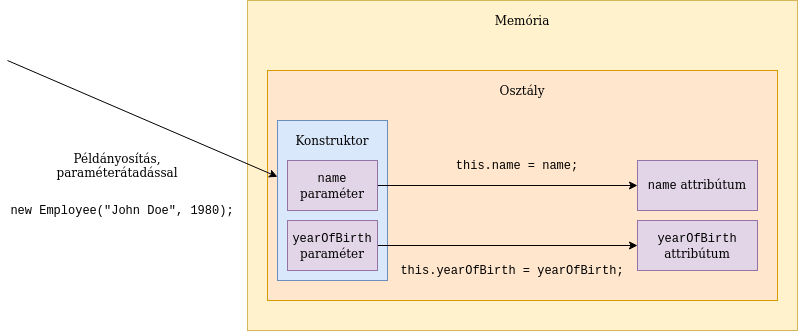

# Java történeti háttér

## Elmélet

**Szoftverkrízis** fogalma már 1968-ban megjelent, mely a mai napig azt jelenti, hogy
minél több, komplexebb alkalmazás fejlesztésére van igény, lehetőleg egyre kevesebb
fejlesztői erőforrás igénybevételével. Erre a problémára több megoldás is született
több-kevesebb sikerrel, és ezek között szerepelnek különböző programozási
paradigmák bevezetése, mint pl. **objektumorientált programozás**.

A **Java** nyelv 1991-ben a Sun titkos projektjeként született, James Gosling vezetésével.
A cél egy olyan programozási platform, mellyel hatékonyan lehet alkalmazásokat
fejleszteni olyan digitális eszközökhöz, mint pl. a televízió.
Az első megjelenése egy Mosaic böngészőbe épített Java motor, mely
egy molekulát forgatott három dimenzióban. Elképzelhető mekkora
újítás volt ez akkor, mikor a weboldalak fehér alapon fekete betűk voltak,
és az oldalakat kék színű linkek kötötték össze.


A Java kifejlesztésekor a következő célkitűzéseket fogalmazták meg:

* Egyszerű, könnyen tanulható és használható
* Objektumorientált
* Robusztus, azaz hibatűrő, az alkalmazás fejlesztője, vagy használója által
  vétett hiba ne befolyásolja a teljes alkalmazás működését, hanem kellően lokalizálható legyen
* Biztonságos, hiszen az internetről letöltött tartalmakban nem mindig lehet megbízni
* Architektúra-semleges, hordozható, azaz a megírt alkalmazás ugyanúgy fusson eltérő platformokon, mint Windows vagy Linux
* Nagyteljesítményű
* Interpretált, utasításonként végrehajtott
* Többszálúságot nyelvi szinten támogassa
* Dinamikus, azaz a futáshoz szükséges kódrészeket futás közben töltse be, mindig azt, amire szükség van


A Java programozási nyelv egy szabvány, melynek több implementációja (megvalósítása) létezik.
A hivatalos referencia implementáció az ingyenes [OpenJDK](https://openjdk.java.net/),
melyet az Oracle és az OpenJDK köré épült közösség fejleszt, több más cég
közreműködésével. Azonban ezt nem javasolják éles használatra, hanem
valamely erre épülő implementációt.

Történeti okok miatt az [Oracle Java SE JDK](https://www.oracle.com/java/technologies/javase-downloads.html)
a legelterjedtebb. Ez a Sun megvásárlásával került az Oracle-höz.
Azonban ennek használatához a Java 11 óta fizetni kell, így megjelentek további
implementációk, mint pl. az [AdoptOpenJDK](https://adoptopenjdk.net/).

Mivel elterjedt, és oktatásra ingyenes, ezért az Oracle Java SE JDK-t használjuk a
képzésen.

A Java elsődleges felhasználási területe nagyvállalati háttérrendszerek (backend). Mobil környezetben is
találkozhatunk vele, hiszen az Android készülékekre először Javaban kellett fejleszteni.

> A Google az Oracle-lel való jogi csatározások miatt Android területen kezd elfordulni a Java
programozási nyelvtől, és helyette a Kotlin programozási nyelvet javasolja.

Felhasználói felületek fejlesztésére, számítógépre telepíthető, önállóan futó alkalmazások
fejlesztésére (kliens alkalmazások) a Java nem annyira alkalmas. Bár több technológia létezik, Swing,
NetBeans Platform, Eclipse Platform, nem igazán terjedt el.
Főleg Java fejlesztőeszközöket implementálnak Java alkalmazásokként.

> A JavaFX egy újabb technológia felhasználói felületek fejlesztésére. A Java 8-as fejlesztőkészletben jelent
> meg, azonban a Java 11-esből eltávolították. Eredetileg a Java részét képező Swing vastag kliens technológia
> leváltására jött létre.

Java áll több IoT (Internet of Things - Internetre kötött eszközök), és Big Data megvalósítás mögött.
Az Oracle szerint jelenleg 10 millió Java fejlesztő van a világon és mintegy 15 milliárd Java kódot futtató eszköz.

A Java verziószámozása az újabb verziókban már konzisztens, a weboldalon letöltéskor megjelenő verziószám (pl. 12.0.1)
megegyezik azzal, amit a fejlesztőkörnyezet is kiír.

A tananyag legutóbbi frissítésekor a Java legfrissebb verziója a 15-ös verzió.

## További források

A Java verziószámozását, és a különböző verziókban megjelenő újdonságokat a
[Wikipedia](https://en.wikipedia.org/wiki/Java\_version\_history) részletesen taglalja.

## Ellenőrző kérdések

* Milyen megoldások születtek a szoftverkrízisre?
* Kinek a nevéhez kötődik a Java programozási nyelv?
* Mely cég vett és vesz részt a Java fejlesztésében?
* Milyen irányelveket vettek figyelembe a Java nyelv kialakításakor?
* Milyen Java implementációkat ismersz?
* Melyik a legfrissebb Java verzió?

# Oracle JDK telepítése

## Gyakorlati feladat

Ellenőrizd, hogy milyen **JDK** van telepítve a gépre parancssorban a `java -version` parancs kiadásával. Ha a legfrissebb,
akkor nincs további dolgod.
Amennyiben van fenn korábbi, mondjuk 8-as, akkor el kell távolítani (Windowson a _Programok telepítése és törlése_
kifejezésre keresve a _Start_ menüben.)
(A Java 8-at egyébként 2030-ig támogatják, és sok helyen még azt használják.)

A JDK mindenkori legfrissebb verzióját le kell tölteni a [https://www.oracle.com/java/technologies/javase-downloads.html](https://www.oracle.com/java/technologies/javase-downloads.html) címről.

A `jdk-XXX_windows-x64_bin.exe` állományt kell kiválasztani,
elfogadni a Licence feltételeket, majd letölteni és elindítani az állományt.

A varázslóval értelemszerűen feltelepíthető.

Alapértelmezetten a `C:\Program Files\Java\jdk-XXX` könyvtárba telepíti (az XXX helyére természetesen a
mindenkori aktuális verziószám kerül).

Állítsuk be a `JAVA_HOME` és `PATH` környezeti változókat!

Ehhez a Windows _Rendszer környezeti változóinak módosítása_ menüpontját kell kiválasztani a Start menüből.
A megjelenő ablakban a _Környezeti változók..._ gombra kell kattintani.

A `JAVA_HOME` értéke a könyvtár, ahova a JDK telepítve lett,
tehát `C:\Program Files\Java\jdk-XXX`, a `PATH` környezeti változó értéke `%JAVA_HOME%\bin` legyen.

Vigyázz, a környezeti változók szerkesztése után újra kell indítani a parancssort!

Sikeres telepítés és beállítás után parancssorba a `java -version` parancsot írva a következőt írja ki
(a verziószám természetesen itt is lehet más):

```
java version "16.0.1" 2021-04-20
Java(TM) SE Runtime Environment (build 16.0.1+9-24)
Java HotSpot(TM) 64-Bit Server VM (build 16.0.1+9-24, mixed mode, sharing)
```

# Több JDK egy gépen

Előfordulhat, hogy egy számítógépen több JDK-t kell használni.
Ez történhet azért, mert különböző projekteket különböző
verziójú JDK-val kell fejleszteni. Esetleg egy használt program
elvárja, hogy JDK legyen telepítve a gépre
([Általános Nyomtatványkitöltő (ÁNYK) - keretprogram](https://www.nav.gov.hu/nav/letoltesek/nyomtatvanykitolto_programok/nyomtatvany_apeh/keretprogramok/abevjava_install.html)).

Vannak programok, melyek az operációs rendszer beállításait veszik alapul.
Valamint ha parancssorból hívjuk a JDK-ban lévő programokat, akkor is
az operációs rendszer beállításai érvényesülnek.

Ezt kizárólag a `JAVA_HOME` és `PATH` környezeti változók szabályozzák.
A `JAVA_HOME` az a könyvtár, ahova a JDK telepítve lett. Pl.
Java 8 esetén Windowson a `C:\Program Files\Java\jdk1.8.0_271`
könyvtár. A `PATH` környezeti változó értéke tartalmazza azt, hogy melyik
könyvtárban vannak a segédprogramok. Ez a JDK `bin` könyvtára.
Ezért az értékei között szerepeljen a pl. `C:\Program Files\Java\jdk1.8.0_271\bin`!
Azért, hogy ne kelljen mindig mind a kettőt állítani, érdemes a `PATH`
értékei közé a következőt felvenni: `%JAVA_HOME%\bin`. Ekkor ha módosítjuk
a `JAVA_HOME` értékét, akkor változni fog a `PATH` értéke is.

Windowsban grafikus felületen a _Rendszer környezeti változóinak módosítása_
menüpontban tudjuk módosítani ezeket az értékeket.

Módosítás után újra kell indítani a parancssort, Total Commandert, stb.

Adott parancssorra ideiglenesen is állíthatjuk. Windowsban pl.:

```shell
set JAVA_HOME=C:\Java\jdk-11.0.10
echo %JAVA_HOME%
set PATH=%JAVA_HOME%\bin;%PATH%
echo %PATH%
```

Fontos, hogy a `PATH`-ban több JDK is szerepelhet, de az fog érvényesülni, ami
elöl van. Az `echo` paranccsokkal ellenőrizzük a beállítást.

Linux alatt:

```shell
export JAVA_HOME=/opt/jdk-11.0.10
echo $JAVA_HOME
export PATH=$JAVA_HOME/bin:$PATH
echo $PATH
```

Mindkét operációs rendszer alatt telepíthető tehát több JDK, csak
a `JAVA_HOME` és `PATH` beállítástól függ, melyiket használjuk.

Linux alatt használhatjuk az `update-alternatives`, `update-java-alternatives`
segédprogramokat, valamint a [jEnv - Manage your Java environment](https://www.jenv.be/)
eszközt.

A fejlesztőeszközökben ettől függetlenül állítható, pl.
IntelliJ IDEA esetén a _File / Project Structure / Project Settings / Project / Project SDK_
menüpontban.

# Maven

## Elmélet

Sajnos a Java platform nem biztosít standard **projektstruktúrát**.
A projekt nem más, mint a könyvtárak és fájlok halmaza. Itt főleg a
forráskódokat tartalmazó állományokat tároljuk.
A nyelv megjelenésekor minden projekt máshogy épült fel, más könyvtárakba csoportosították
az alkalmazás felépítéséhez szükséges állományokat. A Java források fordításával,
az így előállt bájtkód és az alkalmazás futtatásához szükséges egyéb állományok
(ún. erőforrás állományok, pl. szövegek, képek) összecsomagolásával jön létre maga az alkalmazás,
ez egy `jar` kiterjesztésű állomány. Ezt a folyamatot nevezzük **build** folyamatnak.

A Maven egy kvázi szabványos eszköz a build folyamat megvalósításáért. Ezen kívül
kezeli a függőségeket, hiszen egy alkalmazás fejlesztésekor számos más szervezet és
gyártó által megírt nyílt és zárt forráskódú programot/könyvtárat (**third party library**-t)
használunk.

Ennél azonban többnek definiálja magát a Maven, ún. software project management and comprehension tool.
Betartja a **Convention over configuration** elvet, ami azt jelenti, ha a konvencióknak
(megállapodásoknak) megfelelően járunk el, akkor az eszközt nem kell konfigurálni,
hanem a build folyamatban az előzetes megállapodásoknak megfelelően fog eljárni.

Ez gyakorlatban annyit tesz, ha a fájlokat a megfelelő könyvtárakban helyezzük el,
akkor különleges konfiguráció nélkül lefut a build folyamat, lefordításra kerülnek
a forrásállományok, és összecsomagolásra az alkalmazás.

A build folyamat általában a következő nagyobb lépésekből áll:

* Forrásállományok fordítása
* Többi, ún. erőforrás állomány megfelelő helyre másolása
* Tesztesetekhez szükséges erőforrás állományok másolása
* Tesztesetek fordítása
* Tesztesetek futtatása
* Alkalmazás összecsomagolása

Jelen projektben még nincsenek automatikus tesztesetek, de későbbi
projektekben készítünk ilyeneket is. (Az **automatikus tesztesetek**
olyan programok, melyek az alkalmazás helyes működését
ellenőrzik.)

A Maven projektet a `pom.xml` állomány írja le, melyet a projekt gyökerében,
azaz az állományainkat tartalmazó könyvtárban kell
elhelyezni. A különböző állományokat konvenció
szerint a következő könyvtárakba kell elhelyezni:

* `src\main\java` Java forráskódok
* `src\main\resources` Erőforrás állományok
* `src\test\java` Tesztesetek, nem része az alkalmazásnak
* `src\test\resources` Tesztesetekhez szükséges egyéb erőforrás állományok, nem része az alkalmazásnak

A következő példa bemutat egy minimális `pom.xml` állományt.

```xml
<?xml version="1.0" encoding="UTF-8"?>
<project xmlns="http://maven.apache.org/POM/4.0.0"
         xmlns:xsi="http://www.w3.org/2001/XMLSchema-instance"
         xsi:schemaLocation="http://maven.apache.org/POM/4.0.0 http://maven.apache.org/xsd/maven-4.0.0.xsd">
    <modelVersion>4.0.0</modelVersion>

    <groupId>training</groupId>
    <artifactId>intromaven</artifactId>
    <version>1.0-SNAPSHOT</version>

    <properties>
        <project.build.sourceEncoding>UTF-8</project.build.sourceEncoding>
        <maven.compiler.source>1.8</maven.compiler.source>
        <maven.compiler.target>1.8</maven.compiler.target>
    </properties>

</project>
```

Ebben szerepelnek a projekt koordinátái, melyek egyedileg azonosítják a projektet,
úgymint `groupId`, `artifactId`, `version`. Ezeket szabadon választhatjuk,
a `groupId` tipikusan a cégünk neve, ahol dolgozunk, az `artifactId`
a projekt neve. Az `artifactId` tipikusan megegyezik a könyvtár nevével,
amely tartalmazza a projektet és `pom.xml` állományt.

A verziószám pedig indulhat `1.0-SNAPSHOT` verzióval. A
`SNAPSHOT` azt jelenti, hogy az alkalmazás még fejlesztés alatt áll.

Érdemes még megadni a karakterkódolást,
hiszen a fájl önmaga nem tartalmazza, hogy milyen karakterkódolással íródott a
forráskód. Ez az ékezetes karakterek használatakor fontos. Ez a `project.build.sourceEncoding`
property-ben adható meg. Manapság érdemes mindenütt az UTF-8 karakterkódolást használni.

Tartalmaznia kell, hogy mely Java verzióval kompatibilis a forrás,
és mely Java verzióra legyen fordítva. Ezeket a `maven.compiler.source` és
`maven.compiler.target` property tartalmazza.

A build az `mvn clean package` paranccsal indítható. A `target/classes` könyvtárban
létrejönnek a `class` kiterjesztésű állományok. A `target` könyvtárban
létrejön a `jar` állomány.


## Ellenőrző kérdések

* Mire használjuk a Maven-t?
* Tipikusan hogyan épül fel egy build folyamat?
* Milyen alkönyvtárakat tartalmaz a projekt könyvtár?
* Mi ír le egy projektet? Milyen elemek találhatók benne?

## Gyakorlati feladatok

### Gyakorlati feladat - Maven telepítése

Töltsd le a legfrissebb Maven Binary zip archive állományt a [https://maven.apache.org/download.cgi](https://maven.apache.org/download.cgi) címről,
majd a letöltött `.zip` állományt tömörítsd ki a `C:\Java` könyvtárba!

A fájl neve pl. `apache-maven-3.8.1-bin.zip`.

Vedd fel az `M2_HOME` környezeti változót, melynek értéke az a könyvtár, ahova
a Maven ki lett csomagolva (példánkban `C:\Java\apache-maven-3.8.1`),
és vegyük fel a `PATH` környezeti változóba a `%M2_HOME%\bin` értéket is!


A telepítés és beállítás sikerességét a `mvn -version` parancs kiadásával ellenőrizzük!
Valami hasonlót fog kiírni:

```shell
Apache Maven 3.8.1 (05c21c65bdfed0f71a2f2ada8b84da59348c4c5d)
Maven home: C:\Program Files\Java\apache-maven-3.8.1\bin\..
Java version: 16.0.1, vendor: Oracle Corporation, runtime: C:\Program Files\Java\jdk-16.0.1
Default locale: hu_HU, platform encoding: Cp1250
OS name: "windows 10", version: "10.0", arch: "amd64", family: "windows"
```

### Gyakorlati feladat - Első Maven projekt

Hozz létre egy üres könyvtárat `intromaven` néven, abban egy `pom.xml` állományt a következő tartalommal.
Figyelj arra, hogy a `<maven.compiler.source>` és a `<maven.compiler.target>` tagekhez tartozó értéket
(ami itt `1.8`) cseréld ki a Java legfrissebb verziószámára (pl. `16`)!

```xml
<?xml version="1.0" encoding="UTF-8"?>
<project xmlns="http://maven.apache.org/POM/4.0.0"
         xmlns:xsi="http://www.w3.org/2001/XMLSchema-instance"
         xsi:schemaLocation="http://maven.apache.org/POM/4.0.0 http://maven.apache.org/xsd/maven-4.0.0.xsd">
    <modelVersion>4.0.0</modelVersion>

    <groupId>training</groupId>
    <artifactId>intromaven</artifactId>
    <version>1.0-SNAPSHOT</version>

    <properties>
        <project.build.sourceEncoding>UTF-8</project.build.sourceEncoding>
        <maven.compiler.source>1.8</maven.compiler.source>
        <maven.compiler.target>1.8</maven.compiler.target>
    </properties>

</project>
```

Majd az `src/main/java` könyvtárban hozzunk létre egy `HelloWorld.java` állományt
a következő tartalommal:

```java
public class HelloWorld {
  public static void main(String[] args) {
    System.out.println("Hello World!");
  }
}
```

Add ki az `mvn clean package` parancsot abban a könyvtárban, ahol a `pom.xml` található! Ha minden rendben történik, ilyesmit fog kiírni:

```shell
[INFO] Scanning for projects...
[INFO]
[INFO] ---------------------< training:intromaven >---------------------
[INFO] Building intromaven 1.0-SNAPSHOT
[INFO] --------------------------------[ jar ]---------------------------------
[INFO]
[INFO] --- maven-clean-plugin:2.5:clean (default-clean) @ intromaven ---
[INFO] Deleting C:\iviczian\Downloads\tmp\target
[INFO]
[INFO] --- maven-resources-plugin:2.6:resources (default-resources) @ intromaven ---
[INFO] Using 'UTF-8' encoding to copy filtered resources.
[INFO] skip non existing resourceDirectory C:\iviczian\Downloads\tmp\src\main\resources
[INFO]
[INFO] --- maven-compiler-plugin:3.1:compile (default-compile) @ intromaven ---
[INFO] Changes detected - recompiling the module!
[INFO] Compiling 1 source file to C:\iviczian\Downloads\tmp\target\classes
[INFO]
[INFO] --- maven-resources-plugin:2.6:testResources (default-testResources) @ intromaven ---
[INFO] Using 'UTF-8' encoding to copy filtered resources.
[INFO] skip non existing resourceDirectory C:\iviczian\Downloads\tmp\src\test\resources
[INFO]
[INFO] --- maven-compiler-plugin:3.1:testCompile (default-testCompile) @ intromaven ---
[INFO] No sources to compile
[INFO] 
[INFO] --- maven-surefire-plugin:2.12.4:test (default-test) @ intromaven ---
[INFO] No tests to run.
[INFO] 
[INFO] --- maven-jar-plugin:2.4:jar (default-jar) @ intromaven ---
[INFO] Building jar: C:\iviczian\Downloads\tmp\target\intromaven-1.0-SNAPSHOT.jar
[INFO] ------------------------------------------------------------------------
[INFO] BUILD SUCCESS
[INFO] ------------------------------------------------------------------------
[INFO] Total time:  1.453 s
[INFO] Finished at: 2020-09-25T11:27:09+02:00
[INFO] ------------------------------------------------------------------------ 
```

A `target/classes` könyvtárban
létrejön a `HelloWorld.class` állomány. Ez futtatható a következő paranccsal
a projekt könyvtárában: `java -classpath target\classes HelloWorld`.

A `target` könyvtárban létrejön az `intromaven-1.0-SNAPSHOT.jar` állomány.

# Maven használata proxy mögött

Amennyiben a számítógép proxy-n keresztül kapcsolódik
az internetre, ezt a Mavennek is be kell állítani,
hiszen a külső függőségeit az internetről tölti le.

Ehhez a `settins.xml`-be kell elhelyezni a következő
tartalmat. A megfelelő értékek átírandók.
A `settings.xml` fájl helye a HOME könyvtárban a
`.m2` könyvtár. Windows esetén `%USERPROFILE%\.m2\settings.xml`,
Linux esetén `${user.home}/.m2/settings.xml`.

```xml
<settings>
  <proxies>
   <proxy>
      <id>example-proxy</id>
      <active>true</active>
      <protocol>http</protocol>
      <host>proxy.example.com</host>
      <port>8080</port>
      <username>proxyuser</username>
      <password>somepassword</password>
      <nonProxyHosts>www.google.com|*.example.com</nonProxyHosts>
    </proxy>
  </proxies>
</settings>
```

# IDE

## Elmélet

Java fejlesztésre különböző **fejlesztőeszközöket** használunk, melyek ugyanúgy a JDK szolgáltatásaira épülnek, de grafikus
felhasználói felülettel rendelkeznek, és egyszerűbbé teszik a forráskód szerkesztését, a build folyamat futtatását,
az alkalmazás tesztelését és elindítását.

A legelterjedtebb fejlesztőeszközök a **NetBeans**, **Eclipse** és a **JetBrains IntelliJ IDEA**. A NetBeans nyílt
forráskódú, az Oracle berkeiben volt, de nemrég átkerült az Apache szervezethez. Az Eclipse fejlesztése régóta az
Apache szervezeten belül történik, szintén nyílt forráskódú eszköz. A NetBeans egy kezdők számára jobban ajánlott
eszköz, a különböző funkciók jobban integráltak, de kevésbé testre szabhatóak. Az Eclipse inkább haladó
fejlesztőknek javasolt, pluginekkel tetszőlegesen bővíthető és
jobban testre szabható. A JetBrains egy fejlesztőeszközök gyártására szakosodott cég, az ő termékük az
IDEA, mely egy Java fejlesztőeszköz. Nagyon sok Javára épülő technológiát támogat. Két kiadása van, egy ingyen használható
Community és egy nagyvállalati fejlesztésre szánt kereskedelmi Ultimate verzió.


A fejlesztőeszköz alapvető fogalma a **projekt**. Egy projekt állományok összessége:
Java forrásállományok, erőforrás állományok stb. Létre lehet hozni új projektet
vagy meg lehet nyitni már létező projektet.

Egy projekt típusa lehet különböző, attól függően, hogy milyen eszközöket szeretnénk használni.

Új projektet létrehozni a nyitóképernyőn, a _New Project_ gombbal lehet. Maven
projektet válasszunk ki. Majd meg kell adni a projekt nevét és a könyvtárat, amelyben tárolva lesz.

Ezután megjelenik a főablak. A projekt felépítését, fizikai elemeket (könyvtárakat, fájlokat) a bal oldalon található
Project ablak mutatja.

> Az alkalmazás új Java verzióval nem fog futni, mert be kell illeszteni a `pom.xml`-be, hogy
újabb Java verziót használunk.

A `pom.xml`-t kell módosítani, hogy frissebb Java verziót használunk (amennyiben már ez a verzió szerepel benne,
akkor természetesen nincs ezzel már újabb teendő):

```xml
<properties>
    <project.build.sourceEncoding>UTF-8</project.build.sourceEncoding>
    <maven.compiler.source>16</maven.compiler.source>
    <maven.compiler.target>16</maven.compiler.target>
</properties>
```

Az IDEA fejlesztőeszköz képes a Maven kezelésére, azonban a saját projekt fogalma
és a Maven projekt fogalma eltér. Ezért a kettőt szinkronizálja. Választhatunk,
hogy a fejlesztőeszköz automatikusan tegye ezt, vagy kérdezzen rá, és nekünk kell
a frissítést elvégezni, amennyiben módosítjuk a `pom.xml` állományt.

Azaz a `pom.xml` módosítása után a jobb oldalon lévő _Maven_ panelt nyissuk ki, és
nyomjuk meg a _Reload All Maven Projects_ gombot!

Új `.java` állomány úgy hozható létre, hogy a bal oldalon található _Project_ fülre kell kattintani.
Itt le kell nyitni a projektet, azon belül az `src\main\java` könyvtárat, és jobb klikk
_New / Java class_ menüpontot kell kiválasztani. Ugyanis a `.java` állományok
valójában osztályokat tartalmaznak.

A fejlesztő a legtöbb időt a kódszerkesztő ablakban tölti, mely különböző kisegítő
funkciókkal támogatja a forráskód írását, ilyen a kód színezése, vagy az automatikus
kódkiegészítés.

A fejlesztőeszköz lehetőséget biztosít az alkalmazás és a tesztesetek futtatására is.


Fontos megjegyezni, hogy az IDEA-ban az `src/main/java` könyvtárnak
Sources Root-nak kell lennie, míg az `src/test/java` könyvtárnak
Test Sources Root könyvtárnak. Amennyiben a projekt megnyitásakor
ezek már léteznek, az IDEA felismeri ezeket. Amennyiben később kerülnek
létrehozásra, frissíteni kell a Maven konfigurációt. Ehhez a _View / Tool Windows /
Maven Projects_ ablakot kell előhozni, és ott megnyomni a _Reimport All Maven Projects_
gombot.

Az IDEA leggyakrabban használt billentyűzet kombinációit a _Help/Keymap reference_
tartalmazza, mely egy nyomtatható PDF állomány.

A leghasznosabb a `Ctrl + Space`, ami automatikus kódkiegészítést végez, valamint
a `Alt + Enter`, mely a leggyakoribb hibákra próbál megoldási javaslatot adni.
Gyakran használt kódrészleteket nem kell mindig begépelni, hanem erre ún.
code template-ek állnak rendelkezésre. Ilyenkor egy rövidítést kell
beírni, majd a `Tab` billentyűt lenyomni.
A `.java` fájlon belül egy osztály található. Azon belül a `main`-t egy
metódusnak nevezzük. A `psvm + Tab`
a `main()` metódust generálja le. A `sout + Tab` billentyűkombinációval a `System.out.println`
utasítást generáljuk le.

## Ellenőrző kérdések

* Milyen Java IDE-kről hallottál?
* Miben segít nekünk az IDE?
* Mi a fejlesztés alapegysége, (a könyvtár, amiben a fájlok találhatóak)?
* Mondj néhány billentyűkombinációt!

## Gyakorlati feladatok

### Gyakorlati feladat - IDEA telepítése

Ellenőrizd, hogy az IntelliJ IDEA fejlesztőeszköz telepítve van-e a gépeden!
Az Asztalon, Tálcán, vagy a Start menüben meg kell jelennie.

Amennyiben nincs, az IDEA letölthető a [https://www.jetbrains.com/idea/#chooseYourEdition](https://www.jetbrains.com/idea/#chooseYourEdition)
címről, és a Community verziót kell letölteni és feltelepíteni.

Érdemes a `C:\Java` könyvtárba telepíteni.

A telepítés történhet az alapértelmezett beállításokkal, azon módosítani nem
szükséges.

### Gyakorlati feladat - Új projekt létrehozása

Hozz létre egy új projektet `introide` néven a `C:\training\introide`
könyvtárba! Módosítsd megfelelően a `pom.xml` fájlt! Hozz létre benne egy
`HelloWorld` osztályt, mely kiírja a `Hello World!` szöveget! Futtasd az
alkalmazást!

# Git használata IDE-ben

## Elmélet

Az IDEA fejlesztőeszköz beépítetten támogatja a **Git** használatát.
Lehetőség van új projekt esetén azt verziókezelő rendszerben tárolni,
vagy egy projektet úgy megnyitni, hogy közvetlen verziókezelő rendszerből
kerüljön letöltésre és megnyitásra.

Ahhoz, hogy egy új projekt Git alatt legyen tárolva, a `git init` parancsot kell
kiadni. Ez felületről is megoldható a _VCS / Enable Version
Control Integration_ menüpont használatával.

Alul található a _Git_ panel. Ezen ablak mutatja az újonnan létrehozott,
módosított és törölt állományokat. Itt lehet az állományokat a Githez hozzáadni,
commitolni. A _Revert_ művelettel lehet a saját módosításainkat elvetni.

A `pom.xml`, `.gitignore`, és a `*.java` állományokat adjuk hozzá. A `target` könyvtárba
dolgozik a Maven, az `.idea` könyvtár tartalma az IDEA-hoz tartozik,
azt sose commitoljuk. Ehelyett helyezzük el a `.gitignore` fájlban.

```
target/
.idea/
```

> Az IDEA újabb verziói már nem hoznak létre `.iml` fájlokat, így azt már nem kell beleírni.

> A `.gitignore` fájlt az IDEA újabb verziói már a projekt létrehozásakor
elkészítik. Alapesetben elég sok sort tartalmaz, a fájl tartalmát nyugodtan
ki lehet cserélni csak a fenti pár sorra.

A verziókezelő rendszerhez, azaz esetünkben a Githez kapcsolódó parancsokat
a _VCS / Git_ menüpont alatt lehet megtalálni, ebből a _Remotes..._, _Pull..._ és _Push..._ a leggyakrabban
használt.

Alul megtalálható a _Git_ panel is, mely információkat ad a Git műveletekről és a
repository-ról.


Bár érdemes az IDEA fejlesztőeszközt használni a Git műveletek végrehajtására,
tisztában kell lenni azzal, hogy parancssorban hogyan lehet ezeket elvégezni.
Gyakran lehet olyan, hogy vagy nincs kéznél fejlesztőeszköz, vagy
parancssorból kell ellenőrizni, hogy a fejlesztőeszköz jól működik-e, esetleg
speciális parancsokat kell kiadni.

## Ellenőrző kérdések

* Hogyan támogatja a fejlesztőeszköz a Git használatát?

## Gyakorlati feladatok

### Gyakorlati feladat - Első commitok

Hozz létre egy új projektet `introgit` néven, abban egy `HelloGit`
Java osztályt, ami kiírja, hogy `Hello Git!`!

Hozz létre egy lokális Git repository-t, és commitold a megoldásodat!

Módosítsd a Java osztályt, hogy most már azt írja ki, hogy `Hello IDEA and Git!`.

Commitold a megoldásodat!

# Feltöltés a GitHubra

## Elmélet

Ahhoz, hogy a projektet meg lehessen osztani **GitHub**-on, a webes felületen
létre kell hozni egy új üres projektet. Ennek az URL-jét kell
kimásolni, és a _VCS / Git / Remotes_ menüpontban kell `origin` néven
felvenni a lokális repository-ban távoli repository-ként.

Ahhoz, hogy működjön az azonosítás, a _Settings_ menüpontban,
a _Git_ ablakban a _Use credential helper_ checkboxot
be kell klikkelni. Majd újra a _VCS / Git / Push_ menüpontban
lehet a módosításokat push-olni a távoli repository-ba.

Commitnál is lehet egyből push-olni, ha a _Commit_ gomb
melletti nyíllal kiválasztod, hogy _Commit and push_.

## Ellenőrző kérdések

* Milyen lépések kellenek, hogy a GitHubon meg tudd osztani a projektedet?
* Mi az a push?
* Mi az az `origin`?
* Mi a különbség a local és a remote repository között?

## Gyakorlati feladatok

### Gyakorlati feladat - Első push

Hozz létre egy új projektet `introgit` néven, abban egy `HelloGit`
Java osztályt, ami kiírja, hogy `Hello Git!`!

Ha még nem vagy regisztrálva, regisztráld magad a GitHubon!

Hozz létre egy local Git repository-t, és commitold a megoldásodat!
Majd hozz létre egy GitHub repository-t, vedd fel
`origin` néven távoli repository-ként és push-old a megoldásodat!

### Gyakorlati feladat - Második push

Írd át a `HelloGit` osztályban, hogy azt írja ki, hogy `Hello IDEA and Git!`!

Commitold és egyben push-old a megoldásodat!

# Kiírás és beolvasás konzolról

## Elmélet

A Java nyelv alap építőköve az **osztály**. Minden alkalmazás osztályokból épül fel.
Tipikusan egy fájlba egy osztályt írunk, és a fájl neve meg kell egyezzen az
osztály nevével. (Megj.: Ha több osztályt írunk egy fájlba, akkor csak egyetlen
publikus osztály - `public` módosítószóval ellátott - lehet benne, és ennek a
neve kell megegyezzen a fájlnévvel.)

Ez egy egyszerű osztály:

```java
public class HelloWorld {

}
```

Látszik, hogy a Java forráskód struktúráját kapcsos zárójelekkel adjuk meg. Ezek
ún. **blokkokat** képeznek.

Sok osztályból álló alkalmazásnak **csomagokkal** tudunk belső struktúrát adni. A
csomagok nem csak könnyebbé teszik az áttekintést, de az osztályok láthatóságát
is szabályozzák. A csomagok fizikailag könyvtárként jelennek meg.

A csomagot meg kell adni az első utasításban a `package` kulcsszóval.

```java
package training;

public class HelloWorld {

}
```


Az osztály tagjai között vannak, amelyek adatokat tárolnak és vannak, amelyek
utasításokat fognak össze. Ez utóbbiak a **metódusok**.

Látható, hogy az eddigi utasítások hatására még nem történt semmi, az ilyen
utasítások a **deklarációs utasítások**. Ezek csak arra valók, hogy struktúrát adjanak
a programunknak, vagy valaminek nevet adjanak, amire később tudunk hivatkozni.

Az alkalmazáson belül azon osztályok futtathatóak, melyek tartalmaznak `main()`
metódust. Egy alkalmazásban akár több ilyen is lehet, azonban tipikusan egy
szokott lenni, ez az alkalmazás fő belépési pontja, ezzel indítjuk el az
alkalmazást. Azonban tanuláskor több osztálynak is készíthetünk `main()` metódust,
tesztelve osztályunk működését. A JVM a `main()` metódust csak akkor találja meg,
ha megfelel bizonyos szabályoknak. Nézzük, hogy kell kinéznie egy `main`
metódusnak az osztályon belül:

```java
package training;

public class HelloWorld {

    public static void main(String[] args) {
        System.out.println("Hello World!");
    }

}
```

Látható, hogy itt a struktúra miatt a blokkokat egymásba ágyazzuk, hiszen
az osztály tartalmazza a metódust.

Ez az osztály futtatható, a `training` csomagban van és a fájl neve `HelloWorld.java`.
Az osztály futtatásával a `main()` metódusban lévő utasítások szépen sorban
végrehajtódnak. A `HelloWorld` osztály esetében ez egyetlen egy utasítást jelent,
mely a konzolra kiírja a `Hello World!` szöveget.

Az IntelliJ IDEA fejlesztőeszköz számos template-et tartalmaz a gyakran használt
kódrészletek gyors legenerálására. Ezek a template-ek rövid szavakkal elérhetőek,
melyek begépelése után a `Tab` billentyű lenyomására az elmentett kódrészlet
jelenik meg. Ilyen például a `main()` metódust legeneráló `psvm` rövidítés.
A `System.out.println()` utasítás szintén elérhető template-ből a `sout` rövidítéssel.
További template-eket találsz a _File / Settings..._ menüpont alatt megjelenő
ablak _Editor/Live Templates_ lapján.

## Kommunikáció a felhasználóval

Az alkalmazások valamilyen felületen át kommunikálnak a felhasználóval. Az üzenetek
megjelenítésének legegyszerűbb módja, ha azt a konzolra kiírjuk. Ezt
a `System.out.println()` metódus hívásával tehetjük meg. A zárójelei között
paraméterként a kiírandó üzenetet kell megadnunk. Ez legtöbbször szöveg, de lehet
más típusú adat is.

> A `System.out.println()` metódus a két kerek zárójel között megadott kifejezéseket
> sortöréssel, egymás alá írja ki a konzolra. Egy ilyen, a kerek zárójelek között megadott, szövegként
> értelmezhető kifejezés után automatikusan következik egy sortörés karakter.
> Használható még a `System.out.print()` metódus is, amely a kiírást sortörés nélkül valósítja meg.
> Több egymás utáni `System.out.print()` metódushívással egymás mellé írhatjuk a konzolra a különböző
> szövegeket.

Ha szeretnénk valamilyen adatot bekérni a felhasználótól, akkor azt a `Scanner`
osztállyal tehetjük meg. Ehhez először **példányosítanunk** kell egy **objektumot**
az osztály alapján a `new Scanner(System.in)`
utasítással, és a kapott objektumot el kell tárolni egy **változóban**. Ezek után
a `Scanner` objektum metódusait használva különböző típusú adatokat tudunk beolvasni.

* `nextLine()`: az `Enter` lenyomásáig bevitt szöveget olvassa be
* `nextInt()`: egész szám beolvasására használható

Egy szöveg beolvasható a következő kóddal:

```java
package training;

import java.util.Scanner;

public class HelloWorld {

    public static void main(String[] args) {
        Scanner scanner = new Scanner(System.in);

        System.out.println("What's your name?");
        String name = scanner.nextLine();
        System.out.println(name);
    }
}
```

A `Scanner scanner` egy **változódeklaráció**, ahol a `scanner` a változó neve,
a `Scanner` annak típusa. A típust kötelező megadni, mert a Java egy
szigorúan típusos nyelv, ami azt jelenti, hogy nem lehet akármilyen értéket adni egy
változónak, csak olyat, amit a típusa megenged.
Majd az egyenlőségjellel értéket adunk neki.

A `String name` ugyanígy egy változódeklaráció, ahol a `name` a változó neve,
a `String` annak típusa (karakterlánc). Majd az egyenlőségjellel értéket adunk neki, méghozzá
úgy, hogy beolvassuk a konzolról.

A kód tehát beolvassa a nevet, majd kiírja a konzolra. A nevet az IDEA-ban alul,
a `Run` ablakban lehet megadni.

Mivel a `Scanner` osztály a `java.util` csomagban található, ezért **importálni**
kell az osztály elején. Ezt nem szükséges beírni, hanem amikor az
osztály nevét (`Scanner`) írjuk a `main()` metódusban, akkor az IDEA felajánlja,
hogy automatikusan beimportálja. Ehhez nyomjuk meg az `Alt + Enter`
billentyűkombinációt (amikor az osztály neve piros és alá van húzva).
Ekkor elhelyezi az IDEA az import utasítást az osztály elején a csomagdeklaráció
(`package`) alatt.

A következő példa azt is megmutatja, milyen műveleteket lehet végezni a `String`
és `int` típusú értékekkel.

```java
package training;

import java.util.Scanner;

public class HelloWorld {

    public static void main(String[] args) {
        Scanner scanner = new Scanner(System.in);

        System.out.println("What's your name?");
        String name = scanner.nextLine();
        System.out.println("Hello " + name); // 1

        System.out.println("What's your year of birth?");
        int yearOfBirth = scanner.nextInt();
        System.out.println("Year of birth: " + yearOfBirth); // 2

        System.out.println(2019 - yearOfBirth); // 3
    }
}
```


Az `int yearOfBirth` utasítással egy `int` típusú, `yearOfBirth` nevű
változót deklarálunk. Ennek értéke tehát csak egy egész szám lehet.

Az `// 1` jelzéssel ellátott sor mutatja, hogy kell két karakterláncot összefűzni.
A `// 2` jelzéssel ellátott sor mutatja, hogy egy karakterlánchoz egy egész szám is
hozzáfűzhető. Ekkor a szám először automatikusan szöveggé kerül átalakításra.
A `// 3` jelzéssel ellátott sor mutatja, hogy lehet két egész számmal kivonás műveletet
elvégezni.

> Egyszerűnek tűnik, ugye? Azonban akadhatnak problémák, amikbe előbb utóbb belefutsz.
A `nextInt()` nem olvassa be az Enter leütésével odakerült sortörés karaktert,
így az a következő `nextLine()` hívást megzavarja.

Mire figyelj a `Scanner` használatakor: a `nextLine()` a teljes szöveget beolvassa,
de a sorvége jelet eldobja, míg a `nextInt()` csak az első láthatatlan karakterig
(pl. szóköz, sorvége jel) olvas, és azt ott hagyja. Éppen ezért, ha szám beolvasása
után egy szöveget akarsz olvasni, akkor azt fogod tapasztalni, hogy ez a szöveg
üres lesz, és csak a második olvasás ad eredményt.

```java
public static void main(String[] args) {
        Scanner scanner = new Scanner(System.in);

        System.out.println("How old are you?");
        int age = scanner.nextInt();
        scanner.nextLine(); //Ez fogja az ottmaradt sorvége jelet beolvasni
        
        System.out.println("What's your name?");
        String name = scanner.nextLine();
        System.out.println(name);
    }
```

## Ellenőrző kérdések

* Mik a Java alkalmazások alapvető építőkövei?
* Egy Java osztály mit tartalmazhat, amikben utasításokat lehet írni?
* Hogyan lehet konzolról adatokat bekérni? Melyik osztályra van ehhez szükségünk?
* Mivel a `Scanner` másik csomagban található, mit kell csinálni a használatához?
* Hogyan lehet a konzolra adatokat kiírni?
* Milyen probléma merülhet fel az egész szám beolvasásakor?

## Gyakorlati feladatok

`demos/src/main/java/classstructureio` 

Hozz létre egy új projektet a `C:\training\training-solutions` könyvtárba, és innentől
ebbe a projektbe dolgozz külön csomagokban! Hozz létre egy repository-t a GitHub accountodon
a mentor által megadott néven! Innentől ide push-old a megoldásaidat!

Figyelj arra, hogy külön feladatmegoldások mindig külön commitban legyenek!

A feladatok megoldásai a `solutions/classstructureio` elérési úton vannak.

Hozz létre te is egy `classstructureio` csomagot, és ennél a leckénél abba tedd a
gyakorlati feladatok megoldásait!

### A main metódus szerepe

A `main()` metódus a legegyszerűbb módja annak, hogy a megírt kódodat kipróbáld,
legyen ez akár egy osztály, akár egy metódus.

Ide tetszőleges utasításokat írhatsz, amivel kipróbálod, teszteled a megoldásod. A feladatleírások
adnak ugyan támpontokat, de ennél nyugodtan teljesíthetsz többet. Próbálj osztályokat
példányosítani, meghívni a különböző metódusokat, különböző paraméterekkel! Az adatokat
akár a konzolról is bekérheted a felhasználótól (akkor is, ha esetleg nem szerepel a
feladatkiírásban).

### Gyakorlati feladat - Számológép

Készíts egy `Calculator` osztályt a `classstructureio` csomagba! A `main` metódusban kérj be a felhasználótól
két egész számot! Az első sorban írd ki a műveletet a következő formátumban: `5 + 10`! A második
sorban írd ki az eredményt (`15`)!

### Gyakorlati feladat - Regisztráció

Készíts egy `Registration` osztályt a `classstructureio` csomagba! A `main` metódusban kérd be a felhasználótól a
nevét és az email címét, majd írd ki, hogy milyen adatokkal regisztrált!

# Objektumok és attribútumok

## Elmélet

Egy Java alkalmazás a futás közben létrejövő és egymással kommunikáló **objektumok**
összessége. Ezen objektumok az osztályok alapján készülnek el. Az objektumok
tárolhatnak adatokat, melyeket **attribútumnak** nevezünk. Az attribútumok
tulajdonképpen osztályszinten deklarált **változók**. Az azonos típusú
objektumok ugyanolyan mintára készülnek, ezért ugyanolyan típusú adatok tárolására
alkalmasak. Egy objektum **állapotán** az attribútumok aktuális értékeinek
összességét értjük.
Gondoljunk úgy az osztályra, mint egy tervrajzra, ami alapján elkészítjük,
más szóval **példányosítjuk** az objektumokat. A példányosítás a `new`
kulcsszóval történik. Ezért az objektumra a **példány** szót is szoktuk használni.
Egy osztályhoz bármennyi példányt tudunk készíteni.
(Hasonlóan, ahogy egy tervrajz alapján több házat is meg tudunk építeni.)
Látható, hogy eddig a `Scanner` objektumot is példányosítottuk:

```java
Scanner scanner = new Scanner(System.in);
``` 
Nem csak a Javaban már létező osztályt tudunk példányosítani,
hanem saját osztályt is létre tudunk hozni.

Ezen belül attribútumokat a típusuk és a nevük megadásával deklarálhatunk:

```java
public class Trainer {
    
    String name;

    int yearOfBirth;

}
```

Példányosítás után az adott objektumot értékül adjuk egy változónak,
hogy később tudjunk rá hivatkozni.
Az objektum attribútumát a pont operátorral érhetjük el.

Ahhoz, hogy kipróbáljuk az osztályunkat, egy új `TrainerMain` osztályt
hozunk létre. A `main()` metódust akár a `Trainer` osztályban is létrehozhatnánk,
de így jobban látható, hogy hogyan használható egy osztály a másikból.

```java
public class TrainerMain {

    public static void main(String[] args) {
        Trainer trainer = new Trainer(); // 1
        trainer.name = "John Doe";
        trainer.yearOfBirth = 1980;
    
        Trainer anotherTrainer = new Trainer(); // 2
        anotherTrainer.name = "Jack Doe";
    }

}
```

A példában látható, hogy az `// 1` jelzéssel ellátott sorban példányosítunk egy
`Trainer` objektumot, és értékül adjuk egy `Trainer` típusú `trainer` nevű változónak.

Ebből a példányosítás:

```java
new Trainer()
```

Ez így önmagában is értelmes utasítás. Hatására létrejön egy
objektum, és lefoglalásra kerül a JVM memóriájában.
Amikor az objektum létrejön,
még üres a `name` attribútumának értéke, és a `yearOfBirth` értéke `0`.

Azért nem használjuk így magában, mert így nem tudunk rá a későbbiekben hivatkozni,
nem tudjuk átállítani az
attribútumainak az értékét.

Hogy az attribútumának értékét, azaz az állapotát módosítani tudjuk, létrehozunk egy `Trainer` típusú `trainer`
változót. A típusa egy osztály, ezért nagybetűs. A neve bármi lehet, szabadon
választhatjuk meg, konvenció szerint kisbetűs. Majd az egyenlőségjellel értékül adjuk neki a példányosított
objektumot.


Így a későbbiekben már tudunk rá hivatkozni, és a változó nevét használva
(`trainer`), beállítjuk a nevét és a születési évét. Ez lesz
az objektum állapota.

```java
trainer.name = "John Doe"
```

Majd a `// 2` jelzéssel ellátott sorban példányosítunk
egy másik `Trainer` objektumot, ennek más nevet állítunk be.


Az ábrán narancssárga mező reprezentálja a virtuális gép memóriáját. A lila `Trainer` osztály
alapján jön létre két sárgával jelölt objektum (`John Doe` és `Jack Doe`). Az elsőre a `trainer` változó,
a másodikra az `anotherTrainer` változó hivatkozik.

### Változók elnevezése

A változók neve szabadon választható, konvenció szerint legyen kisbetűs. Utaljon arra,
hogy mit tárol, hiszen arra való, hogy a későbbiekben
ezen keresztül férjünk hozzá a példányosított objektumhoz. Az előbbi kódrészlet tehát így is helyes lenne:

```java
public class TrainerMain {

    public static void main(String[] args) {
        Trainer john = new Trainer(); // 1
        john.name = "John Doe";
        john.yearOfBirth = 1980;
    
        Trainer jack = new Trainer(); // 2
        jack.name = "Jack Doe";
    }

}
```

Ugyanúgy a `Scanner`-t tartalmazó változót is nevezhetjük másképp:

```java
Scanner systemInScanner = new Scanner(System.in);
``` 

## Ellenőrző kérdések

* Mi a kapcsolat az osztály és példány között?
* Mi az az attribútum?
* Mit értünk egy objektum állapota alatt?

## Gyakorlati feladatok

A `classstructureattributes` csomagba dolgozz!

A feladatok megoldásai a `solutions/classstructureattributes` elérési úton vannak.

### Gyakorlati feladat - Ügyfél nyilvántartás

Hozz létre egy `Client` osztályt, melynek három attribútuma van: név (`name`), születési év (`year`)
és cím (`address`). Típusaik rendre `String`, `int` és `String`.

Hozz létre egy `main()` metódust a `ClientMain` osztályba, amelyben kipróbálod
a `Client` osztály működését. Példányosítani kell egy objektumot
a `Client` osztály alapján, majd kérd be az attribútumok értékét a
felhasználótól. Ellenőrzésképp írd ki minden attribútumának értékét a konzolra!

### Gyakorlati feladatok - Zeneszámok

Készíts egy `Song` osztályt, melyben eltárolhatod egy dal előadóját (`band`), címét
(`title`) és a hosszát (`length`) percben!

Készíts `main()` metódust egy `Music` osztályba, ahol kérd be a felhasználótól
a kedvenc zeneszáma adatait! Ellenőrzésképp írd ki a megadott adatokat
`előadó - cím (hossz percben)` formában, azaz `Britney Spears - Oops!...I Did It Again (4 perc)`!

# Metódusok

## Elmélet

Az objektumok nem csak adatokat, hanem **utasításokat** is tartalmazhatnak. Az utasítások többfélék
lehetnek. Többségüket egy osztályon belül a **metódusok** fogják egybe.
A metódusok feladata az objektum attribútumainak módosítása vagy azok lekérdezése.
Ezzel tulajdonképpen pontosíthatjuk az osztály definícióját: az osztály a tulajdonságok (attribútumok) és
műveletek (metódusok) összessége.

A metódus hívásakor az egyik metódus átadja a vezérlést a másik metódusnak, és
átadja neki a **paramétereket**. A metódushívás a példányokon értelmezett.

Egy metódus készítésekor meg kell adnunk, hogy mi legyen a **visszatérési típusa**,
a neve, valamint a paraméterek listája.
Visszatérési típust akkor is kötelező megadnunk, ha a metódus nem ad vissza értéket.
Ebben az esetben a `void` kulcsszót kell használnunk.

Amennyiben nem `void` a visszatérési típus, muszáj valamilyen értékkel
visszatérni. Ehhez a `return` kulcsszó használandó és utána kell írni a visszatérési értéket.
A `return` főleg a metódusok utolsó utasításaként szerepel.

Metódusnak nem kell lennie paraméterének, ekkor csak egy nyitó és csukó zárójel szerepel.
A paramétereket egymástól vesszővel kell elválasztani. Mivel a Java
erősen típusos nyelv, minden paraméter esetén meg kell adni annak típusát is.

A `main()` is egy metódus.


A metódus hozzáfér az attribútumokhoz, valamint a paraméterekhez. A metóduson
belül is deklarálhatunk változókat, ezek a **lokális változók**. Az attribútumok, a paraméterként
átadott változók és a lokális változók együttesen, összefoglaló néven **változók**,
létrehozásuk pedig **változódeklaráció** utasítással történik.
Előfordul, hogy a paraméterként kapott változó neve ugyanaz, mint az attribútumé. Ekkor a
paraméter elfedi az attribútumot. Ha leírjuk magában a nevet, az a paraméterre
vonatkozik.
Úgy lehet az attribútumhoz hozzáférni, hogy az attribútum elé kitesszük a `this` minősítőt.


Fontos objektumorientált alapelv, hogy az attribútumokhoz nem engedünk közvetlen
hozzáférést kívülről, azokat mind lekérdezni, mind módosítani csak metóduson át
lehet. Ez az **information hiding** alapelv. De hogyan tudjuk ezt elérni? A
tagok láthatóságát **módosítószavakkal** szabályozhatjuk, melyet mindig a legelső
helyen kell megadni.

* `public` - minden osztályból látható, elérhető
* `private` - csak az adott osztályon belül látható, érhető el

Javaban az alapértelmezett láthatóság a package private, azaz azonos csomagon
belül más osztályokból is elérhető a tag. Ekkor semmilyen módosítót nem használunk.
Ezért deklaráljuk az attribútumainkat mindig privátként!

Az adott osztályban látható néhány metódus is.

```java
public class Trainer {
    
    private String name;
    
    private int yearOfBirth;
    
    public String getNameAndYearOfBirth() {
        return name + ": " + yearOfBirth;
    }
    
    public int getAge(int year) {
        return year - yearOfBirth;
    }
    
    public void changeName(String name) {
        this.name = name;
    }
    
    public void setYearOfBirth(int yearOfBirth) {
        this.yearOfBirth = yearOfBirth;
    }
    
}
```

Egy másik osztályból már csak a `Trainer` metódusait érhetjük el, az attribútumait nem.

```java
public class TrainerMain {
    
    public static void main(String[] args) {
        Trainer trainer = new Trainer();
        trainer.changeName("John Doe");
        trainer.setYearOfBirth(1980);

        String nameAndYearOfBirth = trainer.getNameAndYearOfBirth();
        int age = trainer.getAge(2019);
    }
}
```

Itt a `main()` metódusból meghívásra kerül a `changeName()` metódus, és paraméterül
átadásra kerül a `John Doe` érték. Majd meghívásra kerül a `setYearOfBirth()` metódus,
mely paraméterül kapja az `1980` egész számot. Ezek nem adnak vissza értéket.
A `getNameAndYearOfBirth()` metódusnak nincs paramétere, de visszatér egy karakterlánccal,
melyet eltárolunk a `nameAndYearOfBirth` változóban. A `getAge()` metódus visszaad egy
egész értéket, melyet eltárolunk az `age` változóban.

Nagyon gyakran használunk olyan metódusokat, amelyek egyetlen attribútum értékét
lekérdezik, illetve módosítják. A lekérdező metódus neve **getter**, a módosítóé
**setter**.

## Fejlesztőeszköz támogatás

> Látható, hogy nem mindig, de van olyan eset, mikor az IDEA megjeleníti
a paraméter nevét. Ezt nem kell begépelni!

A fejlesztőeszköz csak segít abban, hogy szürkével megjeleníti a paraméter nevét.
Ezt nem kell kiírni. Javaban a metódus hívásakor csak a paraméter neveket kell
megadni sorban egymás után, vesszővel elválasztva.

Tehát az IDEA így jeleníti meg:

```
anotherTrainer.changeName(newName: "Joe Doe"); // Ez a Java kód nem fordul le
```


Helyesen természetesen így kell meghívni:

```
anotherTrainer.changeName("Joe Doe");
```

A getter és setter metódusokat az IDEA-val nagyon könnyen előállíthatjuk:
jobb klikk a szerkesztőben, majd _Generate..._ (vagy `ALT + Insert` billentyűkombináció),
azon belül _Getter and Setter_ pont. Miután kiválasztottuk azokat az attribútumokat,
amelyekhez szeretnénk gettert és settert generálni, az IDEA automatikusan beszúrja
ezek kódját az osztályba.

A névhez generált getter és setter metódusok:

```java
public String getName() {
    return name;
}

public void setName(String name) {
    this.name = name;
}
```

## Ellenőrző kérdések

* Mi a feladata a metódusoknak?
* Mihez férhetnek hozzá a metódusok?
* Milyen részei vannak a metódus deklarációjának?
* Mik azok a getter és setter metódusok? Mi a nevük, paramétereik és visszatérési értékeik?

## Gyakorlati feladatok

A `classstructuremethods` csomagba dolgozz!

A feladatok megoldásai a `solutions/classstructuremethods` elérési úton vannak.

### Gyakorlati feladat - Ügyfél nyilvántartás

Hozz létre egy `Client` osztályt, melynek három `private` attribútuma van:
név (`name`), születési év (`year`) és cím (`address`). Típusaik rendre
`String`, `int` és `String`!

Mind a három attribútumra legyen lekérdező és módosító metódus! Legyen egy
`public void migrate(String address)` metódusa is, mely az ügyfél elköltözését
implementálja, valójában beállítja a tárolt címet az új, paraméterként átadott címre.

Hozz létre egy `main()` metódust egy `ClientMain` osztályban, amelyben kipróbálod
az osztály működését! Példányosítani kell egy objektumot a `Client` osztály alapján, majd
be kell állítani az attribútumai értékét.
Írd ki konzolra az összes adatát, majd hívd meg a `migrate()` metódust egy másik címmel!
Jelezd vissza a felhasználónak a címváltozás sikerességét úgy, hogy kiírod az
eltárolt új címet!

### Gyakorlati feladat - Jegyzeteljünk!

Készíts egy `Note` osztályt, melyben a felhasználó rövid szöveges jegyzetét
tárolod. Tárolni kell a felhasználó nevét (`name`), a jegyzet témáját (`topic`)
és szövegét (`text`). Fejlesztés során ezentúl mindig tartsd be az information
hiding elvet, azaz az attribútumok legyenek privátak, és készíts
hozzájuk gettereket és settereket! Készíts egy `getNoteText()` metódust, mely az
osztály attribútumai alapján egyetlen szöveget ad vissza `name: (topic) text` formátumban!

Teszteld az osztályod a `NoteMain` osztály `main()` metódusából! A `Note` tartalmának
megjelenítésekor használd a `getNoteText()` metódust!

# Konstruktorok

## Elmélet

A **konstruktorok** felelősek az objektumok állapotának inicializálásáért. Amikor
egy osztályt példányosítunk, akkor lefoglalásra kerül a memóriában a hely az attribútumai
számára. Ezek kezdőértéket kívülről konstruktoron át kaphatnak.

A konstruktor hasonlít egy metódusra, de nem az. A konstruktornak nincs visszatérési értéke,
a neve pedig megegyezik az osztály nevével.

```java
public class Trainer {
    
    private String name;
    
    private int yearOfBirth;
    
    public Trainer(String name, int yearOfBirth) {
        this.name = name;
        this.yearOfBirth = yearOfBirth;
    }
    
    //getter és setter metódusok
}
```

Látható, hogy itt is a paraméterek elfedik az attribútumokat, ezért ha az
attribútumra akarunk hivatkozni, akkor a `this` kulcsszót kell alkalmaznunk.

Amikor a `new` operátorral szeretnénk egy `Trainer` objektumot létrehozni, akkor
tulajdonképpen a `Trainer` osztály konstruktorát hívjuk meg. (Ezt a paraméter nélküli
konstruktort eddig legenerálta nekünk a fordító, nem magunknak kellett megírni,
mi csak meghívtuk. Ez egy ún. paraméter nélküli **default konstruktor**) Ha ez paramétereket
vár, akkor azokat is meg kell adnunk.

```java
public class TrainerMain {
    
    public static void main(String[] args) {
        Trainer trainer = new Trainer("John Doe", 1980); //konstruktor hívása
        
        System.out.println(trainer.getName()); //"John Doe"
        System.out.println(trainer.getYearOfBirth()); //1980
    }
}
```



Úgy képzeljünk, hogy a konstruktor hívásával az üres attribútumoknak adunk értéket a konstruktor
paramétereken keresztül.

Amikor leírjuk a következő kódot:

```java
Scanner scanner = new Scanner(System.in);
```

már tudjuk, hogy a `Scanner` osztály konstruktorát hívjuk meg, és átadjuk neki
paraméterül a `System.in` értéket.

Konstruktort a fejlesztőkörnyezet is tud generálni. Az IDEA-ban az `ALT + Insert`
billentyűkombináció lenyomása után a _Constructor_ menüpontot választva meg kell
adnunk, hogy mely attribútumok kapjanak kezdőértéket, majd az IDE a konstruktor
kódját automatikusan beszúrja.

## Ellenőrző kérdések

* Mi a konstruktor feladata?
* Milyen megkötések vannak, amikor konstruktort készítesz?
* Hogyan lehet az IDEA segítségével konstruktort létrehozni?

## Gyakorlati feladatok

A `classstructureconstructors` csomagba dolgozz!

A feladatok megoldásai a `solutions/classstructureconstructors` elérési úton vannak.


### Gyakorlati feladat - Könyv regisztráció

Hozz létre egy `Book` osztályt, melynek három privát attribútuma van:
szerző (`author`), cím (`title`) és regisztrációs szám (`regNumber`),
mindhárom típusa `String`.

A `Book` példányosításakor csak a szerzőt és a címet kelljen megadni.

Legyen egy `public void register(String regNumber)` metódusa, mely a
nyilvántartásba vételt implementálja, és ennek paraméterül kell megadni
a regisztrációs számot.

Írj egy `main()` metódust a `BookMain` osztályba, amivel kipróbálod a működését!
Az attribútumok kiolvasásához használj gettereket!

### Gyakorlati feladat - Raktárkészlet

Készíts egy `Store` osztályt, mely egy raktárt modellez. A raktár jellemzője
az, hogy miből (`product`) és aktuálisan mekkora mennyiséget (`stock`) tárol.
(Ennek a raktárnak speciális jellemzője, hogy csak egyféle terméket tud
tárolni.)
Az első attribútuma `String`, a második `int` típusú.

A `Store` példányosításakor elég megadni a tárolt terméket, a mennyiség mindig 0,
ezért a konstruktor csak a terméket kapja meg kívülről.

Készíts hozzá két metódust, mely a tárolt mennyiséget változtatja: a `store()` metódusa
a paraméterként kapott mennyiséget eltárolja a raktárban növelve ezzel a készletet,
míg a `dispatch()` metódusa az elszállítást modellezi, azaz a paraméterként kapott
mennyiséggel csökkenti a készletet! (Most még nem kell ellenőrizned, hogy
elszállításkor van-e a raktárban elegendő mennyiségű terméked.)

A `StoreMain` osztály `main()` metódusában készíts két `Store` példányt, és
teszteld, hogy mindkét raktár helyesen és függetlenül működik-e be- és kiszállítás
esetén is!

# UML, példányok konzol íráskor/olvasáskor

## Elmélet

Az osztály egységbe zárja az összetartozó adatokat és a rajtuk végzett
műveleteket. Háromféle tagját különböztetjük meg:

* attribútum: az adatok, tehát az állapot tárolására szolgáló változók
* konstruktor: az adatok inicializálására (kezdőérték adás) szolgáló speciális metódus,
  mely példányosításkor egyszer és csakis egyszer fut le
* metódus: az állapot lekérdezésére, módosítására szolgáló műveletek

## UML (Unified Modeling Language)

Az **UML** szabványos, általános célú modellező nyelv, amely alkalmas nagy méretű
rendszerek vizuális megjelenítésére, dokumentálására. A diagramok
alkalmasak a rendszer struktúrájának és viselkedésének leírására. Egyik
leggyakrabban használt diagramja az **osztálydiagram**, mely az osztályok és
kapcsolataik grafikus ábrázolására szolgál. Az osztályokat egy három
részre osztott téglalap jelöli. A felső részben található az osztály
neve, a középsőben az attribútumok, a harmadikban a metódusok sora.
A tagok láthatóságát speciális karakterek jelölik a tag neve előtt.

Metódusok esetén gyakran találkozunk azzal, hogy a paramétereknek csak típusa
van, neve nincs. Ilyenkor tetszőleges, de beszédes nevet adhatunk nekik. Az UML
osztálydiagram csak akkor tartalmazza a neveket is, ha több paraméter esetén nem
egyértelmű azok szerepe. Például két `String` típusú paraméter is van.


## Konzol használata objektum létrehozásakor

Az objektum létrehozásához szükséges adatokat a felhasználótól `Scanner`
objektum segítségével kérhetjük be, majd a létrehozott objektum aktuális
állapotát `System.out.println()` metódussal írhatjuk ki. Lássunk is egy
teljes példát erre:

```java
package training;

public class TrainerMain {

    public static void main(String[] args) {
        System.out.println("What is your name?");
        Scanner scanner = new Scanner(System.in);
        String name = scanner.nextLine();
    
        System.out.println("Year of birth?");
        int yearOfBirth = scanner.nextInt();
    
        Trainer trainer = new Trainer(name, yearOfBirth);
    
        System.out.println(trainer.getName());
        System.out.println(trainer.getNameAndYearOfBirth());
        System.out.println("Age: " + trainer.getAge(2019));
    }
}
```

Amennyiben két osztály van, a köztük lévő vonal jelenti, hogy kapcsolatban vannak egymással.


Egy osztálydiagramon nem szükséges mindent kiírni, csak ami a megértés szempontjából fontos. Sőt, komolyabb
alkalmazások esetén nem is szoktuk az alkalmazás minden osztályát megjeleníteni, hiszen az több száz vagy
ezer is lehet.

## Ellenőrző kérdések

* Mi az UML?
* Hogyan épül fel egy osztálydiagram?
* Milyen részekből áll egy osztály diagramelem?

## Gyakorlati feladatok

A `classstructureintegrate` csomagba dolgozz!

A feladatok megoldásai a `solutions/classstructureintegrate` elérési úton vannak.

### Gyakorlati feladat - Termék

Az alábbi diagram és a leírás alapján készítsd el a `Product` osztályt!


Az attribútumok kezdőértéket a konstruktorban kapnak. Az `increasePrice()` a paraméter
értékével növeli, a `decreasePrice()` pedig csökkenti az aktuális árat.

Próbáld ki az osztály működését a `ProductMain` osztály `main()` metódusban, ahol a példány létrehozásához
szükséges adatokat a felhasználótól kéred be!

### Gyakorlati feladat - Bankszámlák

Az UML diagram és a leírás alapján készítsd el a `BankAccount` osztályt!


Számlanyitáshoz mindhárom attribútum értékét meg kell adni. A számlára lehet
befizetni (`deposit()`) és lehet róla pénzt kivenni (`withdraw()`).

A `getInfo()` metódus a számla adatait az alábbi formában adja vissza Stringként:

```
Tóth Kálmán (10073217-12000098-67341590): 103400 Ft
```

Készíts egy `Bank` osztályt, amely `main()` metódusában létrehozol egy bankszámlát!
Próbáld ki az összes elkészített metódust, hogy jól működik-e!
A szükséges adatokat a felhasználótól kérd be!