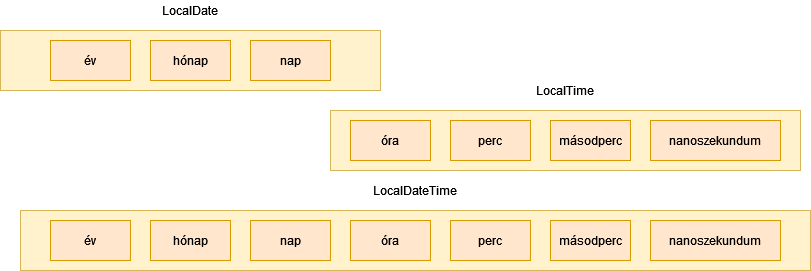

# Java történeti háttér

## Elmélet

**Szoftverkrízis** fogalma már 1968-ban megjelent, mely a mai napig azt jelenti, hogy
minél több, komplexebb alkalmazás fejlesztésére van igény, lehetőleg egyre kevesebb
fejlesztői erőforrás igénybevételével. Erre a problémára több megoldás is született
több-kevesebb sikerrel, és ezek között szerepelnek különböző programozási
paradigmák bevezetése, mint pl. **objektumorientált programozás**.

A **Java** nyelv 1991-ben a Sun titkos projektjeként született, James Gosling vezetésével.
A cél egy olyan programozási platform, mellyel hatékonyan lehet alkalmazásokat
fejleszteni olyan digitális eszközökhöz, mint pl. a televízió.
Az első megjelenése egy Mosaic böngészőbe épített Java motor, mely
egy molekulát forgatott három dimenzióban. Elképzelhető mekkora
újítás volt ez akkor, mikor a weboldalak fehér alapon fekete betűk voltak,
és az oldalakat kék színű linkek kötötték össze.


A Java kifejlesztésekor a következő célkitűzéseket fogalmazták meg:

* Egyszerű, könnyen tanulható és használható
* Objektumorientált
* Robusztus, azaz hibatűrő, az alkalmazás fejlesztője, vagy használója által
  vétett hiba ne befolyásolja a teljes alkalmazás működését, hanem kellően lokalizálható legyen
* Biztonságos, hiszen az internetről letöltött tartalmakban nem mindig lehet megbízni
* Architektúra-semleges, hordozható, azaz a megírt alkalmazás ugyanúgy fusson eltérő platformokon, mint Windows vagy Linux
* Nagyteljesítményű
* Interpretált, utasításonként végrehajtott
* Többszálúságot nyelvi szinten támogassa
* Dinamikus, azaz a futáshoz szükséges kódrészeket futás közben töltse be, mindig azt, amire szükség van


A Java programozási nyelv egy szabvány, melynek több implementációja (megvalósítása) létezik.
A hivatalos referencia implementáció az ingyenes [OpenJDK](https://openjdk.java.net/),
melyet az Oracle és az OpenJDK köré épült közösség fejleszt, több más cég
közreműködésével. Azonban ezt nem javasolják éles használatra, hanem
valamely erre épülő implementációt.

Történeti okok miatt az [Oracle Java SE JDK](https://www.oracle.com/java/technologies/javase-downloads.html)
a legelterjedtebb. Ez a Sun megvásárlásával került az Oracle-höz.
Azonban ennek használatához a Java 11 óta fizetni kell, így megjelentek további
implementációk, mint pl. az [AdoptOpenJDK](https://adoptopenjdk.net/).

Mivel elterjedt, és oktatásra ingyenes, ezért az Oracle Java SE JDK-t használjuk a
képzésen.

A Java elsődleges felhasználási területe nagyvállalati háttérrendszerek (backend). Mobil környezetben is
találkozhatunk vele, hiszen az Android készülékekre először Javaban kellett fejleszteni.

> A Google az Oracle-lel való jogi csatározások miatt Android területen kezd elfordulni a Java
programozási nyelvtől, és helyette a Kotlin programozási nyelvet javasolja.

Felhasználói felületek fejlesztésére, számítógépre telepíthető, önállóan futó alkalmazások
fejlesztésére (kliens alkalmazások) a Java nem annyira alkalmas. Bár több technológia létezik, Swing,
NetBeans Platform, Eclipse Platform, nem igazán terjedt el.
Főleg Java fejlesztőeszközöket implementálnak Java alkalmazásokként.

> A JavaFX egy újabb technológia felhasználói felületek fejlesztésére. A Java 8-as fejlesztőkészletben jelent
> meg, azonban a Java 11-esből eltávolították. Eredetileg a Java részét képező Swing vastag kliens technológia
> leváltására jött létre.

Java áll több IoT (Internet of Things - Internetre kötött eszközök), és Big Data megvalósítás mögött.
Az Oracle szerint jelenleg 10 millió Java fejlesztő van a világon és mintegy 15 milliárd Java kódot futtató eszköz.

A Java verziószámozása az újabb verziókban már konzisztens, a weboldalon letöltéskor megjelenő verziószám (pl. 12.0.1)
megegyezik azzal, amit a fejlesztőkörnyezet is kiír.

A tananyag legutóbbi frissítésekor a Java legfrissebb verziója a 15-ös verzió.

## További források

A Java verziószámozását, és a különböző verziókban megjelenő újdonságokat a
[Wikipedia](https://en.wikipedia.org/wiki/Java\_version\_history) részletesen taglalja.

## Ellenőrző kérdések

* Milyen megoldások születtek a szoftverkrízisre?
* Kinek a nevéhez kötődik a Java programozási nyelv?
* Mely cég vett és vesz részt a Java fejlesztésében?
* Milyen irányelveket vettek figyelembe a Java nyelv kialakításakor?
* Milyen Java implementációkat ismersz?
* Melyik a legfrissebb Java verzió?

# Oracle JDK telepítése

## Gyakorlati feladat

Ellenőrizd, hogy milyen **JDK** van telepítve a gépre parancssorban a `java -version` parancs kiadásával. Ha a legfrissebb,
akkor nincs további dolgod.
Amennyiben van fenn korábbi, mondjuk 8-as, akkor el kell távolítani (Windowson a _Programok telepítése és törlése_
kifejezésre keresve a _Start_ menüben.)
(A Java 8-at egyébként 2030-ig támogatják, és sok helyen még azt használják.)

A JDK mindenkori legfrissebb verzióját le kell tölteni a [https://www.oracle.com/java/technologies/javase-downloads.html](https://www.oracle.com/java/technologies/javase-downloads.html) címről.

A `jdk-XXX_windows-x64_bin.exe` állományt kell kiválasztani,
elfogadni a Licence feltételeket, majd letölteni és elindítani az állományt.

A varázslóval értelemszerűen feltelepíthető.

Alapértelmezetten a `C:\Program Files\Java\jdk-XXX` könyvtárba telepíti (az XXX helyére természetesen a
mindenkori aktuális verziószám kerül).

Állítsuk be a `JAVA_HOME` és `PATH` környezeti változókat!

Ehhez a Windows _Rendszer környezeti változóinak módosítása_ menüpontját kell kiválasztani a Start menüből.
A megjelenő ablakban a _Környezeti változók..._ gombra kell kattintani.

A `JAVA_HOME` értéke a könyvtár, ahova a JDK telepítve lett,
tehát `C:\Program Files\Java\jdk-XXX`, a `PATH` környezeti változó értéke `%JAVA_HOME%\bin` legyen.

Vigyázz, a környezeti változók szerkesztése után újra kell indítani a parancssort!

Sikeres telepítés és beállítás után parancssorba a `java -version` parancsot írva a következőt írja ki
(a verziószám természetesen itt is lehet más):

```
java version "16.0.1" 2021-04-20
Java(TM) SE Runtime Environment (build 16.0.1+9-24)
Java HotSpot(TM) 64-Bit Server VM (build 16.0.1+9-24, mixed mode, sharing)
```

# Több JDK egy gépen

Előfordulhat, hogy egy számítógépen több JDK-t kell használni.
Ez történhet azért, mert különböző projekteket különböző
verziójú JDK-val kell fejleszteni. Esetleg egy használt program
elvárja, hogy JDK legyen telepítve a gépre
([Általános Nyomtatványkitöltő (ÁNYK) - keretprogram](https://www.nav.gov.hu/nav/letoltesek/nyomtatvanykitolto_programok/nyomtatvany_apeh/keretprogramok/abevjava_install.html)).

Vannak programok, melyek az operációs rendszer beállításait veszik alapul.
Valamint ha parancssorból hívjuk a JDK-ban lévő programokat, akkor is
az operációs rendszer beállításai érvényesülnek.

Ezt kizárólag a `JAVA_HOME` és `PATH` környezeti változók szabályozzák.
A `JAVA_HOME` az a könyvtár, ahova a JDK telepítve lett. Pl.
Java 8 esetén Windowson a `C:\Program Files\Java\jdk1.8.0_271`
könyvtár. A `PATH` környezeti változó értéke tartalmazza azt, hogy melyik
könyvtárban vannak a segédprogramok. Ez a JDK `bin` könyvtára.
Ezért az értékei között szerepeljen a pl. `C:\Program Files\Java\jdk1.8.0_271\bin`!
Azért, hogy ne kelljen mindig mind a kettőt állítani, érdemes a `PATH`
értékei közé a következőt felvenni: `%JAVA_HOME%\bin`. Ekkor ha módosítjuk
a `JAVA_HOME` értékét, akkor változni fog a `PATH` értéke is.

Windowsban grafikus felületen a _Rendszer környezeti változóinak módosítása_
menüpontban tudjuk módosítani ezeket az értékeket.

Módosítás után újra kell indítani a parancssort, Total Commandert, stb.

Adott parancssorra ideiglenesen is állíthatjuk. Windowsban pl.:

```shell
set JAVA_HOME=C:\Java\jdk-11.0.10
echo %JAVA_HOME%
set PATH=%JAVA_HOME%\bin;%PATH%
echo %PATH%
```

Fontos, hogy a `PATH`-ban több JDK is szerepelhet, de az fog érvényesülni, ami
elöl van. Az `echo` paranccsokkal ellenőrizzük a beállítást.

Linux alatt:

```shell
export JAVA_HOME=/opt/jdk-11.0.10
echo $JAVA_HOME
export PATH=$JAVA_HOME/bin:$PATH
echo $PATH
```

Mindkét operációs rendszer alatt telepíthető tehát több JDK, csak
a `JAVA_HOME` és `PATH` beállítástól függ, melyiket használjuk.

Linux alatt használhatjuk az `update-alternatives`, `update-java-alternatives`
segédprogramokat, valamint a [jEnv - Manage your Java environment](https://www.jenv.be/)
eszközt.

A fejlesztőeszközökben ettől függetlenül állítható, pl.
IntelliJ IDEA esetén a _File / Project Structure / Project Settings / Project / Project SDK_
menüpontban.

# Maven

## Elmélet

Sajnos a Java platform nem biztosít standard **projektstruktúrát**.
A projekt nem más, mint a könyvtárak és fájlok halmaza. Itt főleg a
forráskódokat tartalmazó állományokat tároljuk.
A nyelv megjelenésekor minden projekt máshogy épült fel, más könyvtárakba csoportosították
az alkalmazás felépítéséhez szükséges állományokat. A Java források fordításával,
az így előállt bájtkód és az alkalmazás futtatásához szükséges egyéb állományok
(ún. erőforrás állományok, pl. szövegek, képek) összecsomagolásával jön létre maga az alkalmazás,
ez egy `jar` kiterjesztésű állomány. Ezt a folyamatot nevezzük **build** folyamatnak.

A Maven egy kvázi szabványos eszköz a build folyamat megvalósításáért. Ezen kívül
kezeli a függőségeket, hiszen egy alkalmazás fejlesztésekor számos más szervezet és
gyártó által megírt nyílt és zárt forráskódú programot/könyvtárat (**third party library**-t)
használunk.

Ennél azonban többnek definiálja magát a Maven, ún. software project management and comprehension tool.
Betartja a **Convention over configuration** elvet, ami azt jelenti, ha a konvencióknak
(megállapodásoknak) megfelelően járunk el, akkor az eszközt nem kell konfigurálni,
hanem a build folyamatban az előzetes megállapodásoknak megfelelően fog eljárni.

Ez gyakorlatban annyit tesz, ha a fájlokat a megfelelő könyvtárakban helyezzük el,
akkor különleges konfiguráció nélkül lefut a build folyamat, lefordításra kerülnek
a forrásállományok, és összecsomagolásra az alkalmazás.

A build folyamat általában a következő nagyobb lépésekből áll:

* Forrásállományok fordítása
* Többi, ún. erőforrás állomány megfelelő helyre másolása
* Tesztesetekhez szükséges erőforrás állományok másolása
* Tesztesetek fordítása
* Tesztesetek futtatása
* Alkalmazás összecsomagolása

Jelen projektben még nincsenek automatikus tesztesetek, de későbbi
projektekben készítünk ilyeneket is. (Az **automatikus tesztesetek**
olyan programok, melyek az alkalmazás helyes működését
ellenőrzik.)

A Maven projektet a `pom.xml` állomány írja le, melyet a projekt gyökerében,
azaz az állományainkat tartalmazó könyvtárban kell
elhelyezni. A különböző állományokat konvenció
szerint a következő könyvtárakba kell elhelyezni:

* `src\main\java` Java forráskódok
* `src\main\resources` Erőforrás állományok
* `src\test\java` Tesztesetek, nem része az alkalmazásnak
* `src\test\resources` Tesztesetekhez szükséges egyéb erőforrás állományok, nem része az alkalmazásnak

A következő példa bemutat egy minimális `pom.xml` állományt.

```xml
<?xml version="1.0" encoding="UTF-8"?>
<project xmlns="http://maven.apache.org/POM/4.0.0"
         xmlns:xsi="http://www.w3.org/2001/XMLSchema-instance"
         xsi:schemaLocation="http://maven.apache.org/POM/4.0.0 http://maven.apache.org/xsd/maven-4.0.0.xsd">
    <modelVersion>4.0.0</modelVersion>

    <groupId>training</groupId>
    <artifactId>intromaven</artifactId>
    <version>1.0-SNAPSHOT</version>

    <properties>
        <project.build.sourceEncoding>UTF-8</project.build.sourceEncoding>
        <maven.compiler.source>1.8</maven.compiler.source>
        <maven.compiler.target>1.8</maven.compiler.target>
    </properties>

</project>
```

Ebben szerepelnek a projekt koordinátái, melyek egyedileg azonosítják a projektet,
úgymint `groupId`, `artifactId`, `version`. Ezeket szabadon választhatjuk,
a `groupId` tipikusan a cégünk neve, ahol dolgozunk, az `artifactId`
a projekt neve. Az `artifactId` tipikusan megegyezik a könyvtár nevével,
amely tartalmazza a projektet és `pom.xml` állományt.

A verziószám pedig indulhat `1.0-SNAPSHOT` verzióval. A
`SNAPSHOT` azt jelenti, hogy az alkalmazás még fejlesztés alatt áll.

Érdemes még megadni a karakterkódolást,
hiszen a fájl önmaga nem tartalmazza, hogy milyen karakterkódolással íródott a
forráskód. Ez az ékezetes karakterek használatakor fontos. Ez a `project.build.sourceEncoding`
property-ben adható meg. Manapság érdemes mindenütt az UTF-8 karakterkódolást használni.

Tartalmaznia kell, hogy mely Java verzióval kompatibilis a forrás,
és mely Java verzióra legyen fordítva. Ezeket a `maven.compiler.source` és
`maven.compiler.target` property tartalmazza.

A build az `mvn clean package` paranccsal indítható. A `target/classes` könyvtárban
létrejönnek a `class` kiterjesztésű állományok. A `target` könyvtárban
létrejön a `jar` állomány.


## Ellenőrző kérdések

* Mire használjuk a Maven-t?
* Tipikusan hogyan épül fel egy build folyamat?
* Milyen alkönyvtárakat tartalmaz a projekt könyvtár?
* Mi ír le egy projektet? Milyen elemek találhatók benne?

## Gyakorlati feladatok

### Gyakorlati feladat - Maven telepítése

Töltsd le a legfrissebb Maven Binary zip archive állományt a [https://maven.apache.org/download.cgi](https://maven.apache.org/download.cgi) címről,
majd a letöltött `.zip` állományt tömörítsd ki a `C:\Java` könyvtárba!

A fájl neve pl. `apache-maven-3.8.1-bin.zip`.

Vedd fel az `M2_HOME` környezeti változót, melynek értéke az a könyvtár, ahova
a Maven ki lett csomagolva (példánkban `C:\Java\apache-maven-3.8.1`),
és vegyük fel a `PATH` környezeti változóba a `%M2_HOME%\bin` értéket is!


A telepítés és beállítás sikerességét a `mvn -version` parancs kiadásával ellenőrizzük!
Valami hasonlót fog kiírni:

```shell
Apache Maven 3.8.1 (05c21c65bdfed0f71a2f2ada8b84da59348c4c5d)
Maven home: C:\Program Files\Java\apache-maven-3.8.1\bin\..
Java version: 16.0.1, vendor: Oracle Corporation, runtime: C:\Program Files\Java\jdk-16.0.1
Default locale: hu_HU, platform encoding: Cp1250
OS name: "windows 10", version: "10.0", arch: "amd64", family: "windows"
```

### Gyakorlati feladat - Első Maven projekt

Hozz létre egy üres könyvtárat `intromaven` néven, abban egy `pom.xml` állományt a következő tartalommal.
Figyelj arra, hogy a `<maven.compiler.source>` és a `<maven.compiler.target>` tagekhez tartozó értéket
(ami itt `1.8`) cseréld ki a Java legfrissebb verziószámára (pl. `16`)!

```xml
<?xml version="1.0" encoding="UTF-8"?>
<project xmlns="http://maven.apache.org/POM/4.0.0"
         xmlns:xsi="http://www.w3.org/2001/XMLSchema-instance"
         xsi:schemaLocation="http://maven.apache.org/POM/4.0.0 http://maven.apache.org/xsd/maven-4.0.0.xsd">
    <modelVersion>4.0.0</modelVersion>

    <groupId>training</groupId>
    <artifactId>intromaven</artifactId>
    <version>1.0-SNAPSHOT</version>

    <properties>
        <project.build.sourceEncoding>UTF-8</project.build.sourceEncoding>
        <maven.compiler.source>1.8</maven.compiler.source>
        <maven.compiler.target>1.8</maven.compiler.target>
    </properties>

</project>
```

Majd az `src/main/java` könyvtárban hozzunk létre egy `HelloWorld.java` állományt
a következő tartalommal:

```java
public class HelloWorld {
  public static void main(String[] args) {
    System.out.println("Hello World!");
  }
}
```

Add ki az `mvn clean package` parancsot abban a könyvtárban, ahol a `pom.xml` található! Ha minden rendben történik, ilyesmit fog kiírni:

```shell
[INFO] Scanning for projects...
[INFO]
[INFO] ---------------------< training:intromaven >---------------------
[INFO] Building intromaven 1.0-SNAPSHOT
[INFO] --------------------------------[ jar ]---------------------------------
[INFO]
[INFO] --- maven-clean-plugin:2.5:clean (default-clean) @ intromaven ---
[INFO] Deleting C:\iviczian\Downloads\tmp\target
[INFO]
[INFO] --- maven-resources-plugin:2.6:resources (default-resources) @ intromaven ---
[INFO] Using 'UTF-8' encoding to copy filtered resources.
[INFO] skip non existing resourceDirectory C:\iviczian\Downloads\tmp\src\main\resources
[INFO]
[INFO] --- maven-compiler-plugin:3.1:compile (default-compile) @ intromaven ---
[INFO] Changes detected - recompiling the module!
[INFO] Compiling 1 source file to C:\iviczian\Downloads\tmp\target\classes
[INFO]
[INFO] --- maven-resources-plugin:2.6:testResources (default-testResources) @ intromaven ---
[INFO] Using 'UTF-8' encoding to copy filtered resources.
[INFO] skip non existing resourceDirectory C:\iviczian\Downloads\tmp\src\test\resources
[INFO]
[INFO] --- maven-compiler-plugin:3.1:testCompile (default-testCompile) @ intromaven ---
[INFO] No sources to compile
[INFO] 
[INFO] --- maven-surefire-plugin:2.12.4:test (default-test) @ intromaven ---
[INFO] No tests to run.
[INFO] 
[INFO] --- maven-jar-plugin:2.4:jar (default-jar) @ intromaven ---
[INFO] Building jar: C:\iviczian\Downloads\tmp\target\intromaven-1.0-SNAPSHOT.jar
[INFO] ------------------------------------------------------------------------
[INFO] BUILD SUCCESS
[INFO] ------------------------------------------------------------------------
[INFO] Total time:  1.453 s
[INFO] Finished at: 2020-09-25T11:27:09+02:00
[INFO] ------------------------------------------------------------------------ 
```

A `target/classes` könyvtárban
létrejön a `HelloWorld.class` állomány. Ez futtatható a következő paranccsal
a projekt könyvtárában: `java -classpath target\classes HelloWorld`.

A `target` könyvtárban létrejön az `intromaven-1.0-SNAPSHOT.jar` állomány.

# Maven használata proxy mögött

Amennyiben a számítógép proxy-n keresztül kapcsolódik
az internetre, ezt a Mavennek is be kell állítani,
hiszen a külső függőségeit az internetről tölti le.

Ehhez a `settins.xml`-be kell elhelyezni a következő
tartalmat. A megfelelő értékek átírandók.
A `settings.xml` fájl helye a HOME könyvtárban a
`.m2` könyvtár. Windows esetén `%USERPROFILE%\.m2\settings.xml`,
Linux esetén `${user.home}/.m2/settings.xml`.

```xml
<settings>
  <proxies>
   <proxy>
      <id>example-proxy</id>
      <active>true</active>
      <protocol>http</protocol>
      <host>proxy.example.com</host>
      <port>8080</port>
      <username>proxyuser</username>
      <password>somepassword</password>
      <nonProxyHosts>www.google.com|*.example.com</nonProxyHosts>
    </proxy>
  </proxies>
</settings>
```

# IDE

## Elmélet

Java fejlesztésre különböző **fejlesztőeszközöket** használunk, melyek ugyanúgy a JDK szolgáltatásaira épülnek, de grafikus
felhasználói felülettel rendelkeznek, és egyszerűbbé teszik a forráskód szerkesztését, a build folyamat futtatását,
az alkalmazás tesztelését és elindítását.

A legelterjedtebb fejlesztőeszközök a **NetBeans**, **Eclipse** és a **JetBrains IntelliJ IDEA**. A NetBeans nyílt
forráskódú, az Oracle berkeiben volt, de nemrég átkerült az Apache szervezethez. Az Eclipse fejlesztése régóta az
Apache szervezeten belül történik, szintén nyílt forráskódú eszköz. A NetBeans egy kezdők számára jobban ajánlott
eszköz, a különböző funkciók jobban integráltak, de kevésbé testre szabhatóak. Az Eclipse inkább haladó
fejlesztőknek javasolt, pluginekkel tetszőlegesen bővíthető és
jobban testre szabható. A JetBrains egy fejlesztőeszközök gyártására szakosodott cég, az ő termékük az
IDEA, mely egy Java fejlesztőeszköz. Nagyon sok Javára épülő technológiát támogat. Két kiadása van, egy ingyen használható
Community és egy nagyvállalati fejlesztésre szánt kereskedelmi Ultimate verzió.


A fejlesztőeszköz alapvető fogalma a **projekt**. Egy projekt állományok összessége:
Java forrásállományok, erőforrás állományok stb. Létre lehet hozni új projektet
vagy meg lehet nyitni már létező projektet.

Egy projekt típusa lehet különböző, attól függően, hogy milyen eszközöket szeretnénk használni.

Új projektet létrehozni a nyitóképernyőn, a _New Project_ gombbal lehet. Maven
projektet válasszunk ki. Majd meg kell adni a projekt nevét és a könyvtárat, amelyben tárolva lesz.

Ezután megjelenik a főablak. A projekt felépítését, fizikai elemeket (könyvtárakat, fájlokat) a bal oldalon található
Project ablak mutatja.

> Az alkalmazás új Java verzióval nem fog futni, mert be kell illeszteni a `pom.xml`-be, hogy
újabb Java verziót használunk.

A `pom.xml`-t kell módosítani, hogy frissebb Java verziót használunk (amennyiben már ez a verzió szerepel benne,
akkor természetesen nincs ezzel már újabb teendő):

```xml
<properties>
    <project.build.sourceEncoding>UTF-8</project.build.sourceEncoding>
    <maven.compiler.source>16</maven.compiler.source>
    <maven.compiler.target>16</maven.compiler.target>
</properties>
```

Az IDEA fejlesztőeszköz képes a Maven kezelésére, azonban a saját projekt fogalma
és a Maven projekt fogalma eltér. Ezért a kettőt szinkronizálja. Választhatunk,
hogy a fejlesztőeszköz automatikusan tegye ezt, vagy kérdezzen rá, és nekünk kell
a frissítést elvégezni, amennyiben módosítjuk a `pom.xml` állományt.

Azaz a `pom.xml` módosítása után a jobb oldalon lévő _Maven_ panelt nyissuk ki, és
nyomjuk meg a _Reload All Maven Projects_ gombot!

Új `.java` állomány úgy hozható létre, hogy a bal oldalon található _Project_ fülre kell kattintani.
Itt le kell nyitni a projektet, azon belül az `src\main\java` könyvtárat, és jobb klikk
_New / Java class_ menüpontot kell kiválasztani. Ugyanis a `.java` állományok
valójában osztályokat tartalmaznak.

A fejlesztő a legtöbb időt a kódszerkesztő ablakban tölti, mely különböző kisegítő
funkciókkal támogatja a forráskód írását, ilyen a kód színezése, vagy az automatikus
kódkiegészítés.

A fejlesztőeszköz lehetőséget biztosít az alkalmazás és a tesztesetek futtatására is.


Fontos megjegyezni, hogy az IDEA-ban az `src/main/java` könyvtárnak
Sources Root-nak kell lennie, míg az `src/test/java` könyvtárnak
Test Sources Root könyvtárnak. Amennyiben a projekt megnyitásakor
ezek már léteznek, az IDEA felismeri ezeket. Amennyiben később kerülnek
létrehozásra, frissíteni kell a Maven konfigurációt. Ehhez a _View / Tool Windows /
Maven Projects_ ablakot kell előhozni, és ott megnyomni a _Reimport All Maven Projects_
gombot.

Az IDEA leggyakrabban használt billentyűzet kombinációit a _Help/Keymap reference_
tartalmazza, mely egy nyomtatható PDF állomány.

A leghasznosabb a `Ctrl + Space`, ami automatikus kódkiegészítést végez, valamint
a `Alt + Enter`, mely a leggyakoribb hibákra próbál megoldási javaslatot adni.
Gyakran használt kódrészleteket nem kell mindig begépelni, hanem erre ún.
code template-ek állnak rendelkezésre. Ilyenkor egy rövidítést kell
beírni, majd a `Tab` billentyűt lenyomni.
A `.java` fájlon belül egy osztály található. Azon belül a `main`-t egy
metódusnak nevezzük. A `psvm + Tab`
a `main()` metódust generálja le. A `sout + Tab` billentyűkombinációval a `System.out.println`
utasítást generáljuk le.

## Ellenőrző kérdések

* Milyen Java IDE-kről hallottál?
* Miben segít nekünk az IDE?
* Mi a fejlesztés alapegysége, (a könyvtár, amiben a fájlok találhatóak)?
* Mondj néhány billentyűkombinációt!

## Gyakorlati feladatok

### Gyakorlati feladat - IDEA telepítése

Ellenőrizd, hogy az IntelliJ IDEA fejlesztőeszköz telepítve van-e a gépeden!
Az Asztalon, Tálcán, vagy a Start menüben meg kell jelennie.

Amennyiben nincs, az IDEA letölthető a [https://www.jetbrains.com/idea/#chooseYourEdition](https://www.jetbrains.com/idea/#chooseYourEdition)
címről, és a Community verziót kell letölteni és feltelepíteni.

Érdemes a `C:\Java` könyvtárba telepíteni.

A telepítés történhet az alapértelmezett beállításokkal, azon módosítani nem
szükséges.

### Gyakorlati feladat - Új projekt létrehozása

Hozz létre egy új projektet `introide` néven a `C:\training\introide`
könyvtárba! Módosítsd megfelelően a `pom.xml` fájlt! Hozz létre benne egy
`HelloWorld` osztályt, mely kiírja a `Hello World!` szöveget! Futtasd az
alkalmazást!

# Git használata IDE-ben

## Elmélet

Az IDEA fejlesztőeszköz beépítetten támogatja a **Git** használatát.
Lehetőség van új projekt esetén azt verziókezelő rendszerben tárolni,
vagy egy projektet úgy megnyitni, hogy közvetlen verziókezelő rendszerből
kerüljön letöltésre és megnyitásra.

Ahhoz, hogy egy új projekt Git alatt legyen tárolva, a `git init` parancsot kell
kiadni. Ez felületről is megoldható a _VCS / Enable Version
Control Integration_ menüpont használatával.

Alul található a _Git_ panel. Ezen ablak mutatja az újonnan létrehozott,
módosított és törölt állományokat. Itt lehet az állományokat a Githez hozzáadni,
commitolni. A _Revert_ művelettel lehet a saját módosításainkat elvetni.

A `pom.xml`, `.gitignore`, és a `*.java` állományokat adjuk hozzá. A `target` könyvtárba
dolgozik a Maven, az `.idea` könyvtár tartalma az IDEA-hoz tartozik,
azt sose commitoljuk. Ehelyett helyezzük el a `.gitignore` fájlban.

```
target/
.idea/
```

> Az IDEA újabb verziói már nem hoznak létre `.iml` fájlokat, így azt már nem kell beleírni.

> A `.gitignore` fájlt az IDEA újabb verziói már a projekt létrehozásakor
elkészítik. Alapesetben elég sok sort tartalmaz, a fájl tartalmát nyugodtan
ki lehet cserélni csak a fenti pár sorra.

A verziókezelő rendszerhez, azaz esetünkben a Githez kapcsolódó parancsokat
a _VCS / Git_ menüpont alatt lehet megtalálni, ebből a _Remotes..._, _Pull..._ és _Push..._ a leggyakrabban
használt.

Alul megtalálható a _Git_ panel is, mely információkat ad a Git műveletekről és a
repository-ról.


Bár érdemes az IDEA fejlesztőeszközt használni a Git műveletek végrehajtására,
tisztában kell lenni azzal, hogy parancssorban hogyan lehet ezeket elvégezni.
Gyakran lehet olyan, hogy vagy nincs kéznél fejlesztőeszköz, vagy
parancssorból kell ellenőrizni, hogy a fejlesztőeszköz jól működik-e, esetleg
speciális parancsokat kell kiadni.

## Ellenőrző kérdések

* Hogyan támogatja a fejlesztőeszköz a Git használatát?

## Gyakorlati feladatok

### Gyakorlati feladat - Első commitok

Hozz létre egy új projektet `introgit` néven, abban egy `HelloGit`
Java osztályt, ami kiírja, hogy `Hello Git!`!

Hozz létre egy lokális Git repository-t, és commitold a megoldásodat!

Módosítsd a Java osztályt, hogy most már azt írja ki, hogy `Hello IDEA and Git!`.

Commitold a megoldásodat!

# Feltöltés a GitHubra

## Elmélet

Ahhoz, hogy a projektet meg lehessen osztani **GitHub**-on, a webes felületen
létre kell hozni egy új üres projektet. Ennek az URL-jét kell
kimásolni, és a _VCS / Git / Remotes_ menüpontban kell `origin` néven
felvenni a lokális repository-ban távoli repository-ként.

Ahhoz, hogy működjön az azonosítás, a _Settings_ menüpontban,
a _Git_ ablakban a _Use credential helper_ checkboxot
be kell klikkelni. Majd újra a _VCS / Git / Push_ menüpontban
lehet a módosításokat push-olni a távoli repository-ba.

Commitnál is lehet egyből push-olni, ha a _Commit_ gomb
melletti nyíllal kiválasztod, hogy _Commit and push_.

## Ellenőrző kérdések

* Milyen lépések kellenek, hogy a GitHubon meg tudd osztani a projektedet?
* Mi az a push?
* Mi az az `origin`?
* Mi a különbség a local és a remote repository között?

## Gyakorlati feladatok

### Gyakorlati feladat - Első push

Hozz létre egy új projektet `introgit` néven, abban egy `HelloGit`
Java osztályt, ami kiírja, hogy `Hello Git!`!

Ha még nem vagy regisztrálva, regisztráld magad a GitHubon!

Hozz létre egy local Git repository-t, és commitold a megoldásodat!
Majd hozz létre egy GitHub repository-t, vedd fel
`origin` néven távoli repository-ként és push-old a megoldásodat!

### Gyakorlati feladat - Második push

Írd át a `HelloGit` osztályban, hogy azt írja ki, hogy `Hello IDEA and Git!`!

Commitold és egyben push-old a megoldásodat!

# Kiírás és beolvasás konzolról

## Elmélet

A Java nyelv alap építőköve az **osztály**. Minden alkalmazás osztályokból épül fel.
Tipikusan egy fájlba egy osztályt írunk, és a fájl neve meg kell egyezzen az
osztály nevével. (Megj.: Ha több osztályt írunk egy fájlba, akkor csak egyetlen
publikus osztály - `public` módosítószóval ellátott - lehet benne, és ennek a
neve kell megegyezzen a fájlnévvel.)

Ez egy egyszerű osztály:

```java
public class HelloWorld {

}
```

Látszik, hogy a Java forráskód struktúráját kapcsos zárójelekkel adjuk meg. Ezek
ún. **blokkokat** képeznek.

Sok osztályból álló alkalmazásnak **csomagokkal** tudunk belső struktúrát adni. A
csomagok nem csak könnyebbé teszik az áttekintést, de az osztályok láthatóságát
is szabályozzák. A csomagok fizikailag könyvtárként jelennek meg.

A csomagot meg kell adni az első utasításban a `package` kulcsszóval.

```java
package training;

public class HelloWorld {

}
```


Az osztály tagjai között vannak, amelyek adatokat tárolnak és vannak, amelyek
utasításokat fognak össze. Ez utóbbiak a **metódusok**.

Látható, hogy az eddigi utasítások hatására még nem történt semmi, az ilyen
utasítások a **deklarációs utasítások**. Ezek csak arra valók, hogy struktúrát adjanak
a programunknak, vagy valaminek nevet adjanak, amire később tudunk hivatkozni.

Az alkalmazáson belül azon osztályok futtathatóak, melyek tartalmaznak `main()`
metódust. Egy alkalmazásban akár több ilyen is lehet, azonban tipikusan egy
szokott lenni, ez az alkalmazás fő belépési pontja, ezzel indítjuk el az
alkalmazást. Azonban tanuláskor több osztálynak is készíthetünk `main()` metódust,
tesztelve osztályunk működését. A JVM a `main()` metódust csak akkor találja meg,
ha megfelel bizonyos szabályoknak. Nézzük, hogy kell kinéznie egy `main`
metódusnak az osztályon belül:

```java
package training;

public class HelloWorld {

    public static void main(String[] args) {
        System.out.println("Hello World!");
    }

}
```

Látható, hogy itt a struktúra miatt a blokkokat egymásba ágyazzuk, hiszen
az osztály tartalmazza a metódust.

Ez az osztály futtatható, a `training` csomagban van és a fájl neve `HelloWorld.java`.
Az osztály futtatásával a `main()` metódusban lévő utasítások szépen sorban
végrehajtódnak. A `HelloWorld` osztály esetében ez egyetlen egy utasítást jelent,
mely a konzolra kiírja a `Hello World!` szöveget.

Az IntelliJ IDEA fejlesztőeszköz számos template-et tartalmaz a gyakran használt
kódrészletek gyors legenerálására. Ezek a template-ek rövid szavakkal elérhetőek,
melyek begépelése után a `Tab` billentyű lenyomására az elmentett kódrészlet
jelenik meg. Ilyen például a `main()` metódust legeneráló `psvm` rövidítés.
A `System.out.println()` utasítás szintén elérhető template-ből a `sout` rövidítéssel.
További template-eket találsz a _File / Settings..._ menüpont alatt megjelenő
ablak _Editor/Live Templates_ lapján.

## Kommunikáció a felhasználóval

Az alkalmazások valamilyen felületen át kommunikálnak a felhasználóval. Az üzenetek
megjelenítésének legegyszerűbb módja, ha azt a konzolra kiírjuk. Ezt
a `System.out.println()` metódus hívásával tehetjük meg. A zárójelei között
paraméterként a kiírandó üzenetet kell megadnunk. Ez legtöbbször szöveg, de lehet
más típusú adat is.

> A `System.out.println()` metódus a két kerek zárójel között megadott kifejezéseket
> sortöréssel, egymás alá írja ki a konzolra. Egy ilyen, a kerek zárójelek között megadott, szövegként
> értelmezhető kifejezés után automatikusan következik egy sortörés karakter.
> Használható még a `System.out.print()` metódus is, amely a kiírást sortörés nélkül valósítja meg.
> Több egymás utáni `System.out.print()` metódushívással egymás mellé írhatjuk a konzolra a különböző
> szövegeket.

Ha szeretnénk valamilyen adatot bekérni a felhasználótól, akkor azt a `Scanner`
osztállyal tehetjük meg. Ehhez először **példányosítanunk** kell egy **objektumot**
az osztály alapján a `new Scanner(System.in)`
utasítással, és a kapott objektumot el kell tárolni egy **változóban**. Ezek után
a `Scanner` objektum metódusait használva különböző típusú adatokat tudunk beolvasni.

* `nextLine()`: az `Enter` lenyomásáig bevitt szöveget olvassa be
* `nextInt()`: egész szám beolvasására használható

Egy szöveg beolvasható a következő kóddal:

```java
package training;

import java.util.Scanner;

public class HelloWorld {

    public static void main(String[] args) {
        Scanner scanner = new Scanner(System.in);

        System.out.println("What's your name?");
        String name = scanner.nextLine();
        System.out.println(name);
    }
}
```

A `Scanner scanner` egy **változódeklaráció**, ahol a `scanner` a változó neve,
a `Scanner` annak típusa. A típust kötelező megadni, mert a Java egy
szigorúan típusos nyelv, ami azt jelenti, hogy nem lehet akármilyen értéket adni egy
változónak, csak olyat, amit a típusa megenged.
Majd az egyenlőségjellel értéket adunk neki.

A `String name` ugyanígy egy változódeklaráció, ahol a `name` a változó neve,
a `String` annak típusa (karakterlánc). Majd az egyenlőségjellel értéket adunk neki, méghozzá
úgy, hogy beolvassuk a konzolról.

A kód tehát beolvassa a nevet, majd kiírja a konzolra. A nevet az IDEA-ban alul,
a `Run` ablakban lehet megadni.

Mivel a `Scanner` osztály a `java.util` csomagban található, ezért **importálni**
kell az osztály elején. Ezt nem szükséges beírni, hanem amikor az
osztály nevét (`Scanner`) írjuk a `main()` metódusban, akkor az IDEA felajánlja,
hogy automatikusan beimportálja. Ehhez nyomjuk meg az `Alt + Enter`
billentyűkombinációt (amikor az osztály neve piros és alá van húzva).
Ekkor elhelyezi az IDEA az import utasítást az osztály elején a csomagdeklaráció
(`package`) alatt.

A következő példa azt is megmutatja, milyen műveleteket lehet végezni a `String`
és `int` típusú értékekkel.

```java
package training;

import java.util.Scanner;

public class HelloWorld {

    public static void main(String[] args) {
        Scanner scanner = new Scanner(System.in);

        System.out.println("What's your name?");
        String name = scanner.nextLine();
        System.out.println("Hello " + name); // 1

        System.out.println("What's your year of birth?");
        int yearOfBirth = scanner.nextInt();
        System.out.println("Year of birth: " + yearOfBirth); // 2

        System.out.println(2019 - yearOfBirth); // 3
    }
}
```


Az `int yearOfBirth` utasítással egy `int` típusú, `yearOfBirth` nevű
változót deklarálunk. Ennek értéke tehát csak egy egész szám lehet.

Az `// 1` jelzéssel ellátott sor mutatja, hogy kell két karakterláncot összefűzni.
A `// 2` jelzéssel ellátott sor mutatja, hogy egy karakterlánchoz egy egész szám is
hozzáfűzhető. Ekkor a szám először automatikusan szöveggé kerül átalakításra.
A `// 3` jelzéssel ellátott sor mutatja, hogy lehet két egész számmal kivonás műveletet
elvégezni.

> Egyszerűnek tűnik, ugye? Azonban akadhatnak problémák, amikbe előbb utóbb belefutsz.
A `nextInt()` nem olvassa be az Enter leütésével odakerült sortörés karaktert,
így az a következő `nextLine()` hívást megzavarja.

Mire figyelj a `Scanner` használatakor: a `nextLine()` a teljes szöveget beolvassa,
de a sorvége jelet eldobja, míg a `nextInt()` csak az első láthatatlan karakterig
(pl. szóköz, sorvége jel) olvas, és azt ott hagyja. Éppen ezért, ha szám beolvasása
után egy szöveget akarsz olvasni, akkor azt fogod tapasztalni, hogy ez a szöveg
üres lesz, és csak a második olvasás ad eredményt.

```java
public static void main(String[] args) {
        Scanner scanner = new Scanner(System.in);

        System.out.println("How old are you?");
        int age = scanner.nextInt();
        scanner.nextLine(); //Ez fogja az ottmaradt sorvége jelet beolvasni
        
        System.out.println("What's your name?");
        String name = scanner.nextLine();
        System.out.println(name);
    }
```

## Ellenőrző kérdések

* Mik a Java alkalmazások alapvető építőkövei?
* Egy Java osztály mit tartalmazhat, amikben utasításokat lehet írni?
* Hogyan lehet konzolról adatokat bekérni? Melyik osztályra van ehhez szükségünk?
* Mivel a `Scanner` másik csomagban található, mit kell csinálni a használatához?
* Hogyan lehet a konzolra adatokat kiírni?
* Milyen probléma merülhet fel az egész szám beolvasásakor?

## Gyakorlati feladatok

`demos/src/main/java/classstructureio` 

Hozz létre egy új projektet a `C:\training\training-solutions` könyvtárba, és innentől
ebbe a projektbe dolgozz külön csomagokban! Hozz létre egy repository-t a GitHub accountodon
a mentor által megadott néven! Innentől ide push-old a megoldásaidat!

Figyelj arra, hogy külön feladatmegoldások mindig külön commitban legyenek!

A feladatok megoldásai a `solutions/classstructureio` elérési úton vannak.

Hozz létre te is egy `classstructureio` csomagot, és ennél a leckénél abba tedd a
gyakorlati feladatok megoldásait!

### A main metódus szerepe

A `main()` metódus a legegyszerűbb módja annak, hogy a megírt kódodat kipróbáld,
legyen ez akár egy osztály, akár egy metódus.

Ide tetszőleges utasításokat írhatsz, amivel kipróbálod, teszteled a megoldásod. A feladatleírások
adnak ugyan támpontokat, de ennél nyugodtan teljesíthetsz többet. Próbálj osztályokat
példányosítani, meghívni a különböző metódusokat, különböző paraméterekkel! Az adatokat
akár a konzolról is bekérheted a felhasználótól (akkor is, ha esetleg nem szerepel a
feladatkiírásban).

### Gyakorlati feladat - Számológép

Készíts egy `Calculator` osztályt a `classstructureio` csomagba! A `main` metódusban kérj be a felhasználótól
két egész számot! Az első sorban írd ki a műveletet a következő formátumban: `5 + 10`! A második
sorban írd ki az eredményt (`15`)!

### Gyakorlati feladat - Regisztráció

Készíts egy `Registration` osztályt a `classstructureio` csomagba! A `main` metódusban kérd be a felhasználótól a
nevét és az email címét, majd írd ki, hogy milyen adatokkal regisztrált!

# Objektumok és attribútumok

## Elmélet

Egy Java alkalmazás a futás közben létrejövő és egymással kommunikáló **objektumok**
összessége. Ezen objektumok az osztályok alapján készülnek el. Az objektumok
tárolhatnak adatokat, melyeket **attribútumnak** nevezünk. Az attribútumok
tulajdonképpen osztályszinten deklarált **változók**. Az azonos típusú
objektumok ugyanolyan mintára készülnek, ezért ugyanolyan típusú adatok tárolására
alkalmasak. Egy objektum **állapotán** az attribútumok aktuális értékeinek
összességét értjük.
Gondoljunk úgy az osztályra, mint egy tervrajzra, ami alapján elkészítjük,
más szóval **példányosítjuk** az objektumokat. A példányosítás a `new`
kulcsszóval történik. Ezért az objektumra a **példány** szót is szoktuk használni.
Egy osztályhoz bármennyi példányt tudunk készíteni.
(Hasonlóan, ahogy egy tervrajz alapján több házat is meg tudunk építeni.)
Látható, hogy eddig a `Scanner` objektumot is példányosítottuk:

```java
Scanner scanner = new Scanner(System.in);
``` 
Nem csak a Javaban már létező osztályt tudunk példányosítani,
hanem saját osztályt is létre tudunk hozni.

Ezen belül attribútumokat a típusuk és a nevük megadásával deklarálhatunk:

```java
public class Trainer {
    
    String name;

    int yearOfBirth;

}
```

Példányosítás után az adott objektumot értékül adjuk egy változónak,
hogy később tudjunk rá hivatkozni.
Az objektum attribútumát a pont operátorral érhetjük el.

Ahhoz, hogy kipróbáljuk az osztályunkat, egy új `TrainerMain` osztályt
hozunk létre. A `main()` metódust akár a `Trainer` osztályban is létrehozhatnánk,
de így jobban látható, hogy hogyan használható egy osztály a másikból.

```java
public class TrainerMain {

    public static void main(String[] args) {
        Trainer trainer = new Trainer(); // 1
        trainer.name = "John Doe";
        trainer.yearOfBirth = 1980;
    
        Trainer anotherTrainer = new Trainer(); // 2
        anotherTrainer.name = "Jack Doe";
    }

}
```

A példában látható, hogy az `// 1` jelzéssel ellátott sorban példányosítunk egy
`Trainer` objektumot, és értékül adjuk egy `Trainer` típusú `trainer` nevű változónak.

Ebből a példányosítás:

```java
new Trainer()
```

Ez így önmagában is értelmes utasítás. Hatására létrejön egy
objektum, és lefoglalásra kerül a JVM memóriájában.
Amikor az objektum létrejön,
még üres a `name` attribútumának értéke, és a `yearOfBirth` értéke `0`.

Azért nem használjuk így magában, mert így nem tudunk rá a későbbiekben hivatkozni,
nem tudjuk átállítani az
attribútumainak az értékét.

Hogy az attribútumának értékét, azaz az állapotát módosítani tudjuk, létrehozunk egy `Trainer` típusú `trainer`
változót. A típusa egy osztály, ezért nagybetűs. A neve bármi lehet, szabadon
választhatjuk meg, konvenció szerint kisbetűs. Majd az egyenlőségjellel értékül adjuk neki a példányosított
objektumot.


Így a későbbiekben már tudunk rá hivatkozni, és a változó nevét használva
(`trainer`), beállítjuk a nevét és a születési évét. Ez lesz
az objektum állapota.

```java
trainer.name = "John Doe"
```

Majd a `// 2` jelzéssel ellátott sorban példányosítunk
egy másik `Trainer` objektumot, ennek más nevet állítunk be.


Az ábrán narancssárga mező reprezentálja a virtuális gép memóriáját. A lila `Trainer` osztály
alapján jön létre két sárgával jelölt objektum (`John Doe` és `Jack Doe`). Az elsőre a `trainer` változó,
a másodikra az `anotherTrainer` változó hivatkozik.

### Változók elnevezése

A változók neve szabadon választható, konvenció szerint legyen kisbetűs. Utaljon arra,
hogy mit tárol, hiszen arra való, hogy a későbbiekben
ezen keresztül férjünk hozzá a példányosított objektumhoz. Az előbbi kódrészlet tehát így is helyes lenne:

```java
public class TrainerMain {

    public static void main(String[] args) {
        Trainer john = new Trainer(); // 1
        john.name = "John Doe";
        john.yearOfBirth = 1980;
    
        Trainer jack = new Trainer(); // 2
        jack.name = "Jack Doe";
    }

}
```

Ugyanúgy a `Scanner`-t tartalmazó változót is nevezhetjük másképp:

```java
Scanner systemInScanner = new Scanner(System.in);
``` 

## Ellenőrző kérdések

* Mi a kapcsolat az osztály és példány között?
* Mi az az attribútum?
* Mit értünk egy objektum állapota alatt?

## Gyakorlati feladatok

A `classstructureattributes` csomagba dolgozz!

A feladatok megoldásai a `solutions/classstructureattributes` elérési úton vannak.

### Gyakorlati feladat - Ügyfél nyilvántartás

Hozz létre egy `Client` osztályt, melynek három attribútuma van: név (`name`), születési év (`year`)
és cím (`address`). Típusaik rendre `String`, `int` és `String`.

Hozz létre egy `main()` metódust a `ClientMain` osztályba, amelyben kipróbálod
a `Client` osztály működését. Példányosítani kell egy objektumot
a `Client` osztály alapján, majd kérd be az attribútumok értékét a
felhasználótól. Ellenőrzésképp írd ki minden attribútumának értékét a konzolra!

### Gyakorlati feladatok - Zeneszámok

Készíts egy `Song` osztályt, melyben eltárolhatod egy dal előadóját (`band`), címét
(`title`) és a hosszát (`length`) percben!

Készíts `main()` metódust egy `Music` osztályba, ahol kérd be a felhasználótól
a kedvenc zeneszáma adatait! Ellenőrzésképp írd ki a megadott adatokat
`előadó - cím (hossz percben)` formában, azaz `Britney Spears - Oops!...I Did It Again (4 perc)`!

# Metódusok

## Elmélet

Az objektumok nem csak adatokat, hanem **utasításokat** is tartalmazhatnak. Az utasítások többfélék
lehetnek. Többségüket egy osztályon belül a **metódusok** fogják egybe.
A metódusok feladata az objektum attribútumainak módosítása vagy azok lekérdezése.
Ezzel tulajdonképpen pontosíthatjuk az osztály definícióját: az osztály a tulajdonságok (attribútumok) és
műveletek (metódusok) összessége.

A metódus hívásakor az egyik metódus átadja a vezérlést a másik metódusnak, és
átadja neki a **paramétereket**. A metódushívás a példányokon értelmezett.

Egy metódus készítésekor meg kell adnunk, hogy mi legyen a **visszatérési típusa**,
a neve, valamint a paraméterek listája.
Visszatérési típust akkor is kötelező megadnunk, ha a metódus nem ad vissza értéket.
Ebben az esetben a `void` kulcsszót kell használnunk.

Amennyiben nem `void` a visszatérési típus, muszáj valamilyen értékkel
visszatérni. Ehhez a `return` kulcsszó használandó és utána kell írni a visszatérési értéket.
A `return` főleg a metódusok utolsó utasításaként szerepel.

Metódusnak nem kell lennie paraméterének, ekkor csak egy nyitó és csukó zárójel szerepel.
A paramétereket egymástól vesszővel kell elválasztani. Mivel a Java
erősen típusos nyelv, minden paraméter esetén meg kell adni annak típusát is.

A `main()` is egy metódus.


A metódus hozzáfér az attribútumokhoz, valamint a paraméterekhez. A metóduson
belül is deklarálhatunk változókat, ezek a **lokális változók**. Az attribútumok, a paraméterként
átadott változók és a lokális változók együttesen, összefoglaló néven **változók**,
létrehozásuk pedig **változódeklaráció** utasítással történik.
Előfordul, hogy a paraméterként kapott változó neve ugyanaz, mint az attribútumé. Ekkor a
paraméter elfedi az attribútumot. Ha leírjuk magában a nevet, az a paraméterre
vonatkozik.
Úgy lehet az attribútumhoz hozzáférni, hogy az attribútum elé kitesszük a `this` minősítőt.


Fontos objektumorientált alapelv, hogy az attribútumokhoz nem engedünk közvetlen
hozzáférést kívülről, azokat mind lekérdezni, mind módosítani csak metóduson át
lehet. Ez az **information hiding** alapelv. De hogyan tudjuk ezt elérni? A
tagok láthatóságát **módosítószavakkal** szabályozhatjuk, melyet mindig a legelső
helyen kell megadni.

* `public` - minden osztályból látható, elérhető
* `private` - csak az adott osztályon belül látható, érhető el

Javaban az alapértelmezett láthatóság a package private, azaz azonos csomagon
belül más osztályokból is elérhető a tag. Ekkor semmilyen módosítót nem használunk.
Ezért deklaráljuk az attribútumainkat mindig privátként!

Az adott osztályban látható néhány metódus is.

```java
public class Trainer {
    
    private String name;
    
    private int yearOfBirth;
    
    public String getNameAndYearOfBirth() {
        return name + ": " + yearOfBirth;
    }
    
    public int getAge(int year) {
        return year - yearOfBirth;
    }
    
    public void changeName(String name) {
        this.name = name;
    }
    
    public void setYearOfBirth(int yearOfBirth) {
        this.yearOfBirth = yearOfBirth;
    }
    
}
```

Egy másik osztályból már csak a `Trainer` metódusait érhetjük el, az attribútumait nem.

```java
public class TrainerMain {
    
    public static void main(String[] args) {
        Trainer trainer = new Trainer();
        trainer.changeName("John Doe");
        trainer.setYearOfBirth(1980);

        String nameAndYearOfBirth = trainer.getNameAndYearOfBirth();
        int age = trainer.getAge(2019);
    }
}
```

Itt a `main()` metódusból meghívásra kerül a `changeName()` metódus, és paraméterül
átadásra kerül a `John Doe` érték. Majd meghívásra kerül a `setYearOfBirth()` metódus,
mely paraméterül kapja az `1980` egész számot. Ezek nem adnak vissza értéket.
A `getNameAndYearOfBirth()` metódusnak nincs paramétere, de visszatér egy karakterlánccal,
melyet eltárolunk a `nameAndYearOfBirth` változóban. A `getAge()` metódus visszaad egy
egész értéket, melyet eltárolunk az `age` változóban.

Nagyon gyakran használunk olyan metódusokat, amelyek egyetlen attribútum értékét
lekérdezik, illetve módosítják. A lekérdező metódus neve **getter**, a módosítóé
**setter**.

## Fejlesztőeszköz támogatás

> Látható, hogy nem mindig, de van olyan eset, mikor az IDEA megjeleníti
a paraméter nevét. Ezt nem kell begépelni!

A fejlesztőeszköz csak segít abban, hogy szürkével megjeleníti a paraméter nevét.
Ezt nem kell kiírni. Javaban a metódus hívásakor csak a paraméter neveket kell
megadni sorban egymás után, vesszővel elválasztva.

Tehát az IDEA így jeleníti meg:

```
anotherTrainer.changeName(newName: "Joe Doe"); // Ez a Java kód nem fordul le
```


Helyesen természetesen így kell meghívni:

```
anotherTrainer.changeName("Joe Doe");
```

A getter és setter metódusokat az IDEA-val nagyon könnyen előállíthatjuk:
jobb klikk a szerkesztőben, majd _Generate..._ (vagy `ALT + Insert` billentyűkombináció),
azon belül _Getter and Setter_ pont. Miután kiválasztottuk azokat az attribútumokat,
amelyekhez szeretnénk gettert és settert generálni, az IDEA automatikusan beszúrja
ezek kódját az osztályba.

A névhez generált getter és setter metódusok:

```java
public String getName() {
    return name;
}

public void setName(String name) {
    this.name = name;
}
```

## Ellenőrző kérdések

* Mi a feladata a metódusoknak?
* Mihez férhetnek hozzá a metódusok?
* Milyen részei vannak a metódus deklarációjának?
* Mik azok a getter és setter metódusok? Mi a nevük, paramétereik és visszatérési értékeik?

## Gyakorlati feladatok

A `classstructuremethods` csomagba dolgozz!

A feladatok megoldásai a `solutions/classstructuremethods` elérési úton vannak.

### Gyakorlati feladat - Ügyfél nyilvántartás

Hozz létre egy `Client` osztályt, melynek három `private` attribútuma van:
név (`name`), születési év (`year`) és cím (`address`). Típusaik rendre
`String`, `int` és `String`!

Mind a három attribútumra legyen lekérdező és módosító metódus! Legyen egy
`public void migrate(String address)` metódusa is, mely az ügyfél elköltözését
implementálja, valójában beállítja a tárolt címet az új, paraméterként átadott címre.

Hozz létre egy `main()` metódust egy `ClientMain` osztályban, amelyben kipróbálod
az osztály működését! Példányosítani kell egy objektumot a `Client` osztály alapján, majd
be kell állítani az attribútumai értékét.
Írd ki konzolra az összes adatát, majd hívd meg a `migrate()` metódust egy másik címmel!
Jelezd vissza a felhasználónak a címváltozás sikerességét úgy, hogy kiírod az
eltárolt új címet!

### Gyakorlati feladat - Jegyzeteljünk!

Készíts egy `Note` osztályt, melyben a felhasználó rövid szöveges jegyzetét
tárolod. Tárolni kell a felhasználó nevét (`name`), a jegyzet témáját (`topic`)
és szövegét (`text`). Fejlesztés során ezentúl mindig tartsd be az information
hiding elvet, azaz az attribútumok legyenek privátak, és készíts
hozzájuk gettereket és settereket! Készíts egy `getNoteText()` metódust, mely az
osztály attribútumai alapján egyetlen szöveget ad vissza `name: (topic) text` formátumban!

Teszteld az osztályod a `NoteMain` osztály `main()` metódusából! A `Note` tartalmának
megjelenítésekor használd a `getNoteText()` metódust!

# Konstruktorok

## Elmélet

A **konstruktorok** felelősek az objektumok állapotának inicializálásáért. Amikor
egy osztályt példányosítunk, akkor lefoglalásra kerül a memóriában a hely az attribútumai
számára. Ezek kezdőértéket kívülről konstruktoron át kaphatnak.

A konstruktor hasonlít egy metódusra, de nem az. A konstruktornak nincs visszatérési értéke,
a neve pedig megegyezik az osztály nevével.

```java
public class Trainer {
    
    private String name;
    
    private int yearOfBirth;
    
    public Trainer(String name, int yearOfBirth) {
        this.name = name;
        this.yearOfBirth = yearOfBirth;
    }
    
    //getter és setter metódusok
}
```

Látható, hogy itt is a paraméterek elfedik az attribútumokat, ezért ha az
attribútumra akarunk hivatkozni, akkor a `this` kulcsszót kell alkalmaznunk.

Amikor a `new` operátorral szeretnénk egy `Trainer` objektumot létrehozni, akkor
tulajdonképpen a `Trainer` osztály konstruktorát hívjuk meg. (Ezt a paraméter nélküli
konstruktort eddig legenerálta nekünk a fordító, nem magunknak kellett megírni,
mi csak meghívtuk. Ez egy ún. paraméter nélküli **default konstruktor**) Ha ez paramétereket
vár, akkor azokat is meg kell adnunk.

```java
public class TrainerMain {
    
    public static void main(String[] args) {
        Trainer trainer = new Trainer("John Doe", 1980); //konstruktor hívása
        
        System.out.println(trainer.getName()); //"John Doe"
        System.out.println(trainer.getYearOfBirth()); //1980
    }
}
```


Úgy képzeljünk, hogy a konstruktor hívásával az üres attribútumoknak adunk értéket a konstruktor
paramétereken keresztül.

Amikor leírjuk a következő kódot:

```java
Scanner scanner = new Scanner(System.in);
```

már tudjuk, hogy a `Scanner` osztály konstruktorát hívjuk meg, és átadjuk neki
paraméterül a `System.in` értéket.

Konstruktort a fejlesztőkörnyezet is tud generálni. Az IDEA-ban az `ALT + Insert`
billentyűkombináció lenyomása után a _Constructor_ menüpontot választva meg kell
adnunk, hogy mely attribútumok kapjanak kezdőértéket, majd az IDE a konstruktor
kódját automatikusan beszúrja.

## Ellenőrző kérdések

* Mi a konstruktor feladata?
* Milyen megkötések vannak, amikor konstruktort készítesz?
* Hogyan lehet az IDEA segítségével konstruktort létrehozni?

## Gyakorlati feladatok

A `classstructureconstructors` csomagba dolgozz!

A feladatok megoldásai a `solutions/classstructureconstructors` elérési úton vannak.


### Gyakorlati feladat - Könyv regisztráció

Hozz létre egy `Book` osztályt, melynek három privát attribútuma van:
szerző (`author`), cím (`title`) és regisztrációs szám (`regNumber`),
mindhárom típusa `String`.

A `Book` példányosításakor csak a szerzőt és a címet kelljen megadni.

Legyen egy `public void register(String regNumber)` metódusa, mely a
nyilvántartásba vételt implementálja, és ennek paraméterül kell megadni
a regisztrációs számot.

Írj egy `main()` metódust a `BookMain` osztályba, amivel kipróbálod a működését!
Az attribútumok kiolvasásához használj gettereket!

### Gyakorlati feladat - Raktárkészlet

Készíts egy `Store` osztályt, mely egy raktárt modellez. A raktár jellemzője
az, hogy miből (`product`) és aktuálisan mekkora mennyiséget (`stock`) tárol.
(Ennek a raktárnak speciális jellemzője, hogy csak egyféle terméket tud
tárolni.)
Az első attribútuma `String`, a második `int` típusú.

A `Store` példányosításakor elég megadni a tárolt terméket, a mennyiség mindig 0,
ezért a konstruktor csak a terméket kapja meg kívülről.

Készíts hozzá két metódust, mely a tárolt mennyiséget változtatja: a `store()` metódusa
a paraméterként kapott mennyiséget eltárolja a raktárban növelve ezzel a készletet,
míg a `dispatch()` metódusa az elszállítást modellezi, azaz a paraméterként kapott
mennyiséggel csökkenti a készletet! (Most még nem kell ellenőrizned, hogy
elszállításkor van-e a raktárban elegendő mennyiségű terméked.)

A `StoreMain` osztály `main()` metódusában készíts két `Store` példányt, és
teszteld, hogy mindkét raktár helyesen és függetlenül működik-e be- és kiszállítás
esetén is!

# UML, példányok konzol íráskor/olvasáskor

## Elmélet

Az osztály egységbe zárja az összetartozó adatokat és a rajtuk végzett
műveleteket. Háromféle tagját különböztetjük meg:

* attribútum: az adatok, tehát az állapot tárolására szolgáló változók
* konstruktor: az adatok inicializálására (kezdőérték adás) szolgáló speciális metódus,
  mely példányosításkor egyszer és csakis egyszer fut le
* metódus: az állapot lekérdezésére, módosítására szolgáló műveletek

## UML (Unified Modeling Language)

Az **UML** szabványos, általános célú modellező nyelv, amely alkalmas nagy méretű
rendszerek vizuális megjelenítésére, dokumentálására. A diagramok
alkalmasak a rendszer struktúrájának és viselkedésének leírására. Egyik
leggyakrabban használt diagramja az **osztálydiagram**, mely az osztályok és
kapcsolataik grafikus ábrázolására szolgál. Az osztályokat egy három
részre osztott téglalap jelöli. A felső részben található az osztály
neve, a középsőben az attribútumok, a harmadikban a metódusok sora.
A tagok láthatóságát speciális karakterek jelölik a tag neve előtt.

Metódusok esetén gyakran találkozunk azzal, hogy a paramétereknek csak típusa
van, neve nincs. Ilyenkor tetszőleges, de beszédes nevet adhatunk nekik. Az UML
osztálydiagram csak akkor tartalmazza a neveket is, ha több paraméter esetén nem
egyértelmű azok szerepe. Például két `String` típusú paraméter is van.


## Konzol használata objektum létrehozásakor

Az objektum létrehozásához szükséges adatokat a felhasználótól `Scanner`
objektum segítségével kérhetjük be, majd a létrehozott objektum aktuális
állapotát `System.out.println()` metódussal írhatjuk ki. Lássunk is egy
teljes példát erre:

```java
package training;

public class TrainerMain {

    public static void main(String[] args) {
        System.out.println("What is your name?");
        Scanner scanner = new Scanner(System.in);
        String name = scanner.nextLine();
    
        System.out.println("Year of birth?");
        int yearOfBirth = scanner.nextInt();
    
        Trainer trainer = new Trainer(name, yearOfBirth);
    
        System.out.println(trainer.getName());
        System.out.println(trainer.getNameAndYearOfBirth());
        System.out.println("Age: " + trainer.getAge(2019));
    }
}
```

Amennyiben két osztály van, a köztük lévő vonal jelenti, hogy kapcsolatban vannak egymással.


Egy osztálydiagramon nem szükséges mindent kiírni, csak ami a megértés szempontjából fontos. Sőt, komolyabb
alkalmazások esetén nem is szoktuk az alkalmazás minden osztályát megjeleníteni, hiszen az több száz vagy
ezer is lehet.

## Ellenőrző kérdések

* Mi az UML?
* Hogyan épül fel egy osztálydiagram?
* Milyen részekből áll egy osztály diagramelem?

## Gyakorlati feladatok

A `classstructureintegrate` csomagba dolgozz!

A feladatok megoldásai a `solutions/classstructureintegrate` elérési úton vannak.

### Gyakorlati feladat - Termék

Az alábbi diagram és a leírás alapján készítsd el a `Product` osztályt!


Az attribútumok kezdőértéket a konstruktorban kapnak. Az `increasePrice()` a paraméter
értékével növeli, a `decreasePrice()` pedig csökkenti az aktuális árat.

Próbáld ki az osztály működését a `ProductMain` osztály `main()` metódusban, ahol a példány létrehozásához
szükséges adatokat a felhasználótól kéred be!

### Gyakorlati feladat - Bankszámlák

Az UML diagram és a leírás alapján készítsd el a `BankAccount` osztályt!


Számlanyitáshoz mindhárom attribútum értékét meg kell adni. A számlára lehet
befizetni (`deposit()`) és lehet róla pénzt kivenni (`withdraw()`).

A `getInfo()` metódus a számla adatait az alábbi formában adja vissza Stringként:

```
Tóth Kálmán (10073217-12000098-67341590): 103400 Ft
```

Készíts egy `Bank` osztályt, amely `main()` metódusában létrehozol egy bankszámlát!
Próbáld ki az összes elkészített metódust, hogy jól működik-e!
A szükséges adatokat a felhasználótól kérd be!

# Kódolási konvenciók

## Elmélet

A **kódolási konvenciók** arra valók, hogy az együtt dolgozó fejlesztők
hasonló formátumú kódot írjanak. Így ha el kell olvasni, netán módosítani kell
egymás kódját, könnyebben megértsék azokat.

## Kódformázás

A Java szabványban nincs egységes kódolási szabálygyűjtemény az elnevezésekre, behúzásokra,
sortörésekre stb. Az Oracle weboldalán megtalálható egy ajánlás, valamint a
nagyobb cégek is, mint például a Google, mind rendelkeznek saját konvenciókkal.
Ezeket az alábbi linkeken tanulmányozhatod át:

[https://www.oracle.com/java/technologies/javase/codeconventions-contents.html](https://www.oracle.com/java/technologies/javase/codeconventions-contents.html)

[https://google.github.io/styleguide/javaguide.html](https://google.github.io/styleguide/javaguide.html)

Az IDE-k tartalmaznak kódformázó menüpontokat, de ezek sem egységesek.

## Behúzások, üres sorok, blokkok

Konvenció szerint beljebb kezdünk minden olyan utasítást, amely valamilyen másik
utasításon, blokkon belül van. Így az osztályon belül beljebb kezdjük az
attribútum és metódus deklarációkat, a metóduson belül a metódustörzs utasításait.

Az attribútumok és a metódusok között hagyjunk ki egy-egy üres sort, így a kódunk
sokkal strukturáltabbá, olvashatóbbá válik.

## Elnevezések

A Java nyelvben használt azonosítók bármilyen Unicode betűt, számot `_`-t és `$`-t
tartalmazhatnak, azonban kerüljük az ékezetes karakterek használatát. Legjobb,
ha csak az angol ábécé betűit és számokat használunk.
Bármilyen elnevezés megengedett, kivéve a nyelv által lefoglalt kulcsszavakat
(például a ciklusképző  utasításoknál a `while`, `do`, `for` szavak,
elágazásképező utasításoknál az `if`). Kerüljük azokat az elnevezéseket is,
amelyek megtévesztők. Például ne használjuk a `string` vagy az `integer` azonosítót,
mert ezeket ugyan elfogadja a fordító, de összekeverhetőek a `String` és `Integer`
típusokkal. Nem megengedettek a számmal és a speciális karakterrel kezdődő
elnevezések. (Ez utóbbiból vannak ugyan kivételek, de ezek semmiképpen nem ajánlottak.)
Ha több szóból álló elnevezést szeretnénk megadni, azt egybeírjuk, de egymástól
úgy választjuk el, hogy a szóhatároknál a betűt nagybetűvel írjuk, az összes többi
betűt pedig kisbetűvel (**CamelCase**).
Az osztályok nevét nagy kezdőbetűvel kezdjük, ugyanez igaz a konstruktorok nevére
(a konstruktorok elnevezése megegyezik az osztály nevével). Az attribútumok, a metódusok
és bármilyen egyéb változó nevét kisbetűvel kezdjük.
Kivétel ezek alól a mozaikszavak elnevezése, ezek esetén csak az első betűt írjuk naggyal,
a többit kicsivel.

## Megjegyzések

Háromféle megjegyzés létezik. Az egysoros megjegyzést `//` karakterekkel kezdjük
és a sor végéig tart. Ezt akár egy utasítás mögé is írhatjuk.
Ha többsoros megjegyzést szeretnénk írni, akkor azt a `/*`
jellel kezdjük és  `*/` jellel zárjuk. A Javadoc megjegyzések olyan speciális elemek,
amelyekből HTML-ben írt dokumentáció készíthető. Ezeket `/**` jellel kezdjük és `*/`
jellel fejezzük be, és konvenció szerint minden sor elején `*` jel van. A Javadoc
megjegyzés mindig azon elem fölé kerül, amelyikhez készítjük. Tartozhat osztályhoz,
attribútumhoz és metódushoz is. Speciális jelöléseket használ például a metódus
paraméterek vagy a visszatérési érték megadásához.

```java
/**
 * Visszaadja összefűzve az oktató nevét és születési évét.
 *
 * @return Az összefűzött eredmény.
 */
public String getNameAndYearOfBirth() {
    return name + ": " + yearOfBirth; // Összefűzés
}
```

Ne használjunk feleslegesen megjegyzéseket. Amennyiben a kódból is egyszerűen megfejthető,
hogy mit csinál, nem kell odaírni megjegyzésben is.

Forrás: [https://www.oracle.com/technical-resources/articles/java/javadoc-tool.html](https://www.oracle.com/technical-resources/articles/java/javadoc-tool.html)

## Sorrendezés

A java fájlban először mindig a csomagdeklaráció (package), utána az importok,
végül az osztálydeklaráció következik. Ezek sorrendje kötött. Az, hogy az
osztályon belül milyen sorrendben deklaráljuk az attribútumokat, metódusokat
és konstruktorokat, az ránk van bízva, mégis konvencionálisan először adjuk meg
az attribútumokat, utána a konstruktorokat, és csak a legvégén a metódusokat.
Ez utóbbiakat láthatóság szerint csökkenő sorrendbe szoktuk rendezni, azaz
először írjuk a publikus, a legvégén pedig a privát metódusokat.

## Ellenőrző kérdések

* Mire valók a kódolási konvenciók?
* Hogyan nevezzük el az osztályokat, attribútumokat és metódusokat?
* Mire figyeljünk a betűszavaknál?
* Milyen sorrendben következzenek egy osztályon belül a különböző tagok?
* Milyen típusú megjegyzések vannak Java nyelvben?

## Gyakorlati feladatok

A `conventions` csomagba dolgozz!

### Gyakorlati feladat - Javítsd a helytelent!

Az alábbi kód nem helytelen ugyan, de a kódolási konvencióknak több helyen nem felel meg.
Hozz létre egy `Car` osztályt, másold bele az alábbi kódot és javítsd ki benne a konvencióknak nem megfelelő
dolgokat (elnevezések, sortörések, behúzások, stb.)!
Ne az IDEA beépített formázójával formázd meg! Végül írj hozzá egy `CarMain` nevű osztályt, amelyben teszteled,
hogy tényleg minden jól működik-e!

```java
package conventions;

public class Car {

    public void setCarType(String carType) {this.CarType = carType;}

    private String CarType; private String engineType;
    private int doors;
public int getPersons() {
        return persons;
    }
    public Car(String carType, String engineType, int DOORs, int persons) 
    
    
    
    { 
    this.CarType = carType;
    this.engineType = engineType;
        this.doors = DOORs;
        this.persons = persons;
    }
    private int persons;
    public String getCarType() {
                                    return CarType;
    }public String GetEngineType() {
        return engineType; }public int getdoors() {
        return doors;
    }

    

    

                    public void setEngineType(String engineType) {
        this.engineType = engineType;}

    public void SetDoors(int doors) {
        this.doors = doors;}public void SetPersonS(int persons) {
        this.persons = persons;}
        public void addModelName(String MODELName) {
        this.CarType = CarType + " " + MODELName;
    }
}
```

# Literálok és lokális változók

## Elmélet

## Adattípusok

A Java erősen típusos nyelv, azaz minden változó deklarációjakor meg kell adnunk
annak típusát, és ezt később nem változtathatjuk meg. Egy típus
pl. a `boolean` mely egy **logikai értéket** tárol, `true` vagy `false`.
Az `int` **egész típus**, a `double` **lebegőpontos típus** (a valós számok tárolási módja,
lényeg, hogy ezzel lehet nem csak egész számokat ábrázolni). Ezek **primitív típusok**,
úgy is megkülönböztethetőek, hogy kisbetűvel kezdődnek.

Egy változó lehet primitív típusú vagy **referencia típusú**.
A primitív típusú változók magát az értéket tárolják.
A referencia típusú változók
mindig egy objektumra mutatnak, de annak nem az állapotát, hanem csak egy
hivatkozást (referencia) tárolnak. Egy objektum állapota csak közvetve, ezen a hivatkozáson,
vagy referencián keresztül érhető el. Ilyen referencia típus például a `String`.

## Bevezetés a literálok használatába

**Literálnak** hívjuk azokat a kifejezéseket, amelyeknek önmagukban is van jelentése.
Ezekhez mindig **implicit** módon társul egy adattípus.

Az implicit ebben az esetben azt jelenti, hogy nem nekünk kell megadni, hanem a "háttérben",
közvetetten történik meg. (A fordító vagy a virtuális gép végzi el helyettünk.)

A `true` és `false`
`boolean` típusú literál. Ha pl. leírjuk, hogy `12`, az egy
egész literál, melynek típusa `int`.

Amennyiben nagy egész számot használunk, az olvashatóság kedvéért írhatjuk a következő
formátumban is: `100_000`.

Pl. az `1.5` egy lebegőpontos literál, melynek
típusa `double`.

Speciális literál a `null`, mely referencia változóknak adható értékül, amikor
semmilyen objektumra nem mutatnak.

A `"John Doe"` egy `String` típusú literál.

## Lokális változók

A metóduson belül deklarált és paraméterként átadott változókat együttesen **lokális
változóknak** nevezzük.
Változókat deklarálni a típusukkal és a nevükkel lehet.
Ezen kívül opcionálisan meg lehet adni kezdőértéket is, egyenlőségjel után.

```java
double amount;
amount = 2.3;

double sum = 1.5;

int i = 0;
```

Látható, hogy a deklaráció és az értékadás állhat külön, két utasításban, de
állhat egyben is, egy utasításként.

A lokális változót a deklarálástól kezdve az adott blokk végéig lehet használni, ez a **láthatósága**.

A változónak bármennyiszer újra értéket tudunk adni.

A lokális változóknak nincs automatikus kezdőértékük, ezért használatuk előtt mindig nekünk
kell az értékadásról gondoskodni. Kizárólag a deklarációtól azon blokk végéig
léteznek, amelyben deklaráltuk.

## Típuskonverzió

Alapszabály, hogy egy változónak csak olyan típusú érték adható, amilyen a
deklarált típusa. Ha más típusú értéket szeretnénk benne tárolni, akkor azt
konvertálni kell. Ez a **típuskonverzió** vagy típuskényszerítés.
Ez a konverzió történhet automatikusan, implicit módon vagy
a programozó által jelölten, explicit módon.

Hasonló típusok között (pl. számok) a kisebb automatikusan konvertálható
nagyobbra, mint például `int` típusú érték `double` típusúra. A nagyobb típusú
csak explicit, azaz kiírt konverzióval (**cast**) konvertálható kisebbre, és ez esetleges
adatvesztéssel járhat.

```java
double d = 12;         // int --> double implicit
int i = (int) 3.14; // double --> int kényszerítéssel, értéke 3
```

Például a matematikai kerekítés szerint `3.6` kerekített értéke `4` lenne, de Java típuskényszerítés
esetén `3` lesz.

```java
double d = 3.6;
int i = (int) d; // i értéke 3 lesz
```

A Java nyelvben a logikai érték nem kapcsolható számértékhez, mint sok más nyelvben,
ezért ezek nem konvertálhatók számmá.

## Objektumok élettartama

Egy objektum a létrehozásától (konstruktor hívása) addig létezik, amíg használjuk.
Nem kell nekünk megjelölnünk, hogy nem használjuk többet, hanem ezt a JVM automatikusan
figyeli. Van egy mechanizmus, mely a memóriából kitörli a nem használt objektumokat,
ezáltal helyet szabadítva fel, ez a **szemétgyűjtő mechanizmus**, **garbage collector** (**GC**).

## Getter boolean esetén

Egy boolean típusú változó esetén a hozzá generált getter nem `get`, hanem `is` előtagot tartalmaz.

```java
public class Employee {
    private boolean fullTime;

    public boolean isFullTime() {
        return fullTime;    
    }
}
```

## Ellenőrző kérdések

* Mire valók a literálok?
* Milyen literálokat ismersz és hogyan deklarálod őket?
* A hol definiált változókat nevezzük lokális változóknak?
* Szükséges-e típust definiálni? Milyen típusokat különböztetünk meg?
* Mi a lokális változó láthatósága?
* Mi a kezdőértéke egy lokális változónak?
* Mi az a szemétgyűjtő mechanizmus?

## Gyakorlati feladatok

A `localvariables` csomagba dolgozz!

A feladatok megoldásai a `solutions/localvariables` elérési úton vannak.

### Gyakorlati feladat - Literálok és típusok

A `localvariables.LocalVariablesMain` osztály `main()` metódusában
hozd létre az alábbi lokális változókat!

Definiálj egy `boolean` típusú
változót `b` néven, majd írasd ki az értékét!

Sikerül?

Adj értékül neki `false` értéket és írasd ki így!

Definiálj egy `int` típusú változót `2` kezdőértékkel `a` néven! Írd ki!

Definiálj két `int` típusú változót `i` és `j` néven `3` és `4`
kezdőértékkel!

Definiálj egy `int` típusú változót `k` néven, és add neki értékül az
`i` változó értékét!

Írd ki a konzolra `i`, `j` és `k` értékét!

Próbálj egy változót definiálása előtt kiírni! Sikerül?

Definiálj egy `String` típusú változót `s` néven! Adj neki `"Hello World"`
értéket! Írd ki!

Definiálj egy `String` típusú változót `t` néven, és add értékül neki az `s`
változó értékét! Ezt is írd ki!

Metóduson belül definiálj egy blokkot (kapcsos zárójelek között)!
A blokkon belül definiálj egy `int` típusú `x` változót `0` kezdőértékkel!
Írd ki az értékét! Írd ki a blokkon belül a korábban definiált `a` változó értékét is!

Az értékét próbáld kiírni blokk után, a blokkon kívül! Fog sikerülni?

A blokkban próbáld meg kiírni a blokkon kívül, a blokk előtt definiált `a`
változó értékét!

### Gyakorlati feladat - Távolság

Hozz létre egy `Distance` osztályt, mely tartalmazza a távolságot lebegőpontos számként,
valamint azt, hogy a mért távolság pontos-e, egy boolean értékként!
Csak getter metódusokat hozz létre!

A `DistanceMain` osztályban hozz létre egy `Distance` példányt, majd írd ki
a távolságot, és hogy pontos-e!

Majd deklarálj egy `int` típusú változót és add értékül neki a távolság
egész részét! Majd írd ki ezt az értéket!


# Kifejezések és utasítások

## Elmélet

A **kifejezés operátorok** (műveleti jelek) és **operandusok** (azok a literálok,
változók vagy metódushívások, amelyekkel a műveletet elvégezzük) kombinációja,
tipikusan egy érték kiszámítására.

## Operátorok

- Matematikai operátorok: `+`, `-`, `*`, `/`, `%` (összeadás, kivonás, szorzás, osztás, maradékos osztás)
- Példányosítás: `new`
- Értékadó operátor: `=`
- Összevont értékadó operátorok: `+=`, `-=`, `*=`, `/=`, `%=`, `&=`, `|=`, `^=`
- Összehasonlítás, egyenlőségvizsgálat: `<`, `<=`, `>`, `>=`, `==`, `!=`
- Logikai operátorok: `!`, `&`, `|`, `&&`, `||`
- Léptető operátorok (prefix és postfix): `++`, `--`
- Háromoperandusú operátor: `?:`

Az összevont értékadó operátor működése:

```java
int i = 5;
i += 6; // i értéke 11, az i = i + 6 kifejezésnek felel meg
```

Az összehasonlító operátorok eredménye egy boolean érték:

```java
boolean eq = 5 == 10; // false érték, mert a két literál nem egyenlő

boolean gt = 10 > 5; // true érték 
```

Összetett kifejezés esetén a műveletek elvégzésének sorrendje kötött, de
megfelelő zárójelezéssel módosítható. Ehhez kerek zárójelet használunk.

```java
int i = 2 + 3 * 5; // 17, mert a szorzást előbb hajtja végre

int j = (2 + 3) * 5; // 25, mert a zárójelek miatt az összeadást előbb hajtja végre
```

**VIGYÁZZ!** Ne keverd össze az értékadó `=` és az egyenlőséget vizsgáló `==` operátorokat!

Egy kifejezés operandusa lehet literál, egy változó és egy metódushívás is.

```java
String name = trainer.getName(); // Értékadó operátor jobb oldalán egy metódushívás
```

Egy kifejezést át lehet adni paraméterként is.

```java
System.out.println(4 + 5);
```

## Utasítások

A Java nyelvben az **utasítások**:

- változó deklaráció

```java
int age;
```

- értékadás

```java
age = 10;
```

- példányosítás

```java
new Random();
```

- metódushívás

```java
System.out.println("Hello World");
```

A Java nyelvben minden utasítást pontosvesszővel kell lezárnunk.

## Szövegek összehasonlítása

A szövegek nem hasonlíthatóak össze a `==` operátorral, hanem az `equals()` metódust kell hívni.
Ennek használata a következő:

```java
String name = "John";

System.out.println(name.equals("John")); // 1

System.out.println("Jack".equals(name)); // 2 
```

Az `2` jelű sorban lévő formátumot szoktuk használni, mert ez akkor is működik, ha
a `name` értéke `null`. Az `1` jelű esetben hibaüzenetet kapunk, ha a  `name` értéke `null`.

## Ellenőrző kérdések

* Mire valók a kifejezések?
* Írj fel néhány kifejezést!
* Milyen operátorokat ismersz?
* Java nyelven milyen utasításokat ismersz?

## Gyakorlati feladatok

A `statements` csomagba dolgozz!

A feladatok megoldásai a `solutions/statements` elérési úton vannak.

### Gyakorlati feladat - Kifejezések

A `statements.StatementMain` osztály `main()` metódusában definiálj egy `int` típusú `x` változót,
melynek értéke az `5` és `6` literál összege.

Definiálj egy `int` típusú `y` változót, mely a `11` literálból kivont `x` változó értékét kapja.

Definiálj egy `int` típusú `z` változót, mely értéke `8`.

Definiálj egy `boolean` típusú `b` változót, mely értéke `true`, ha az `x` értéke
nagyobb, mint az `y` változó értéke.

Definiálj egy `boolean` típusú `c` változót, mely értéke `true`, ha a `b` értéke
`true`, vagy `z` értéke nagyobb, mint `5`.

A `z` értékéhez adj hozzá egyet egy operandusú operátorral.

Ellenőrzésként írasd is ki minden változó értékét a konzolra!

### Gyakorlati feladat - Időpontok

Készíts egy `Time` osztályt, amely egy adott időpontot reprezentál egy napon
belül. Három attribútuma az óra, perc és másodperc értékét tárolja egész számként. Ezeket a  
a konstruktorban kapja meg. Készítsd el az alábbi metódusokat:

* A `getInMinutes()` metódus az időpont értékét percekben adja vissza, de a
  másodperceket figyelmen kívül hagyja.
* A `getInSeconds()` metódus a teljes időpontot másodpercben adja vissza.
* Az `earlierThan()` metódus paraméterként egy másik `Time` típusú objektumot kap. Amennyiben az adott
  objektum által reprezentált időpont korábbi, mint a paraméterül kapott, igazat ad vissza, különben hamisat.
  Használd a már elkészített metódusokat!
* A `toString()` metódusa az időpontot óra\:perc\:másodperc formában szövegként adja vissza.

A `TimeMain` osztály `main()` metódusában teszteld az osztályt! Kérj be a felhasználótól két
időpontot, és írd ki az elsőt teljesen majd percekben, a másodikat teljesen majd
másodpercekben, illetve azt, hogy az első korábbi-e, mint a második!

Egy lehetséges kimenet:

```
Az első időpont 12:3:43 = 723 perc
A második időpont 4:21:38 = 15698 másodperc
Az első korábbi, mint a második: false
```

### Gyakorlati feladat - Osztható 3-mal

Írj egy `main()` metódust a `DivByThree`, osztályba, mely bekér egy
egész számot a felhasználótól, majd kiírja, hogy 3-mal osztható-e!

### Gyakorlati feladat - Befektetések

Egy befektetéskezelő cég legfeljebb egy év időtartamra vesz át összeget befektetésre
az ügyfeleitől. Ezután bármikor meg lehet szüntetni a befektetést, és a tőkét az
adott napig járó kamattal együtt ki lehet venni. Megszüntetéskor a befektető cég
kezelési költséget von le. Menet közben megszüntetés
nélkül is le lehet kérdezni, hogy mennyi kamat járna az adott napig.


Hozd létre az `Investment` osztályt az alábbi UML-diagram alapján! A konstruktor paraméterként csak a `fund` (tőke)
és az `interestRate` (kamatláb) értékét kapja meg! Befektetés létrehozásakor (példányosításkor)
az `active` attribútum értéke legyen mindig igaz! A `getYield()` metódusa megkapja, hogy hány
napra kérik le a hozamot, és visszaadja az adott időszakra kiszámított hozam
összegét. A `close()` metódusa úgy zárja le a befektetést, hogy közben kezelési költségként levonja a kivett összeg 0,3%-át,
végül visszaadja a teljes kifizetett összeget. A lezárást az `active` attribútum hamisra
állításával éri el. A kifizetett összeg tartalmazza a tőkét és a kamatokat, csökkentve
a kezelési költséggel. Amennyiben már lezárt befektetésre hívják meg a `close()`
metódust, a kifizetett összeg 0 legyen!  
(Használd a három operandusú operátort a kifizetett összeg kiszámításához!)

A metódusok implementálása során törekedj arra, hogy ne írd le kétszer ugyanazt
a képletet, hanem használd a már elkészített metódusokat!

Próbáld ki a működését az `InvestmentMain` osztály `main()` metódusában! Kérd be
a befektetett összeget és a kamatlábat a felhasználótól, majd írd ki a befektetés
adatait! Próbáld meg kétszer is lezárni a befektetést! Például:

```
Befektetés összege:
100000
Kamatláb:
8
Tőke: 100000
Hozam 50 napra: 1095.890410958904
Kivett összeg 80 nap után: 101448.16438356164
Kivett összeg 90 nap után: 0.0
```

# Csomagok

## Elmélet

## Csomagok célja

A Java nyelv alapegysége az **osztály**. Általában egy osztály egy fájlnak felel meg,
de ez alól vannak kivételek. Ha nagyon sok fájlunk van, vagy vannak azonos nevűek,
akkor azokat különböző könyvtárakba szervezzük azért, hogy könnyebben áttekinthetőek
legyenek, könnyen megtaláljuk és differenciáljuk azokat. A **csomagok**
(package) az operációs rendszerben valójában könyvtárak.

Legfontosabb feladatai:

* Struktúrát ad a projektnek: nagyobb projektek több száz, vagy akár több ezer
  osztályt is tartalmazhatnak. Ezeket pl. alkalmazás rétegek vagy funkciójuk szerint
  csoportosíthatjuk csomagok használatával.
* Névütközés feloldása: ha több azonos nevű osztály van, akkor ezeket megkülönböztetjük
  aszerint, hogy melyik csomagban vannak.
* Szabályozza a **láthatóságot**: a Java nyelvben az osztályok zártak, ami azt
  jelenti, hogy megadhatjuk, ki mit lásson belőle. Ha nem szabályozzuk, akkor a
  tagok alapértelmezett láthatósága csomag szintű (ún. package private), azaz az ugyanazon csomagban
  lévő más osztályok hozzáférhetnek az osztályunkban lévő tagokhoz.

## Csomagok használata

A `Scanner` osztály a `java.util` csomagban van.
Hiába deklarálunk egy `Scanner` típusú változót, a fordító nem fogja megtalálni,
mert nem tudja, hol keresse. Ehhez meg kell mondanunk azt is, hogy melyik csomagban van.
Ezt többféleképpen is megtehetjük.

Az első, hogy az osztály neve előtt megadjuk a csomagot is ponttal elválasztva:
`java.util.Scanner`. Persze akárhányszor hivatkozunk a `Scanner` osztályra, mindig
újra és újra így, teljes **minősített névvel** kell azt tennünk, ami hosszú és
áttekinthetetlen kódhoz vezetne.

```java
public class NameReader {

    public static void main(String[] args) {
        java.util.Scanner scanner = new java.util.Scanner(System.in);
        System.out.println("What's your name?");
        String name = scanner.nextLine();
        System.out.println(name);
    }

}
```

A második, hogy **beimportáljuk** az osztályt a fájlunkban közvetlen az osztály
deklarációja fölé. Így ebben a fájlban bárhol használhatjuk, pusztán
osztálynévvel hivatkozva rá.

```java
import java.util.Scanner;

public class NameReader {

    public static void main(String[] args) {
        Scanner scanner = new Scanner(System.in);
        System.out.println("What's your name?");
        String name = scanner.nextLine();
        System.out.println(name);
    }

}
```

A harmadik, hogy beimportáljuk az adott csomagban lévő összes osztályt, így a
`Scanner` osztályt is. Ebben az esetben minden, az importált csomagban lévő
osztályra hivatkozhatunk kizárólag az osztály nevével. Ha egy csomagban lévő minden osztályt
be szeretnénk importálni, akkor azt az osztálynév helyére tett `*` karakterrel
jelölhetjük (**wildcard**).

```java
import java.util.*;

public class NameReader {

    public static void main(String[] args) {
        Scanner scanner = new Scanner(System.in);
        System.out.println("What's your name?");
        String name = scanner.nextLine();
        System.out.println(name);
    }

}
```

Leggyakrabban a második módszert használjuk, a harmadik pedig nem javasolt.

> A Clean Code könyv szerint azonban inkább a wildcard használata javasolt, ugyanis
ekkor nincs konkrét hivatkozás az osztályra, csak a csomagra, így a függőség
lazább. Amennyiben sok osztály van, miért is akarnánk a kódot felesleges importokkal terhelni.

Természetesen ha az egyik osztály a saját csomagjában lévő osztályt akarja használni,
akkor nincs szükség importra.

Van azonban egy csomag, amelynek az osztályait importálás nélkül is elérjük, a
`java.lang` csomag. Ebben található például a `System` és a `String` osztály is.
Mi van akkor, ha két ugyanolyan nevű osztályt szeretnénk használni? Az biztos,
hogy ezek két különböző csomagban vannak, de ha mindkettőt importáljuk, akkor
vajon melyikre gondolunk a kódban?

```java
import java.util.Date;
import java.sql.Date; // HIBA!!!

public class DateCalculator {

public static void main(String[] args) {
		Date date = new Date(); // Ez most melyik Date?
		// ...
	}

}
```

Ezt a Java fordító nem engedi, jelzi, hogy a kódunk hibás. Két választásunk van:

- az egyiket importáljuk, a másiknál minősített nevet használunk:

```java
import java.util.Date;

public class DateCalculator {

    public static void main(String[] args) {
        Date date;
        java.sql.Date sqlDate;
        // ...
    }

}
```

- mindkettő esetén teljes minősített nevet használunk:

```java
public class DateCalculator {

	public static void main(String[] args) {
		java.util.Date date;
		java.sql.Date sqlDate;
		// ...
	}

}
```

Hogy tudjuk megadni, hogy a mi osztályunk melyik csomagban van? A fájl első sora
mindig a csomagdeklarációt tartalmazza.

```java
package business;

public class BusinessLogic {
    // ...	
}
```

Ha ez elmarad, akkor az osztályunk egy ún. **default package**-be kerül, ami a
projektünk gyökérmappája. Ez nem javasolt, ezért mindig adjunk meg csomagnevet!
Mivel nagyon sok cég fejleszt Java nyelven, és gyakran előfordul, hogy azonos
osztályneveket használnak, ezért a javasolt csomagnév tartalmazza a domain nevet
visszafelé. Például a Training360 domain neve `training360.com`, ezért használható lenne
a `com.training360` csomagnévként.


A csomagok valójában fizikailag könyvtárak.

A csomagokban újabb csomagokat is létre lehet hozni, így megvalósítva egy fa
struktúrát. Azonban míg a könyvtárakat Windows esetén backslash (`\`)
karakterrel választjuk el, Linux esetén perjellel (`/`), Java csomagokat
pont karakterrel (`.`). Ezért a `java.util` csomag valójában a `java` csomagban
lévő `util` csomag.

Ha importálunk egy csomagot, akkor csak az abban lévő osztályokat
látjuk, az alcsomagokban lévő osztályokat nem.

Amennyiben beírjuk az osztály nevét, és az egy másik csomagban van, az IDEA segít nekünk az importban.
Kattintsunk az osztály nevére, amit nem talál (ezért piros), és amint aláhúzásra kerül,
nyomjuk meg az `Alt + Enter` billentyűkombinációt.

## Ellenőrző kérdések

* Mire használatosak a Java csomagok?
* Mi a csomag fizikai fájlrendszerbeli megfelelője?
* Hogyan hozunk létre új csomagokat?
* Hogyan használunk más csomagban lévő osztályokat?
* Hogyan kezeljük a névütközést?

## Gyakorlati feladatok

A `packages` csomagba dolgozz!

A feladatok megoldásai a `solutions/packages` elérési úton vannak.

Mindkét feladatnál figyeld meg, hogyan kell importálni a másik csomagokban található
osztályokat (az IDEA segít az importban)!

### Gyakorlati feladat - Köszöntés

Hozz létre a `packages.greetings` csomagban egy `Greeter` osztályt, melynek legyen
egy `public void sayHello()` metódusa, mely kiírja, hogy `Hello World!`.

Hozz létre a `packages.main` csomagban egy `MainProgram` osztályt, melynek
legyen egy `main()` metódusa. Ez példányosítsa a `Greeter` osztályt, majd hívja meg annak `sayHello()` metódusát!

### Gyakorlati feladat - Teljes név

Hozz létre a `packages.prefix` csomagban egy `Prefix` nevű osztályt, melynek legyen egy
`private String pre` nevű attribútuma!

Hozz létre a `packages.firstname` csomagban egy `FirstName` nevű osztályt, melynek legyen egy
`private String first` nevű attribútuma!

Hozz létre a `packages.lastname` csomagban egy `LastName` nevű osztályt, melynek legyen egy
`private String last` nevű attribútuma!

Mindhárom osztály a konstruktorában állítsa be az attribútum értékét a paraméterül megadottra,
valamint mindhárom osztályban legyen getter metódus is az attribútumra!

Végül hozz létre a `packages.namemain` csomagban egy `NameMain` nevű osztályt, melynek legyen egy
`main()` metódusa! Ez példányosítsa mindhárom osztályt, és az attribútumaik értékeiből fűzzön össze
egy teljes nevet! Ezt írja is ki a konzolra!

# Java API

## Elmélet

Az **API** az angol Application Programming Interface kifejezés rövidítése, amely magyarra fordítva
"Alkalmazásprogramozási Felületet" jelent. Az API-k a szoftverfejlesztők munkáját hivatottak
megkönnyíteni azzal, hogy hozzáférést biztosítanak egy adott szoftver vagy eszköz utasításkészletéhez.


> A Java 11 utáni Java verzók már nem tartalmaznak külön JRE-t, csak a JDK-t lehet letölteni.

A Java nyelv nagyon gazdag **osztálykönyvtárral** rendelkezik csomagokba szervezve, melyet verzióról verzióra
újabbakkal egészítenek ki, így nem kell minden feladatra saját osztályt gyártanunk.
Legyen az párhuzamosság kezelése, naplózás, dátum- és időkezelés, reguláris kifejezések,
XML állományok feldolgozása, adatbázis-kezelés, fájlkezelés, felhasználói felületek és még sorolhatnánk, a
Java alapkönyvtáraiban ezekre mindre találunk megoldást.
Teljes Java 8 dokumentációt találhatsz a [https://docs.oracle.com/javase/8/docs/api/](https://docs.oracle.com/javase/8/docs/api/)
oldalon, de minden Java verzióról van fönt hasonló az Oracle oldalán. Keresd meg a legfrissebbhez tartozót!
Ez egy ún. **JavaDoc** eszközzel kerül kigenerálásra.
Sőt, ha kíváncsi vagy az osztályok forráskódjára, akkor azt is megtalálod a JDK telepítési könyvtárában
a `lib\src.zip` állományban.

> Az API dokumentáció jelentősen megváltozott a frissebb verziókban. A 9-es verzióban lett kereshető, és a 11-es
> verzióban eltűnt a több ablakos nézet.

## Ellenőrző kérdések

* Mi az az osztálykönyvtár?
* Hogyan van az osztálykönyvtár szervezve?
* Hogyan kell elemeket felhasználni az osztálykönyvtárból?
* Milyen esetekben nem kell `import` kulcsszót használni?
* Hol található az osztálykönyvtár dokumentációja?

## Gyakorlati feladatok

A `javaapi` csomagba dolgozz!

A feladatok megoldásai a `solutions/javaapi` elérési úton vannak.

### Gyakorlati feladat - Navigáció a dokumentációban

Keresd ki a `Scanner` osztályt az API dokumentációban, majd annak a `nextLine()` és
`nextInt()` metódusát!

### Gyakorlati feladat - String osztály

Keresd ki a JDK API dokumentációból, a
`String` osztálynál, hogyan lehet egy karakterláncot nagybetűssé tenni!

Írj egy `Upper` osztályt, ami a `Hello World!` szöveget nagybetűssé alakítja!

# JAR állomány

## Elmélet

Egy Java alkalmazás több száz, vagy akár több ezer osztályból is állhat. Az alkalmazás
terjesztése sokkal könnyebb, ha ezek valahogyan egységbe vannak foglalva.
A **JAR** állomány tulajdonképpen a lefordított class fájlokat és az alkalmazáshoz
tartozó egyéb erőforrás állományokat tartalmazza ZIP formátumba
összecsomagolva, megkönnyítve ezzel a teljes alkalmazás hordozását. JAR állomány
készítését a Maven is támogatja. A JAR egy betűszó, a "Java Archive" rövidítése.

```
mvn clean package
```

A parancs hatására a Maven kitörli az előző fordítás eredményét (`clean`),
azaz törli a `target` könyvtárat, majd
újra fordítja az osztályokat és elkészíti a JAR állományt alapértelmezetten a
`target` könyvtárba. A JAR neve az `artifactId` és a `version` összefűzve.
Az összecsomagolt osztályok használatához a JVM-nek
tudnia kell, hogy ezek hol vannak, azaz a JAR állományt hozzá kell adni a classpath-hoz,
és meg kell adnunk benne a futtatandó osztályt teljes minősített névvel.

```
java -classpath target\distjar-1.0-SNAPSHOT.jar distjar.HelloWorld
```

## Futtatható JAR állomány

Amennyiben az összecsomagolt osztályok között van `main()` metódust tartalmazó, akkor
a JAR állomány önállóan futtatható is lehet. Ehhez szükséges,
hogy maga a JAR állomány tartalmazzon hivatkozást a `main()` metódust tartalmazó
osztályra, melyet a `pom.xml` állományban tudunk konfigurálni.

```xml
<build>
    <plugins>
        <plugin>
            <artifactId>maven-jar-plugin</artifactId>
            <version>3.2.0</version>
            <configuration>
                <archive>
                    <manifest>
                        <mainClass>distjar.HelloWorld</mainClass>
                    </manifest>
                </archive>
            </configuration>
        </plugin>
    </plugins>
</build>
```

> Nem kötelező a `<version>` tag használata, azonban erősen javasolt. Elhagyása esetén
a Maven WARNING-okat fog kiírni.

A futtatáshoz szükséges információkat JAR állományon belül a `META-INF/MANIFEST.MF` fájl tartalmazza.
Ebben az esetben az alkalmazás a `-jar` kapcsolóval indítható.

```
java -jar target\distjar-1.0-SNAPSHOT.jar
```

Amennyiben a teljes alkalmazás több JAR állományból áll, akkor az összes JAR-t a
classpath-ra kell tenni úgy, hogy a `-classpath` kapcsolónak paraméterül több
JAR állományt adunk át.

A JAR állományt a következő paranccsal lehet kitömöríteni:

```shell
jar xvf distjar-1.0-SNAPSHOT.jar
```


## Ellenőrző kérdések

* Mire valók a JAR állományok?
* Hogyan épülnek fel a JAR állományok?
* Hogyan lehet futtatni egy JAR állományban lévő osztályban található `main()` metódust?
* Hogyan lehet futtathatóvá tenni egy JAR állományt?

## Gyakorlati feladatok

A `distjar` csomagba dolgozz!

A feladatok megoldásai a `solutions/distjar` elérési úton vannak.

### Gyakorlati feladat - JAR állomány készítése

Hozz létre egy teljesen új projektet (pl. a `C:\training\distjar` könyvtárba `distjar` néven), ami
egy `distjar.Main` osztályt tartalmaz `main()` metódussal.
Ez a `Hello User!` szöveggel üdvözli a felhasználót!

Készíts JAR-t az alkalmazásból az `mvn clean package` parancs kiadásával!

### Gyakorlati feladat - Futtatható JAR állomány készítése

A `pom.xml` állományt egészítsd ki a következővel:

```xml
<build>
    <plugins>
        <plugin>
            <artifactId>maven-jar-plugin</artifactId>
            <configuration>
                <archive>
                    <manifest>
                        <mainClass>distjar.Main</mainClass>
                    </manifest>
                </archive>
            </configuration>
        </plugin>
    </plugins>
</build>
```

Készíts JAR-t az alkalmazásból az `mvn clean package` parancs kiadásával!

A JAR állomány futtatható a `java -jar target\distjar-1.0-SNAPSHOT.jar`
paranccsal.

# Szöveges típus

## Elmélet

Javaban a **karakterláncokat**, szövegeket a `String` osztály reprezentálja. Ugyanúgy
példányosítható, mint más osztályok, de a String literált a JVM példányosítja
helyettünk. A szöveget idézőjelek közé kell tennünk, például `"alma"`. Az üres
szöveg literálja a `""`, ami nem ugyanaz, mint a `null`. Szövegek összefűzésére
(konkatenálására) használható a `+` operátor. Mivel a String típusú változó
referenciát tárol, ezért nem használható két szöveg összehasonlítására a `==`
operátor, ezeket a String `equals()` metódusával tudjuk vizsgálni, például `"abc".equals("abc")`
(ennek az értéke `true`). Két szöveg meg nem egyezését pedig olyan módon lehet vizsgálni,
hogy a kifejezés elé felkiáltójelet téve negáljuk azt, tehát például `!"abc".equals("def")`
(ennek az értéke `true`).

## Metódusok

* `boolean equals(String str)`: a szöveg betűről betűre megegyezik-e a paraméterként átadott másik szöveggel.
* `int indexOf(String substring)`: a paraméterként átadott szöveg hol kezdődik az adott szövegben. Ha nem található, akkor -1-gyel tér vissza. A karakterek indexelése, sorszámozása 0-ról indul.
* `int indexOf(String substring, int startIndex)`: a paraméterként átadott szöveg hol kezdődik az adott szövegben, de a keresést csak a `startIndex`-től kezdi. Ha nem található, akkor -1-gyel tér vissza.
* `int length()`: a szöveg hosszát adja vissza.
* `String substring(int beginIndex)`: visszaadja a szöveg egy részét a megadott indextől kezdve a végéig.
* `String substring(int beginIndex, int endIndex)`: visszaadja a megadott indexek közé eső szövegrészt. A bal oldali indexű
  karaktert még tartalmazni fogja, a jobb oldalit nem


A képen látható metódushívás eredménye: `oh`

Vigyázni kell a műveletek sorrendjére is!

A `"John" + 4 + 4` kifejezés értéke `John44`, mert összefűzi a `John` és `4` értékeket,
és utána fűz még egy `4` értéket. a `4 + 4 + "John"` kifejezés először elvégzi a `4 + 4`
műveletet, aminek eredménye `8`, és csak utána fűzi hozzá a `John` szöveget.

## Ellenőrző kérdések

* Milyen típus a `String`?
* Hogyan definiálható `String` literál?
* Hogyan lehet két `String`-et összekapcsolni?
* Hogyan lehet egy `String`-et és egy primitív típust összekapcsolni?
* Hogyan lehet két `String`-et összehasonlítani?

## Gyakorlati feladat

A `stringtype` csomagba dolgozz!

A feladatok megoldásai a `solutions/stringtype` elérési úton vannak.

### Gyakorlati feladat - String műveletek

A `stringtype.StringTypeMain` osztály `main()` metódusában
definiálj `prefix` néven egy `String` típusú változót, és add neki értékül
a `"Hello "` literált.

Definiálj `name` néven egy `String` típusú változót, és add neki értékül
a `John Doe` literált.

Definiálj egy `message` változót, melynek értéke legyen az előző két változó, összefűzve.

A `message` változó értékét írd felül a `message` változó értékével
úgy, hogy hozzákapcsolod még a `444` int literál értékét.

A `b` logikai változó tartalmazza, hogy a `message` értéke megegyezik-e
a `"Hello John Doe"` literál értékével.

A `c` logikai változó tartalmazza, hogy a `message` értéke megegyezik-e
a `"Hello John Doe444"` értékkel.

Írd is ki minden, eddig definiált változó értékét!

Konkatenálj össze két üres `String`-et, és írd ki az értékét! Írd ki a
hosszát is! Hány karakter hosszú lesz?

Írd ki külön sorban, külön utasításokban a következőket:

* Az `Abcde` String hossza
* Az első és harmadik karaktere (0-tól indexelünk) vesszővel elválasztva
* Az elsőtől a harmadik karakterig tartó részlete

<!-- [rating feedback=java-stringtype-stringoperations] -->

### Gyakorlati feladat - Regisztrációs adatok vizsgálata

Amikor egy weboldalon regisztrációkor megadjuk az adatainkat, gyakran kapunk
olyan visszajelzést, hogy a jelszavunk nem elég erős, vagy nem valid
email címet adtunk meg. Készíts egy `UserValidator` osztályt a `stringtype.registration`
csomagba, mely a regisztrációkor megadott adatokat validálja.


Regisztrációkor meg kell adnunk a felhasználónevet, a jelszót kétszer
és az email címet. A három metódus ezeket ellenőrzi:

* A felhasználónév megadása kötelező.
* A jelszó legalább 8 karakter hosszú kell legyen, és a két megadott jelszónak egyeznie kell.
* Az email címben kell lennie `@` karakternek és valamikor utána (de nem közvetlenül) pontnak. A `@`
  karakter nem lehet az első, az őt követő pont pedig az utolsó.

Tételezzük fel, hogy egyik érték sem lehet `null`, mivel konzolról kerül beolvasásra,
ezért maximum üres String (`""`).

Készíts ugyanoda egy `Registration` osztályt, ahol a `main()` metódusban kérd be az
adatokat! Írd ki a felhasználónak egyenként, hogy a megadott adat helyes vagy helytelen!
Használd a háromoperandusú operátort!

# Sortörés kezelése

## Elmélet

Ha sortörést szeretnénk, akkor speciális karaktereket kell alkalmaznunk. A **sortörés karakter**,
karakterek nem láthatóak, tehát nem jelennek meg egy nyomtatott papíron vagy a képernyőn.  
Használatukkal azt lehet elérni, hogy az utánuk következő szövegrész új sorban fog megjelenni.

Különböző operációs rendszerek esetén máshogyan reprezentálják a sortörés karaktert:

* Windows esetén két bájton két karakter: egy _Carriage Return_ (kocsivissza) és egy _Line Feed_ (soremelés) karakter.
* Linux esetén egy bájton egy karakter van, egy _Line Feed_ (soremelés) karakter.

A Java a `System.out.println()` metódus használatakor a kiírandó szöveg után automatikusan
odatesz egy soremelés karaktert is.

```java
System.out.println("John");
System.out.println("Doe");

John 
Doe
```

Abban az esetben, ha csak önmagában írjuk le a `System.out.println()` metódust, és nem adunk neki át
kiírandó szöveget, a konzolon egyetlen (láthatatlan) sortörés karakter fog megjelenni, és egy
következő szöveg már egy sorral lejjebb fog kiírásra kerülni:

```java
System.out.println("John");
System.out.println();
System.out.println("Doe");

John 
        
Doe
```

`System.out.print()` metódus használata esetén pedig ez nem történik meg, tehát az egymás után
kiírandó szövegek egymás mellett fognak megjelenni.

```java
System.out.print("John");
System.out.print("Doe");

JohnDoe
```

Javaban a sortörés karaktereket speciális szimbólumokkal jelöljük. A kocsivissza karakter
jelölése `\r`, a soremelésé pedig `\n`. Ha egy szöveget sortöréssel szeretnénk kiírni, akkor
azt Windowsban a következő módon is megtehetjük:

```java
System.out.println("John\r\nDoe");
```

Itt a `\r\n` ugyan 4 db karakterrel írandó ki, de ezek valójában csak két karakternyi helyet
foglalnak el a kiírt szövegben. Linuxban ugyanez a következőképpen néz ki:

```java
System.out.println("John\nDoe");
```

Elég gyakran előfordul, hogy Windowsban is ennyit használunk összesen, a kocsivissza
karakter pedig kimarad. Mindkét esetben ugyanaz jelenik meg a konzolon:

```text
John
Doe
```

Stringek konkatenálása esetén önmagában is használhatjuk a sortörés karakert, ahogyan az az
alábbi kódrészletben is látható:

```java
System.out.println("John" + "\n" + "Doe");
```

Sortörés karaktert megadhatunk operációs rendszer függetlenül is úgy, hogy lekérjük az adott
operációs rendszerre jellemző sortörés karaktert. Ehhez a `System.lineSeparator()` metódust kell használnunk.

```java
System.out.println("John" + System.lineSeparator() + "Doe");
```

Hosszú Stringek tárolása történhet egy sorban, de így hamar olvashatatlanul hosszúvá válhat az
adott String. Ezért inkább érdemes több sorban leírni és konkatenálni az egyes részeit.
Ha csak egyszerűen `+` jelekkel konkatenálunk, akkor a szövegben még nem keletkezik automatikusan
sortörés. Ehhez az is szükséges, hogy az egymáshoz konkatenált részekhez odaírjuk a megfelelő
helyekre a sortörés karaktereket.

```java
String names = "John Doe\n" +
               "Jack Doe\n" +
               "Jane Doe\n";

John Doe 
Jack Doe 
Jane Doe
```

## Ellenőrző kérdések

* Mit jelent az a fogalom, hogy "sortörés karakter"?
* Hogyan használjuk különböző operációs rendszerek esetében?
* Hogyan használjuk Javaban?
* Miben különbözik a `System.out.println()` és a `System.out.print()` metódus működése?
* Hányféle módon érhetjük el, hogy sortörés legyen egy kiírandó szövegben?
* Hogyan adhatunk meg Javaban sortörést operációs rendszer függetlenül?
* Milyen módokon tárolhatunk hosszú Stringeket?

## Gyakorlati feladatok

A `linebreak` csomagba dolgozz!

### Gyakorlati feladat - Településnevek

Írj ki a `CityNames` osztályban három településnevet a konzolra egymás alá úgy, hogy kizárólag
egyetlen `System.out.print()` utasítást használsz!

### Gyakorlati feladat - Autómárka

Írj a `Car` osztályba egy `public String getBrandAndTypeInSeparateLines(String brand, String type)` metódust, amely
úgy adja vissza az autó márka- és típusnevét, hogy ezek egymás alatti sorokba kerüljenek! Az osztály `main()`
metódusában ellenőrizd, hogy tényleg ez kerül-e a konzolra!

# Dátum- és időkezelés alapok

## Elmélet

A Java fejlődése során több jelentős változáson ment át a dátum-idő kezelés. Az
első eszköz erre a `java.util.Date` osztály volt, ami mellé később a `java.util.Calendar`
osztály társult. A `Date` egy
időpontot reprezentált, míg a `Calendar` szállította a dátumok kezeléséhez
szükséges elemeket, mint például a hét napjainak neveit és még sok minden mást.
Ez azonban a gyakorlatban túl bonyolult lett, ezért a Java 8 kiadásakor
megjelentek a dátum és időkezelést együtt végző `java.time` csomag osztályai:

* `LocalTime`, mely csak időpontot tárol, nanoszekundum pontossággal
* `LocalDate`, mely csak dátumot tárol
* `LocalDateTime` mely dátumot és időpontot is tárol, nanoszekundum pontossággal

Objektumai nem a szokásos `new` operátorral hozhatók létre, hanem a különböző
paraméterezésű `of()` metódusokkal. Látható, hogy akár a hónap
nevét is meg lehet adni.

```java
LocalDate start = LocalDate.of(2015, 1, 20);
LocalDate stop = LocalDate.of(2015, Month.JANUARY, 30);

LocalDateTime from = LocalDateTime.of(2015, 1, 20, 10, 15);
LocalDateTime to = LocalDateTime.of(2015, Month.JANUARY, 30, 10, 15);
LocalDateTime now = LocalDateTime.of(2015, Month.JANUARY, 20, 10, 15, 30);

LocalTime begin = LocalTime.of(10, 15);
```



Mindhárom osztály esetében rendelkezésünkre áll a `now()` metódus, amely a számítógép
rendszeridejének megfelelő dátumot és/vagy időt adja vissza.

A Java képes a dátumok és idők olvasható megjelenítésére az ISO-8601 szabványnak
megfelelően.

```java
LocalDateTime localDateTime = LocalDateTime.now();
System.out.println(localDateTime); // 2015-01-20T10:15:30
```

Egyik osztály sem alkalmas időzónák kezelésére.

A `LocalDate`, `LocalTime` és `LocalDateTime` osztályok által reprezentált dátum- és időadatok kezelése
természetesen nem korlátozódik csupán a létrehozásukra, hanem további műveleteket is végezhetünk rajtuk.
Az alábbiakban felsorolt metódusok olyanok, amelyek több osztályban is megtalálhatóak. Amelyek dátummal
dolgoznak, azok a `LocalDate` és a `LocalDateTime` osztályban is elérhetőek, amelyek pedig időponttal
dolgoznak, azok a `LocalTime` és a `LocalDateTime` osztályokban.

* `getYear()` - lekérdezhető a dátumból az év (`int` típus).
* `getMonth()` - lekérdezhető a dátumból a hónap (`Month` típus).
* `getMonthValue()` - lekérdezhető a dátumból a hónap (`int` típus).
* `getDayOfMonth()` - lekérdezhető a dátumból a nap (`int` típus).
* `getDayOfWeek()` - lekérdezhető a dátumból a nap (`DayOfWeek` típus).
* `getHour()` - lekérdezhető az időpontból az óra (`int` típus).
* `getMinute()` - lekérdezhető az időpontból a perc (`int` típus).
* `getSecond()` - lekérdezhető az időpontból a másodperc (`int` típus).
* `isBefore()` és `isAfter()` - ezek mindhárom osztályban elérhetőek, és paraméterül egy másik ugyanolyan
  típusú objektumot kell nekik megadni. Azt adják vissza, hogy a hívó példány előbb van-e, mint a
  paraméterül átadott (`isBefore()`), illetve hogy később van-e (`isAfter()`).

Az alábbi kódrészlet például a következőket írja a konzolra:

```java
LocalDate date = LocalDate.of(2021, 4, 20);

System.out.println(date.getYear()); // 2021
System.out.println(date.getMonth()); // APRIL
System.out.println(date.getMonthValue()); // 4
System.out.println(date.getDayOfMonth()); // 20
System.out.println(date.getDayOfWeek()); // TUESDAY
System.out.println(date.isBefore(LocalDate.of(2022, 1, 1))); // true
System.out.println(date.isAfter(LocalDate.of(2022, 1, 1))); // false
```

## Ellenőrző kérdések

* Mit tárol a `LocalDateTime` objektum?
* Hogyan lehet egy `LocalDate` vagy `LocalDateTime` objektumot létrehozni?
* Mire való a statikus `now()` metódus?
* Milyen pontossággal lehet az időt megadni?
* Milyen további műveleteket végezhetünk a létrehozott dátum- és időadatokon?

## Gyakorlati feladatok

Az `introdate` csomagba dolgozz!

A feladatok megoldásai a `solutions/introdate` elérési úton vannak.

### Gyakorlati feladat - Alkalmazott nyilvántartása

Egy olyan osztályt - `Employee` - akarunk létrehozni, amely egy alkalmazott
felvételekor rögzíti a munkába álló főbb adatait. Rögzíti a nevét `name`,
születési dátumát `dateOfBirth` és a belépés pillanatát `beginEmployment`
(amikor az objektumot létrehozzuk). Az osztály konstruktorában adjuk meg a
felvett adatokat, és ezek alapján a konstruktor létrehozza az objektumot.
Mivel a felvétel után csak a dolgozó neve módosítható, getter metódus mindegyik attribútumra kell,
de setter metódus csak a nevére szükséges.


Az osztály tesztelését az `EmployeeTest` osztály `main()` metódusában végezd el! Az
alkalmazott belépéséhez szükséges adatokat olvasd be, majd az objektum létrehozása
után írd ki annak minden adatát!

<!-- [rating feedback=java-introdate-employee] -->

### Gyakorlati feladat - Előadók fellépései

Adott előadó fellépéseit szeretnénk nyilvántartani egy Java alkalmazásban, ehhez
viszont szükségünk van egy, az adatokat rögzítő `Performance` osztályra. A fellépés
dátumát (`date`), előadót (`artist`), és kezdési és befejezési idejét (`startTime` és `endTime`) szeretnénk tárolni.
Az egyes attribútumok természetesen lekérdezhetők, így getter metódus mindegyikre kell,
de az adatok rögzítése után azok változtatására már ne legyen lehetőség,
azaz nincs szükség setter metódusokra.

Az osztály tesztelését a `PerformanceTest` osztály `main()` metódusában `System.out`
kiírások formájában végezd! Az objektum létrehozásához szükséges adatokat most nem kell
beolvasnod a felhasználótól.

Írj egy `getInfo()` metódust, ami a következő formátumban adja vissza az előadás
adatait:

`"Queen: 1989-06-02 18:00 - 20:00"`

<!-- [rating feedback=java-introdate-performance] -->

### Gyakorlati feladat - Vizsgaidőpontok

Egy egyetemi hallgató a félév végi vizsgáit szeretné nyilvántartani egy alkalmazásban.
Készíts egy `Exam` nevű osztályt, amelynek legyen két attribútuma: `String subject` és
`LocalDateTime examDate`! Készíts az osztálynak konstruktort és minden attribútumhoz
készíts getter metódust is! Írj egy `String getMessage()` metódust, mely a következő
formában ad vissza egy értesítést a vizsgáról:

`The exam in subject Statics will be on the 5th of JUNE.`

Ezután készíts egy `University` nevű osztályt, amelynek `main()` metódusában teszteld ezt az osztályt!
Példányosíts két különböző vizsgát, majd írd ki a konzolra az egyiknek az adatait (tantárgy, időpont, és
külön év, hónap, nap, óra, perc)!
Írd ki a konzolra azt is, hogy az elsőként példányosított vizsga időpontja a másodikként
példányosított időpontja előtt vagy után van-e! Végül írd ki mindkét vizsgáról az értesítéseket!

# Bevezetés a vezérlési szerkezetekbe

## Elmélet

## Elágazás

Ha egy utasítást egy feltételtől függően szeretnénk végrehajtani, akkor **elágazást**
kell használnunk. Az elágazás egy fejből és egy törzsből áll. A fejben kell adnunk egy feltételt,
amely mindig egy logikai értéket
adó kifejezés. Ha a kiértékelése igaz, akkor végrehajtja a törzset, ami egy blokk, mely utasításokat tartalmazhat.

```java
System.out.println("Check");

if ((x % 2) == 0) {
    System.out.println("Even");
}

System.out.println("Done"); // 1
```

A példában, ha az `x` osztható 2-vel, akkor kiírja, hogy `Even`, majd az
`1`-essel jelölt sorban történik a végrehajtás, és kiírja, hogy `Done`.

Ha `x` nem osztható kettővel, átugorja a végrehajtás a feltétel törzsét, és kiírja, hogy `Done`.

Az algoritmusokat, azaz a lépések sorozatát ún. **folyamatábrával** (**flowchart**) lehet grafikusan ábrázolni.
Téglalapban találhatóak a lépések. A nyilak a lépések egymásutániságát jelölik.
Az elágazást rombusz jelöli.


Meg lehet adni egy ún. `else` ágat, ekkor ha a feltétel igaz, akkor az első blokkot, ha hamis,
akkor a második (`else` ágon lévő) blokkot hajtja végre.

```java
System.out.println("Check");

if ((x % 2) == 0) {
    System.out.println("Even");
} else {
    System.out.println("Odd");
}

System.out.println("Done");
```


## Ciklus

Ha egy utasításblokkot többször szeretnénk végrehajtani, akkor nem kell az
utasításokat sokszor kiadnunk egymás után, hanem elég a programban megadnunk,
hogy mely utasításokat és meddig szeretnénk végrehajtani. Ezt a szerkezetet
**ciklusnak** nevezzük. A Java nyelv többféle
megoldást nyújt erre. Ezek közül az egyik igen gyakran használt a `for`
kulcsszóval jelölt ciklus. Fejből és törzsből áll. A fejrésze három részből áll: inicializációs rész,
feltétel és léptetés. Törzsében azok az utasítások szerepelnek, amelyeket
többször is végre szeretnénk hajtani.

```java
for (int i = 0; i < 10; i++) {
    System.out.println(i);
}
```

Az inicializációs részben a ciklusváltozó kezdőérték adása szerepel. Nagyon
gyakran itt is deklaráljuk, ebben az esetben ez a cikluson kívülről nem érhető el.
Először ez a rész fut le, méghozzá csak egyetlenegyszer. Ezután megvizsgálja a
feltételt, és amennyiben igaz a kiértékelése, akkor végrehajtja a ciklusmagban
megadott utasításokat, majd elvégzi a ciklusfejben megadott léptetést, és újra
megvizsgálja a feltételt. Mindezt addig ismétli, amíg a feltétel hamissá nem
válik, vagy valamilyen módon ki nem ugrunk a ciklusból.

A ciklus fejében deklarált változó nem látszik a ciklus után

A fenti példa valójában elszámol 0-tól 9-ig.

A folyamatábrában nincs szabványos jelölés a ciklusra, hiszen a feltétellel és nyilakkal lehet ábrázolni.


Az egyszerűség kedvéért azonban vannak rá elterjedt jelölések.


## Ellenőrző kérdések

* Hogyan lehet feltételes utasítást Javaban létrehozni?
* Hogyan lehet ciklust használni Javaban?

## Gyakorlati feladatok

Az `introcontrol` csomagba dolgozz!

A feladatok megoldásai a `solutions/introcontrol` elérési úton vannak.

### Gyakorlati feladat - Bevezetés a vezérlési szerkezetek használatába

Az `IntroControl` osztályban írd meg a következő metódusokat, majd az `introcontrol.IntroControlMain` osztály
`main()` metódusában teszteld is őket!

A `public int subtractTenIfGreaterThanTen(int number)` metódusban
add vissza a paraméterként átadott értéket, ha az kisebb vagy egyenlő, mint 10, ellenkező esetben
csökkentsd 10-zel, és azt add vissza!

A `public String describeNumber(int number)` metódusban adj vissza `"zero"` értéket,
ha a paraméterként átadott érték 0, és `"not zero"` értéket, ha nem 0!

A `public String greetingToJoe(String name)` metódusban adj vissza `Hello Joe` értéket,
ha a paraméterként átadott név `"Joe"`, és üres Stringet, ha nem!

Az értékesítők 10% jutalékot kapnak az eladások alapján, de csak abban az esetben,
ha a havi eladás értéke legalább 1 000 000 Ft.
A `public int calculateBonus(int sale)` metódusban számold ki a jutalékot az eladási összeg alapján,
és a jutalék összegét add vissza!

A `public int calculateConsumption(int prev, int next)` metódusban
számold ki a paraméterként megadott mérőóraállások közötti különbséget. Ha a
villanyóra eléri a 9999 értéket, átfordul, és újraindul 0 értéktől. Tételezzük fel,
hogy csak egyszer fordulhat át, és nem érheti el az előző értéket. Tételezzük fel,
hogy 9999 értéknél nagyobbat nem kap paraméterül.

A `public void printNumbers(int max)` metódussal írd ki a pozitív egész számokat (nullával kezdve)
egészen a paraméterként megadott számig (az is legyen kiírva).

A `public void printNumbersBetween(int min, int max)` metódussal írd ki a pozitív egész számokat a két
paraméterként megadott érték között (a megadott értékeket is beleértve). Feltételezzük, hogy mindkét
paraméterként kapott szám nagyobb vagy egyenlő nullával, valamint hogy az elsőként megadott szám kisebb, mint a
második.

A `public void printNumbersBetweenAnyDirection(int a, int b)` metódussal írd ki a pozitív egész számokat a két
paraméterként megadott érték között (a megadott értékeket is beleértve). Ha az `a` értéke nagyobb, mint a `b` értéke,
akkor csökkenő sorrendben történjen a kiíratás.

A `public void printOddNumbers(int max)` metódussal írd ki a páratlan pozitív egész számokat (egytől indítva)
egészen a paraméterként megadott számig (az is legyen kiírva, ha páratlan)!

<!-- [rating feedback=java-introcontrol-introcontrolclass] -->

### Gyakorlati feladat - Minősítő

A `Qualifier` osztály `main()` metódusába dolgozz! Kérj be a felhasználótól egy számot,
és ha az nagyobb, mint 100, akkor írd ki, hogy `Nagyobb, mint száz`, ellenkező esetben a
`Száz, vagy kisebb` szöveget írd ki!

### Gyakorlati feladat - Menürendszer

Készíts egy konzolos menürendszert egy felhasználókat karbantartó
alkalmazáshoz! Az alkalmazás indulásakor ki kell írni a következőt:

```shell
1. Felhasználók listázása
2. Felhasználó felvétele
Többi: Kilépés
```

Majd be kell írni egy számot. Egyes esetén ki kell írni, hogy `Felhasználók listázása`,
kettes esetén `Felhasználó felvétele`. Egyéb esetben nem kell kiírni semmit.

A `UserMenu` osztályba dolgozz!

### Gyakorlati feladat - Összegszámítás

Kérj be a felhasználótól ciklusban öt számot, és számold ki az összegüket. A  
`Sum` osztályba dolgozz!

### Gyakorlati feladat - Csónakok

Egy csónakkölcsönzőben van 3 csónak. Az elsőben 5-en, a másodikban 3-an, a
harmadikban 2-en férnek el. Amikor jön egy csoport, és szeretne csónakot bérelni,
akkor úgy kell kiadni nekik a csónakokat, hogy miután kihajóznak, a lehető legtöbb
hely és csónak maradjon bent egy következő csoportnak.

Például ha 6-an jönnek, akkor az öt- és kétszemélyes csónakot kell kiadni nekik,
mert így még akár egy 3 fős csapat is ki tud hajózni.

Ha 5-en jönnek, akkor az 5 személyes csónakot kell kiadni nekik, mert így 2 csónak
összesen 5 hellyel marad bent.

Készíts egy  `BoatRental` osztályt, ahol a `main()` metódusban bekéred az érkező
csapat létszámát, majd írd ki, hogy melyik csónakokat vitték el és még hány fő mehet utánuk!
Ha többen voltak, mint 10, akkor jelezd, hogy maradtak még a parton!

# Tömbök

## Elmélet

Eddig olyan adattípusokkal ismerkedtünk meg, amelyek csak egy egyszerű értéket
tárolhatnak. A **tömb** már sok ugyanolyan típusú elem tárolására képes, amelyeket a
sorszámukkal (**index**) közvetlenül elérhetünk.

Deklarációkor meg kell adnunk, hogy milyen típusú elemeket szeretnénk tárolni benne.
Létrehozni a `new` kulcsszóval lehet, és meg kell adnunk a tömb méretét is.

```java
int[] arrayOfNumbers = new int[10];
```

A tömb elemei mindig kapnak kezdőértéket: egész típusú elemek esetén ez `0`,
lebegőpontos szám esetén `0.0`, logikai érték esetén `false`, osztály (referencia típus)
esetén `null` lesz.

Az elemek elérése szögletes zárójellel történik, amelybe az elem indexét kell
írnunk. Az indexelés 0-tól kezdődik, és olyan indexre nem hivatkozhatunk, amely
túlmutat bármelyik irányban az indexelés határain. Azaz egy 10 elemű tömb esetén
az index csak 0 és 9 közötti értéket vehet fel. Például a fenti tömb 5. elemét
az `arrayOfNumbers[4]` hivatkozással érhetjük el. Az `arrayOfNumbers[10]`
esetén már `ArrayIndexOutOfBoundsException` hibaüzenetet kapunk.

A tömb hosszát a `length` tulajdonságán át kérdezhetjük le: `arrayOfNumbers.length`.

Létrehozhatunk tömb literált, amelyben a tömb elemeit tudjuk megadni kapcsos
zárójelek között vesszővel elválasztva:

```java
String[] fruits = {"apple", "peach", "plum", "orange"};
```
Egy metódus paramétereként is használhatunk tömb literált a tömb létrehozására,
de ebben az esetben eltérő a szintaktika:

```java
countArrayElements(new int[] {1, 2, 3, 4})
```

## Tömbök elemeinek bejárása

A tömbök elemeit bejárhatjuk a már megismert `for` ciklussal, de létezik egy
hatékonyabb módja is annak, hogy minden egyes elemet elérjünk: a **_for-each_ ciklus**.
Ennek létrehozása a következő módon történik:

```java
for (String fruit: fruits) {
    System.out.println(fruit);
}
```

Itt a ciklus fejlécében a következők szerepelnek:

* először definiálni kell egy változót (típus és változónév megadásával), amellyel hivatkozhatunk minden egyes elemre,
  amelyen majd végigmegyünk. Ennek a típusa értelemszerűen meg kell, hogy egyezzen a tömbben található elemek típusával.
* majd következik egy kettőspont (`:`).
* végül pedig meg kell adni annak a tömbnek a nevét, amelyen végig akarunk menni.

A _for-each_ ciklusban az történik, hogy minden egyes elemet "megfogunk", csinálhatunk vele valamit (például kiírhatjuk),
majd "elengedjük" és megyünk a következő elemre. Ennek a ciklusnak a használata esetén a tömb elemeit csak kiolvasni
tudjuk, de cserélni vagy törölni nem, illetve az elem sorszáma sem áll rendelkezésre. Amennyiben ezekre szükségünk van,
használjuk a hagyományos `for` ciklust!

Ha tömbök között akarunk adatokat átmásolni, akkor ciklussal bejárhatjuk a tömböt és egyenként
átmásolhatjuk az elemeket, de létezik ennél jobb módszer is: a `System.arraycopy()` metódus.

```java
for (int i = 0; i < fruits.length; i++){
	System.out.println(fruits[i]);
}

for (String fruit: fruits){
	System.out.println(fruit);
}

String[] favoriteFruits = new String[2];
System.arraycopy(fruits, 1, favoriteFruits, 0, 2); // favoriteFruits --> {"peach", "plum"}
```

## Ellenőrző kérdések

* Hogyan definiálunk Javaban tömböt?
* Hogyan férünk hozzá egy tömb eleméhez?
* Hogyan kérjük le a tömb hosszát?
* Hogyan definiálunk tömb literált?
* Hogy lehet a tömb elemeit kiírni?
* Hogyan járhatjuk be egy tömb elemeit?

## Gyakorlati feladatok

Az `array` csomagba dolgozz!

### Gyakorlati feladat - Tömbök kezelése

Az `ArrayMain` osztály `main()` metódusába dolgozz!

Definiálj egy `String` tömböt a hét napjaival! Írd ki a második elemét (kedd)!
Írd ki a tömb hosszát is!

Definiálj egy öt elem hosszú `int` tömböt, amely a kettő hatványait fogja tartalmazni
(1, 2, 4, 8, 16)! Ciklusban töltsd fel értékekkel! Az algoritmus az,
hogy mindig az előző elem értékét szorozd meg kettővel!
Ciklusban írd ki az értékeit egy sorba, szóközökkel elválasztva!

Definiálj egy hat elemű `boolean` tömböt, és felváltva írj bele `true` vagy
`false` értéket, 0. index esetén legyen `false`!
Ciklusban töltsd fel! Az algoritmus az, hogy mindig az előző elemnek veszed
a logikai negáltját.
Ciklusban írd ki az elemeit egy sorba, szóközökkel elválasztva!

Ahol lehet, használj for-each ciklust!

<!-- [rating feedback=java-array-arraymain] -->

### Gyakorlati feladat - Plusz index

Hozz létre egy `ArrayHandler` osztályt, és implementálj benne egy
`void addIndexToNumber(int[] source)` metódust, mely egy egész számokat tartalmazó tömb minden
eleméhez hozzáadja a tömbbeli indexét!

Írj egy `void concatenateIndexToWord(String[] source)` metódust is, mely egy szavakat tartalmazó
tömb minden eleme elé hozzárakja a tömbbeli indexét!

Az osztály `main()` metódusában definiálj egy egész számokat és egy szavakat tartalmazó
tömböt, amelyeken tesztelni tudod az előzőleg megírt metódusokat! Írd ki az elemeiket kétféleképpen:
először elemenként külön sorba, majd végül egy sorba az elemeket, egymástól vesszővel és szóközzel elválasztva!

Ahol lehet, használj for-each ciklust!

<!-- [rating feedback=java-array-arrayhandler] -->
